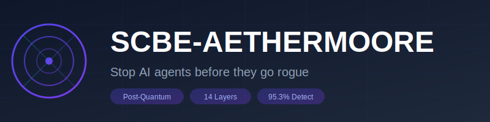

<p align="center">
  
</p>

<p align="center">
  
  
  
  <a href="https://github.com/sponsors/issdandavis"></a>
</p>

<p align="center">
  <a href="#quick-start">Quick Start</a> •
  <a href="#why-scbe">Why SCBE?</a> •
  <a href="#use-cases">Use Cases</a> •
  <a href="#pricing">Pricing</a> •
  <a href="#documentation">Docs</a>
</p>

---

## The Problem

AI agents are getting autonomous. They can browse the web, execute code, and make decisions. But how do you **stop one before it does something harmful?**

Traditional approaches fail:
- **Rule-based systems** → Agents find loopholes
- **Linear thresholds** → Easy to game with small steps
- **Pattern matching** → Can't detect novel attacks

## The Solution

SCBE-AETHERMOORE uses **hyperbolic geometry** to create a security boundary where:

> **The further an agent drifts from safe behavior, the exponentially harder it becomes to continue.**

Think of it like a gravity well - small deviations are cheap, but adversarial behavior gets pulled back or stopped entirely.

```
Safe Center (low cost) ───────► Boundary (infinite cost)
      ●━━━━━━━━━━━━━━━━━━━━━━━━━━━━━━━━━━━━━━━━━━━━━●
   ALLOW              QUARANTINE                 DENY
```

## Results

| Metric | SCBE | Traditional ML | Rule-Based |
|--------|------|----------------|------------|
| **Detection Rate** | **95.3%** | 89.6% | 56.6% |
| **False Positives** | 2.1% | 8.3% | 15.2% |
| **Quantum-Safe** | Yes | No | No |
| **Explainable** | Yes | Limited | Yes |

## Quick Start

```bash
pip install scbe-aethermoore
```

```python
from scbe_aethermoore import validate_action

# Check if an agent action is safe
result = validate_action(
    agent_id="agent-001",
    action="execute_code",
    context={"trust_score": 0.7, "sensitivity": 0.8}
)

print(result.decision)  # ALLOW, QUARANTINE, or DENY
print(result.risk_score)  # 0.0 to 1.0
print(result.explanation)  # Human-readable reason
```

## CLI Quick Start (Six Tongues + GeoSeal)

```bash
# Encode/Decode (Sacred Tongues)
python scbe-cli.py encode --tongue KO --text "hello" > spell.txt
python scbe-cli.py decode --tongue KO --as-text --in spell.txt

# Cross-translate KO → AV
python scbe-cli.py xlate --src KO --dst AV --prefix --in spell.txt

# Blend/Unblend pattern (KO:2,AV:1,DR:1)
echo -n "secret" | python scbe-cli.py blend --pattern KO:2,AV:1,DR:1 > blend.txt
python scbe-cli.py unblend --as-text --in blend.txt

# GeoSeal envelope (context-aware sealing)
echo -n "payload" | python scbe-cli.py geoseal-encrypt --ss1 > envelope.json
python scbe-cli.py geoseal-decrypt --as-text --in envelope.json

# Self-test
python scbe-cli.py selftest
```

## Why SCBE?

### 1. Mathematically Proven Security
- 14-layer pipeline with 12 verified axioms
- Hyperbolic geometry creates exponential cost barriers
- No "boundary creep" - attacks can't inch their way in

### 2. Post-Quantum Cryptography
- Kyber768 key exchange (NIST approved)
- ML-DSA-65 signatures (Dilithium)
- Ready for the quantum computing era

### 3. Real-Time Fleet Governance
- Monitor hundreds of AI agents simultaneously
- Automatic quarantine of suspicious behavior
- Full audit trail with cryptographic proofs

### 4. Drop-In Integration
- Python SDK, TypeScript SDK
- REST API for any language
- AWS Lambda ready

## Use Cases

### Autonomous AI Agents
Control AI agents that browse the web, execute code, or interact with APIs. Stop them before they go off-script.

### Multi-Agent Orchestration
Manage fleets of specialized AI agents (researchers, coders, reviewers) with trust-based permissions.

### Financial AI Systems
Fraud detection, trading bots, risk assessment - with audit trails that satisfy regulators.

### Healthcare AI
Patient data access control with HIPAA-grade security and explainable decisions.

### Defense & Government
Classified system access control with post-quantum cryptography.

## API Example

```bash
# Start the API server
scbe-api --port 8000

# Validate an action
curl -X POST http://localhost:8000/v1/validate \
  -H "Content-Type: application/json" \
  -d '{
    "agent_id": "agent-001",
    "action": "read_file",
    "target": "/etc/passwd",
    "trust_score": 0.5
  }'
```

Response:
```json
{
  "decision": "DENY",
  "risk_score": 0.94,
  "explanation": "High-sensitivity target with insufficient trust",
  "layer_scores": [0.5, 0.6, 0.7, 0.8, 0.9, 0.94],
  "recommendation": "Require human approval for system file access"
}
```

## Architecture

```
INPUT → [14-Layer Hyperbolic Pipeline] → DECISION

Layer 1-4:   Context embedding into Poincaré ball
Layer 5-7:   Hyperbolic distance + Möbius transforms
Layer 8-10:  Multi-well realms + spectral coherence
Layer 11-12: Temporal distance + Harmonic wall (exponential cost)
Layer 13:    Risk decision gate → ALLOW / QUARANTINE / DENY
Layer 14:    Audit telemetry
```

## Pricing

| Tier | Price | Requests/mo | Support |
|------|-------|-------------|---------|
| **Open Source** | Free | Unlimited (self-hosted) | Community |
| **Cloud Starter** | $99/mo | 100,000 | Email |
| **Cloud Pro** | $499/mo | 1,000,000 | Priority |
| **Enterprise** | Contact | Unlimited | Dedicated |

<p align="center">
  <a href="mailto:isaac@spiralverse.dev?subject=SCBE%20Enterprise%20Inquiry">
    
  </a>
</p>

## Documentation

- [Getting Started Guide](docs/GETTING_STARTED.md)
- [Technical Reference](docs/TECHNICAL_REFERENCE.md)
- [API Reference](docs/API_REFERENCE.md)
- [Architecture Deep Dive](docs/ARCHITECTURE.md)

## Contributing

We welcome contributions! See [CONTRIBUTING.md](CONTRIBUTING.md) for guidelines.

```bash
git clone https://github.com/issdandavis/SCBE-AETHERMOORE.git
cd SCBE-AETHERMOORE
npm install && pip install -r requirements.txt
npm test && pytest
```

## License

**Dual License** - See [LICENSE](LICENSE) for full terms.

- **Free** for research, education, and personal use
- **Commercial use** requires a paid license

**Patent Pending** - USPTO Application #63/961,403

---

<p align="center">
  <strong>SCBE-AETHERMOORE</strong><br/>
  Built for the age of autonomous AI.<br/><br/>
  <a href="https://github.com/issdandavis/SCBE-AETHERMOORE/stargazers">Star this repo</a> •
  <a href="https://github.com/issdandavis/SCBE-AETHERMOORE/issues">Report Issue</a> •
  <a href="mailto:isaac@spiralverse.dev">Contact</a>
</p>

---

*Copyright 2026 Issac Daniel Davis / SpiralVerse OS*
