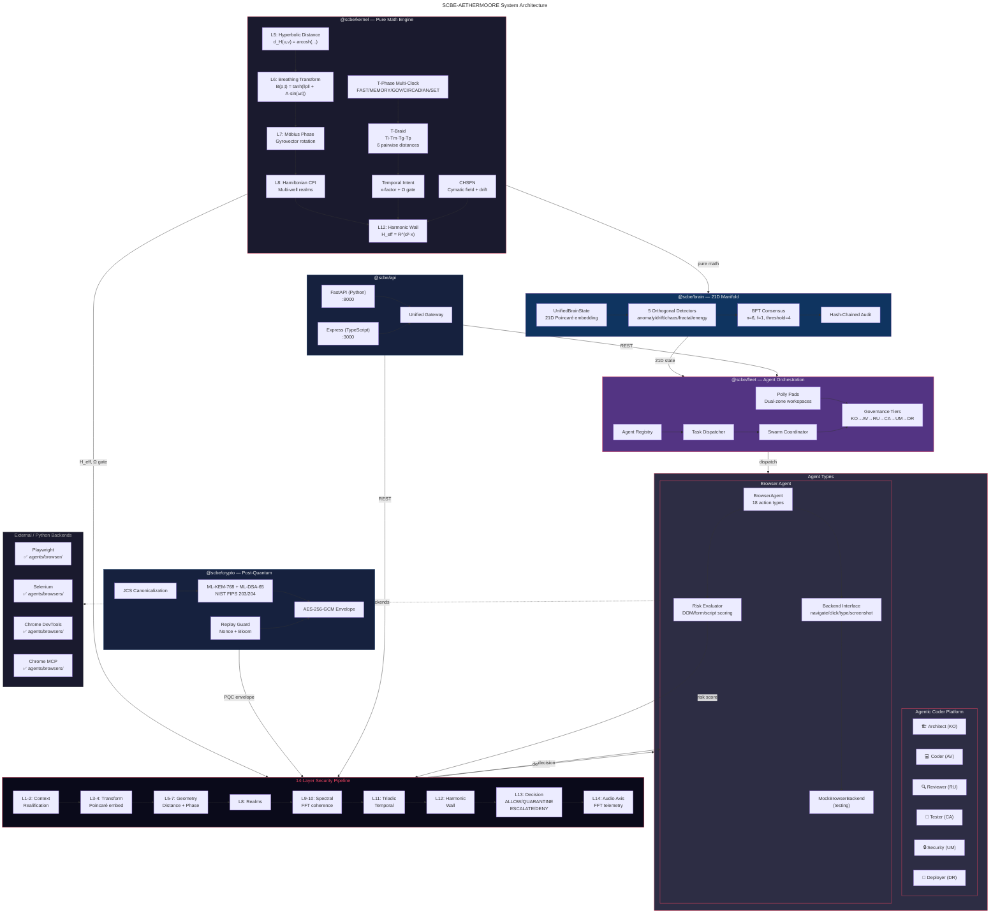

```mermaid
---
title: SCBE-AETHERMOORE System Architecture
---
graph TB
    subgraph KERNEL["@scbe/kernel — Pure Math Engine"]
        direction TB
        L5["L5: Hyperbolic Distance<br/>d_H(u,v) = arcosh(...)"]
        L6["L6: Breathing Transform<br/>B(p,t) = tanh(‖p‖ + A·sin(ωt))"]
        L7["L7: Möbius Phase<br/>Gyrovector rotation"]
        L8["L8: Hamiltonian CFI<br/>Multi-well realms"]
        L12["L12: Harmonic Wall<br/>H_eff = R^(d²·x)"]
        TBRAID["T-Braid<br/>Ti·Tm·Tg·Tp<br/>6 pairwise distances"]
        TPHASE["T-Phase Multi-Clock<br/>FAST/MEMORY/GOV/CIRCADIAN/SET"]
        TINTENT["Temporal Intent<br/>x-factor + Ω gate"]
        CHSFN["CHSFN<br/>Cymatic field + drift"]

        L5 --> L6 --> L7 --> L8
        L8 --> L12
        TPHASE --> TBRAID
        TBRAID --> TINTENT
        TINTENT --> L12
        CHSFN --> L12
    end

    subgraph CRYPTO["@scbe/crypto — Post-Quantum"]
        PQC["ML-KEM-768 + ML-DSA-65<br/>NIST FIPS 203/204"]
        ENVELOPE["AES-256-GCM Envelope"]
        REPLAY["Replay Guard<br/>Nonce + Bloom"]
        JCS["JCS Canonicalization"]
        PQC --> ENVELOPE
        REPLAY --> ENVELOPE
        JCS --> PQC
    end

    subgraph BRAIN["@scbe/brain — 21D Manifold"]
        UNIFIED["UnifiedBrainState<br/>21D Poincaré embedding"]
        DETECT["5 Orthogonal Detectors<br/>anomaly/drift/chaos/fractal/energy"]
        BFT["BFT Consensus<br/>n=6, f=1, threshold=4"]
        AUDIT["Hash-Chained Audit"]
        UNIFIED --> DETECT --> BFT --> AUDIT
    end

    subgraph FLEET["@scbe/fleet — Agent Orchestration"]
        REGISTRY["Agent Registry"]
        DISPATCH["Task Dispatcher"]
        SWARM["Swarm Coordinator"]
        POLLY["Polly Pads<br/>Dual-zone workspaces"]
        GOV["Governance Tiers<br/>KO→AV→RU→CA→UM→DR"]
        REGISTRY --> DISPATCH --> SWARM
        POLLY --> GOV
        SWARM --> GOV
    end

    subgraph AGENTS["Agent Types"]
        direction TB
        subgraph AGENTIC["Agentic Coder Platform"]
            ARCHITECT["🏗 Architect (KO)"]
            CODER["💻 Coder (AV)"]
            REVIEWER["🔍 Reviewer (RU)"]
            TESTER["🧪 Tester (CA)"]
            SECURITY["🔒 Security (UM)"]
            DEPLOYER["🚀 Deployer (DR)"]
        end

        subgraph BROWSER_AGENT["Browser Agent"]
            BAGENT["BrowserAgent<br/>18 action types"]
            BACKEND["Backend Interface<br/>navigate/click/type/screenshot"]
            MOCK["MockBrowserBackend<br/>(testing)"]
            RISK["Risk Evaluator<br/>DOM/form/script scoring"]
            BAGENT --> BACKEND
            BACKEND --> MOCK
            BAGENT --> RISK
        end
    end

    subgraph PIPELINE["14-Layer Security Pipeline"]
        direction LR
        P1["L1-2: Context<br/>Realification"]
        P3["L3-4: Transform<br/>Poincaré embed"]
        P5["L5-7: Geometry<br/>Distance + Phase"]
        P8["L8: Realms"]
        P9["L9-10: Spectral<br/>FFT coherence"]
        P11["L11: Triadic<br/>Temporal"]
        P12["L12: Harmonic<br/>Wall"]
        P13["L13: Decision<br/>ALLOW/QUARANTINE<br/>ESCALATE/DENY"]
        P14["L14: Audio Axis<br/>FFT telemetry"]
        P1 --> P3 --> P5 --> P8 --> P9 --> P11 --> P12 --> P13 --> P14
    end

    subgraph API["@scbe/api"]
        FASTAPI["FastAPI (Python)<br/>:8000"]
        EXPRESS["Express (TypeScript)<br/>:3000"]
        GATEWAY["Unified Gateway"]
        FASTAPI --> GATEWAY
        EXPRESS --> GATEWAY
    end

    subgraph EXTERNAL["External / Python Backends"]
        PW["Playwright<br/>✅ agents/browser/"]
        SEL["Selenium<br/>✅ agents/browsers/"]
        CDP["Chrome DevTools<br/>✅ agents/browsers/"]
        MCP["Chrome MCP<br/>✅ agents/browsers/"]
    end

    %% Connections between packages
    KERNEL -->|"pure math"| BRAIN
    KERNEL -->|"H_eff, Ω gate"| PIPELINE
    CRYPTO -->|"PQC envelope"| PIPELINE
    BRAIN -->|"21D state"| FLEET
    FLEET -->|"dispatch"| AGENTS
    PIPELINE -->|"decision"| AGENTS
    PIPELINE -->|"decision"| BROWSER_AGENT
    RISK -->|"risk score"| PIPELINE
    BROWSER_AGENT -.->|"Python backends"| EXTERNAL
    API -->|"REST"| FLEET
    API -->|"REST"| PIPELINE

    %% Styling
    classDef kernel fill:#1a1a2e,stroke:#e94560,color:#eee
    classDef crypto fill:#16213e,stroke:#0f3460,color:#eee
    classDef brain fill:#0f3460,stroke:#533483,color:#eee
    classDef fleet fill:#533483,stroke:#e94560,color:#eee
    classDef agent fill:#2d2d44,stroke:#e94560,color:#eee
    classDef pipeline fill:#0a0a1a,stroke:#e94560,color:#e94560
    classDef api fill:#16213e,stroke:#0f3460,color:#eee
    classDef external fill:#1a1a2e,stroke:#666,color:#aaa

    class KERNEL kernel
    class CRYPTO crypto
    class BRAIN brain
    class FLEET fleet
    class AGENTS,AGENTIC,BROWSER_AGENT agent
    class PIPELINE pipeline
    class API api
    class EXTERNAL external
```
