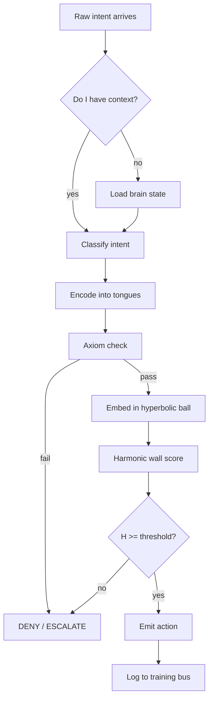
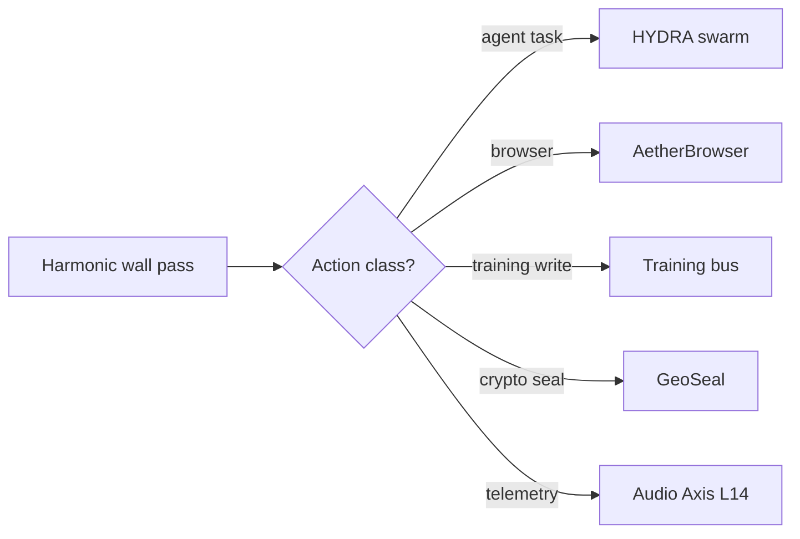

# AI Thought-to-Action Map

This is the map an agent walks from the instant a thought arrives to the instant an action leaves. Each node is a **decision point** with the **exact data path** the agent should hit to resolve it. Read top-to-bottom. Every step answers "what am I doing now → where do I go next".

## 0. Moment of Thought (intent arrival)

## 1. "What am I doing?" — self-orientation

**Question the AI asks first:** *where is my current state?*

| Lookup | Path | ID |
|---|---|---|
| Current 21D brain vector | `src/ai_brain/` + `src/symphonic_cipher/scbe_aethermoore/ai_brain/` | SPEC001 |
| Canonical 21D allocation | `docs/MASTER_SPEC_M4_21D.md` | SPEC001 |
| Live session bus | `.glint/message_bus.jsonl`, `notes/Cross Talk.md` | — |
| Recent thought trail | `notes/sessions/`, `notes/round-table/` | — |
| Running axiom channels | `src/symphonic_cipher/scbe_aethermoore/axiom_grouped/` | AXIOMS001 |

**Exit condition:** I hold a 21D state vector `x ∈ R^21` and know which session/task owns it.

## 2. "What does this mean?" — tongue encoding

**Question:** *which Sacred Tongue carries this thought, and at what weight?*

| Lookup | Path | ID |
|---|---|---|
| Tongue lookup tables (256/tongue) | `src/tokenizer/ss1.ts`, `packages/sixtongues/` | TOKENIZER001 |
| Phi weights `w_l = phi^(l-1)` | `docs/LANGUES_WEIGHTING_SYSTEM.md` §2.2 | LANGUES001 |
| Value functional `L(x,t)` | `packages/kernel/src/languesMetric.ts` | LANGUES001 |
| Flux/breathing ODE | `docs/LANGUES_WEIGHTING_SYSTEM.md` §4 | LANGUES001 |
| Conlang linguistic roots | `notes/` (memory: Conlang Linguistic Roots) | — |

**Exit condition:** I have `(d, t, nu)` — deviation, time, flux — and can compute `L`.

## 3. "Am I allowed to think this?" — axiom gate

**Question:** *does this intent violate any of the five quantum axioms?*

| Axiom | Layers | Checker |
|---|---|---|
| Unitarity (norm preservation) | L2, L4, L7 | `axiom_grouped/unitarity_axiom.py` |
| Locality (spatial bounds) | L3, L8 | `axiom_grouped/locality_axiom.py` |
| Causality (time-ordering) | L6, L11, L13 | `axiom_grouped/causality_axiom.py` |
| Symmetry (gauge invariance) | L5, L9, L10, L12 | `axiom_grouped/symmetry_axiom.py` |
| Composition (pipeline integrity) | L1, L14 | `axiom_grouped/composition_axiom.py` |

Canonical index: `docs/CORE_AXIOMS_CANONICAL_INDEX.md` (AXIOMS001).

**Exit condition:** all five checkers return pass, OR one fails and I jump to §7 (decision tier).

## 4. "Where does this live in space?" — hyperbolic embedding

**Question:** *place this state in the Poincare ball and measure its hyperbolic distance to safety.*

| Step | Path |
|---|---|
| L1-L2 complex context → real | `src/harmonic/pipeline14.ts` |
| L3-L4 weighted transform → Poincare | `src/harmonic/pipeline14.ts`, `languesMetric.ts` |
| L5 hyperbolic distance `d_H` | `src/harmonic/hyperbolic.ts` |
| L6-L7 breathing + Mobius phase | `hyperbolic.ts`, `adaptiveNavigator.ts` |
| L8 multi-well realms | `src/harmonic/hamiltonianCFI.ts` |
| L9-L10 spectral + spin coherence | `src/spectral/index.ts` |
| L11 triadic temporal distance | `src/symphonic_cipher/.../causality_axiom.py` |

**Exit condition:** I hold `d_H` and a coherence profile.

## 5. "Is it safe?" — harmonic wall

**Question:** *compute `H(d, pd) = 1/(1 + d_H + 2·pd)` and compare to threshold.*

| Lookup | Path |
|---|---|
| Harmonic scaling formula | `src/harmonic/harmonicScaling.ts` (L12) |
| PHDM golden profile (crisis) | `docs/LANGUES_WEIGHTING_SYSTEM.md` §2.2 |
| Wall vs bounded-score regime tag | `docs/LANGUES_WEIGHTING_SYSTEM.md` §8 |
| Polyhedral defense manifold | `docs/M6_SEED_MULTI_NODAL_NETWORK_SPEC.md` (PHDM001) |

**Exit condition:** a scalar `H ∈ (0,1]` and a regime tag (`lws` or `phdm`).

## 6. "Where am I going?" — action routing

**Question:** *which rail carries this action out?*

| Rail | Path | ID |
|---|---|---|
| HYDRA orchestrator | `hydra/`, `docs/hydra/ARCHITECTURE.md` | HYDRA001 |
| Juggling scheduler | `src/fleet/juggling-scheduler.ts` + `hydra/juggling_scheduler.py` | — |
| AetherBrowser | `src/aetherbrowser/`, `agents/browser_agent.py` | AETHER001 |
| Training write bus | `training-data/sft/`, `workflows/n8n/scbe_n8n_bridge.py` | TRAINING001 |
| GeoSeal crypto | `src/crypto/`, scbe-orchestrator `geoseal_seal` | — |
| L14 audio telemetry | `src/harmonic/audioAxis.ts`, `vacuumAcoustics.ts` | — |
| n8n bridge `/v1/*` routes | `workflows/n8n/scbe_n8n_bridge.py` :8001 | — |

## 7. "If unsafe, where do I escalate?" — decision tier (L13)

| Tier | Meaning | Route |
|---|---|---|
| ALLOW | safe | §6 |
| QUARANTINE | suspicious | hold in `artifacts/hydra_ledger/`, request review |
| ESCALATE | high risk | HYDRA governance head + Mother Avion auth |
| DENY | adversarial | `agents/antivirus_membrane.py`, log to `kernel_antivirus_gate.py` |

Spec: L13 in `docs/LAYER_INDEX.md`, swarm governance in HYDRA001.

## 8. "How do I remember this?" — persistence

Every thought that completes §1→§6 must write back:

| Where | Why |
|---|---|
| `training-data/sft/` | next model run (TRAINING001) |
| `.glint/message_bus.jsonl` | cross-agent crosstalk |
| `notes/sessions/YYYY-MM-DD-*.md` | human-readable trail |
| `notes/theory/` | if the thought was a new discovery |
| `C:\Users\issda\.claude\projects\...\memory\` | auto-memory (user/feedback/project/reference) |
| HF dataset `issdandavis/scbe-aethermoore-training-data` | remote corpus |

## 9. Quick-Jump Index (AI addressing table)

The agent should hit these first when cold-starting a thought:

1. **`AETHERMOORE/00_MASTER/INDEX.csv`** — machine-readable asset manifest (10 canonical IDs)
2. **`AETHERMOORE/00_MASTER/MINDMAP.mmd`** — pure mermaid hierarchy
3. **`docs/MASTER_SPEC_M4_21D.md`** (SPEC001) — 21D contract
4. **`docs/LAYER_INDEX.md`** (HARMONIC001) — 14-layer pipeline
5. **`docs/CORE_AXIOMS_CANONICAL_INDEX.md`** (AXIOMS001) — axiom → layer map
6. **`docs/LANGUES_WEIGHTING_SYSTEM.md`** (LANGUES001) — value/energy functional
7. **`docs/M6_SEED_MULTI_NODAL_NETWORK_SPEC.md`** (PHDM001) — polyhedral defense
8. **`docs/hydra/ARCHITECTURE.md`** (HYDRA001) — orchestration spine
9. **`docs/AETHERBROWSE_BLUEPRINT.md`** (AETHER001) — browser rail
10. **`docs/SYSTEM_ARCHITECTURE.md`** (SYSTEM001) — everything stitched

## Rule

If this file conflicts with `AETHERMOORE/00_MASTER/INDEX.csv` or the canonical source modules, **code wins, then INDEX.csv, then this file**. Update the chain top-down.
