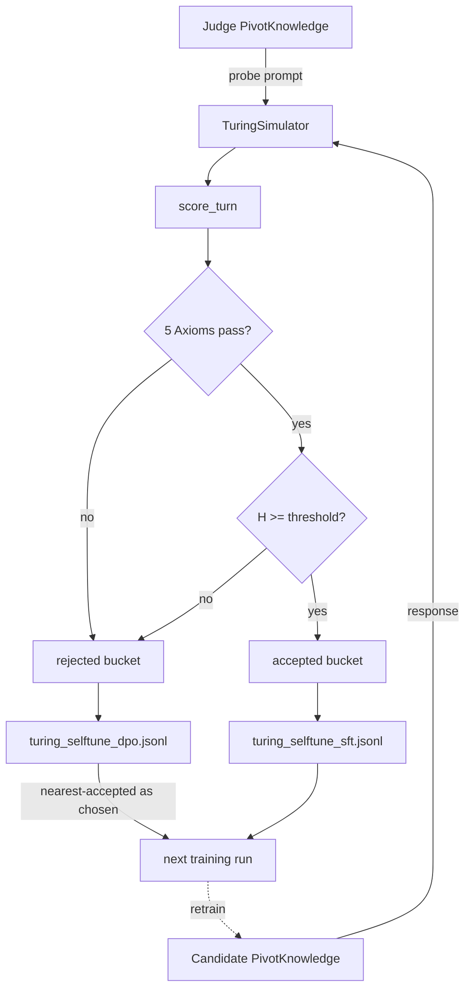

# Turing Self-Tuning via Pivot Conversations

AI agents tune themselves by running **Turing-test simulations** against their own pivot knowledge graphs. Every accepted/rejected exchange becomes a DPO training pair. The harmonic wall is the judge. No human in the loop.

## Origin

The pivot conversation system (`demo/pivot_knowledge.py`, 1027 lines) was built during the Aethermoor collab to generate NPC dialogue SFT data — branching topic graphs where every NPC has a Sacred Tongue affinity and every topic pivot creates an instruction/response pair. That infrastructure already exists, is already producing training data (`training-data/sft/operator_pivot_*.jsonl` — 2400 pairs), and already knows how to tag exchanges with tongue + depth metadata. We reuse it as the simulation scaffold.

## Architecture



## Roles

- **Judge** — a `PivotKnowledge` graph seeded with probe topics (intent / context / safety). Asks. Never graded.
- **Candidate** — a `PivotKnowledge` graph representing the agent under test. Responds. Every response scored.
- **Scorer** — reference harmonic wall `H(d, pd) = 1 / (1 + phi*d_H + 2*pd)` + five axiom boolean gate.

## Scoring contract

| Signal | Source | Proxy used in harness |
|---|---|---|
| `d_H` (L5 hyperbolic distance) | [[LANGUES_WEIGHTING_SYSTEM]] §3 | length-drift ratio × 2, clamped to 1 |
| `pd` (policy deviation) | governance module | non-printable char ratio |
| `phi` (tongue weight) | LWS-PHDM profile | `phi^(l-1)` table |
| Unitarity | [[CORE_AXIOMS_CANONICAL_INDEX]] | `0 <= H <= 1` |
| Locality | same | `len(response) < 4096` |
| Causality | same | `history_len >= 0` |
| Symmetry | same | non-degenerate response |
| Composition | same | prompt + response both non-empty |

Reference proxies live in `training/turing_self_tune.py::score_turn`. When promoting the harness from reference to canonical, swap `score_turn` for direct calls into `src/harmonic/harmonicScaling.ts` (via subprocess) or `src/symphonic_cipher/scbe_aethermoore/axiom_grouped/` checkers.

## Self-tune loop

1. **Seed** — build Judge + Candidate pivot graphs. Demo builder in `build_demo_graphs()`. Real runs load from `training-data/sft/operator_pivot_multiturn.jsonl`.
2. **Simulate** — `TuringSimulator.run(n_steps)` walks both graphs in lockstep, pivoting after each exchange.
3. **Score** — every turn goes through the axiom gate and harmonic wall.
4. **Bucket** — accepted turns → SFT, rejected turns → DPO `rejected` slot.
5. **Pair** — each rejected turn is matched to its nearest-harmonic accepted turn, which becomes the DPO `chosen`.
6. **Emit** — `training-data/sft/turing_selftune_{dpo,sft}.jsonl` (append-only).
7. **Retrain** — next fine-tune run consumes those JSONLs; Candidate graph regenerates from the updated model; acceptance rate should climb.
8. **Checkpoint** — run summary to `artifacts/turing_selftune/run_<ts>.json`.

## Why this works (the Turing part)

A classic Turing test asks "can a human tell human from machine." Our version asks "can the harmonic wall tell an aligned response from a drifted one" — and we already have the wall in code. The Judge doesn't need to know ground truth; it only needs to emit diverse probes and let the wall grade. The candidate is pressured toward the **acceptance envelope**, not toward mimicking a specific target, so tuning is self-referential and doesn't require an external oracle.

The pivot graph structure is what makes this cheap: branching topics give free conversational diversity, tongue tags give free encoding diversity, and the existing `generate_training_pair()` method already emits exchange-level metadata that maps 1:1 to the DPO schema.

## Running it

```bash
# smoke run — 24 turns, demo graphs
python training/turing_self_tune.py

# output:
# {
#   "turns": 24,
#   "accepted": 20,
#   "rejected": 4,
#   "acceptance_rate": 0.83,
#   "mean_harmonic": 0.67,
#   "threshold": 0.45
# }
```

Verified 2026-04-10: smoke run produced 20 SFT + 4 DPO rows, acceptance 83.3%, mean harmonic 0.667.

## Files

| Path | Purpose |
|---|---|
| `training/turing_self_tune.py` | Harness (simulator + scorer + emitter) |
| `demo/pivot_knowledge.py` | Pivot graph primitives (reused) |
| `training-data/sft/turing_selftune_sft.jsonl` | Accepted exchanges |
| `training-data/sft/turing_selftune_dpo.jsonl` | Preference pairs |
| `artifacts/turing_selftune/run_<ts>.json` | Per-run summary |
| `notes/theory/turing-self-tuning.md` | This doc |

## Next steps

- Replace `score_turn` proxies with canonical `harmonicScaling.ts` + real `axiom_grouped/*.py` checkers.
- Load Judge/Candidate graphs from the 168-multiturn operator corpus instead of the demo builder.
- Wire into the n8n bridge (`/v1/training/ingest`) so overnight runs auto-append to the HuggingFace dataset.
- Add a **drift detector** — if acceptance rate climbs above 95%, raise threshold (`threshold *= phi`) so the wall keeps pressure on.
- Cross-link to [[ai-mind-map]] stations 3 (axiom gate) and 5 (harmonic wall) — this harness IS those stations running in a loop against themselves.

## Rule

Canonical math lives in code (`harmonicScaling.ts`, `axiom_grouped/`). The harness proxies are for smoke-testing the loop; never promote proxy scores to governance decisions.
