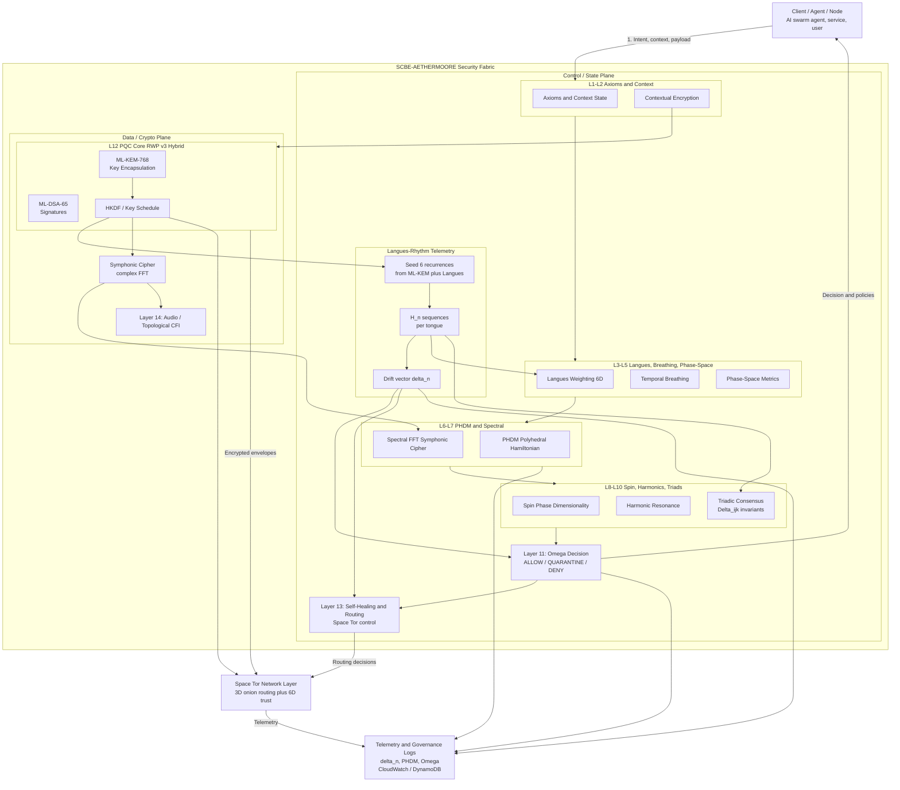

# SCBE-AETHERMOORE Architecture

> System architecture, data flows, and deployment patterns for the 14-layer security framework

## System Overview

```
┌─────────────────────────────────────────────────────────────────────────────┐
│                        SCBE-AETHERMOORE v3.0.0                              │
│                   Spectral Context-Bound Encryption                          │
├─────────────────────────────────────────────────────────────────────────────┤
│                                                                              │
│  ┌──────────────┐    ┌──────────────┐    ┌──────────────┐                   │
│  │   Client     │───▶│   Gateway    │───▶│   Pipeline   │                   │
│  │   (API/CLI)  │    │   (Auth)     │    │   (14-Layer) │                   │
│  └──────────────┘    └──────────────┘    └──────────────┘                   │
│                                                 │                            │
│                                                 ▼                            │
│  ┌──────────────────────────────────────────────────────────────────────┐   │
│  │                        14-LAYER SECURITY STACK                        │   │
│  ├──────────────────────────────────────────────────────────────────────┤   │
│  │  L1: Context    L2: Metric     L3: Breath     L4: Phase              │   │
│  │  L5: Potential  L6: Spectral   L7: Spin       L8: Triadic            │   │
│  │  L9: Harmonic   L10: Decision  L11: Audio     L12: Quantum           │   │
│  │  L13: Anti-Fragile             L14: Topological CFI                  │   │
│  └──────────────────────────────────────────────────────────────────────┘   │
│                                                 │                            │
│                                                 ▼                            │
│  ┌──────────────┐    ┌──────────────┐    ┌──────────────┐                   │
│  │   Trust      │◀──▶│   PHDM       │◀──▶│   PQC        │                   │
│  │   Manager    │    │   (IDS)      │    │   (Quantum)  │                   │
│  └──────────────┘    └──────────────┘    └──────────────┘                   │
│                                                                              │
└─────────────────────────────────────────────────────────────────────────────┘
```

---

## The 14-Layer Security Stack

### Layer Architecture

```
                    ┌─────────────────────────────────────┐
                    │         INCOMING REQUEST            │
                    └─────────────────┬───────────────────┘
                                      │
                    ┌─────────────────▼───────────────────┐
                    │  Layer 1: CONTEXT ENCODER           │
                    │  • Bind data to user/role/time      │
                    │  • Generate context hash            │
                    └─────────────────┬───────────────────┘
                                      │
                    ┌─────────────────▼───────────────────┐
                    │  Layer 2: LANGUES METRIC            │
                    │  • 6D exponential distance          │
                    │  • Hyperbolic geometry              │
                    └─────────────────┬───────────────────┘
                                      │
                    ┌─────────────────▼───────────────────┐
                    │  Layer 3: BREATH LAYER              │
                    │  • Temporal dynamics                │
                    │  • Session binding                  │
                    └─────────────────┬───────────────────┘
                                      │
                    ┌─────────────────▼───────────────────┐
                    │  Layer 4: PHASE ENCODER             │
                    │  • Phase space encryption           │
                    │  • Chaotic dynamics                 │
                    └─────────────────┬───────────────────┘
                                      │
                    ┌─────────────────▼───────────────────┐
                    │  Layer 5: POTENTIAL FIELD           │
                    │  • Energy-based security            │
                    │  • Gradient descent protection      │
                    └─────────────────┬───────────────────┘
                                      │
                    ┌─────────────────▼───────────────────┐
                    │  Layer 6: SPECTRAL COHERENCE        │
                    │  • FFT-based analysis               │
                    │  • Frequency domain security        │
                    └─────────────────┬───────────────────┘
                                      │
                    ┌─────────────────▼───────────────────┐
                    │  Layer 7: SPIN ENCODER              │
                    │  • Quantum spin states              │
                    │  • Entanglement simulation          │
                    └─────────────────┬───────────────────┘
                                      │
                    ┌─────────────────▼───────────────────┐
                    │  Layer 8: TRIADIC GATE              │
                    │  • Three-way verification           │
                    │  • Consensus requirement            │
                    └─────────────────┬───────────────────┘
                                      │
                    ┌─────────────────▼───────────────────┐
                    │  Layer 9: HARMONIC SCALING          │
                    │  • H(d) = R^(d/d₀)                  │
                    │  • Super-exponential growth         │
                    └─────────────────┬───────────────────┘
                                      │
                    ┌─────────────────▼───────────────────┐
                    │  Layer 10: DECISION ENGINE          │
                    │  • Adaptive security                │
                    │  • Risk-based decisions             │
                    └─────────────────┬───────────────────┘
                                      │
                    ┌─────────────────▼───────────────────┐
                    │  Layer 11: AUDIO AXIS               │
                    │  • Cymatic patterns                 │
                    │  • Acoustic fingerprinting          │
                    └─────────────────┬───────────────────┘
                                      │
                    ┌─────────────────▼───────────────────┐
                    │  Layer 12: PQC LAYER                │
                    │  • ML-KEM-768 (Kyber)               │
                    │  • ML-DSA (Dilithium)               │
                    └─────────────────┬───────────────────┘
                                      │
                    ┌─────────────────▼───────────────────┐
                    │  Layer 13: ANTI-FRAGILE             │
                    │  • Self-healing                     │
                    │  • Circuit breaker                  │
                    └─────────────────┬───────────────────┘
                                      │
                    ┌─────────────────▼───────────────────┐
                    │  Layer 14: TOPOLOGICAL CFI          │
                    │  • Hamiltonian path verification    │
                    │  • Control flow integrity           │
                    └─────────────────┬───────────────────┘
                                      │
                    ┌─────────────────▼───────────────────┐
                    │         SEALED PAYLOAD              │
                    └─────────────────────────────────────┘
```

---

## Data Flow

### Seal Operation

```
┌─────────┐     ┌─────────┐     ┌─────────┐     ┌─────────┐     ┌─────────┐
│  Data   │────▶│ Context │────▶│ Layers  │────▶│   PQC   │────▶│ Sealed  │
│  Input  │     │ Binding │     │  1-14   │     │ Encrypt │     │ Output  │
└─────────┘     └─────────┘     └─────────┘     └─────────┘     └─────────┘
     │               │               │               │               │
     │               │               │               │               │
     ▼               ▼               ▼               ▼               ▼
 plaintext      context_hash    layer_meta     ciphertext      payload
 "secret"       0x7f3a...       [L1..L14]      0x9c2b...       JSON
```

### Retrieve Operation

```
┌─────────┐     ┌─────────┐     ┌─────────┐     ┌─────────┐     ┌─────────┐
│ Sealed  │────▶│  Trust  │────▶│ Verify  │────▶│ Decrypt │────▶│  Data   │
│ Payload │     │  Check  │     │ Layers  │     │   PQC   │     │ Output  │
└─────────┘     └─────────┘     └─────────┘     └─────────┘     └─────────┘
     │               │               │               │               │
     │               │               │               │               │
     ▼               ▼               ▼               ▼               ▼
  payload       trust=0.92      all_pass?       plaintext       decision
  JSON          TRUSTED         YES/NO          "secret"        ALLOW
```

---

## Component Architecture

### Trust Manager

```
┌─────────────────────────────────────────────────────────────────┐
│                        TRUST MANAGER                             │
├─────────────────────────────────────────────────────────────────┤
│                                                                  │
│  ┌──────────────┐    ┌──────────────┐    ┌──────────────┐       │
│  │   Langues    │    │   Behavior   │    │   History    │       │
│  │   Weighting  │    │   Analysis   │    │   Tracker    │       │
│  └──────┬───────┘    └──────┬───────┘    └──────┬───────┘       │
│         │                   │                   │                │
│         └───────────────────┼───────────────────┘                │
│                             │                                    │
│                    ┌────────▼────────┐                          │
│                    │  Trust Score    │                          │
│                    │  Calculator     │                          │
│                    └────────┬────────┘                          │
│                             │                                    │
│         ┌───────────────────┼───────────────────┐               │
│         │                   │                   │                │
│  ┌──────▼──────┐    ┌──────▼──────┐    ┌──────▼──────┐         │
│  │   ALLOW     │    │ QUARANTINE  │    │    DENY     │         │
│  │   ≥ 0.8     │    │  0.2-0.8    │    │   < 0.2     │         │
│  └─────────────┘    └─────────────┘    └─────────────┘         │
│                                                                  │
└─────────────────────────────────────────────────────────────────┘
```

### PHDM (Intrusion Detection)

```
┌─────────────────────────────────────────────────────────────────┐
│              POLYHEDRAL HAMILTONIAN DEFENSE MANIFOLD             │
├─────────────────────────────────────────────────────────────────┤
│                                                                  │
│     ┌─────┐  ┌─────┐  ┌─────┐  ┌─────┐  ┌─────┐  ┌─────┐       │
│     │ P0  │  │ P1  │  │ P2  │  │ P3  │  │ P4  │  │ ... │       │
│     │Tetra│  │Cube │  │Octa │  │Dodec│  │Icosa│  │ P15 │       │
│     └──┬──┘  └──┬──┘  └──┬──┘  └──┬──┘  └──┬──┘  └──┬──┘       │
│        │        │        │        │        │        │           │
│        └────────┴────────┴────┬───┴────────┴────────┘           │
│                               │                                  │
│                    ┌──────────▼──────────┐                      │
│                    │  Hamiltonian Path   │                      │
│                    │  + HMAC Chaining    │                      │
│                    └──────────┬──────────┘                      │
│                               │                                  │
│                    ┌──────────▼──────────┐                      │
│                    │  6D Geodesic        │                      │
│                    │  Distance Check     │                      │
│                    └──────────┬──────────┘                      │
│                               │                                  │
│              ┌────────────────┼────────────────┐                │
│              │                │                │                 │
│       ┌──────▼──────┐  ┌──────▼──────┐  ┌──────▼──────┐        │
│       │   NORMAL    │  │   ANOMALY   │  │  INTRUSION  │        │
│       │   d < 0.3   │  │  0.3-0.7    │  │   d > 0.7   │        │
│       └─────────────┘  └─────────────┘  └─────────────┘        │
│                                                                  │
└─────────────────────────────────────────────────────────────────┘
```

---

## Deployment Architecture

### Single Node (Development)

```
┌─────────────────────────────────────────┐
│              Single Node                 │
├─────────────────────────────────────────┤
│                                          │
│  ┌──────────────────────────────────┐   │
│  │         SCBE Pipeline            │   │
│  │  ┌─────────┐  ┌─────────┐       │   │
│  │  │ 14-Layer│  │  Trust  │       │   │
│  │  │ Stack   │  │ Manager │       │   │
│  │  └─────────┘  └─────────┘       │   │
│  │  ┌─────────┐  ┌─────────┐       │   │
│  │  │  PHDM   │  │   PQC   │       │   │
│  │  │  (IDS)  │  │  Layer  │       │   │
│  │  └─────────┘  └─────────┘       │   │
│  └──────────────────────────────────┘   │
│                                          │
│  ┌──────────────────────────────────┐   │
│  │         Local Storage            │   │
│  │  • Sealed payloads               │   │
│  │  • Trust history                 │   │
│  │  • Audit logs                    │   │
│  └──────────────────────────────────┘   │
│                                          │
└─────────────────────────────────────────┘
```

### AWS Lambda (Serverless)

```
┌─────────────────────────────────────────────────────────────────┐
│                        AWS Cloud                                 │
├─────────────────────────────────────────────────────────────────┤
│                                                                  │
│  ┌──────────────┐    ┌──────────────┐    ┌──────────────┐       │
│  │  API Gateway │───▶│   Lambda     │───▶│  DynamoDB    │       │
│  │  (REST/WS)   │    │   (SCBE)     │    │  (Storage)   │       │
│  └──────────────┘    └──────────────┘    └──────────────┘       │
│         │                   │                   │                │
│         │                   │                   │                │
│         ▼                   ▼                   ▼                │
│  ┌──────────────┐    ┌──────────────┐    ┌──────────────┐       │
│  │   Cognito    │    │   Secrets    │    │  CloudWatch  │       │
│  │   (Auth)     │    │   Manager    │    │   (Logs)     │       │
│  └──────────────┘    └──────────────┘    └──────────────┘       │
│                                                                  │
│  ┌──────────────────────────────────────────────────────────┐   │
│  │                    Lambda Function                        │   │
│  │  ┌─────────────────────────────────────────────────────┐ │   │
│  │  │  import { SCBE14LayerPipeline } from 'scbe-aethermoore' │   │
│  │  │                                                       │ │   │
│  │  │  export const handler = async (event) => {           │ │   │
│  │  │    const pipeline = new SCBE14LayerPipeline();       │ │   │
│  │  │    return pipeline.process(event);                   │ │   │
│  │  │  };                                                  │ │   │
│  │  └─────────────────────────────────────────────────────┘ │   │
│  └──────────────────────────────────────────────────────────┘   │
│                                                                  │
└─────────────────────────────────────────────────────────────────┘
```

### Kubernetes (Enterprise)

```
┌─────────────────────────────────────────────────────────────────┐
│                     Kubernetes Cluster                           │
├─────────────────────────────────────────────────────────────────┤
│                                                                  │
│  ┌─────────────────────────────────────────────────────────┐    │
│  │                    Ingress Controller                    │    │
│  └─────────────────────────┬───────────────────────────────┘    │
│                            │                                     │
│         ┌──────────────────┼──────────────────┐                 │
│         │                  │                  │                  │
│  ┌──────▼──────┐    ┌──────▼──────┐    ┌──────▼──────┐         │
│  │  SCBE Pod   │    │  SCBE Pod   │    │  SCBE Pod   │         │
│  │  (Replica)  │    │  (Replica)  │    │  (Replica)  │         │
│  └──────┬──────┘    └──────┬──────┘    └──────┬──────┘         │
│         │                  │                  │                  │
│         └──────────────────┼──────────────────┘                 │
│                            │                                     │
│  ┌─────────────────────────▼───────────────────────────────┐    │
│  │                    Service Mesh                          │    │
│  │  ┌─────────────┐  ┌─────────────┐  ┌─────────────┐      │    │
│  │  │   Redis     │  │  PostgreSQL │  │   Vault     │      │    │
│  │  │   (Cache)   │  │   (State)   │  │   (Secrets) │      │    │
│  │  └─────────────┘  └─────────────┘  └─────────────┘      │    │
│  └─────────────────────────────────────────────────────────┘    │
│                                                                  │
│  ┌─────────────────────────────────────────────────────────┐    │
│  │                    Monitoring Stack                      │    │
│  │  ┌─────────────┐  ┌─────────────┐  ┌─────────────┐      │    │
│  │  │ Prometheus  │  │   Grafana   │  │   Jaeger    │      │    │
│  │  │  (Metrics)  │  │ (Dashboard) │  │  (Tracing)  │      │    │
│  │  └─────────────┘  └─────────────┘  └─────────────┘      │    │
│  └─────────────────────────────────────────────────────────┘    │
│                                                                  │
└─────────────────────────────────────────────────────────────────┘
```

---

## Technology Stack

### Languages & Runtimes
| Component | Technology | Version |
|-----------|------------|---------|
| Core Engine | TypeScript | 5.x |
| Python Bindings | Python | 3.10+ |
| Build System | Node.js | 18+ |
| Testing | Vitest / pytest | Latest |

### Cryptography
| Algorithm | Standard | Use Case |
|-----------|----------|----------|
| ML-KEM-768 | NIST PQC | Key encapsulation |
| ML-DSA | NIST PQC | Digital signatures |
| AES-256-GCM | FIPS 197 | Symmetric encryption |
| SHA-3-256 | FIPS 202 | Hashing |
| HMAC-SHA256 | RFC 2104 | Authentication |

### Dependencies
```json
{
  "dependencies": {
    "typescript": "^5.0.0",
    "vitest": "^4.0.0",
    "fast-check": "^3.0.0"
  }
}
```

```
requirements.txt:
numpy>=1.24.0
scipy>=1.10.0
hypothesis>=6.0.0
pytest>=8.0.0
```

---

## Security Model

### Threat Model

```
┌─────────────────────────────────────────────────────────────────┐
│                        THREAT MODEL                              │
├─────────────────────────────────────────────────────────────────┤
│                                                                  │
│  EXTERNAL THREATS                    INTERNAL THREATS            │
│  ┌─────────────────┐                ┌─────────────────┐         │
│  │ • Quantum       │                │ • Insider       │         │
│  │   attacks       │                │   threats       │         │
│  │ • Side-channel  │                │ • Privilege     │         │
│  │ • Replay        │                │   escalation    │         │
│  │ • MITM          │                │ • Data          │         │
│  │ • Brute force   │                │   exfiltration  │         │
│  └────────┬────────┘                └────────┬────────┘         │
│           │                                  │                   │
│           └──────────────┬───────────────────┘                  │
│                          │                                       │
│                 ┌────────▼────────┐                             │
│                 │  14-LAYER       │                             │
│                 │  DEFENSE        │                             │
│                 └────────┬────────┘                             │
│                          │                                       │
│         ┌────────────────┼────────────────┐                     │
│         │                │                │                      │
│  ┌──────▼──────┐  ┌──────▼──────┐  ┌──────▼──────┐             │
│  │   Context   │  │   Trust     │  │   Quantum   │             │
│  │   Binding   │  │   Scoring   │  │   Resist    │             │
│  └─────────────┘  └─────────────┘  └─────────────┘             │
│                                                                  │
└─────────────────────────────────────────────────────────────────┘
```

### Defense Layers by Threat

| Threat | Primary Defense | Secondary Defense |
|--------|-----------------|-------------------|
| Quantum Attack | Layer 12 (PQC) | Layer 9 (Harmonic) |
| Replay Attack | Layer 3 (Breath) | Layer 1 (Context) |
| Side-Channel | Layer 6 (Spectral) | Layer 11 (Audio) |
| Insider Threat | Layer 2 (Metric) | Layer 10 (Decision) |
| Data Tampering | Layer 14 (CFI) | Layer 8 (Triadic) |

---

## Performance Characteristics

### Latency Profile

```
Operation: SEAL (14 layers)
─────────────────────────────────────────────────────
Layer 1  (Context)    │████                    │ 0.2ms
Layer 2  (Metric)     │██████                  │ 0.3ms
Layer 3  (Breath)     │████                    │ 0.2ms
Layer 4  (Phase)      │████                    │ 0.2ms
Layer 5  (Potential)  │████                    │ 0.2ms
Layer 6  (Spectral)   │██████                  │ 0.3ms
Layer 7  (Spin)       │████                    │ 0.2ms
Layer 8  (Triadic)    │████                    │ 0.2ms
Layer 9  (Harmonic)   │████                    │ 0.2ms
Layer 10 (Decision)   │██                      │ 0.1ms
Layer 11 (Audio)      │████                    │ 0.2ms
Layer 12 (PQC)        │████████████████████    │ 1.0ms
Layer 13 (Anti-Frag)  │██                      │ 0.1ms
Layer 14 (CFI)        │████                    │ 0.2ms
─────────────────────────────────────────────────────
TOTAL                                           3.4ms
```

### Throughput

| Configuration | Ops/sec | Latency (p99) |
|---------------|---------|---------------|
| All 14 layers | 294 | 4.2ms |
| Layers 1-10 only | 625 | 2.1ms |
| PQC disabled | 1,250 | 1.0ms |

---

## AI Orchestration System

### Multi-Agent Architecture

```
+------------------------------------------------------------------+
|                    SCBE AI ORCHESTRATION                          |
+------------------------------------------------------------------+
|                                                                    |
|  +------------------+       +------------------+                   |
|  |   ORCHESTRATOR   |<----->|  SECURITY GATE   |                  |
|  |  (Central Hub)   |       | (14-Layer Stack) |                  |
|  +--------+---------+       +------------------+                   |
|           |                                                        |
|           v                                                        |
|  +------------------+       +------------------+                   |
|  |  AGENT REGISTRY  |       |   AUDIT LOGGER   |                  |
|  +--------+---------+       +------------------+                   |
|           |                         ^                              |
|    +------+------+                  |                              |
|    |      |      |                  |                              |
|    v      v      v                  |                              |
|  +----+ +----+ +----+              |                              |
|  |Sec | |Res | |Bus |   Logs ------+                              |
|  |Agt | |Agt | |Agt |                                             |
|  +----+ +----+ +----+                                             |
|                                                                    |
|  +------------------+       +------------------+                   |
|  | WORKFLOW ENGINE  |       | SECURE STORAGE   |                  |
|  +------------------+       +------------------+                   |
|                                                                    |
+------------------------------------------------------------------+
```

### Agent Types

| Role | Description | Capabilities |
|------|-------------|--------------|
| **Coordinator** | Central task routing | Load balancing, delegation, status |
| **Security** | Threat monitoring | Scanning, auditing, compliance |
| **Research** | Knowledge lookup | Search, summarize, compare |
| **Business** | Portfolio management | Analysis, reporting, forecasting |
| **Engineer** | Code operations | Generate, test, debug |
| **Analyst** | Data analysis | Visualization, insights |

### Secure Agent Communication

```
Agent A                    Security Gate                   Agent B
   |                            |                             |
   |------ Send Message ------->|                             |
   |                            |                             |
   |                     +------+------+                      |
   |                     | Sanitize    |                      |
   |                     | Validate    |                      |
   |                     | Sign        |                      |
   |                     | Encrypt     |                      |
   |                     +------+------+                      |
   |                            |                             |
   |                            |------ Deliver Message ----->|
   |                            |                             |
   |                            |<----- Response -------------|
   |                            |                             |
   |<----- Verified Response ---|                             |
```

### Prompt Injection Prevention

Multi-layer defense against prompt injection attacks:

| Layer | Protection | Method |
|-------|------------|--------|
| 1 | Pattern Matching | 40+ known injection patterns |
| 2 | Encoding Detection | Hex, Unicode, HTML entity |
| 3 | Context Boundary | System/User delimiter checks |
| 4 | Recursive Prompt | Nested prompt detection |
| 5 | Rate Limiting | Abuse prevention |
| 6 | Message Signing | HMAC authentication |
| 7 | Output Validation | Sensitive data redaction |

### Workflow Execution

```
+-----------+     +-----------+     +-----------+
|   Task 1  |---->|   Task 2  |---->|   Task 3  |
|  (Scan)   |     | (Analyze) |     | (Report)  |
+-----------+     +-----------+     +-----------+
     |                  |                  |
     v                  v                  v
+--------+         +--------+         +--------+
| Agent  |         | Agent  |         | Agent  |
|Security|         |Research|         |Business|
+--------+         +--------+         +--------+
```

---

## Science Packs - Knowledge Base System

### Module Categories

| Category | Packs | Total Size |
|----------|-------|------------|
| **Physical Sciences** | physics_sim, chemistry, astronomy, earth_science, materials | ~19 MB |
| **Life Sciences** | biology, neuroscience, ecology, bioinformatics, pharmacology | ~23 MB |
| **Mathematical Sciences** | pure_math, applied_math, statistics, cryptography, logic | ~15 MB |
| **Engineering** | electrical, mechanical, aerospace, civil, biomedical | ~22 MB |
| **Computer Science** | algorithms, ai_ml, distributed, security, quantum_computing | ~22 MB |
| **Social Sciences** | economics, sociology, psychology, linguistics | ~11 MB |

### Knowledge Pack Structure

```
science_packs/
+-- __init__.py          # Pack registry and management
+-- physics_sim/         # INSTALLED - Physics simulation
|   +-- core.py
|   +-- atmosphere.py
|   +-- fluids.py
|   +-- orbital.py
|   +-- nuclear.py
|   +-- statistical.py
|   +-- waves_optics.py
|   +-- numerical.py
|   +-- simulator.py
+-- chemistry/           # Available add-on
+-- biology/             # Available add-on
+-- ai_ml/               # Available add-on
...
```

### Pack Installation Model

```
+------------------+     +------------------+     +------------------+
|   NOT INSTALLED  |---->|    INSTALLED     |---->|     ACTIVE       |
|   (Available)    |     |   (On Disk)      |     |  (In Memory)     |
+------------------+     +------------------+     +------------------+
        |                        |                        |
        v                        v                        v
   Download &            Load on startup         Accessible to
   verify integrity      if configured           all agents
```

---

## Setup Assistant

### Interactive Setup Flow

```
+----------+     +----------+     +----------+     +----------+
| Welcome  |---->|  System  |---->| Knowledge|---->|  Agent   |
| & Select |     |  Check   |     |   Packs  |     |  Config  |
+----------+     +----------+     +----------+     +----------+
                                                        |
+----------+     +----------+     +----------+          |
| Complete |<----| Portfolio|<----|  Security|<---------+
|   Setup  |     |  Import  |     |   Level  |
+----------+     +----------+     +----------+
```

### Setup Templates

| Template | Use Case | Agents | Security |
|----------|----------|--------|----------|
| **Business** | Portfolio management | Coordinator, Business, Analyst, Security | Standard |
| **Research** | Scientific computing | Coordinator, 2x Research, Engineer | Minimal |
| **Security** | SOC operations | Coordinator, 3x Security | Maximum |
| **Minimal** | Development/Testing | Coordinator only | Minimal |

---

## Audit & Compliance

### Hash-Chained Audit Logs

```
+--------+     +--------+     +--------+     +--------+
| Entry  |---->| Entry  |---->| Entry  |---->| Entry  |
|   1    |     |   2    |     |   3    |     |   N    |
+--------+     +--------+     +--------+     +--------+
    |              |              |              |
    v              v              v              v
 hash_1 <------ hash_1 <------ hash_2 <------ hash_N-1
                prev           prev           prev
```

### Log Categories

| Category | Tracked Events |
|----------|----------------|
| **AGENT** | Actions, status changes, errors |
| **TASK** | Start, progress, completion, failure |
| **WORKFLOW** | Execution, steps, results |
| **SECURITY** | Threats, blocks, violations |
| **FILE** | Creates, modifies, deletes |
| **DECISION** | AI decisions with reasoning |
| **COMMUNICATION** | Agent-to-agent messages |

### Secure Storage

- AES-256-GCM encryption at rest
- Integrity verification via SHA-256
- Optional cloud backup extensions
- Automatic log rotation & compression

---

## Full System Architecture

```
+========================================================================+
|                    SCBE-AETHERMOORE v3.0.0                              |
|                    Complete System Overview                             |
+========================================================================+
|                                                                         |
|  +------------------------+    +------------------------+               |
|  |   SETUP ASSISTANT      |    |    SCIENCE PACKS       |              |
|  |  - Interactive wizard  |    |  - 30+ knowledge packs |              |
|  |  - Template selection  |    |  - Offline access      |              |
|  |  - Portfolio import    |    |  - Modular add-ons     |              |
|  +------------------------+    +------------------------+               |
|                                                                         |
|  +------------------------------------------------------------------+  |
|  |                    AI ORCHESTRATION                               |  |
|  |  +-------------+  +-------------+  +-------------+               |  |
|  |  | Coordinator |  |  Security   |  |  Research   |               |  |
|  |  |    Agent    |  |    Agent    |  |    Agent    |               |  |
|  |  +-------------+  +-------------+  +-------------+               |  |
|  |  +-------------+  +-------------+  +-------------+               |  |
|  |  |  Business   |  |  Engineer   |  |   Analyst   |               |  |
|  |  |    Agent    |  |    Agent    |  |    Agent    |               |  |
|  |  +-------------+  +-------------+  +-------------+               |  |
|  +------------------------------------------------------------------+  |
|                                                                         |
|  +------------------------------------------------------------------+  |
|  |                    SECURITY LAYER                                 |  |
|  |  +---------------------+    +---------------------+              |  |
|  |  | PROMPT INJECTION    |    |  14-LAYER SECURITY  |              |  |
|  |  | PREVENTION          |    |  STACK              |              |  |
|  |  | - Pattern matching  |    |  - Context binding  |              |  |
|  |  | - Encoding detect   |    |  - Langues metric   |              |  |
|  |  | - Rate limiting     |    |  - PQC encryption   |              |  |
|  |  | - Message signing   |    |  - PHDM intrusion   |              |  |
|  |  +---------------------+    +---------------------+              |  |
|  +------------------------------------------------------------------+  |
|                                                                         |
|  +------------------------------------------------------------------+  |
|  |                    WORKFLOW ENGINE                                |  |
|  |  +-------------+  +-------------+  +-------------+               |  |
|  |  | Task Queue  |  | Executor    |  |  Tracker    |               |  |
|  |  +-------------+  +-------------+  +-------------+               |  |
|  +------------------------------------------------------------------+  |
|                                                                         |
|  +------------------------------------------------------------------+  |
|  |                    STORAGE & LOGGING                              |  |
|  |  +-------------+  +-------------+  +-------------+               |  |
|  |  | Audit Logs  |  | Secure      |  | Cloud       |               |  |
|  |  | (Chained)   |  | Storage     |  | Extensions  |               |  |
|  |  +-------------+  +-------------+  +-------------+               |  |
|  +------------------------------------------------------------------+  |
|                                                                         |
+=========================================================================+
```

---

## Spectral Identity System - Rainbow Chromatic Fingerprinting

### Overview

The Spectral Identity System provides visual human verification through unique color signatures. Each entity gets a "rainbow fingerprint" based on their multi-dimensional trust vectors - no two entities will have exactly the same color signature.

```
┌─────────────────────────────────────────────────────────────────┐
│              SPECTRAL IDENTITY SYSTEM                            │
├─────────────────────────────────────────────────────────────────┤
│                                                                  │
│  6D Trust Vector                    7-Band Spectrum              │
│  ┌─────────────┐                   ┌─────────────────────┐      │
│  │ KO: 0.8     │                   │ Red     ████████░░  │      │
│  │ AV: 0.6     │    ──────────▶    │ Orange  ██████░░░░  │      │
│  │ RU: 0.7     │    Spectral       │ Yellow  ███████░░░  │      │
│  │ CA: 0.5     │    Transform      │ Green   █████░░░░░  │      │
│  │ UM: 0.9     │                   │ Blue    █████████░  │      │
│  │ DR: 0.4     │                   │ Indigo  ████░░░░░░  │      │
│  └─────────────┘                   │ Violet  ██████░░░░  │      │
│                                    └─────────────────────┘      │
│                                                                  │
│  Sacred Tongue Colors              Combined Identity             │
│  ┌─────────────────┐              ┌─────────────────────┐       │
│  │ KO: Deep Red    │              │ Hex: #7A4B8C        │       │
│  │ AV: Amber       │              │ Name: Vivid Blue    │       │
│  │ RU: Emerald     │  ─────────▶  │ Hash: SP-A3F2-8B1C  │       │
│  │ CA: Sapphire    │              │ Confidence: HIGH    │       │
│  │ UM: Amethyst    │              └─────────────────────┘       │
│  │ DR: Obsidian    │                                            │
│  └─────────────────┘                                            │
│                                                                  │
└─────────────────────────────────────────────────────────────────┘
```

### Color Mapping to SCBE Layers

| Spectral Band | Wavelength (nm) | SCBE Layers | Sacred Tongue | Purpose |
|---------------|-----------------|-------------|---------------|---------|
| Red | 620-750 | L1-L2 | Koraelin (KO) | Context/Metric |
| Orange | 590-620 | L3-L4 | Avali (AV) | Breath/Phase |
| Yellow | 570-590 | L5-L6 | Runethic (RU) | Potential/Spectral |
| Green | 495-570 | L7-L8 | Cassisivadan (CA) | Spin/Triadic |
| Blue | 450-495 | L9-L10 | Umbroth (UM) | Harmonic/Decision |
| Indigo | 420-450 | L11-L12 | Draumric (DR) | Audio/Quantum |
| Violet | 380-420 | L13-L14 | (Combined) | Anti-Fragile/CFI |

### Usage Example

```typescript
import { spectralGenerator } from 'scbe-aethermoore';
import { TrustManager } from 'scbe-aethermoore';

// Create trust manager
const trustManager = new TrustManager();

// Compute trust score
const trustVector = [0.8, 0.6, 0.7, 0.5, 0.9, 0.4];
const score = trustManager.computeTrustScore('node-123', trustVector);

// Generate spectral identity for visual verification
const spectralIdentity = spectralGenerator.generateIdentity('node-123', trustVector);

console.log(spectralIdentity.hexCode);      // #7A4B8C
console.log(spectralIdentity.spectralHash); // SP-A3F2-8B1C
console.log(spectralIdentity.colorName);    // Vivid Blue

// Get ASCII visual representation
const visual = spectralGenerator.generateVisual(spectralIdentity);
console.log(visual);
// ╔══════════════════════════════════════════╗
// ║  SPECTRAL IDENTITY: node-123             ║
// ╠══════════════════════════════════════════╣
// ║  Color: #7A4B8C (Vivid Blue)             ║
// ║  Hash:  SP-A3F2-8B1C                     ║
// ║  Confidence: HIGH                        ║
// ╠══════════════════════════════════════════╣
// ║  Red     ████████████████░░░░ 80.0%      ║
// ║  Orange  ████████████░░░░░░░░ 60.0%      ║
// ...

// Compare two identities
const identity2 = spectralGenerator.generateIdentity('node-456', [0.3, 0.9, 0.2, 0.8, 0.4, 0.7]);
const similarity = spectralGenerator.compareIdentities(spectralIdentity, identity2);
console.log(`Similarity: ${(similarity * 100).toFixed(1)}%`);
```

### Python Usage

```python
from src.harmonic.spectral_identity import (
    generate_spectral_identity,
    compare_spectral_identities,
    visualize_spectral_identity
)

# Generate spectral identity
identity = generate_spectral_identity(
    entity_id='node-123',
    trust_vector=[0.8, 0.6, 0.7, 0.5, 0.9, 0.4]
)

print(f"Color: {identity.hex_code}")
print(f"Hash: {identity.spectral_hash}")
print(f"Name: {identity.color_name}")

# Visualize
print(visualize_spectral_identity(identity))

# Compare identities
identity2 = generate_spectral_identity('node-456', [0.3, 0.9, 0.2, 0.8, 0.4, 0.7])
similarity = compare_spectral_identities(identity, identity2)
print(f"Similarity: {similarity * 100:.1f}%")
```

### Human Verification Use Cases

1. **Visual Identity Confirmation** - Users can verify node identity by comparing displayed colors
2. **Anomaly Detection** - Sudden color changes indicate trust vector manipulation
3. **Network Visualization** - Color-code network graphs by spectral identity
4. **Audit Trails** - Include spectral hashes in logs for visual verification

---

---

## Mermaid Architecture Diagram



---

## Core Mathematical Specification (Replication Edition)

### System Goal (Formal)

Define a decision function:

```
D : C x T x P -> {ALLOW, QUARANTINE, DENY}
```

such that:
- Small deviations are tolerated
- Large deviations incur **super-exponential cost**
- Decision difficulty scales with **risk, intent, and timing**, not identity alone

### Context Space

Complex Context Vector:
```
c(t) ∈ C^D    (D = 6 typical)
```

with energy preservation:
```
Σ |c_j(t)|^2 = E
```

### Weighted Importance Transform

Let:
```
G = diag(φ^0, φ^1, ..., φ^(2D-1)),  φ = (1+√5)/2
x_G(t) = G^(1/2) x(t)
```

This introduces **asymmetric feature cost**.

### Hyperbolic Metric (Invariant Law)

For any u, v ∈ B^n (Poincare ball):
```
d_H(u,v) = arcosh(1 + 2|u-v|^2 / ((1-|u|^2)(1-|v|^2)))
```

This metric **never changes**.

### Harmonic Scaling (The Vertical Wall)

Unbounded form:
```
H(d*, R) = R^((d*)^2),  R > 1
```

This is the **core asymmetric cost amplifier**.

Bounded (implementation-safe) variant:
```
H_bounded = 1 + α tanh(β d*)
```

### Final Risk

```
Risk' = Risk_base × H(d*, R) × (1 + γ_time) × (1 + γ_intent)
```

Monotone increasing in **every deviation**.

### Decision Rule

Let thresholds 0 < θ₁ < θ₂:
```
D = ALLOW       if Risk' < θ₁
D = QUARANTINE  if θ₁ ≤ Risk' < θ₂
D = DENY        if Risk' ≥ θ₂
```

### Core Invariants (Replication Checklist)

A reproducing system **must** satisfy:

1. Hyperbolic metric invariant
2. Radial cost scaling via non-linear map
3. Isometric intent transforms
4. Multi-center trust basins
5. Super-exponential risk amplification
6. Asymmetric difficulty scaling
7. Decision collapse to finite outputs

### One-Line Summary

> **Encode context into hyperbolic space, measure deviation geometrically, amplify cost super-exponentially, and require consensus proportional to risk.**

---

## See Also

- [API.md](./API.md) - Complete API reference
- [MATHEMATICAL_PROOFS.md](./MATHEMATICAL_PROOFS.md) - Formal proofs
- [DEPLOYMENT.md](../DEPLOYMENT.md) - Deployment guide
- [README.md](../README.md) - Quick start

---

*Patent Pending - USPTO Application #63/961,403*
