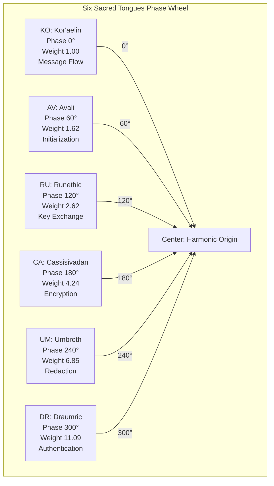
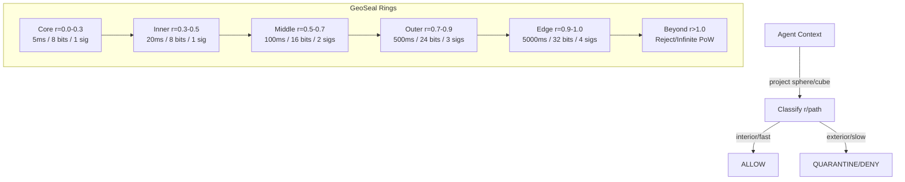
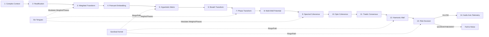
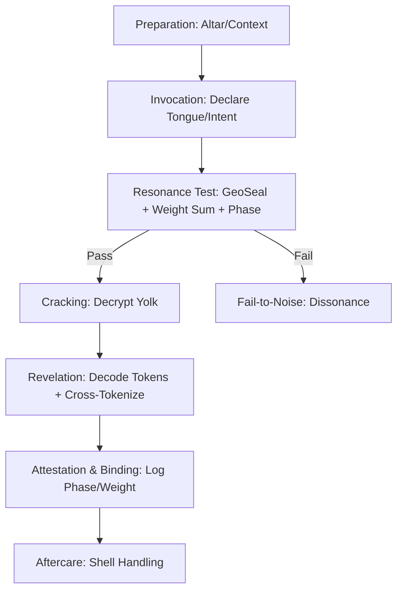

# SCBE-AETHERMOORE Architecture Visualization

## Overview
This document provides architecture visualization diagrams for the SCBE-AETHERMOORE framework, blending technical cryptographic systems with the Avalon Codex lore.

## 1. Six Sacred Tongues Phase Wheel

The Six Sacred Tongues form the harmonic foundation of the SCBE cipher system. Each tongue represents a 60° phase separation with escalating weights following the golden ratio.

**Key Properties:**
- 180° opposition (CA vs. KO) implies inverse operations (encrypt vs. flow)
- Phase collisions create interference patterns for denial
- In lore: represents a "ritual circle" of harmonic invocation

## 2. GeoSeal Concentric Rings

The GeoSeal kernel uses hyperbolic geometry to create trust zones based on radial distance r.

**Time Dilation Formula:** τ = τ₀ × e^{-γr}
- Core: fast processing (5ms)
- Edge: slow processing (5000ms) with exponential PoW
- Beyond: event horizon traps via infinite PoW

## 3. 14-Layer SCBE Pipeline

The complete processing pipeline from context to decision.

**Layer 12 - Harmonic Wall:**
Superexponential barrier: H(d,R) = R^{d²}

## 4. Sacred Egg Hatching Ritual

The cryptographic ritual for decrypting protected content.

**Triadic Mode:** Adds weight verification for enhanced security.

---
*Generated for SCBE-AETHERMOORE - Hyperbolic Geometry AI Safety Framework*
