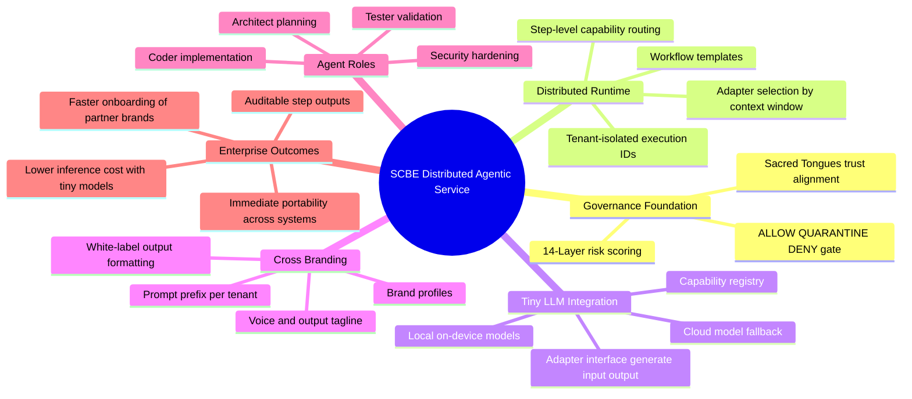

# Distributed Agentic Workflow Service

This document outlines a practical path from governance-only operation to a distributed workflow execution model where small/tiny LLMs can be plugged in and inherit SCBE controls immediately.

## System Mind Map

## Execution Flow

1. Register one or more `BrandProfile` records for tenant/partner identities.
2. Register tiny-LLM adapters with capabilities (planning, implementation, testing, security, etc.).
3. Register a workflow template that defines ordered steps.
4. Execute the workflow for a tenant prompt.
5. Collect step outputs with adapter IDs and token usage for auditability.

## Why this helps your stated goal

- **Beyond governance only:** the service executes multi-step workflows, not just policy decisions.
- **Tiny LLM ready:** each step routes to lightweight adapters with explicit capability matching.
- **Cross-branded:** tenant prompt-prefix/voice/tagline enables white-label reuse across partner systems.
- **Composable:** existing SCBE agent roles map directly to distributed workflow steps.
