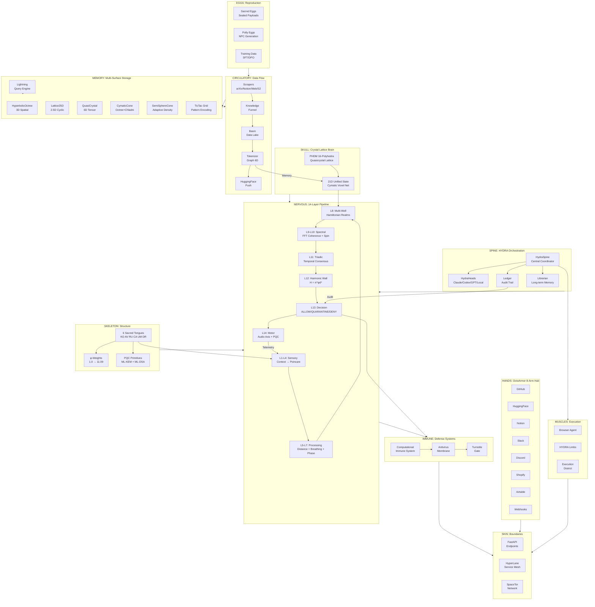
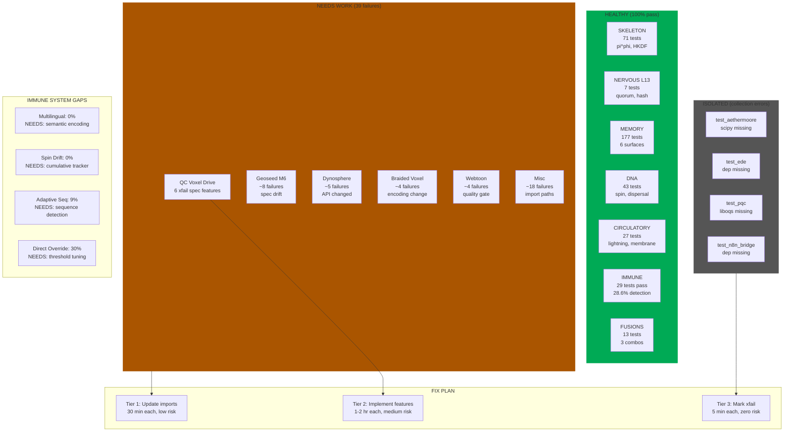

# SCBE-AETHERMOORE System Anatomy

*The system mapped to a body. Life made it work — we just borrow the patterns.*

---

## The Body Map

```
ORGAN SYSTEM              SCBE MODULE                    FUNCTION
─────────────────────────────────────────────────────────────────────

SKULL (crystal lattice)   src/ai_brain/phdm-core.ts      16-polyhedra cognitive container
                          src/crypto/quasicrystal_lattice Aperiodic lattice = no exploitable patterns
                          PHDM Notion Ch.6               Dual lattice with phason shifts

BRAIN (21D state)         src/ai_brain/unified-state.ts   21D canonical state vector
                          src/ai_brain/cymatic-voxel-net  Neurons at Chladni nodal points
                          src/ai_brain/tri-manifold       3-layer manifold lattice

SPINE (HYDRA)             hydra/spine.py                  Central coordinator
                          hydra/__init__.py               "Many heads, one governed body"
                          hydra/ledger.py                 Action/decision audit trail

NERVOUS SYSTEM            14-layer pipeline               Signals travel L1→L14
  Sensory (L1-L4)         src/harmonic/pipeline14.ts      Context → Poincare embedding
  Processing (L5-L10)     src/harmonic/hyperbolic.ts      Distance, breathing, phase, spectral
  Decision (L11-L13)      src/harmonic/governanceSim.ts   Triadic consensus → ALLOW/DENY
  Motor (L14)             src/harmonic/audioAxis.ts       FFT telemetry output

IMMUNE SYSTEM             src/gateway/COMPUTATIONAL_IMMUNE Threat analysis (physics/chem/bio/math)
                          agents/antivirus_membrane.py     Semantic antivirus turnstile
                          src/ai_brain/immune-response.ts  Immune response gates

CIRCULATORY SYSTEM        src/knowledge/funnel.py          Data flows: Source → Scan → Store → Push
  Arteries (input)        src/knowledge/scrapers/          arXiv, Notion, web, S2 scrapers
  Veins (output)          scripts/push_to_hf.py            Push governed data to HuggingFace
  Heart (pump)            hydra/research.py                Research orchestrator pumps data

SKELETON (structure)      src/harmonic/constants.ts        Phi, scales, thresholds — the fixed frame
                          src/crypto/sacred_tongues.py     6 tongues = 6 bone groups
                          packages/kernel/                 Kernel = the core skeleton

MUSCLES (execution)       agents/browser/main.py           Browser execution
                          hydra/limbs.py                   Browser/Terminal/API limbs
                          src/agentic/execution-district   Sandboxed execution environment

SKIN (boundary)           src/api/main.py                  HTTP boundary (FastAPI)
                          src/browser/hyperlane.ts          Service mesh (GREEN/YELLOW/RED zones)
                          src/network/                      Network-level boundary

EYES (perception)         agents/obsidian_researcher/      Knowledge graph builder
                          src/browser/polly_vision.py       Visual page understanding
                          src/aetherbrowser/page_analyzer    Page content analysis

HANDS (8 arms)            OctoArmor (src/fleet/octo_armor)  8-arm connector hub
  Arm 1                   GitHub connector
  Arm 2                   HuggingFace connector
  Arm 3                   Notion connector
  Arm 4                   Slack connector
  Arm 5                   Discord connector
  Arm 6                   Shopify connector
  Arm 7                   Airtable connector
  Arm 8                   Webhook connector

VOICE                     packages/sixtongues/              Sacred Tongue encoding (speech)
                          src/symphonic_cipher/              Audio-based crypto (harmonic voice)
                          scripts/article_to_video.py        TTS video generation

MEMORY                    hydra/librarian.py                 Long-term memory (SQLite)
                          hydra/ledger.py                    Decision history
                          src/knowledge/tokenizer_graph/     6D DNA memory chain
                          src/storage/                       Multi-surface storage backends

EGGS (reproduction)       src/crypto/sacred_eggs.py          GeoSeal-encrypted payloads
                          Polly Eggs                         NPC/character generation
                          training-data/                     Training data = offspring

FEATHERS (Raven)          agents/obsidian_researcher/        Raven-like reconnaissance
                          hydra/swarm_browser.py             Swarm scouting
                          Polly (the raven NPC)              Sarcastic guide/scout

DNA (encoding)            src/knowledge/tokenizer_graph/memory_chain.py
                          6D coordinates = genetic code
                          Chain hash = parent→child lineage
```

---

## Mermaid System Flow



---

## Health Status (Pass 2 — 2026-03-22)

```
TOTAL: 3856 passed, 39 failed, 11 collection errors = 99.0% pass rate
```



## What's Left and Why

| Gap | Why it exists | Best fix | Worst fix |
|-----|---------------|----------|-----------|
| Multilingual 0% | Text metrics are language-blind | Token-level semantic encoding across tongues | Keyword blocklist (brittle) |
| Spin drift 0% | Cost rises 7x but per-message, not cumulative | Sliding window cost tracker across conversation | Lower threshold (more false positives) |
| QC float→int | `int(abs(c)*10)` loses precision | Native float gate vectors | Wider acceptance radius (loses security) |
| 11 collection errors | Module moves during rapid dev | Update import paths | Delete the test files (loses coverage) |
| 39 test failures | Spec changes not reflected in tests | Rewrite tests to match code | Rewrite code to match tests (risky) |

---

## Quick Reference: What Goes Where

| Question | Organ | Module |
|----------|-------|--------|
| "Where does thinking happen?" | Brain | `src/ai_brain/unified-state.ts` |
| "Where do decisions get made?" | Nervous L13 | `src/harmonic/governanceSim.ts` |
| "Where is data stored?" | Memory | `src/storage/` (6 surfaces) |
| "How do we talk to the outside?" | Skin | `src/api/main.py` |
| "How do we connect to services?" | Hands | `src/fleet/octo_armor.py` |
| "How do we defend against attacks?" | Immune | `agents/antivirus_membrane.py` |
| "How does data flow in?" | Circulatory | `src/knowledge/funnel.py` |
| "How do we coordinate agents?" | Spine | `hydra/spine.py` |
| "What holds it all together?" | Skeleton | `packages/kernel/` + Sacred Tongues |
| "How do we reproduce/train?" | Eggs | `src/crypto/sacred_eggs.py` + training-data/ |
| "How do we see the web?" | Eyes | `agents/obsidian_researcher/` |
| "How do we act in the world?" | Muscles | `agents/browser/main.py` |
