# 📚 WorldForge - RAG Training Files

> last-synced: 2026-02-16T07:30:25.335Z

📄 worldforge_overview.md

/code

🌍 WorldForge - Complete Worldbuilding & Conlang Template

# Welcome to WorldForge

<!-- Unsupported block type: child_page -->
<!-- Unsupported block type: callout -->

### 1) Duplicate WorldForge

  - Click Duplicate (top-right) to add WorldForge to your workspace.

  - Keep the example data for your first run. You can delete it later.

### 2) Pick your starting point (choose one)

  - 🏛️ Culture (politics + society first)

  - 🗺️ Location (map + regions first)

  - 🗣️ Language (names + linguistic vibe first)

  - ⚡ Magic/Tech (rules + constraints first)

### 3) Create your first “seed” entry

  - Open the matching database in the main WorldForge page.

  - Duplicate an example entry and rename it.

  - Add 1–2 links to other systems (example: a Culture should link to at least one Location and one Language).

### 4) Verify the web is working

Use this quick checklist:

  - Your Culture links to a Location.

  - Your Character links to a Culture.

  - Your Historical Event links to a Location.

### 5) Visual map of the workflow

```mermaid
graph TD
	A[📌 Duplicate template] --> B[🎯 Choose a starting system]
	B --> C[🧩 Create your first seed entry]
	C --> D[🔗 Link to 1–2 other systems]
	D --> E[✅ Check backlinks / related sections]
	E --> F[🚀 Keep building outward]

	%% Readability defaults
	classDef node fill:#f8fafc,stroke:#1f2937,stroke-width:1px,color:#111827;
	class A,B,C,D,E,F node;
```



<!-- Unsupported block type: callout -->

<!-- Unsupported block type: child_page -->
<!-- Unsupported block type: callout -->

### The 6 core databases (and what they do)

  - 🗣️ Constructed Languages: sounds, grammar, vocabulary, naming rules.

  - 🏛️ Cultures: values, aesthetics, taboos, social structures.

  - 👥 Characters: backstory, goals, relationships, affiliations.

  - 🗺️ Locations: places, regions, climate, political control.

  - ⏳ Historical Events: timeline, causes, consequences.

  - ⚡ Magic/Tech Systems: rules, costs, limitations, who can use it.

### The “web” (how it actually works)

```mermaid
graph TB
	CL[🗣️ Languages]
	CU[🏛️ Cultures]
	CH[👥 Characters]
	LC[🗺️ Locations]
	HE[⏳ Events]
	MG[⚡ Magic/Tech]

	CU -->|speak| CL
	CU -->|inhabit| LC
	CU -->|practice| MG

	CH -->|belongs to| CU
	CH -->|speaks| CL
	CH -->|lives in| LC
	CH -->|uses| MG
	CH -->|participated in| HE

	HE -->|affected| LC
	HE -->|involved| CU
	HE -->|changed access to| MG

	LC -->|influenced| CL
	MG -->|shaped by| CU

	%% Readability defaults
	classDef node fill:#f8fafc,stroke:#1f2937,stroke-width:1px,color:#111827;
	class CL,CU,CH,LC,HE,MG node;
```



### Suggested “minimum viable world” (so you can start fast)

  1. 1 Culture

  2. 1 Location

  3. 1 Language

  4. 3 Characters

  5. 3 Events

  6. 1 Magic/Tech system

<!-- Unsupported block type: callout -->

<!-- Unsupported block type: child_page -->
<!-- Unsupported block type: callout -->

### 1) Cleanup (remove personal stuff)

  - Delete or archive any pages that are only relevant to your example world.

  - Keep 3–10 example entries per database (or none, if you want a clean starting point).

  - Replace any “Add your link here” placeholders with real links (Gumroad, email, etc.).

### 2) Final QA (fast checks)

  - Open each core database and confirm:
    - Relations are still connected.

    - Required properties exist.

    - Views look clean (Table / Board / Gallery).

  - Click through 3 random pages and confirm backlinks render.

### 3) Export + screenshots

  - Export a PDF of the main landing page (optional).

  - Take 3–5 screenshots:
    - The main landing page hero section

    - One core database view

    - One example entry page

    - One worksheet page

### 4) Publish flow (visual)


### 5) Listing copy skeleton

  - Headline: What it is + who it’s for

  - 3 bullets: What’s included

  - 1 paragraph: Why it’s different

  - Call to action: Buy / duplicate / get started

<!-- Unsupported block type: callout -->

# Welcome to WorldForge

Your complete creative toolkit for building immersive worlds and constructed languages.

Whether you're writing a novel, designing a game, running a TTRPG campaign, or just building worlds for fun — WorldForge gives you the structure, prompts, and databases to bring your imagination to life.

<!-- Unsupported block type: callout -->
  - 🗣️ Conlang Builder with grammar templates

  - 🏛️ Culture & Society databases

  - 👥 Character & Relationship tracker

  - 🗺️ Location & Geography system

  - ⏳ Timeline & History builder

  - ⚡ Magic/Tech system designer

  - 📝 Worldbuilding worksheets & prompts

  - 💬 Built-in feedback form (help improve this template!)

---

## 🗺️ System Architecture

<!-- Unsupported block type: callout -->
WorldForge isn't six separate databases—it's an interconnected ecosystem where every piece talks to every other piece. This is what makes it more powerful than other templates.

### The Six Core Systems

```mermaid
graph TB
    CL[🗣️ Constructed Languages]
    CU[🏛️ Cultures & Societies]
    CH[👥 Characters]
    LC[🗺️ Locations]
    HE[⏳ Historical Events]
    MG[⚡ Magic/Tech Systems]

    CU -->|speak| CL
    CU -->|inhabit| LC
    CU -->|practice| MG
    CH -->|belong to| CU
    CH -->|speak| CL
    CH -->|live in| LC
    CH -->|use| MG
    CH -->|participated in| HE
    HE -->|affected| LC
    HE -->|involved| CU
    HE -->|changed access to| MG
    LC -->|influenced| CL
    MG -->|shaped by| CU

    %% Improve readability: ensure dark text + visible borders on all node fills
    style CL fill:#e3f2fd,stroke:#1f2937,stroke-width:1px,color:#111827
    style CU fill:#fff3e0,stroke:#1f2937,stroke-width:1px,color:#111827
    style CH fill:#f3e5f5,stroke:#1f2937,stroke-width:1px,color:#111827
    style LC fill:#e8f5e9,stroke:#1f2937,stroke-width:1px,color:#111827
    style HE fill:#fce4ec,stroke:#1f2937,stroke-width:1px,color:#111827
    style MG fill:#fff9c4,stroke:#1f2937,stroke-width:1px,color:#111827
```



### How The Web Works

When you create a Culture:

- Link the language(s) they speak → pulls naming patterns

- Link locations they inhabit → shows population distribution

- Link magic/tech systems they use → defines their capabilities

- Characters can auto-reference culture for customs and values

When you create a Character:

- Link to culture → inherits societal norms and aesthetics

- Link to languages → tracks multilingual abilities

- Link to location → establishes home base

- Link to historical events → creates rich backstory

When you design a Location:

- Link to cultures → shows who lives there (demographics)

- Link to historical events → builds sense of place and conflict

- Link to magic/tech → defines regional power variations

- Geography influences language phonology (harsh climates = harsh sounds)

When you add a Historical Event:

- Link locations affected → maps historical spread

- Link cultures involved → tracks alliances and grudges

- Link characters who participated → fleshes out backstories

- Changes magic/tech accessibility across your timeline

When you build a Language:

- Link to cultures that speak it → shows cultural identity

- Track loan words from other languages → proves cultural contact

- Link to locations → geography shapes phonology patterns

- Characters reference it → maintains linguistic consistency

When you define a Magic/Tech System:

- Link to cultures → who has access? How is it viewed?

- Link to characters → who can use this power?

- Link to historical events → when was it discovered?

- Link to locations → where is it stronger/weaker?

### Why This Matters

Problem with other templates: You get six disconnected databases. When you change something in one place, nothing updates anywhere else. You have to manually remember "Oh right, if the elves fled their homeland, I need to update their culture page, character locations, the history timeline, and the old city's population..."

WorldForge solution: Everything is already linked. Change ripples through the whole system. You can trace cause and effect. "These characters speak this language because they're from this culture, which inhabits this region, which was affected by this historical event, which changed access to this magic system."

That's the depth that creates immersive worldbuilding.

---

## 🚀 Quick Start Guide

New to worldbuilding? Start here:

1. Pick a starting point below (Languages, Cultures, or Locations)

2. Use the example entries to understand how each database works

3. Duplicate or edit the examples to start building your own world

4. Link everything together — cultures use languages, characters belong to cultures, etc.

Experienced worldbuilder? 

- Clear out the example data and dive right in

- Use the worksheets to develop deeper consistency

- The databases auto-link for easy cross-referencing

---

## 🎯 How WorldForge Systems Work Together

The secret to deep worldbuilding: Everything connects. Your languages shape your cultures. Your cultures shape your characters. Your geography shapes your history. WorldForge isn't just six separate databases—it's an interconnected ecosystem where changes ripple through your entire world.

Example workflow:

1. Start with a culture in the Cultures database (e.g., "Mountain Dwellers")

2. Create their language in the Conlang Builder, linking it back to that culture

3. Design their homeland in Locations, noting how terrain shaped their values

4. Add historical events that explain why they settled there

5. Create characters from that culture who speak that language

6. Define their magic system based on cultural beliefs

Every piece references the others. When you change one element, you can trace its impact across your entire world. That's the depth other templates can't match.

---

## 📚 Core Systems

### 🗣️ Conlang Builder

<!-- Unsupported block type: child_database -->

Build complete constructed languages with phonology, grammar, and vocabulary tracking.

What's inside: Phonology charts (sounds your language uses), grammar rules (word order, tenses, cases), vocabulary database with etymology tracking, and writing system designer. Perfect for creating languages like Tolkien's Elvish or Peterson's Dothraki — or something uniquely yours.

Why it matters: A well-developed language makes your cultures feel authentic and lived-in. Even if readers never see full sentences, having consistent naming patterns and sound rules creates immersive worldbuilding.

### 🏛️ Cultures & Societies

<!-- Unsupported block type: child_database -->

Design rich cultures with customs, values, aesthetics, and social structures.

What's inside: Social hierarchies, belief systems, customs and taboos, aesthetic profiles (clothing, architecture, art), relationship to magic/technology, and links to the languages they speak. Track multiple cultures from nomadic tribes to sprawling empires.

Why it matters: Characters are shaped by their cultures. Understanding why your elven society values honor or your merchant guilds distrust magic gives you endless story hooks and authentic character motivations.

### 👥 Characters

<!-- Unsupported block type: child_database -->

Track your cast with linked cultures, languages, and relationship webs.

What's inside: Character profiles with personality, backstory, goals, and flaws; relationship tracker (allies, rivals, family); cultural affiliations; languages spoken; and appearance details. See how your protagonist connects to that mysterious mentor from three cultures away.

Why it matters: Complex characters need complex relationships. This system prevents plot holes ("Wait, wouldn't she know about the siege if her cousin was there?") and helps you discover unexpected story threads.

### 🗺️ Locations & Geography

<!-- Unsupported block type: child_database -->

Map your world from continents to taverns, linked to cultures and events.

What's inside: Hierarchical location system (continent → region → city → district → specific building), climate and terrain details, political control, population demographics, notable features, and connections to historical events. Link locations to the cultures that inhabit them.

Why it matters: Geography shapes culture and conflict. A desert nation's values differ from a maritime empire's. Knowing travel distances, terrain challenges, and who controls which territories prevents "the army teleported there" plot holes.

### ⏳ Timeline & History

<!-- Unsupported block type: child_database -->

Chronicle your world's history with cause-and-effect tracking.

What's inside: Timeline database with dates (or eras if you prefer relative time), event descriptions, key participants, locations affected, and cause/consequence chains. Track wars, discoveries, natural disasters, and cultural shifts across millennia or just decades.

Why it matters: History creates depth. Ancient grudges explain current conflicts. Past catastrophes shaped modern fears. Even background history makes your world feel like it existed before page one — and will continue after the final chapter.

### ⚡ Magic & Technology

<!-- Unsupported block type: child_database -->

Define the rules, costs, and limitations of your world's powers.

What's inside: System mechanics (how it works), power sources and fuel costs, limitations and weaknesses, user requirements (bloodlines, training, tools), cultural perceptions (revered, feared, regulated), and impact on society. Works for hard magic systems, soft magic, advanced technology, or supernatural powers.

Why it matters: Consistent magic/tech rules create satisfying stories. If readers understand the costs and limits, victories feel earned and defeats feel tragic rather than arbitrary. This is Sanderson's First Law in database form.

Cross-system integration: Link magic systems to:

- Cultures (Who has access? How does society view magic users?)

- Characters (Which of your cast can use this system?)

- History (When was this magic discovered? What wars were fought over it?)

- Locations (Are there places where this magic is stronger/weaker?)

---

## 🔗 Advanced Integration Features

WorldForge goes deeper than other templates because every database talks to every other database:

### Character-Culture-Language Chain

When you create a character:

- Auto-link to their culture (pulls in customs, values, aesthetics)

- Auto-link to languages they speak (tracks multilingual characters)

- See their culture's relationship to magic/tech systems

- View historical events that shaped their people

### Location-Based Worldbuilding

When you design a location:

- Link to cultures that inhabit it (creates population demographics)

- Connect to historical events that happened there (builds sense of place)

- Reference magic/tech systems that are stronger/weaker in that region

- Track which characters call this place home

### Historical Cause-and-Effect

When you add a timeline event:

- Link to locations affected (map historical spread)

- Connect to cultures involved (track alliances and conflicts)

- Reference characters who participated (flesh out backstories)

- Note how it changed magic/tech accessibility

### Language Evolution Tracking

When you develop a conlang:

- Link to cultures that speak it (or spoke it historically)

- Track loan words from other languages (shows cultural contact)

- Note how geography affected phonology (mountain peoples vs. coastal)

- See which characters are native vs. second-language speakers

This isn't just organization—it's a living web of interconnected lore that prevents plot holes and reveals story opportunities you'd never find with disconnected notes.

---

## 📖 Worksheets & Guides

### Conlang Workshop

<!-- Unsupported block type: child_page -->
# 📝 Phonology Builder Worksheet

Use this worksheet to design the sound system of your constructed language.

---

## Step 1: Choose Your Consonants

Check off the consonants your language uses. Feel free to add your own!

Stops:

- [ ] p, b (like "pin", "bin")

- [ ] t, d (like "tin", "din")

- [ ] k, g (like "king", "game")

Fricatives:

- [ ] f, v (like "fine", "vine")

- [ ] s, z (like "sip", "zip")

- [ ] sh, zh (like "ship", pleasure)

- [ ] th (like "thin" or "this")

- [ ] h (like "house")

Nasals:

- [ ] m (like "map")

- [ ] n (like "nap")

- [ ] ng (like "sing")

Liquids:

- [ ] l (like "lap")

- [ ] r (like "rap")

Approximants:

- [ ] w (like "wet")

- [ ] y (like "yet")

Other sounds you want to include:

  -

  -

  -

---

## Step 2: Choose Your Vowels

Basic Vowels:

- [ ] a (like "father")

- [ ] e (like "bed")

- [ ] i (like "see")

- [ ] o (like "no")

- [ ] u (like "food")

Additional Vowels:

- [ ] ä (like "cat")

- [ ] ö (like German "schön")

- [ ] ü (like French "tu")

Diphthongs (two vowels together):

- [ ] ai (like "buy")

- [ ] ei (like "say")

- [ ] oi (like "boy")

- [ ] au (like "cow")

---

## Step 3: Phonotactics (Sound Combinations)

What syllable structures does your language allow?

- [ ] CV (consonant + vowel): ma, ti, ku

- [ ] CVC (consonant + vowel + consonant): mat, tin, kup

- [ ] V (vowel alone): a, i, o

- [ ] VC (vowel + consonant): am, it, ok

- [ ] CCV (two consonants + vowel): sta, pri, kla

- [ ] CVCC (consonant + vowel + two consonants): fast, melt, task

Are there any sound combinations that are NOT allowed?

(Example: "No words can start with 'ng'" or "No 'r' after 'l'")

  -

  -

  -

---

## Step 4: Stress & Rhythm

Where does the stress (emphasis) fall in words?

- [ ] Always on the first syllable (like Finnish)

- [ ] Always on the last syllable (like French)

- [ ] Always on the second-to-last syllable (like Spanish)

- [ ] It varies and changes meaning (like English "REcord" vs "reCORD")

- [ ] No stress - all syllables equal

---

## Step 5: Test Your Phonology

Generate 10 words using only the sounds and rules you chose above:

  1.

  2.

  3.

  4.

  5.

  6.

  7.

  8.

  9.

  10.

Do they feel consistent? Do they sound like they belong to the same language?

If not, adjust your rules and try again!

---

<!-- Unsupported block type: callout -->

Design your language's sound system: consonants, vowels, phonotactics (which sounds can combine), and stress patterns. Creates the "feel" of your language — harsh and guttural or flowing and melodic.

<!-- Unsupported block type: child_page -->
# 📝 Grammar Structure Template

Use this template to define how your language puts words together.

---

## Basic Word Order

What order do sentences use?

- [ ] SVO (Subject-Verb-Object): "The cat eats fish" (English, Spanish, Chinese)

- [ ] SOV (Subject-Object-Verb): "The cat fish eats" (Japanese, Korean, Turkish)

- [ ] VSO (Verb-Subject-Object): "Eats the cat fish" (Irish, Arabic, Hawaiian)

- [ ] VOS (Verb-Object-Subject): "Eats fish the cat" (Malagasy, Fijian)

- [ ] Free word order - any order works, meaning shown by word endings

---

## Noun Cases (Optional)

Do nouns change form based on their role in the sentence?

<!-- Unsupported block type: table -->
<!-- Unsupported block type: table_row -->

<!-- Unsupported block type: table_row -->

<!-- Unsupported block type: table_row -->

<!-- Unsupported block type: table_row -->

<!-- Unsupported block type: table_row -->

<!-- Unsupported block type: table_row -->

<!-- Unsupported block type: table_row -->

Example: 

  - "cat" (subject) → kat

  - "cat's" (possessive) → katis

  - "to the cat" → kate

---

## Verb Conjugation

Do verbs change based on who is doing the action?

<!-- Unsupported block type: table -->
<!-- Unsupported block type: table_row -->

<!-- Unsupported block type: table_row -->

<!-- Unsupported block type: table_row -->

<!-- Unsupported block type: table_row -->

Example verb: "speak" (root: parl-)

  - I speak → parlo

  - You speak → parlas

  - They speak → parleno

---

## Verb Tenses

How does your language show time?

- [ ] Past: Add prefix ta- → "ta-parlo" (I spoke)

- [ ] Present: No change → "parlo" (I speak)

- [ ] Future: Add prefix va- → "va-parlo" (I will speak)

- [ ] Other: 

---

## Questions

How do you form questions?

- [ ] Change word order: "You speak?" vs "Speak you?"

- [ ] Add a question word: "You speak ka?" (ka = question marker)

- [ ] Use rising tone at the end

- [ ] Add a question particle at the beginning

Question words:

  - Who? →

  - What? →

  - Where? →

  - When? →

  - Why? →

  - How? →

---

## Negation

How do you say "not"?

- [ ] Add "not" before the verb: "I not speak"

- [ ] Add "not" after the verb: "I speak not"

- [ ] Change the verb form: "I speak" → "I unspeak"

- [ ] Add a negative prefix: "I ne-speak"

---

## Test Sentences

Translate these sentences using your grammar rules:

<!-- Unsupported block type: table -->
<!-- Unsupported block type: table_row -->

<!-- Unsupported block type: table_row -->

<!-- Unsupported block type: table_row -->

<!-- Unsupported block type: table_row -->

<!-- Unsupported block type: table_row -->

<!-- Unsupported block type: table_row -->

Do your rules work consistently? Adjust if needed!

---

<!-- Unsupported block type: callout -->

Build the architecture of your language: word order (SVO, SOV, etc.), noun cases, verb tenses, plurals, and how meaning is constructed. This is where your language becomes functional.

<!-- Unsupported block type: child_page -->
# 📝 Vocabulary Development Guide

Build your language's vocabulary systematically.

---

## Start With the Essentials

Core 100 Words: Every language needs these basic words first.

### People & Pronouns

  - I, you, he, she, we, they

  - person, man, woman, child, baby

  - people, family, friend, enemy

### Body Parts

  - head, eye, ear, nose, mouth, hand, foot

  - heart, blood, bone, skin

### Nature & World

  - sun, moon, star, sky, earth, water, fire

  - mountain, river, tree, stone, wind

### Basic Verbs

  - be, have, do, make, go, come, see, hear

  - eat, drink, sleep, speak, die, live

  - give, take, want, know, think

### Basic Adjectives

  - big, small, long, short, good, bad

  - hot, cold, new, old, many, few

### Numbers

  - one, two, three, four, five

  - (decide if you want base-10, base-12, or something else!)

---

## Word Creation Methods

1. Root + Affix

  - Base word + prefix/suffix

  - Example: "speak" = parl → "speaker" = parlisto (-isto = person who does)

2. Compound Words

  - Combine two words

  - Example: "fire" + "water" = "steam" / "sun" + "rise" = "morning"

3. Sound Symbolism

  - Harsh sounds for harsh meanings: kr-, gr-, sk-

  - Soft sounds for soft meanings: fl-, sh-, m-

4. Borrow & Transform

  - Take a real word and modify it

  - "telephone" → "telfon" → "telef"

---

## Vocabulary Builder Table

<!-- Unsupported block type: table -->
<!-- Unsupported block type: table_row -->

<!-- Unsupported block type: table_row -->

<!-- Unsupported block type: table_row -->

<!-- Unsupported block type: table_row -->

<!-- Unsupported block type: table_row -->

<!-- Unsupported block type: table_row -->

<!-- Unsupported block type: table_row -->

<!-- Unsupported block type: table_row -->

<!-- Unsupported block type: table_row -->

---

## Semantic Fields (Word Families)

Pick a category and develop 10-20 related words:

### Example: Magic & Power

  - magic → maja

  - wizard → majisto (magic-person)

  - spell → majaĵo (magic-thing)

  - to cast → maji (to magic)

  - wand → majbastono (magic-stick)

  - potion → majalikvo (magic-liquid)

  - enchanted → majita (magicked)

Your turn - pick a category:

Category: _

  1.

  2.

  3.

  4.

  5.

  6.

  7.

  8.

  9.

  10.

---

## Cultural Vocabulary

What words exist in your world that don't exist in English?

(Example: Inuit languages have many words for "snow" - your fantasy culture might have many words for "magic" or "honor")

<!-- Unsupported block type: table -->
<!-- Unsupported block type: table_row -->

<!-- Unsupported block type: table_row -->

<!-- Unsupported block type: table_row -->

<!-- Unsupported block type: table_row -->

---

## Idioms & Expressions

Common phrases that don't translate literally:

<!-- Unsupported block type: table -->
<!-- Unsupported block type: table_row -->

<!-- Unsupported block type: table_row -->

<!-- Unsupported block type: table_row -->

<!-- Unsupported block type: table_row -->

---

<!-- Unsupported block type: callout -->

<!-- Unsupported block type: callout -->

Strategies for creating vocabulary efficiently: semantic fields, derivation rules, loan words, and maintaining etymological consistency. Includes a starter list of 200 essential words every language needs.

### Worldbuilding Workshop

<!-- Unsupported block type: child_page -->
# 📝 Culture Development Prompts

Use these prompts to build rich, believable cultures for your world.

---

## Core Identity

What defines this culture at its heart?

### Values (Pick 2-3 primary values)

What does this culture prize above all else?

- [ ] Honor & reputation

- [ ] Knowledge & wisdom

- [ ] Freedom & independence

- [ ] Tradition & continuity

- [ ] Innovation & progress

- [ ] Power & strength

- [ ] Harmony & balance

- [ ] Wealth & prosperity

- [ ] Family & kinship

- [ ] Other: 

How do these values show up in daily life?

---

## Social Structure

How is this society organized?

### Power Structure

  - Who has power? (elders, warriors, priests, merchants, elected officials?)

  - How is power transferred? (inherited, earned, elected, taken?)

  - What social classes exist?

### Family & Kinship

  - What counts as "family"? (nuclear, extended, clan, chosen family?)

  - How are children raised? (by parents, by community, by mentors?)

  - What marriage/partnership customs exist?

### Gender Roles

  - Are there strict gender divisions, or is it fluid?

  - What roles are typically male/female/neutral?

  - Are there more than two recognized genders?

---

## Daily Life

What does an average day look like?

### Food & Meals

  - What do they eat? (staple crops, meat, special foods)

  - How do they eat? (communal, family, alone)

  - Any food taboos or sacred foods?

### Clothing & Appearance

  - What do they wear? (practical, decorative, symbolic)

  - Are there status markers? (colors, jewelry, hairstyles)

  - Any body modifications? (tattoos, piercings, scarification)

### Work & Economy

  - Main occupations?

  - Trade & barter, or currency?

  - Who does what work?

---

## Life Milestones

How does this culture mark important moments?

### Birth

  - How are births celebrated?

  - Naming ceremonies?

  - Are some births more valued than others?

### Coming of Age

  - When is someone considered an adult?

  - Any trials or rituals?

  - What responsibilities come with adulthood?

### Marriage/Partnership

  - How do people form partnerships?

  - Arranged, chosen, or both?

  - Any unique marriage customs?

### Death

  - How do they handle death and dying?

  - Burial, cremation, or other?

  - Beliefs about afterlife?

---

## Beliefs & Spirituality

What do they believe about the world?

### Religion/Philosophy

  - Do they worship gods, spirits, ancestors, nature?

  - Organized religion or personal spirituality?

  - Religious leaders?

### Magic & Supernatural

  - How do they view magic? (gift, curse, tool, sin?)

  - Who can use magic?

  - Supernatural creatures - feared, revered, ignored?

### Ethics & Morality

  - What's considered good/evil?

  - Any absolute taboos?

  - How are crimes punished?

---

## Arts & Expression

How does this culture express creativity?

### Visual Arts

  - Architecture style?

  - Decorative arts? (pottery, weaving, metalwork)

  - Visual symbols or motifs?

### Performing Arts

  - Music? (instruments, styles)

  - Dance? (social, ritual, performance)

  - Theater or storytelling traditions?

### Literature & Knowledge

  - Oral tradition or written?

  - What stories do they tell?

  - How is knowledge preserved?

---

## Relationships with Others

How does this culture interact with outsiders?

### Diplomacy

  - Welcoming or isolationist?

  - How do they treat strangers?

  - Trade partners or enemies?

### Warfare

  - How do they conduct war?

  - Honor codes in battle?

  - What's worth fighting for?

### Cultural Exchange

  - Do they adopt foreign customs?

  - Protective of their traditions?

  - How do they handle cultural mixing?

---

## Unique Cultural Elements

What makes THIS culture distinctive?

Create 3 unique cultural practices that don't exist in our world:

  1.

  2.

  3.

Create 3 common sayings or proverbs:

  1.

  2.

  3.

---

<!-- Unsupported block type: callout -->

<!-- Unsupported block type: callout -->

50+ questions to flesh out cultures beyond surface aesthetics: How do they handle death? What's considered rude? Who holds power? How do children learn? Turns "generic medieval kingdom" into a living society.

<!-- Unsupported block type: child_page -->
# 📝 Magic System Consistency Check

Use this checklist to make sure your magic system has clear, consistent rules.

---

## Core Mechanism Test

How does magic actually work in your world?

### Energy Source

Starting Point: Where does magical power originate? This is the fundamental fuel source that makes magic possible in your world. The source determines scarcity, access, and power distribution.

Types of Energy Sources:

  - Internal: Magic comes from within the user (life force, willpower, emotions, soul energy)

  - External: Magic is drawn from the environment (ley lines, stars, divine beings, natural forces, crystals, ambient energy)

  - Transactional: Magic requires exchange (sacrifices, pacts, borrowed power from entities)

  - Hybrid: Combination of internal and external sources

✅ I have clearly defined WHERE magic power comes from:

- [ ] Within the user (life force, willpower, emotion)

- [ ] External source (ley lines, stars, gods, crystals)

- [ ] Combination of both

- [ ] Other: 

Can this source run out? What happens if it does?

---

### Activation Method

Starting Point: How do users tap into and direct magical energy? This is the interface between the user and the magic—the specific actions or conditions needed to make magic happen.

Types of Activation Methods:

  - Verbal: Incantations, words of power, songs, true names, language-based casting

  - Somatic: Gestures, dance, martial forms, hand signs, ritual movements

  - Mental: Visualization, willpower, meditation, emotional states, pure thought

  - Material: Tools (wands, staves, focuses), ingredients, catalysts, prepared objects

  - Ritualistic: Ceremonies, specific times/places, multiple components combined

  - Innate: Automatic/instinctive, triggered by need or emotion, always-on abilities

✅ I have defined HOW magic is activated:

- [ ] Words/incantations

- [ ] Gestures/movements

- [ ] Mental focus alone

- [ ] Rituals/ceremonies

- [ ] Tools/objects required

- [ ] Bloodline/innate ability

- [ ] Other: 

What happens if you do it wrong?

---

## Limits & Costs Test

Every good magic system has COSTS and LIMITS.

### Physical Costs

Does using magic cause:

- [ ] Exhaustion/fatigue

- [ ] Pain

- [ ] Aging

- [ ] Illness

- [ ] Death (in extreme cases)

- [ ] No physical cost

### Resource Costs

Does magic require:

- [ ] Rare materials

- [ ] Time to prepare

- [ ] Specific locations

- [ ] Specific times (full moon, etc.)

- [ ] Sacrifices

- [ ] No material cost

### Knowledge Limits

- [ ] Must study/train for years

- [ ] Natural talent required

- [ ] Anyone can learn basics

- [ ] Only certain bloodlines

- [ ] Random/unpredictable

### Scope Limits

What CAN'T your magic do? (This is crucial!)

Magic in my world CANNOT:

  1.

  2.

  3.

  4.

---

## Scale & Power Test

How powerful is magic compared to other forces?

### Combat

  - Can magic defeat an army? (if so, why doesn't everyone use it?)

  - Is magic stronger than swords/tech/numbers?

  - What's the magical equivalent of a "nuke"?

### Daily Life

  - Why don't people use magic for everything?

  - What problems CANNOT be solved with magic?

  - How has magic shaped technology/society?

### Long-term Effects

  - Does magic have lasting consequences?

  - Environmental impact?

  - Social/political power dynamics?

---

## User Test

Who can use magic, and why does that make sense?

### Selection Criteria

Magic users are selected by:

- [ ] Birth (bloodline, race, species)

- [ ] Choice (study, dedication)

- [ ] Chance (random, divine selection)

- [ ] Other: 

### Demographics

  - What % of the population can use magic?

  - Is this percentage stable or changing?

  - Are magic users feared, revered, or normal?

### Learning Curve

  - How long to learn basic magic?

  - How long to master it?

  - Can you lose the ability?

---

## Consistency Stress Test

Put your system through these scenarios:

### Scenario 1: The Healing Problem

"Why don't healers just cure everyone?"

Your answer:

### Scenario 2: The Weapon Problem

"Why don't mages rule the world with unstoppable power?"

Your answer:

### Scenario 3: The Death Problem

"Can magic bring people back from the dead? If not, why not? If yes, why isn't everyone immortal?"

Your answer:

### Scenario 4: The Poverty Problem

"If magic can create/transform matter, why is anyone poor?"

Your answer:

---

## Plot Hole/Plot Device Check

Common magic system problems to avoid, or use with right.

- [ ] The Deus Ex Machina: Magic can solve any problem → no tension /Best for funny stories where the tension is the fixing your problems that magic caused

- [ ] The Forgotten Power: Character forgets they have magic when it would solve the plot

- [ ] The Inconsistent Cost: Magic is sometimes easy, sometimes hard, with no clear reason

- [ ] The Unlimited Power: No clear limits, so readers never know what's possible

- [ ] The Unexplained Exception: Rules work 99% of the time, broken randomly when convenient

Does your system have any of these problems?

How will you fix them?

---

## Final Question

What makes YOUR magic system unique?

In one sentence, what sets your magic apart from other fantasy worlds?

---

<!-- Unsupported block type: callout -->
    1. Your ability to solve problems with magic is directly proportional to how well the reader understands it.

    2. Limitations are more interesting than powers.

    3. Expand what you already have before you add something new.

Does your system follow these principles?

<!-- Unsupported block type: callout -->

A stress-test for your magic/tech rules. Walks through edge cases, power-scaling issues, and worldbuilding implications. Prevents "why didn't they just use magic to solve everything?" plot holes.

<!-- Unsupported block type: child_page -->
# 📝 Timeline Brainstorming

Build a rich history for your world with this timeline development guide.

---

## Deep Time: World Creation

Start at the beginning - how did your world come to be?

### Origin Story

  - Was it created by gods? Natural forces? Unknown?

  - How old is the world?

  - Are there creation myths? Are they true?

Key "creation" events:

  -

  -

  -

---

## Ancient History (Distant Past)

What happened before recorded history?

### Early Civilizations

  - Who were the first people/creatures?

  - First settlements, first kingdoms

  - Lost civilizations? (ruins, legends, mysteries)

### Cataclysmic Events

  - Wars that shaped the world

  - Natural disasters

  - Magic gone wrong

  - Divine interventions

Major ancient events (oldest to more recent):

<!-- Unsupported block type: table -->
<!-- Unsupported block type: table_row -->

<!-- Unsupported block type: table_row -->

<!-- Unsupported block type: table_row -->

<!-- Unsupported block type: table_row -->

---

## Middle History (Foundation Era)

When were the current cultures/nations founded?

### Rise of Powers

  - How did current kingdoms/empires begin?

  - Key founding figures or dynasties

  - Legendary heroes and villains

### Cultural Golden Ages

  - When did each culture reach its peak?

  - Great works, discoveries, achievements

  - Cultural exchanges and trade routes

Foundation events:

<!-- Unsupported block type: table -->
<!-- Unsupported block type: table_row -->

<!-- Unsupported block type: table_row -->

<!-- Unsupported block type: table_row -->

---

## Recent History (Living Memory)

What do the current generation remember?

### Wars & Conflicts

  - Recent wars (last 20-100 years)

  - Who fought whom, and why

  - Current peace or ongoing tensions

### Discoveries & Changes

  - New magic/technology

  - Exploration of new lands

  - Social/political reforms

Events within living memory:

<!-- Unsupported block type: table -->
<!-- Unsupported block type: table_row -->

<!-- Unsupported block type: table_row -->

<!-- Unsupported block type: table_row -->

---

## Current Era (Now)

Where does your story take place in the timeline?

### Current State

  - Who's in power now?

  - What tensions exist?

  - What problems need solving?

### Recent Events

  - What happened last year, last month?

  - Rumor and news

  - Setting the stage for your story

---

## Cause & Effect Chains

Great histories have domino effects. Map out a causal chain:

Example:

  1. Ancient war destroys the kingdom of Eldarion

  2. → Survivors scatter, become nomadic tribes

  3. → 500 years later, tribes reunite under new banner

  4. → New empire rises, seeks to reclaim old territory

  5. → Current conflict with neighboring kingdoms

Your turn - create 3 causal chains:

### Chain 1:

  1.

  2. →

  3. →

  4. →

  5. →

### Chain 2:

  1.

  2. →

  3. →

  4. →

  5. →

### Chain 3:

  1.

  2. →

  3. →

  4. →

  5. →

---

## Mystery & Secrets

What does nobody know about the past?

### Lost Knowledge

  - Forgotten magic or technology

  - Lost cities or artifacts

  - Suppressed histories

### Mysteries to Explore

  - What really happened during [event]?

  - Where did [people/power/object] disappear to?

  - Why did [empire/magic/species] fall?

3 historical mysteries in your world:

  1.

  2.

  3.

---

## Timeline Template

Fill this in with your world's major eras:

```javascript
AGE OF CREATION (? - ?)
├─ Event 1
├─ Event 2
└─ Event 3

AGE OF __________ (? - ?)
├─ Event 1
├─ Event 2
└─ Event 3

AGE OF __________ (? - ?)
├─ Event 1
├─ Event 2
└─ Event 3

CURRENT AGE (? - Now)
├─ Event 1
├─ Event 2
└─ Event 3 ← YOU ARE HERE
```

---

## Consistency Checks

Answer these questions to avoid plot holes:

  1. If X happened 1000 years ago, why is there still evidence/impact today?

  2. If this culture is ancient, why don't they have more advanced tech/magic?

  3. If there was a great war, where are the ruins? The refugees? The trauma?

  4. Do your culture's legends align with actual historical events?

---

<!-- Unsupported block type: callout -->

<!-- Unsupported block type: callout -->

Template for building believable history with cause-and-effect chains. Includes prompts for: rise and fall of civilizations, technological progression, cultural evolution, and how past events echo into your story's present.

---

## 🎓 Masterclass: Using WorldForge Like a Pro

### For Novel Writers

Your workflow:

1. Sketch your story's main cultures first (protagonist's people + antagonist's people)

2. Build languages for each (even if readers only see naming patterns)

3. Add 3-5 major historical events that created current tensions

4. Populate characters, linking them to cultures and events

5. Use the Magic System Consistency Check before your first draft

Why this works: You'll never write "Why didn't they just use magic?" plot holes because you've defined the rules first.

### For TTRPG Game Masters

Your workflow:

1. Build the starting region in Locations (continent → region → starting town)

2. Create 2-3 factions/cultures with conflicting goals

3. Populate with NPCs, linking them to factions

4. Add recent historical events (within 1-10 years) that create adventure hooks

5. Define one "mystery magic" system players can uncover

Why this works: When players ask "What language do the shopkeeper's tattoos use?" you can actually answer because it's in your database.

### For Video Game Designers

Your workflow:

1. Map your entire game world in Locations (with hierarchical structure)

2. Create cultures for each major region + any isolated enclaves

3. Build languages for each culture (use Phonology Worksheet for consistent naming)

4. Populate historical events that explain current political tensions

5. Add characters with relationship webs (generates quest chains)

Why this works: Your design doc writes itself. Every location has cultural context, every NPC has believable motivations.

### For Worldbuilding Hobbyists

Your workflow:

1. Start with whatever excites you most (a cool language? A magic system? A culture?)

2. Let that starting point pull you outward (Who speaks this? Where do they live? What's their history?)

3. Use the databases to track connections as they emerge

4. Revisit the Consistency Check worksheets every few months

Why this works: No pressure to fill everything at once. Build deep instead of wide.

---

## 💎 What Makes WorldForge Worth 2X Other Templates

Other templates give you:

- Blank databases with generic properties

- Maybe some example entries

- No guidance on how pieces connect

WorldForge gives you:

- Pre-designed relational structure (databases talk to each other automatically)

- Example entries from a complete world (see how everything interconnects)

- Six detailed worksheets (not just "fill in these fields" but "here's how to stress-test your ideas")

- Built-in consistency checks (catch plot holes before they become problems)

- Active development (user feedback shapes updates—see the form below)

- Proven by published authors (built by someone who actually uses this system)

Most importantly: When you change one piece, you can trace its impact across your entire world. That's the depth that turns good worldbuilding into unforgettable worldbuilding.

---

## 💰 Get WorldForge Now

<!-- Unsupported block type: callout -->
Complete worldbuilding system with 6 interconnected databases, worksheets, and The Spiral of Avalon example story.

What's Included:

  - All 6 core databases (pre-configured with relations)

  - 6 detailed worldbuilding worksheets

  - Complete example story showing everything connected

  - States of Matter magic system framework

  - Lifetime updates as I add new features

Perfect for: Novel writers, TTRPG GMs, game designers, worldbuilding hobbyists

### 💳 Purchase Options

🛒 Buy on Gumroad - $12 ← Add your link here

Single payment. Instant delivery. No subscription. Lifetime access.

---

### ✨ What Makes WorldForge Worth It?

Other templates: Disconnected databases, no examples, figure it out yourself

WorldForge: 

- ✅ Pre-built relational structure (databases already talk to each other)

- ✅ Complete working example (The Spiral of Avalon - 7 chapters)

- ✅ 6 detailed worksheets (not just empty forms, actual guidance)

- ✅ Active development (your feedback = future features)

- ✅ Built by a published author who actually uses this system

The difference: When you change one element, you can trace its impact across your entire world. That's the depth that separates good worldbuilding from unforgettable worldbuilding.

---

## 💬 Help Me Improve This Template!

<!-- Unsupported block type: callout -->
Found this template helpful? Have suggestions? Want a feature added?

Fill out the feedback form below — I read every response and use your input to make WorldForge better.

<!-- Unsupported block type: child_database -->

---

## 🎓 Tips for Success

Start Small, Build Deep

- Don't try to fill every database at once

- Pick one culture or language and flesh it out completely, or in pieces. Start with something you like, such as Orcs, Elves, Dwarves.

- Use text to speech to speak out-loud and capture the phonetics as they hear them

Use Example Data as Training Wheels

- The template includes examples from my fantasy world "Aethermoor"

- Study how the pieces link together

- Then replace with your own creations

Consistency Over Completeness

- A few well-developed elements beat dozens of shallow ones

- Use the worksheets to stress-test your ideas

- If something doesn't fit your world's rules, revise it

Make It Yours

- Delete sections you don't need

- Add databases for your specific genre (sci-fi tech, superhero powers, etc.)

- Customize properties to match your workflow

## 📚 Resources & Inspiration

Worldbuilding Platforms & Tools

- World Anvil - Comprehensive worldbuilding platform with maps, timelines, and community features

- Everweave - AI-powered worldbuilding assistant for creating immersive fictional worlds

- Campfire Write - Writing software with dedicated worldbuilding modules and relationship mapping

- LegendKeeper - Wiki-style worldbuilding tool with map integration and secret management

Educational Content

- YouTube Channels - Artifexian (conlangs & worldbuilding), Hello Future Me (storytelling & magic systems), Stoneworks (D&D worldbuilding), Edgar's Wordbuild (language creation)

- Podcasts - Worldbuilding for Masochists, The Worldbuilder's Anvil

- Online Courses - Brandon Sanderson's Creative Writing lectures (free on YouTube)

Visual Inspiration

- Manhwa & Webtoons - Study visual storytelling and worldbuilding in Tower of God, Solo Leveling, The Beginning After The End, Omniscient Reader's Viewpoint

- ArtStation - Browse concept art for cultures, creatures, and locations

- Pinterest - Create mood boards for aesthetics, architecture, and character design

Conlang Resources

- r/conlangs - Active Reddit community for constructed language creators

- Language Construction Kit - Mark Rosenfelder's comprehensive guide to creating languages

- Vulgarlang - Language generator tool for creating realistic conlangs

- IPA Chart - Interactive International Phonetic Alphabet reference

Map Making

- Inkarnate - Fantasy map creation tool with hand-drawn aesthetic

- Wonderdraft - Professional-grade fantasy map software

- Azgaar's Fantasy Map Generator - Procedural map generator with demographic tools

Science-Based Worldbuilding

- States of Matter as Magic - Scientific properties translated into magical systems (see below)

- Physics-Based Magic - Using real-world physics as foundation for consistent magic rules

- Material Science - How different substances interact with magical energy

Writing Communities

- r/worldbuilding - Large Reddit community for sharing worlds and getting feedback

- NaNoWriMo Forums - Active worldbuilding discussion boards

- Discord Servers - Search for worldbuilding and writing-focused communities

Reference Books

- "The Art of Language Invention" by David J. Peterson - From the creator of Dothraki and Valyrian

- "Wonderbook" by Jeff VanderMeer - Illustrated guide to creating imaginative fiction

- "The Writer's Guide to Creating a Science Fiction Universe" by George Ochoa & Jeffrey Osier

---

## 📬 Support & Updates

Questions? Stuck? Want to share your world?

Email: issdandavis7795@gmail.com

Updates: I regularly add new worksheets, prompts, and features based on user feedback. Check back for new content!

---

---

## 🔬 Advanced Magic System: States of Matter

<!-- Unsupported block type: callout -->
This section bridges hard science with magical worldbuilding by reimagining the eight states of matter as magical essences. Perfect for creating scientifically-grounded magic systems with deep internal logic.

### The Eight Essences

Each state of matter has unique scientific properties that translate into magical characteristics. Use these as foundations for your magic system, cultural elements, or character abilities.

<!-- Unsupported block type: heading_4 -->

Scientific Properties: Fixed shape and volume, particles vibrate in place, incompressible, strong intermolecular forces.

Magical Interpretation: The element of Earth and Stability. Solid essence embodies permanence, endurance, and unyielding strength. Earth mages drawing on this state create unbreakable walls, steadfast golems, and immovable barriers.

Worldbuilding Applications:

- Culture: Mountain kingdoms that value tradition, honor, and unchanging law

- Character Type: Defensive specialists, earth elementalists, stone shapers

- Magic Cost: Requires patience and time; solid magic is slow but permanent

- Limitations: Cannot adapt quickly; rigid and inflexible

<!-- Unsupported block type: heading_4 -->

Scientific Properties: Definite volume but no fixed shape, particles slide past each other, takes shape of container, nearly incompressible.

Magical Interpretation: The element of Water and Change. Liquid essence symbolizes adaptability, transformation, and life's flow. Water mages invoke this state to heal, shapeshift, and dissolve boundaries.

Worldbuilding Applications:

- Culture: Coastal or river civilizations that value flexibility, trade, and diplomacy

- Character Type: Healers, shapeshifters, adaptation specialists

- Magic Cost: Requires emotional fluidity; practitioners must "flow" with their magic

- Limitations: Lacks permanence; effects are temporary unless maintained

<!-- Unsupported block type: heading_4 -->

Scientific Properties: No fixed shape or volume, expands to fill container, highly compressible, particles move rapidly.

Magical Interpretation: The element of Air and Freedom. Gas essence represents intangibility, speed, and the unseen. Air mages become living fog, slip through cracks, and ride the wind.

Worldbuilding Applications:

- Culture: Nomadic peoples, sky cities, or societies that value freedom and movement

- Character Type: Rogues, scouts, illusionists, wind dancers

- Magic Cost: Requires letting go of physical form; risky for untrained practitioners

- Limitations: Cannot hold form; easily dispersed by stronger forces

<!-- Unsupported block type: heading_4 -->

Scientific Properties: Ionized particles, electrically conductive, emits light, exists at extreme temperatures, most abundant in the universe.

Magical Interpretation: The element of Fire and Lightning. Plasma is raw energy incarnate—dragonfire, lightning bolts, and starlight. It's the boundary between matter and pure energy.

Worldbuilding Applications:

- Culture: Warrior cultures, sun worshippers, or technologically advanced civilizations

- Character Type: Pyromancers, storm callers, star priests

- Magic Cost: Dangerous and volatile; can backfire and consume the caster

- Limitations: Chaotic and hard to control; requires immense willpower

<!-- Unsupported block type: heading_4 -->

Scientific Properties: Ultra-cold temperatures near absolute zero, particles collapse into single quantum state, acts as one unified entity, exhibits quantum effects at macro scale.

Magical Interpretation: The element of Unity and Stillness. Matter so cold and still it becomes a single being—perfect harmony where time nearly stops. Mages using this state can create hive minds or freeze enemies in timeless suspension.

Worldbuilding Applications:

- Culture: Monastic orders, collective consciousness societies, or frozen wastelands

- Character Type: Telepaths, time manipulators, unity priests

- Magic Cost: Requires complete emotional stillness; erases individuality temporarily

- Limitations: Fragile; any heat or disruption breaks the unity

<!-- Unsupported block type: heading_4 -->

Scientific Properties: Fermions pair at ultra-low temperatures, paired particles act as bosons, superfluid behavior, matter in perfect balance.

Magical Interpretation: The element of Duality and Partnership. Opposite forces—light and dark, fire and ice—paired in perfect balance. This magic embodies cooperation between opposites.

Worldbuilding Applications:

- Culture: Societies that worship duality gods, twin-soul bonding rituals

- Character Type: Dual-wielders, balance mages, paired familiars

- Magic Cost: Requires a bonded partner; cannot be used alone

- Limitations: If one partner falls, the magic fails

<!-- Unsupported block type: heading_4 -->

Scientific Properties: Existed moments after Big Bang, quarks and gluons freed from protons/neutrons, trillions of degrees, fundamental building blocks of matter.

Magical Interpretation: The element of Creation and Destruction. Raw cosmic soup from which all matter is born. Mages wielding this can unmake objects to their fundamental essence or forge new realities.

Worldbuilding Applications:

- Culture: Creation myths, apocalypse cults, or genesis wizards

- Character Type: Reality shapers, cosmic mages, void callers

- Magic Cost: Risks unmaking the caster themselves; forbidden in most societies

- Limitations: Uncontrollable; can destroy entire regions if misused

<!-- Unsupported block type: heading_4 -->

Scientific Properties: Ultra-dense matter from neutron stars, quantum degeneracy pressure, teaspoon weighs billions of tons, collapsed stellar core.

Magical Interpretation: The element of Density and Gravity. The most unbreakable substance imaginable—matter compressed until emptiness is squeezed out. A shard of this creates gravity wells that bend space and time.

Worldbuilding Applications:

- Culture: Fallen star worshippers, gravity mages, or deep-earth dwellers

- Character Type: Graviturgy specialists, unbreakable defenders, star-forgers

- Magic Cost: Incredibly heavy to wield; can crush the unprepared

- Limitations: Nearly impossible to move or reshape once created

### Using the Eight Essences in Your World

Option 1: Cultural Magic Systems

Different cultures specialize in different states. Mountain dwarves master Solid, coastal elves master Liquid, nomadic tribes master Gas, etc.

Option 2: Character Progression

Mages start with classical states (solid/liquid/gas/plasma) and unlock exotic states (BEC, fermionic, QGP, degenerate) at higher levels.

Option 3: Magic Schools

Your academy has eight guilds, each studying one state of matter as their magical philosophy.

Option 4: Hybrid Systems

Allow advanced mages to combine states (liquid + gas = mist magic, solid + plasma = lightning-forged metal).

<!-- Unsupported block type: callout -->

### Consistency Questions

- Can mages transition matter between states? (Ice → Water → Steam)

- Are exotic states (BEC, QGP, etc.) considered forbidden or lost magic?

- Do certain locations amplify specific states? (Volcanoes boost Plasma, frozen peaks boost BEC)

- Can non-mages interact with these essences through artifacts or rituals?

- What happens when opposing states collide? (Plasma vs. BEC = annihilation?)

---

---

## 🎭 Bonus: See WorldForge In Action

### Example 1: The Spiral of Avalon

The founding story of Avalon Academy - A complete demonstration of WorldForge's interconnected databases

Izack Thorne, a dimensional mage, awakens on an impossible beach—a pocket dimension he accidentally created. With the Chronological Nexus Staff and his companion Polly (a sarcastic magical raven), he meets Count Eldrin Ravencrest and his daughter Aria. Together, they awaken a World Tree sapling and begin building Avalon—an interdimensional academy where collaborative magic becomes the foundation of education.

How WorldForge databases interconnect in this story:

🗣️ Languages:

- Dimensional Weavers' scripts (ancient texts in the cave)

- Rune-magic (Polly's feather patterns, Aria's stone-healing spell)

- The language of time itself (Staff's temporal communication)

🏛️ Cultures:

- Dimensional Weavers: Izack's people, 90-year childhoods, value theoretical exploration

- Boundary Specialists: Aria's tradition, collaborative magic, negotiation over force

- Ravencrest School: Eldrin's approach—multiple traditions working in harmony

👥 Characters:

- Izack Thorne: Dimensional theorist, wears Transdimensional Reality Robes, staff-bearer

- Polly: Magical raven familiar, "Polydimensional Manifestation of Accumulated Wisdom and Occasional Sarcasm"

- Aria Ravencrest: Boundary magic specialist, collaborative caster, co-founder of Avalon

- Count Eldrin Ravencrest: Former academic, keeper of artifacts, mentor

🗺️ Locations:

- The Impossible Beach: Izack's accidental dimensional realm, sand like ground starlight

- Cave of Echoes: Living magical inscriptions, where the Staff was found

- Eldrin's Cottage: Dimensionally-folded architecture, library and laboratory

- The Garden: Where the World Tree sapling awaits collaboration to bloom

- Early Avalon: Growing organically—libraries sprouting from tree roots, lakes that read books

⏳ Historical Events:

- The Robe's Choosing: Izack becomes the first wearer in 200 years

- Staff Awakening: Chronological Nexus Staff recognizes its new bearer

- First Blooming: World Tree awakens when Izack and Aria's collaborative magic proves cooperation works

- Dimensional Realm Stabilization: Izack's accidental creation becomes intentional

- Founding of Avalon Academy: "Let's build something impossible"

⚡ Magic Systems:

- Dimensional Magic: Folding space, creating pocket realms, reality manipulation

- Boundary Magic: Collaborative repair, negotiation with materials, framework creation

- Time Magic: The Staff as translator of causality, speaking with time rather than commanding it

- Artifact Consciousness: The Robes choose their wearer, objects with intentions

Why this example matters:

Notice how every change ripples through the system:

- When Izack found the Staff → triggered Eldrin's detection equipment → brought them together

- When Aria met Izack → their compatible magic → awakened the World Tree → validated collaborative magic

- When they began building → the realm developed opinions → features emerged organically → the lake learned to read

This isn't six separate databases. It's a living web of cause and effect.

---

### Example 2: The Six Tongues Protocol

The Six Tongues Protocol - An isekai story built entirely in this template

Marcus Chen, a systems engineer, wakes up in Aethermoor—a fantasy world where "magic" is actually cryptographic protocol architecture. As he learns the Six Sacred Tongues, he discovers they're domain-separated authorization channels.

Every WorldForge database used:

- Cultures: Avalon Academy, Archive Keepers, six magical guilds

- Languages: The Six Sacred Tongues (KO, AV, RU, CA, UM, DR) with complete phonology

- Characters: Marcus Chen, Polly (fox-girl mentor), Archive Masters

- Locations: Avalon Academy, Crystal Archives, training grounds

- Timeline: 1,000 years of Aethermoor history, Great Convergence event

- Magic System: Six Tongues as cryptographic protocol layers

This template built both worlds. You can build yours.

Read Chapter 1: Protocol Handshake → (Coming soon to website)

---

## Genre Packs — Ready-Made Starting Points

Don’t start from a blank page. Each Genre Pack pre-loads your databases with genre-specific example data, naming conventions, and worldbuilding prompts so you can start building immediately.

### TTRPG Campaign Pack

Built for Game Masters running tabletop campaigns. Pre-loaded with faction-based cultures, NPC relationship webs, session-ready location hierarchies (continent down to tavern), quest-hook timeline events, and a “Mystery Magic” system your players can uncover. Includes a Session Zero checklist and a “rumors and secrets” tracker so you never run out of adventure hooks.

### Epic Fantasy Pack

Designed for novel writers and epic worldbuilders. Features multi-kingdom political structures with rival empires, a fully developed ancient language with etymology chains, a “Prophecy Engine” timeline that connects past events to future conflicts, a detailed hard magic system with costs and limitations, and character archetypes mapped to cultural backgrounds. Comes with a “Series Bible” dashboard view for tracking multi-book continuity.

### Sci-Fi Reskin Pack

Every WorldForge database re-labeled for science fiction. Cultures become Factions and Species. Locations become Sectors, Stations, and Planets. Magic/Tech becomes Technology Tiers with research trees. Languages become Communication Protocols (trade pidgins, AI languages, xenolinguistics). Includes a “First Contact” scenario template, a galactic timeline with expansion eras, and a tech-level comparison chart across civilizations.

## Export & Print Center

Take your world offline. Every section below is formatted for clean PDF export from Notion (File > Export > PDF). Print these out for your writing desk, game table, or binder.

### Printable Exports

- [ ] World Overview One-Pager — Your world’s elevator pitch, core conflicts, and map reference on a single page. Pin it above your desk.

- [ ] Character Roster Sheet — All your characters with culture, languages spoken, and key relationships. Great for beta readers or co-authors.

- [ ] Language Quick-Reference Card — Phonology chart, core grammar rules, and 50 essential vocabulary words on a printable reference card. Tape it to your notebook.

- [ ] Timeline Poster — Full chronological history of your world formatted as a visual timeline. Perfect for wall display.

- [ ] Magic System Rules Sheet — Complete rules, costs, limitations, and cultural perceptions formatted as a player handout or writing reference.

- [ ] Culture Comparison Matrix — Side-by-side comparison of all your cultures’ values, taboos, aesthetics, and relationships. Spot conflicts and alliances at a glance

How to export: Open any page or database view in Notion, click the three-dot menu (top right), select Export, choose PDF. For best results, use “A4” page size and “Include subpages” for complete sections.

## Bonus Vault

These extras aren’t filler. Each one is something I built because I needed it while worldbuilding and figured you would too.

### Bonus 1: “World in a Weekend” Checklist

A step-by-step weekend sprint that takes you from zero to a playable, writable world in 48 hours. Not a rushed skeleton — a genuinely usable foundation with one culture, one language, one magic system, five locations, three characters, and enough history to feel real.

- [ ] Friday Night (2 hrs): Pick your genre, name your world, sketch one culture and its core values

- [ ] Saturday Morning (3 hrs): Build your language’s sound system and 50-word starter vocabulary

- [ ] Saturday Afternoon (3 hrs): Map 5 locations (continent > region > city > 2 landmarks), link to your culture

- [ ] Saturday Evening (2 hrs): Design your magic/tech system — rules, costs, who can use it, cultural perception

- [ ] Sunday Morning (3 hrs): Create 3 characters with backstories linked to culture, language, location, and magic

- [ ] Sunday Afternoon (3 hrs): Write 5 historical events that explain why your world is the way it is right now

- [ ] Sunday Evening (2 hrs): Run the Consistency Check worksheets, fix any gaps, celebrate — you built a worl

### Bonus 2: Printable Worksheets Bundle

All six WorldForge worksheets reformatted for offline use. Fill them out by hand when you want to brainstorm away from the screen, then transfer your best ideas back into the Notion databases. Includes: Phonology Builder, Grammar Structure Template, Vocabulary Development Guide, Culture Development Prompts (50+ questions), Magic System Consistency Check, and Timeline Brainstorming Template.

### Bonus 3: Genre Pack Starter Set

All three Genre Packs (TTRPG, Epic Fantasy, Sci-Fi) bundled as a single bonus section. Each pack includes pre-configured database views filtered for that genre, example entries showing the genre in action, and genre-specific worldbuilding prompts. Switch between genres using Notion’s view tabs — or combine elements from multiple packs to create something entirely new.en i th

Built with ❤️ by a fellow worldbuilder

© 2026 Issac Davis. For personal and commercial creative projects.

<!-- Unsupported block type: child_page -->
A complete fantasy novel demonstrating WorldForge in action

This is a full-length example showing how all WorldForge systems work together. The story features the Six Sacred Languages (Kor'aelin, Cassivadan, Draumric, Umbroth, Avali, Zar'nav), multiple cultures, character relationships, locations, magic systems, and a 20-year timeline—all elements you can track in your own WorldForge databases.

<!-- Unsupported block type: callout -->
Most templates give you empty databases. WorldForge gives you a complete working example so you can see:

    - How characters link to cultures and languages

    - How locations shape cultural values

    - How magic systems integrate with society

    - How timeline events create story depth

    - How collaborative worldbuilding principles create rich, interconnected lore

Study this novel, then replace it with your own world.

---

# The Shore to King

A Novel of Avalon Academy

By Issac D Davis

---

## Part 1: Chapters 1-6

### Chapter 1: The Impossible Shore

I woke up on a beach that shouldn't exist.

The sand beneath me was the wrong color—not quite silver, not quite gold, but something that shifted between the two depending on which eye I used to look at it. The waves that lapped at my boots made sounds that were almost, but not quite, the familiar rush and retreat of water meeting land. They sounded more like whispered conversations in a language I couldn't quite parse, as if the ocean was trying to tell me something important but kept getting distracted.

I sat up slowly, taking inventory. Two arms, two legs, one head—all present and apparently functional. My university robes were soaked through with what I assumed was seawater, though it had a faint luminescence that ordinary seawater typically lacks. My teaching satchel was still strapped across my chest, its contents probably ruined.

The last thing I remembered was falling asleep at my desk in the university library, having spent the previous fourteen hours attempting to solve a particularly vexing problem in collaborative magical theory. I had been researching whether multiple mages could combine their individual specialties into something greater than the sum of their parts—a question that most of my colleagues considered either solved ("obviously not") or irrelevant ("who cares?").

I most certainly did not remember anything that would explain waking up on an impossible beach.

"You're taking this rather well," observed a voice from somewhere above and behind me.

I turned to find a raven perched on a piece of driftwood that looked like it had been carved by someone with strong opinions about aesthetic symbolism. The bird was unusually alarge, with feathers that reflected light in ways that suggested they might be made of something other than keratin.

"I'm in shock," I replied, because talking to birds seemed perfectly reasonable given the circumstances. "I'll probably start panicking in a few minutes once my brain catches up with the situation."

"Fair enough," said the raven. "I'm Polly, and before you ask—yes, I'm a raven named Polly, yes I know that's traditionally a parrot name, no I don't want to discuss it."

"I'm Izack," I said. "Professor Izack Thorne, Department of Theoretical Magic, University of... " I trailed off, suddenly uncertain about even basic facts like which university I worked for or whether it still existed.

"The University of Presumptuous Certainty," Polly supplied helpfully. "You're an associate professor of collaborative magical theory, you've published seven papers that approximately twelve people have read, and you're widely regarded by your colleagues as brilliant but impractical."

"That's... disturbingly accurate. How do you know all that?"

"I'm a raven of considerable age and questionable motives," Polly said. "Also, you're wearing a name badge."

I looked down. Indeed, I was still wearing my conference badge from last week's Symposium on Advanced Magical Cooperation, complete with my name, title, and institution printed in embarrassingly small font.

"Right," I said. "So. Talking raven. Impossible beach. Luminescent seawater. I don't suppose you know how I got here?"

"The same way everyone gets everywhere," Polly said with the sort of cryptic wisdom that I was already beginning to suspect was her default mode of communication. "Through a combination of circumstance, choice, and cosmic coincidence."

"That's not actually helpful."

"No, but it's true. More specifically, you were selected."

"Selected for what?"

"An experiment in collaborative magic on a scale significantly larger than seven papers that twelve people read."

I stood up, brushing impossible sand from my robes, and took a proper look at my surroundings. The beach stretched in both directions for what might have been miles or might have been infinity—it was genuinely difficult to tell. Behind me, where beaches typically have dunes or cliffs or at least some sort of inland geography, there was simply... more beach. It curved upward in a way that made my spatial reasoning abilities file a formal complaint.

"Where is this?" I asked.

"Nowhere in particular," Polly said. "Or everywhere, depending on your philosophical stance on the nature of reality. Technically, this is a threshold space—a location between locations. It exists because it needs to exist, and it needs to exist because you need somewhere to start."

"Start what?"

"Building."

As if in response to Polly's words, the impossible sand beneath my feet began to shift and reshape itself. I stepped back quickly as it formed a smooth circle about ten feet in diameter, its surface hardening into something that looked like polished stone but felt like compacted potential.

"What is that?" I asked.

"A foundation," Polly said. "The first piece of something larger. What you build on it is up to you, though I should mention that you're not alone in this endeavor."

"I'm not?"

"Look up."

I looked up and immediately regretted it, because the sky was doing something that skies are not supposed to do. Instead of the usual arrangement of clouds and atmosphere, it appeared to be showing me multiple different skies simultaneously—dawn and noon and sunset and midnight all occupying the same space without any apparent conflict.

Also, someone was falling out of it.

"Oh gods," I said, and started running toward where the person seemed likely to land, which was difficult because the trajectory kept changing as if gravity was still deciding which direction it wanted to work in.

The person—a woman wearing the practical robes of a dimensional architect—fell the last twenty feet and landed directly in my arms in a way that suggested either remarkable coincidence or the intervention of forces with a sense of dramatic timing.

She looked up at me with eyes that contained flecks of what might have been actual stardust and said, "Did you remember to carry the two?"

"What?"

"In the equation. The one about collaborative magical resonance. You forgot to carry the two, which is why the entire dimensional stabilization matrix collapsed and we both ended up... wherever this is."

I set her down carefully, my brain trying to process this new information. "You're saying this is my fault?"

"Technically it's mathematics' fault for being so finicky about things like carrying the two," she said, brushing off her robes. "I'm Aria Ravencrest, dimensional architecture specialist. We met at the symposium last week. You asked me whether dimensional boundaries could be made permeable through collaborative spellwork."

"I remember," I said, because I did. "You said it was theoretically possible but practically insane."

"I was being diplomatic," Aria said. "What I meant was that it was theoretically insane but practically possible, which is a crucial distinction. Though apparently not as crucial as carrying the two."

Polly, who had flown over to perch on a nearby piece of driftwood that definitely hadn't been there a moment ago, made a sound that might have been avian laughter.

"Two brilliant magical theorists," the raven observed, "selected for their expertise in collaborative magic, brought to a threshold space where reality is unusually flexible, and already bickering about mathematics. This is going to be entertaining."

"Selected by whom?" Aria asked, her dimensional architect's instincts apparently already cataloging the impossible properties of our surroundings.

"By necessity," Polly said. "By possibility. By the collective unconscious need for someone to prove that magical cooperation can be more than a theoretical curiosity. Take your pick."

"I prefer concrete answers to metaphysical vagueness," Aria said.

"Then you're going to have a difficult time here," Polly replied. "This is a place where the metaphysical becomes practical and the impossible becomes merely improbable."

I looked around at the impossible beach, the shifting sand, the stone circle that had appeared as if reality itself was offering suggestions, and the woman I had accidentally pulled through a dimensional boundary because of a mathematical error.

"Let me see if I understand this correctly," I said. "We've been brought here—wherever here is—to conduct some sort of experiment in collaborative magic. We're apparently supposed to build something, starting with that stone circle. And our guide is a talking raven with a penchant for cryptic pronouncements."

"That's reasonably accurate," Polly said.

"And if we refuse?"

"Then you stay on this beach forever, or until the tide comes in, whichever happens first. Though I should mention that the tide has been coming in for approximately seven hundred years and hasn't actually arrived yet, so forever seems more likely."

Aria and I looked at each other. She had the expression of someone whose carefully organized life had just been disrupted by unexpected dimensional anomalies. I probably had the expression of someone who was still in shock but gradually transitioning to panic.

"So," Aria said finally. "We build something."

"We build something," I agreed.

"Any idea what?"

I looked at the stone circle, at the impossible beach, at the sky that couldn't decide which time of day to be. I thought about my research into collaborative magic, about years of theoretical work that my colleagues had dismissed as impractical.

"Something impossible," I said. "Something that proves collaboration can achieve what individual magic cannot."

"Well," Aria said, rolling up her sleeves with the decisive gesture of someone who has decided that if she's going to be trapped in an impossible situation, she might as well make it interesting. "If we're going to build something impossible, we should probably start by figuring out what resources we have."

She walked over to the stone circle and knelt down, running her hands over its surface. "The stone is real but the foundation is... fluid. It's like the space itself is offering to become whatever we need it to be."

"Collaborative architecture," I realized. "The location itself is participating in the construction."

"Which should be impossible," Aria said with the tone of someone whose list of impossible things was getting uncomfortably long.

"Everything here should be impossible," I pointed out. "Talking ravens. Multiple skies. Sand that can't decide what color it is. Maybe we should stop expecting things to make sense and start working with the insanity."

Polly made a sound of approval. "Now you're thinking correctly. Or incorrectly, in a way that's more useful than thinking correctly. Shall I explain the basic rules, or would you prefer to discover them through trial and error?"

"Explanation would be nice," Aria said.

"This is a threshold space," Polly began. "It exists in the gaps between established reality. The usual rules still apply—mostly—but they're more like guidelines than actual physical laws. Magic here responds to intention more readily than in normal reality. Collaborative spells are more stable than individual castings. And most importantly, things that you build here with genuine cooperation will be more real than things built through individual effort."

"So it's designed to reward collaboration," I said.

"It's designed to make collaboration necessary," Polly corrected. "Individual magic works here, but it's like trying to build a house with one hand. Technically possible, practically frustrating, and the results are structurally questionable."

Aria stood up, her analytical mind clearly processing the implications. "If the space responds to collaborative intention, then the first question is what we're trying to create. We need a shared goal."

I thought about this. What did we need? Shelter, certainly. Food and water, probably, though I had no idea if those were necessary in a threshold space. But beyond basic survival needs...

"We need a proof of concept," I said. "Something that demonstrates collaborative magic can achieve what traditional individual magic cannot. Not just a temporary spell, but something permanent. Something that continues to exist and function through sustained cooperation."

"An institution," Aria said, her eyes lighting up with the excitement of someone having a professionally relevant idea. "A place dedicated to studying and teaching collaborative magic. Where the building itself is created through cooperation and requires cooperation to maintain."

"A school," I said, warming to the concept. "But not a traditional academy with competitive students trying to outperform each other. A place where success means helping others succeed."

Polly ruffled her feathers with evident satisfaction. "Now we're getting somewhere interesting."

Over the next hour—or what felt like an hour; time seemed negotiable in the threshold space—Aria and I began planning. She had expertise in dimensional architecture and spatial design. I had theoretical knowledge of collaborative magical structures. Together, we started sketching plans in the sand, which helpfully preserved our drawings instead of being washed away by the impossible waves.

We designed a central building that would serve as both classroom and laboratory. We planned dormitories where students would live in collaborative communities rather than competitive isolation. We sketched out practice grounds where magic would be performed in groups rather than individually.

And as we planned, something remarkable began to happen.

The stone circle started to grow.

Not physically expanding, exactly, but becoming more substantial. More real. As Aria and I worked together, sharing ideas and building on each other's suggestions, the foundation we were planning on became more solid, more present, more definitively existing.

"The space is responding to our collaborative planning," Aria said with wonder in her voice. "It's not just listening to our intentions—it's being shaped by our cooperation."

"Then we need to be very careful about what we agree on," I said. "Because apparently our consensus becomes reality here."

Polly hopped down to the edge of our sand sketches. "A word of advice from someone who has watched countless magical experiments: start small. Build one room before you try to build a campus. Create one successful collaborative structure before you attempt an entire institution."

"That's... actually sensible advice," I said.

"Don't sound so surprised. I have depths."

We scaled back our plans, focusing on a single building—a workshop space where we could continue developing our theories while having shelter from the impossible elements. Aria worked out the dimensional stabilization requirements. I designed the collaborative magical matrices that would hold the structure together. Together, we carved our combined design into the stone circle.

The moment we both placed our hands on the completed design, agreeing that this was what we wanted to create, the threshold space responded.

The stone circle erupted with light—not blinding, but warm and somehow collaborative, as if multiple sources of illumination were working together to create the glow. The light spread upward, tracing lines in the air that matched our design. Where Aria had contributed architectural stability, the lines were solid and sure. Where I had added collaborative magical bindings, the light branched and interconnected.

And where our ideas had built on each other, where my suggestions had improved her designs and her expertise had corrected my theoretical errors, the light practically sang with harmonious construction.

The workshop took approximately ten minutes to materialize, which seemed fast until I remembered that we were in a threshold space where time was negotiable and reality was more of a collaborative suggestion than a rigid law.

When the light faded, we stood in front of a building that definitely hadn't existed ten minutes ago. It was small—maybe twenty feet square—but it was real. The walls were solid stone that had never been quarried. The roof was wooden beams that had never been part of a tree. The door was carved with intricate patterns that represented the collaborative magical matrices I had designed, rendered in Aria's clean architectural style.

And most remarkably, the building felt alive. Not sentient exactly, but aware. It had been created through genuine cooperation, and it somehow embodied that cooperation in its structure.

"We built a house," Aria said with a mixture of pride and disbelief.

"We proved a theory," I corrected. "Collaborative magic can create permanent structures that continue to exist without active maintenance. That's huge. That's publishable. That's—"

"That's the beginning," Polly interrupted. "You built one room. Now build a community."

I looked at the raven, at the impossible beach, at the workshop we had created through cooperation, and at Aria, who was already pulling out a notebook to document our techniques.

"This is going to take a while," I said.

"All the best experiments do," Polly replied.

And that was how it started. Two academics, one cryptic raven, and a building that shouldn't exist on a beach that couldn't be found on any map.

We were going to prove that collaborative magic could change the world.

We just had to survive the impossibility long enough to do it.

### Chapter 2: Clay

Three months after arriving on the impossible beach

The workshop had expanded over the past weeks through a combination of careful planning, magical collaboration, and what Polly cheerfully called "constructive accidents." We now had four rooms instead of one, a loft space that Aria had designed for observation and research, and—most recently—a door that occasionally led to places it shouldn't.

"The problem," Aria explained for the third time that morning while studying the door that had decided to open onto a moonlit forest despite it being noon outside, "is that the dimensional boundaries here are too flexible. When we built the additional rooms, we didn't account for the space's tendency to interpret collaborative intent creatively."

"Meaning the door is trying to be helpful by connecting us to places we might need to go," I said, making notes in the research journal that had become the chronicle of our discoveries and disasters.

"Meaning the door has developed opinions," Aria corrected. "Which is precisely the kind of thing that dimensional architects spend years learning to prevent."

Polly, perched on what we had taken to calling the Window of Variable Weather (because it showed whatever weather seemed most appropriate regardless of what was actually happening outside), made a thoughtful croaking noise. "Perhaps what you need is someone who understands how to work with enthusiastic architecture rather than trying to prevent it."

"That's not a real discipline," Aria said.

"Neither was collaborative threshold magic until you started doing it," Polly pointed out. "Reality is what you make of it. Sometimes literally."

Which was when the opinionated door opened again—despite nobody touching it—and a humanoid figure made entirely of compacted earth walked through, stopped, looked around our workshop with evident confusion, and said: "I'm Clay. Did someone request an architectural consultant who specializes in buildings with personality?"

There was a long silence while Aria and I processed this development. The figure—Clay, apparently—stood patiently in our doorway, waiting for someone to respond. They were indeed made of earth, with a texture somewhere between packed dirt and pottery, and their features had been shaped with surprising detail. They looked like a sculpture that had decided to become ambulatory.

"I didn't request anything," Aria said slowly.

"Neither did I," I added.

"I might have," Polly said with the tone of someone confessing to a minor transgression. "In the sense that I communicated with the collective consciousness of threshold spaces that this project needed someone who understands collaborative architecture from the building's perspective."

"You can do that?" I asked.

"I'm a raven of surprising capabilities. Also, Clay has been looking for a project worthy of their particular talents."

Clay took another step into the workshop, their earthen feet making a pleasant scuffing sound on the floor that we had accidentally made from compressed moonlight. "I heard there were people building impossible structures through collaborative magic. I'm interested in participating, if you'll have me."

"You're made of earth," Aria observed with the careful tone of someone trying not to be rude about obvious facts.

"Technically I'm made of earth that decided to become a person," Clay corrected. "It's a long story involving a lonely mountain, a very persistent hope, and the sort of magical accident that only happens in threshold spaces. The point is, I understand architecture from the inside. I know how buildings want to be built, which is surprisingly different from how architects want to build them."

I looked at Aria. She looked at me. We had been working in isolation for three months, and while we had made remarkable progress, there were challenges we couldn't solve with just the two of us. The door's increasing independence was just the latest example.

"What exactly do you mean by 'how buildings want to be built'?" I asked.

Clay walked over to our problem door, placed an earthen hand on its frame, and went very still for a moment. "This door is trying to be helpful," they said finally. "It understands that you're building something important and wants to contribute. But it doesn't understand what you're trying to achieve, so it's guessing. If you explain your goals to it properly, it will probably behave more predictably."

"Buildings don't understand goals," Aria said with the strained patience of someone whose professional training was being challenged. "They're inanimate objects."

"Not here," Clay replied simply. "Here, things that are built through genuine collaboration remember that collaboration. They become part of the collaborative effort. Your door isn't misbehaving—it's participating."

They turned to address the door directly, speaking in a language that sounded like wind passing through stone corridors. The door—remarkably—seemed to listen. When Clay finished speaking, it swung closed gently and then opened to reveal the impossible beach outside, exactly where it should lead.

"What did you tell it?" I asked, fascinated.

"I explained that you're trying to build a place for teaching collaborative magic, and that students would need the doors to work predictably so they don't accidentally end up in midnight forests when they're trying to attend morning classes. The door understands now. It will behave properly unless there's an emergency where an unexpected exit would be helpful."

"The door understands emergencies?" Aria asked weakly.

"It's a very intelligent door," Clay said with what might have been pride. "You built it well."

Over the following weeks, Clay became an integral part of our work. They didn't just understand how to build structures—they understood how to build structures that would cooperate with their inhabitants. Under their guidance, our workshop expanded into something that could genuinely be called a small campus.

We built a library where the books organized themselves by relevance to whoever was researching. We created dormitory rooms that adjusted their size based on how many people needed housing. We designed a great hall with a ceiling that showed not the sky above but the sky that would be most inspiring for whatever gathering was taking place.

And through it all, Clay taught us to think of architecture not as static construction but as collaborative partnership. Buildings that were included in the planning process didn't just shelter occupants—they actively contributed to whatever activities happened within them.

"Traditional architecture treats buildings as containers," Clay explained one evening as we sat in the great hall watching the ceiling display a remarkable sunset that had never occurred naturally. "But buildings can be partners. They can understand purpose and help fulfill it. You just have to include them in the collaboration."

"How did you learn this?" Aria asked. She had been taking copious notes on Clay's techniques, her initial skepticism transforming into professional fascination.

"By being earth that wanted to be more than earth," Clay said. "I spent a long time as part of a mountain, feeling the wind shape stone, the rain carve channels, the trees grow in cracks. Mountains are very old buildings that nobody planned. They understand structure in ways that constructed buildings rarely get the chance to learn. When I became... this... I brought that understanding with me."

"How does earth become a person?" I asked, because it seemed like an important question.

"Through the same process that brought you here," Clay said. "Need, possibility, and the right circumstances. I needed to be more than a mountain. The threshold space made it possible. And you two needed someone who could translate between architectural theory and architectural reality."

"Polly summoned you," Aria said accusingly to the raven, who had been unusually quiet during this conversation.

"I communicated a need," Polly corrected. "Clay chose to respond. There's a difference."

"Are you going to summon more people?" I asked.

"I don't summon people," Polly said with evident exasperation. "I facilitate connections between needs and those who can fulfill them. Think of me as a very proactive networking event."

"That's the least cryptic thing you've ever said," I observed.

"Don't get used to it."

With Clay's help, we began planning something more ambitious than a workshop or even a small campus. We started designing what could genuinely be called an academy—a place where students could come to learn collaborative magic in buildings that were themselves examples of collaborative architecture.

But as our plans grew more elaborate, a question emerged that we couldn't answer through architectural innovation or magical theory.

"Who exactly are we building this for?" Aria asked one morning as we reviewed designs for what Clay was calling the Repository—a library that would actively help students find the knowledge they needed. "We've been so focused on proving that collaborative construction works that we haven't addressed who we're expecting to teach."

"Students interested in collaborative magic," I said automatically.

"What students?" Aria pressed. "We're in a threshold space that can't be reached by normal means. We don't have a curriculum or teaching materials. We don't even have a name for this place. We're building an academy without any clear sense of what academy we're building."

She was right, and I knew it. We had spent three months creating remarkable structures, but structures weren't an institution. We needed purpose, direction, a clear vision of what we were trying to achieve beyond proving theoretical points about collaborative magic.

Clay, who had been working on teaching the library to organize books by emotional relevance, looked up from their conversation with the shelves. "You're building a place where people can learn that collaboration creates better results than competition. Where students help each other succeed instead of trying to outperform each other. Where magic is treated as a shared art form rather than a competitive sport."

"That's idealistic," Aria said.

"So is building a talking library in a threshold space," Clay pointed out. "Idealism seems to be working well so far."

"But how do we actually make that happen?" I asked. "How do we create an educational environment that rewards collaboration when the entire magical world is built on competitive achievement?"

"By starting small," Polly said, flying down from her perch to land on the planning table where our architectural drawings were spread out. "By proving it works with a small group before trying to transform the entire magical education system. By accepting that you're conducting an experiment, and experiments sometimes fail."

"That's not encouraging," I said.

"It's realistic," Polly corrected. "The question isn't whether you can immediately create a perfect collaborative academy. The question is whether you're willing to start building one despite not knowing whether it will work."

I looked around at what we had already created—impossible buildings on an impossible beach, architecture that participated in its own purpose, a library that was learning to understand what readers needed before they knew themselves. Three months ago, this had all been theoretical impossibility. Now it was simply impossible, which represented genuine progress.

"We'll need a curriculum," I said, starting a new list in my research journal. "Teaching methods designed for collaboration rather than competition. Assessment structures that measure collective achievement rather than individual performance. Rules that encourage mutual support instead of trying to prevent cheating."

"And we'll need to actually accept students," Aria added. "Which means figuring out how to let people find this place."

"The threshold space will handle that," Polly said with confidence I found either reassuring or terrifying. "When you're ready for students, students will arrive. That's how threshold spaces work—they connect people who need to be connected."

"That's extremely vague," Aria said.

"Welcome to threshold spaces," Polly replied. "Where the rules are made up and the coordinates don't matter."

Over the next month, we shifted our focus from construction to curriculum. I drew on my years of teaching experience—and my frustrations with traditional competitive magical education—to develop teaching methods that assumed students would work together rather than against each other.

Aria contributed her expertise in dimensional architecture to create learning spaces that physically facilitated collaboration. Rooms that grouped students naturally, workshops where magical workings from multiple practitioners could blend seamlessly, practice grounds where helping your classmate succeed made your own magic stronger.

Clay built structures that would teach through their very existence. Stairs that were easier to climb when people worked together. Doors that opened more readily for groups than individuals. A dining hall where the food was better when people shared it.

"We're embedding our philosophy into the architecture itself," I realized one evening, watching Clay teach a wall to adjust its height based on how many people needed to work on it simultaneously. "Students won't just learn collaborative magic through classes—they'll experience it in every interaction with their environment."

"The building is the curriculum," Clay agreed. "Or at least, the building supports the curriculum by making collaboration obviously more effective than individual effort."

"That's brilliant," Aria said. "And slightly manipulative."

"All educational environments manipulate," I pointed out. "Traditional academies manipulate students toward competition through individual rankings, limited resources, and comparative grading. We're just manipulating toward collaboration instead."

"When you phrase it that way, it sounds less ethical," Aria observed.

"Ethics are complicated when you're trying to transform educational paradigms," Polly said from her perch on what we were now calling the Window of Moral Ambiguity. "The question isn't whether you're influencing students—all teachers do that. The question is whether you're influencing them toward approaches that work better than current methods."

"And we won't know that until we actually have students to teach," I said.

"Then perhaps," Polly suggested with the sort of timing that implied she had been waiting for exactly this moment, "it's time to answer the question of what to call this place. Impossible institutions need names if they want to attract students."

We spent the next three days debating names. Aria wanted something dignified and architectural. I preferred something that clearly communicated our collaborative purpose. Clay suggested we ask the buildings what they wanted to be called, which led to an interesting but ultimately unhelpful discussion with the library about the symbolic weight of nomenclature.

In the end, it was Polly who cut through our indecision with characteristic bluntness.

"You're building an academy in a threshold space," she said. "A place of learning that exists between established reality. A mythical institution where impossible things become possible through collaboration. There's an obvious name, if you're not too pretentious to use it."

"What name?" I asked.

"Avalon," Polly said simply. "The island academy from legend, where knights learned to work together in service of ideals larger than individual glory. Where collaboration was valued over competition. Where the impossible was simply Wednesday afternoon."

"Avalon Academy," Aria said, testing the words. "For Collaborative Magical Arts."

"It's on the nose," I said.

"It's perfect," Clay corrected.

And so we had our name. Avalon Academy for Collaborative Magical Arts. An impossible institution on an impossible beach, built through collaboration, dedicated to teaching that collaboration could achieve what individual effort could not.

All we needed now were students willing to learn that lesson.

"They'll come," Polly said when I expressed this concern. "The threshold space is already calling them. People who are frustrated with competitive magic, who suspect there's a better way, who are willing to try impossible things."

"How many people?" Aria asked practically.

"Enough," Polly said. "Shall we see?"

She flew to the great hall's main door—the one that had learned to behave predictably unless emergencies required creative portal management—and spoke to it in that wind-through-stone language Clay had taught her.

The door swung open.

On the other side, instead of the impossible beach, there was a young woman with a backpack and an expression of determined confusion.

"Is this Avalon Academy?" she asked. "Because I've been walking for three days following a raven who might have been a hallucination, and I really hope I didn't do that for nothing."

"Welcome," I said, because apparently we were really doing this. "Welcome to Avalon Academy. Come in. We've been expecting you."

We hadn't been expecting her, of course. But that seemed like the right thing to say when your impossible academy received its first impossible student.

The transformation was beginning.

### Chapter 3: The First Students

Six months after founding

Our first five students arrived over the course of two weeks, each led to Avalon by different paths that shared certain common elements: frustration with traditional magical education, a suspicion that collaboration might achieve more than competition, and following a raven who might or might not have been Polly.

("I have cousins," Polly said when I asked about this. "Large, gossipy cousins who enjoy dramatic reveals. Don't read too much into the raven thing.")

Elena, the young woman who had walked for three days, turned out to be a specialist in anger magic—a discipline that traditional academies treated with extreme caution because students kept accidentally setting things on fire during exams. She had been expelled from two institutions for "insufficient emotional control" and "excessive collaborative tendencies during individual assessments."

"They kept telling me I was cheating when I helped my classmates," she explained during our informal admissions interview, which consisted mostly of making sure she understood that our academy was highly experimental and might collapse into dimensional paradox at any moment. "But how is it cheating to help someone else succeed? Isn't that just... what you're supposed to do?"

"Traditional academies don't see it that way," I said. "They treat magic as a limited resource where one person's success comes at the cost of another's failure."

"That's stupid," Elena said with the sort of blunt clarity that suggested she was going to fit in perfectly.

Marcus arrived three days later, having been directed here by what he described as "a very insistent crow with opinions about my life choices." He specialized in kinesthetic magic—spells that required full-body movement and spatial awareness. Traditional academies taught this discipline through individual practice and competitive demonstrations, which Marcus found profoundly unsatisfying.

"Magic is like dancing," he explained, demonstrating a spell that required elaborate hand movements and what appeared to be half a waltz step. "It's always better when you have partners who complement your moves instead of trying to outperform you."

The third student, Yuki, practiced what she called "structural sympathy"—the ability to understand how objects and materials wanted to be shaped. Clay took one look at her work and immediately declared her a genius, which was high praise from someone who was literally made of earth.

"Traditional schools told me I was too slow," Yuki said quietly, watching Clay demonstrate how to ask stone to reshape itself instead of forcing it with magic. "They wanted fast spells, quick results. But if you're patient and listen to what materials want to become, they'll do half the work themselves."

"Collaboration with materials instead of domination," Clay said approvingly. "You understand partnership at a fundamental level."

The fourth and fifth students arrived together—twins named Kira and Kael who had been experimenting with synchronized spellcasting at their previous academy and been told to stop because it "gave them an unfair advantage" during competitive assessments.

"Unfair to whom?" Kira asked with evident frustration during their interview. "We're not competing against other students—we're trying to learn magic. If casting spells together makes us better at magic, isn't that exactly what we should be doing?"

"Traditional magical education treats synchronized casting as cheating," Aria explained. "Because it demonstrates that collaboration produces better results than individual effort, which undermines the entire competitive structure."

"So we're going to learn synchronized casting here?" Kael asked hopefully.

"You're going to teach it," I corrected. "Because collaborative education means students teach each other, not just absorb information from instructors."

The twins looked at each other with identical expressions of delighted anticipation.

With five students, we had enough people to attempt our first actual class—a collaborative workshop on what I was calling "sympathetic magic synchronization" and Aria kept trying to rename something more academically dignified.

"It's about helping your magic work with other people's magic," I explained to the assembled students in what had become our main teaching space—a room that Clay had designed to physically bring people closer together when their magical workings were complementary. "Traditional academies teach you to keep your magical field separate and distinct. We're going to learn to blend them deliberately."

"Won't that be dangerous?" Elena asked. "I was always told that mixing magical fields could cause uncontrolled reactions."

"It can," Aria said from where she was setting up dimensional monitoring equipment to make sure nobody accidentally created a paradox. "But that's like saying dancing with a partner is dangerous because you might step on each other's feet. It's risky when you don't know what you're doing, but with practice and communication, it becomes natural."

"So we're going to learn to dance with our magic," Marcus said with evident satisfaction.

"Essentially," I agreed.

The first exercise was simple: two students would cast basic light spells simultaneously while trying to make their magical fields harmonize instead of interfere. Traditional magic training taught students to assert individual control forcefully. Collaborative magic required... something different. Something more like conversation than declaration.

Elena paired with Yuki. Their first attempt resulted in both light spells flickering chaotically as their magical fields clashed. Their second attempt produced a light that was dimmer than either could create alone. On the third attempt, they started talking to each other.

"My magic comes from anger," Elena said. "It's hot and fast and wants to expand aggressively."

"Mine comes from sympathy," Yuki replied. "It's patient and wants to understand before acting."

"So maybe... I provide the energy and you provide the direction?"

"Let's try."

Their fourth attempt produced a sphere of light that was both brighter and more stable than either could have created individually. It floated between them like a small sun, warm without being burning, illuminating without being harsh.

Clay, watching from the corner where they had been helping the room understand what we were trying to achieve, made a sound of deep satisfaction. "That's collaborative magic. Not one person's spell helped by another, but something neither could create alone."

The twins, working together with the natural synchronization of people who had shared a womb, produced similar results on their first attempt. Their combined light spell didn't just merge—it harmonized, creating patterns that pulsed in ways that suggested music.

Marcus, pairing with Kael, took longer. His kinesthetic magic required movement, while Kael's more traditional approach used still precision. But once they understood that Marcus could provide dynamic energy while Kael provided stable control, they created a light that danced through the air in choreographed patterns.

"This is remarkable," Aria said, her monitoring equipment showing magical field interactions that traditional theory said were impossible. "You're not just combining magic—you're creating emergent properties. The whole is genuinely greater than the sum of parts."

"That's the point," I said, watching my five students create impossible light through collaboration. "Traditional magic treats individual power as the peak of achievement. We're proving that partnership creates capabilities that individual excellence never could."

Over the following weeks, those five students became not just our first class but the foundation of our teaching methodology. Every lesson we designed was tested with them, refined based on their feedback, and often improved through their suggestions.

Elena discovered that anger magic became more controlled, not less, when she practiced it collaboratively. Instead of suppressing her emotions—which traditional academies insisted was necessary—she learned to channel them through partnership with others who could provide balance and direction.

Yuki taught us that collaborative magic with materials required the same patience as collaborative magic with people. You couldn't force stone to work with wood any more than you could force Elena's fire magic to harmonize with water spells. You had to understand what each element brought to the partnership and create space for them to complement each other.

Marcus and the twins developed what they called "choreographed casting"—elaborate synchronized spells that required timing, communication, and mutual awareness. Traditional academies would have called it showing off. We recognized it as a sophisticated form of collaborative magic that could achieve effects impossible through individual casting.

But perhaps most importantly, the five students taught each other. Elena helped Yuki understand how to work with passionate materials that didn't want to be patient. Marcus taught Elena how to add movement to her anger magic, making it more expressive and less explosive. The twins worked with everyone to understand synchronization, not as something unique to people who shared genetics, but as a skill that any compatible practitioners could develop.

"They're forming a learning community," Aria observed one evening as we watched the students practice in the courtyard, their various magical workings blending and supporting each other in ways that created ambient light patterns the courtyard itself seemed to enjoy. "Not five individuals studying in parallel, but a collaborative network where everyone's growth supports everyone else's development."

"That's the goal," I said. "An educational environment where helping others succeed is the most effective way to improve your own abilities."

"It won't scale," Aria warned. "Five students can form a tight-knit community. Fifty might be difficult. Five hundred? The personal connections that make this work would be impossible to maintain."

"Then we'll need to develop structures that preserve collaborative principles while accommodating larger populations," I said. "But that's a future problem. Right now, we have five students proving that the basic concept works."

Polly, who had been perched on the Window of Philosophical Implications (every window had developed distinct personality; we'd stopped fighting it), spoke up. "The question you should be asking isn't whether collaborative education can scale. It's whether you're ready for more students when they arrive."

"Are more students arriving?" I asked.

"Probably," Polly said with her characteristic unhelpful certainty. "Threshold spaces connect people who need to be connected. Five students learning collaborative magic are creating ripples. Others will feel those ripples and follow them here."

"We should establish admissions criteria," Aria said practically. "Not everyone will be suitable for collaborative education."

"Everyone is suitable for collaborative education," I countered. "The question is whether they're willing to unlearn competitive habits. We need to assess willingness to cooperate, not inherent ability."

"How do you assess willingness to cooperate?"

It was a good question. Traditional academies assessed magical power, theoretical knowledge, and individual capability. They had centuries of established testing methods. We were trying to evaluate something that traditional magical education actively discouraged.

"We ask them to work together," Elena suggested. She had wandered over from the courtyard, apparently having overheard our discussion. "Give applicants a problem that requires collaboration to solve. See how they respond."

"That's... actually excellent," I said. "Practical assessment through demonstration. What kind of problem?"

"Building something," Yuki added, joining the conversation along with the other students. "Clay taught us that collaboration is most obvious when you're creating something none could make alone."

"So we give potential students a collaborative building project," Marcus said, getting excited about the idea. "Something that requires different magical specialties working together. If they compete or try to work individually, they fail. If they collaborate effectively, they succeed and demonstrate they're ready for this kind of education."

"That's a brutal admissions requirement," Aria said. "Most magical students have been trained for years to compete, not cooperate."

"Then our admissions process also serves as deconditioning," I said, warming to the idea. "Students who make it through will have already started unlearning competitive habits."

Over the next week, we developed what became our standard admissions challenge: applicants would be given basic materials and asked to collaboratively build a structure that demonstrated both magical competence and cooperative ability. The task was deliberately impossible to complete individually but straightforward if people worked together.

The five students helped us design it, which meant it included elements that required Elena's passionate magic, Yuki's structural sympathy, Marcus's kinesthetic awareness, and the twins' synchronized casting. A comprehensive collaboration test created through collaboration.

"When do we use this?" Kira asked after we'd finalized the design.

"When more students arrive," I said.

"When will that be?"

Polly, right on cue, made a cawing sound from the doorway.

"I'd say approximately now," the raven announced. "There are seven people standing on the beach looking confused and holding what appears to be a pamphlet about Avalon Academy that definitely doesn't exist in any official capacity."

"Seven new students?" Aria asked.

"Seven potential students," Polly corrected. "They'll only become actual students if they pass your admissions challenge. Which should be entertaining, given that most of them appear to have come from highly competitive traditional academies."

We all looked at each other—faculty, current students, and one very smug raven.

"Well," I said finally, "let's go see if we can turn seven competitive magical students into collaborative learners."

"This is going to be a disaster," Aria predicted.

"All the best experiments are," Clay replied cheerfully.

We headed down to the beach where seven confused people were apparently waiting to learn whether they could build something impossible.

The academy was growing.

(Chapters 4-6 continue with the first students, admissions challenges, and the growth of the collaborative education model...)

---

## Part 2: Expansion & Discovery

### Chapters 7-11

(These chapters cover the academy's growth, Clay's development, the arrival of more faculty, the World Tree's maturation, and the deepening of collaborative magical theory. Alexander is born, Shimmer arrives, and the foundations of what will become a multi-dimensional institution are laid.)

---

## Part 3: Chapters 12-16 & Epilogue

### Chapter 12: The Rival Academy Crisis

Four years after founding

The attack came disguised as a formal academic challenge, wrapped in so much official parchment and sealed with so much important-looking wax that it took Clay twenty minutes just to unwrap it all. The seals kept multiplying when he wasn't looking.

"Professor Thorne," said the messenger who arrived during our morning planning session, still slightly out of breath from climbing our ever-shifting stairs, "the Obsidian Institute of Advanced Magical Superiority formally challenges your... establishment... to demonstrate the effectiveness of your alleged educational innovations."

"Alleged?" Aria asked with the sort of dangerous calm that made the temperature drop three degrees and caused nearby theoretical plants to suddenly decide they were definitely real and didn't want any trouble.

The formal challenge threatened everything we'd built. But Alexander—now four years old—had other ideas about competition versus collaboration.

During the final assessment, he walked onto the competition floor and spoke in the Six Sacred Languages, inviting students from both academies to work together instead of against each other.

"Med'thara zar'nav bren thul'joy," he said. "Heart-greeting, navigation-harmony, illumination spiral-joy."

What followed was unprecedented: students from competing institutions collaborated to build something none could have achieved alone. The crystalline tower they created—existing in seven dimensions simultaneously—became a symbol of collaborative magic's superiority.

The Obsidian Institute didn't just lose the challenge. They asked to learn our methods.

### Chapter 13: The Observatory Vision

Ten years after the academy's founding

The observatory was Clay's idea—a crystalline dome crowning the World Tree's highest branches where time and perspective could be adjusted. Not to predict the future, but to view possibility.

"It's not prediction," Clay emphasized. "It's more like standing at the top of a mountain and seeing the landscape in directions you can't see from ground level."

The first viewing session showed me patterns extending decades into the future. I saw the academy expanded into a true interdimensional institution. I saw collaborative magical techniques so advanced that individual versus collective power became meaningless. I saw educational approaches that helped every student discover their authentic magical nature.

But I also saw challenges: political resistance, dimensional instabilities, the difficulty of scaling collaborative approaches without losing personal connections.

"We're building something larger than an academy," I realized. "We're creating a new framework for how magical communities can function."

"And we're only about halfway to where we need to be," Aria added.

Alexander and Shimmer, now ten, used the observatory together to create the Navigation Stone—a crystal map showing which decisions would lead to the best possible futures. Not prophecy, but navigation.

### Chapter 14: The Magnificent Entrance of Fizzle Brightcog

Seven years after founding

The explosion that announced Fizzle Brightcog's arrival shattered every piece of glass in the academy and somehow managed to turn all the theoretical fruit into actual fruit, which immediately began arguing with each other about proper ripeness standards.

"IZACK!" came a familiar voice from within billowing multicolored smoke. "I HAVE MADE A DISCOVERY!"

Fizzle—my oldest friend from University days—had developed adaptive magical infrastructure: systems that learned what communities needed and reconfigured themselves accordingly. Buildings that rearranged themselves for optimal efficiency. Tools that developed preferences. Architecture as collaborative partner.

"Adaptive systems with institutional memory," Alexander said excitedly. "Infrastructure that learns from experience and gets better over time."

Fizzle's innovations opened possibilities for magical infrastructure that could support much larger communities while maintaining personalized attention. His Experimental Chaos Workshop became a landmark—though we posted warning signs after it spent three days as a Klein bottle.

### Chapter 15: The Pocket Watch Discovery

Twelve years after founding

Alexander found the pocket watch in the Repository—a temporal anchor designed to maintain consciousness stability across multiple timelines. But it was more than that: it could share temporal perception, allowing people to experience time the same way even across dimensional boundaries.

When Alexander and Shimmer synchronized with it together, they could see connections across time. "Every student who's studied here, every lesson taught, every discovery made—they're all part of a pattern. A spiral, growing outward but always connected to the center."

On his thirteenth birthday, Alexander announced his intention to bond permanently with the watch—a dangerous process that would give him the ability to see long patterns and guide decisions based on understanding temporal consequences.

The bonding succeeded. Alexander gained perspective that made him an extraordinary leader, able to see how small acts of collaboration strengthened patterns across decades.

"Time isn't linear," he explained. "It's collaborative. Every moment influences every other moment. When we work together, we're not just sharing the present—we're creating better futures for everyone."

### Chapter 16: The Spiral Continues

Fifteen years after the academy's founding

The delegation from the Interdimensional Council of Educational Standards arrived to evaluate Avalon. What they found exceeded everything traditional magical education had achieved.

Our graduation rates were higher. Our students consistently outperformed peers from traditional academies. Most remarkably, our graduates were creating innovations at rates that suggested fundamental advances in how magic itself was understood.

"This is unprecedented," Chancellor Veridian said. "Your outcomes exceed anything we've seen from traditional magical education."

Their final report changed everything: "The Avalon Academy has demonstrated that alternative approaches to magical education can produce results that exceed traditional methods by significant margins. Their integration of personalized learning with collaborative community building has created an educational model that should be studied and adapted by institutions throughout the known dimensions."

More importantly, they established Avalon as a center for educational innovation and teacher training. Traditional academies began implementing collaborative approaches. Kingdoms requested policy advice on educational reform.

The transformation was no longer just beginning. It was becoming inevitable.

### Epilogue: Five Years Hence

Twenty years after the academy's founding

I stood in the observatory watching Alexander—now twenty-one and serving as Director of Collaborative Education—lead visiting scholars through gardens where theoretical plants had become beautifully real.

The academy had grown from our initial community of four to a truly interdimensional institution. The World Tree now supported an entire vertical city. Our educational approaches had spread far beyond Avalon's boundaries, restructuring magical education policies across dimensions.

But perhaps most significant: students who had grown up with collaborative magic were now teaching their own students, creating expanding networks of communities that prioritized shared growth over individual competition.

"We're not just running an academy anymore," Aria said. "We're facilitating a civilization-wide shift in how conscious beings think about knowledge, power, and responsibility."

Below us, Alexander demonstrated how collaborative magic could solve problems individual approaches couldn't attempt. Students from different traditions worked together—water and fire creating steam sculptures, earth and air making buildings that breathed.

"They're building something better than what we created," I observed.

"They're building what we taught them to build," Aria corrected. "The next stage of the transformation we started."

Polly announced news from the Interdimensional Council: they were establishing the Avalon Protocols as the recommended framework for magical education across all member dimensions.

"The transformation is self-sustaining now," Alexander said. "Students who experience collaborative education carry those approaches to their home communities. The spiral accelerates."

Standing in our observatory, surrounded by family and colleagues, watching the next generation improve on everything we'd created, I felt deep satisfaction.

We had proven that individual excellence and collaborative community could enhance each other. We had demonstrated that competition could be replaced by cooperation without sacrificing achievement. We had shown that education could serve every student while building stronger communities.

"So what do we do next?" I asked.

"We keep building," Alexander said simply. "There are always new problems to solve, new students to serve, new possibilities to explore."

"We keep improving," Shimmer added.

"We keep teaching," Aria said.

"We keep learning," Clay concluded.

"And we keep laughing," Polly said. "Because consciousness taking itself too seriously is one of the primary obstacles to collaborative growth."

Looking out over the academy—twenty years of proving impossible things possible—I realized Alexander was right.

We were just getting started.

The spiral continued, carrying forward principles that would influence magical communities for generations. The shore had led to the academy. The academy had become a kingdom of collaborative possibility.

And the kingdom was still growing.

---

## Bonus Content: Additional Stories

### The Day The World Didn't Move

At the edge of Avalon's foundational cycle, when the Spiral Spire was only half-woken and the leyline anchors still whispered uncertainly in their sockets, something impossible happened.

Time stopped.

Not figuratively. Literally. Everything halted with stillness.

A dropped quill hovered mid-air in the library. The waterfall outside froze mid-crest. Golems paused mid-step. The World Tree stilled, listening.

And in that moment, Zara moved. Only Zara.

She found Izack sitting on a floating stone bench that refused to orbit.

"Oh good," he said. "It worked."

"You did this?"

"I figured if we're going to build a school that defies reality, we should take a day off when reality gives us one."

They sat together in suspended silence for hours that didn't pass. He gave her graduation robes—blue and silver, stitched with personal runes. And a delicate silver amulet containing a pocket realm for practice and creating spells no one had ever seen.

"I don't feel ready," she said.

"That's how you know you are."

When time resumed, no one noticed anything had happened. Except Zara, who wrote in her journal that night: "I didn't steal the time. I accepted it."

---

### Extended Chapters: The Full Beginning

Prologue: The View from Tomorrow

Year 510 - The Timeless Observatory

Time, I've come to understand after five centuries of spiraling through it, isn't a river. It's more like a very confused librarian who keeps filing moments in the wrong order and occasionally loses entire decades behind the cosmic equivalent of a filing cabinet.

I am Izack Elion Thorne, and I am dead. Also alive. Also something in between that doesn't have a proper name because nobody's been impolite enough to exist this way before.

"Stop being dramatic," Polly says. "You're not dead. You're just dimensionally distributed."

From the Timeless Observatory, I watch young Kael Nightwhisper about to wake on an impossible beach. Just like I did, five hundred years ago. Or yesterday.

The pocket watch in my hand ticks with significance. Each tick marks a moment when someone chooses collaboration over conquest.

Below—or above, direction is negotiable—I can see it all. Young Alexander teaching dragons to sing. Shimmer turning music into crystal. Clay patiently explaining that rocks have feelings too.

"Ready to watch it all happen again?" Polly asks.

"Does it happen the same way every time?"

"Never. That's what makes it worth watching. Every spiral is different. Every choice creates new possibilities. Every friendship reshapes the pattern."

The pocket watch chimes. The spiral turns. The story begins again.

Time to remember how it all started.

With me, waking up on a beach, about to complain about sand in ways that would make the universe itself roll its eyes.

---

## Full Narrative: Extended Edition

(The complete extended narrative follows, including the full Prologue, all five chapters of the early founding story, detailed accounts of Clay's creation, the meeting with Aria, the discovery of the Six Sacred Languages in the Repository, the birth of Avalon with the World Tree, and Count Ravencrest's arrival with funding and matchmaking schemes.)

---

About This Example

This novel demonstrates how WorldForge databases can track:

  - Six Sacred Languages (Kor'aelin, Cassivadan, Draumric, Umbroth, Avali, Zar'nav) → Conlang Builder

  - Multiple cultures (Obsidian Institute, House Ravencrest, various magical traditions) → Cultures Database

  - Character relationships (Izack, Aria, Clay, Polly, Alexander, Shimmer, Fizzle, Count Ravencrest, students) → Characters Database

  - Locations (Impossible Beach, Threshold Forest, Cave of Speaking Stones, Avalon Academy, World Tree, Observatory) → Locations Database

  - Magic systems (Collaborative magic, anger magic, kinesthetic magic, structural sympathy, temporal magic) → Magic/Tech Systems

  - 20-year timeline (founding → 4 years → 7 years → 10 years → 12 years → 15 years → 20 years) → Historical Events

Use this as your blueprint, then build your own world.

---

© 2026 Issac D Davis • Included as example content with WorldForge

<!-- Unsupported block type: child_page -->
# Welcome to Your WorldForge Setup!

Congratulations on getting WorldForge! This wizard will walk you through the essential steps to start building your world. You can work through these steps in order, or jump to what excites you most.

---

## ✅ Setup Checklist

### Step 1: Explore the Example World

- [ ] Browse the Aethermoor example entries in each database

- [ ] Notice how entries link to each other (cultures → languages, characters → cultures)

- [ ] Read the example conlang Kor'aelin to see a complete language structure

- [ ] Check out the example character Polly Fizzlewing to see how all properties connect

Why this helps: Understanding the example structure shows you how to build your own interconnected world.

---

### Step 2: Choose Your Starting Point

Pick ONE of these paths based on what excites you most:

Path A: Start with a Culture (Recommended for beginners)

- [ ] Go to the Cultures database

- [ ] Create your first culture (e.g., "Mountain Dwellers," "Desert Nomads," "Sky Pirates")

- [ ] Fill in their core values, customs, and aesthetics

- [ ] Then create their language, homeland, and key characters

Path B: Start with a Language (For conlang enthusiasts)

- [ ] Go to the Constructed Languages database

- [ ] Use the Phonology Builder Worksheet to design your sound system

- [ ] Create your first language entry

- [ ] Then create the culture that speaks it

Path C: Start with a Character (For character-driven writers)

- [ ] Go to the Characters database

- [ ] Create your protagonist or a key character

- [ ] Build outward: What culture are they from? What language do they speak?

- [ ] Create those supporting elements next

Path D: Start with a Magic System (For hard worldbuilders)

- [ ] Go to the Magic/Tech Systems database

- [ ] Design your magic rules using the Magic System Consistency Check worksheet

- [ ] Then create cultures based on their relationship to that magic

---

### Step 3: Clean Out Example Data (When Ready)

Don't rush this step! Keep the examples until you understand the system.

When you're ready:

- [ ] Delete or archive the Aethermoor example entries

- [ ] Keep the database structure intact (don't delete the databases themselves)

- [ ] Consider keeping one example as a template you can duplicate

Pro tip: Instead of deleting, create a "Status" property and mark examples as "Archive" so you can reference them later.

---

### Step 4: Link Everything Together

This is where WorldForge becomes powerful:

- [ ] Link your cultures to the languages they speak

- [ ] Link your characters to their cultures and languages

- [ ] Link your characters to their home locations

- [ ] Add a few historical events and link them to locations and cultures

- [ ] Link your magic/tech systems to cultures (who uses it? who fears it?)

See the Architecture Diagram on the main page to understand how pieces connect.

---

### Step 5: Use the Worksheets

These aren't just "fill in the blanks"—they're deep-dive exercises:

For Languages:

- [ ] Complete the Phonology Builder Worksheet (design your sound system)

- [ ] Use the Grammar Structure Template (build syntax rules)

- [ ] Reference the Vocabulary Development Guide (create words efficiently)

For Worldbuilding:

- [ ] Work through Culture Development Prompts (50+ questions to flesh out societies)

- [ ] Complete the Magic System Consistency Check (stress-test your rules)

- [ ] Use the Timeline Brainstorming worksheet (build cause-and-effect history)

These worksheets prevent plot holes and create depth other worldbuilders miss.

---

## 🎯 Common Workflows by Goal

### For Novel Writers

Your 7-day setup:

Day 1-2: Create your protagonist's culture and your antagonist's culture

Day 3: Build basic languages for each (at minimum: naming patterns + 50 core words)

Day 4: Add 3-5 major historical events that created current story tensions

Day 5: Populate 10-15 key characters, linking them to cultures and events

Day 6: Design your magic/tech system and run the Consistency Check

Day 7: Add key locations and link them to cultures and events

Result: You now have a plot-hole-resistant world bible to reference while drafting.

---

### For TTRPG Game Masters

Your session-zero prep:

Week before Session 1:

  - Create the starting region in Locations (continent → region → starting town)

  - Build 2-3 factions with conflicting goals in Cultures

  - Populate 15-20 NPCs, linking them to factions

  - Add 5 recent historical events (last 1-10 years) for adventure hooks

Ongoing campaign:

  - Add new locations as players explore

  - Track NPC relationships in the Characters database

  - Add new events to the Timeline as consequences of player actions

  - Expand languages and cultures when players ask deeper questions

Result: You can improvise confidently because you know your world's internal logic.

---

### For Video Game Designers

Your design doc workflow:

Phase 1: Geography

  - Map your entire game world hierarchically (continent → region → city → district)

  - Define biomes and how they affect gameplay

Phase 2: Cultures & Politics

  - Create major factions with territories marked in Locations

  - Define relationships (allies, rivals, neutral)

Phase 3: Language & Naming

  - Build naming pattern rules for each culture (even if not full languages)

  - Use Phonology Builder to keep names consistent

Phase 4: Characters & Quests

  - Populate NPCs with relationship webs

  - Link characters to locations and events for quest generation

Phase 5: Lore & History

  - Build timeline of major events

  - Create discoverable lore entries that reference your databases

Result: Your design doc writes itself with built-in consistency.

---

### For Worldbuilding Hobbyists

No pressure approach:

  - Start with whatever excites you most (a cool language? A magic system? A character?)

  - Let that starting point pull you outward organically

  - Use the databases to track connections as they emerge

  - Don't feel obligated to fill every field—build deep instead of wide

  - Revisit the Consistency Check worksheets every few months

Result: A living, breathing world that grows with your interests.

---

## 💡 Pro Tips for Success

### Start Small, Build Deep

  - Don't try to fill every database at once

  - Pick one culture or language and flesh it out completely

  - Quality over quantity—3 detailed cultures beat 20 shallow ones

### Use Text-to-Speech for Languages

  - Speak your conlang words out loud

  - Use speech-to-text to capture phonetics as you hear them

  - Helps catch awkward sound combinations early

### Consistency Over Completeness

  - A few well-developed elements beat dozens of shallow ones

  - Use the worksheets to stress-test your ideas

  - If something breaks your world's rules, revise it now (not in Chapter 15)

### Make It Yours

  - Delete sections you don't need (if you don't use magic, remove that database)

  - Add databases for genre-specific needs (sci-fi tech, superhero powers, political systems)

  - Customize properties to match your workflow

### Save Often, Version Control

  - Duplicate your WorldForge page monthly as a backup

  - Name backups "WorldForge - January 2026 Backup"

  - Notion has version history, but explicit backups are safer

---

## 🆘 Troubleshooting

"I don't know where to start!"

→ Use Path A (Start with a Culture). It's the most beginner-friendly.

"The databases feel overwhelming."

→ Hide properties you don't need yet. Focus on Title, Description, and one or two key fields.

"I'm stuck on naming things."

→ Use the Phonology Builder to create naming rules. Generate syllables, combine them randomly, pick what sounds good.

"My world feels generic."

→ Work through the Culture Development Prompts worksheet. The deep questions reveal uniqueness.

"I keep finding plot holes."

→ That's what the Consistency Check worksheets are for! Run your systems through the stress tests.

"Links between databases aren't working."

→ Make sure you're using the Relation properties (they have a chain link icon). These auto-connect databases.

---

## 📬 Need Help?

Questions? Stuck on something? Want to show off your world?

Email me: issdandavis7795@gmail.com

I read every message and love seeing what people build with WorldForge!

---

## ✅ Quick Checklist Summary

- [ ] I've explored the Aethermoor examples

- [ ] I've chosen my starting point (Culture, Language, Character, or Magic)

- [ ] I've created my first entry in that database

- [ ] I've started linking entries together (using Relation properties)

- [ ] I've completed at least one worksheet

- [ ] I understand the Architecture Diagram on the main page

- [ ] I've bookmarked this Setup Wizard for reference

When you've checked all these boxes, you're ready to build!

---

Now go create something amazing. 🌍✨

Your world is waiting.

<!-- Unsupported block type: child_page -->
# The Echo of Self → The Endless Protocol

Chapters 11-14 of the Six Tongues Protocol isekai series

A systems engineer discovers that magic is actually cryptographic protocol architecture—and must master fleet coordination, adversarial defense, and the 14-layer manifold to survive.

---

## Chapter 11: The Echo of Self

The garden of the Core wasn't just a place of reflection—it was a place of action, disguised as serenity. As I walked its paths, I began to feel the fleet. Not as abstract concepts or status updates, but as extensions of myself. Distant presences, each one a point in the manifold, moving with purpose.

"Integration begins with awareness," the Archive said, its voice now a gentle rustle of leaves. "The fleet isn't separate from Avalon. It's Avalon in motion. Agents that patrol, repair, and adapt based on the geometry we've discussed."

I focused on one— a guardian agent near the Outer ring. Through my new full-layer access, I could see its state in exquisite detail.

```javascript
╔════════════════════════════════════════╗
║  AGENT ID: G-4719                     ║
╠════════════════════════════════════════╣
║  Position: OUTER (d_H = 0.82)         ║
║  Phase: 147° (RU dominant)            ║
║  Drift: 0.12σ (nominal)               ║
║  Current Task: ANOMALY SCAN           ║
║  ├─ Layer 5 Metric: Monitoring d_H    ║
║  ├─ Layer 9 Spectral: FFT coherence   ║
║  └─ Layer 10 Spin: Phase interference ║
║                                        ║
║  Felt State: CALM (no itch)           ║
╚════════════════════════════════════════╝
```

"How do they... decide what to do?" I asked. "Without central command?"

"Through the layers," the Archive replied. "Each agent processes its local environment through the full pipeline. Layer 1 establishes context—what's around it, what signals it's receiving. Layer 2 realifies that into tangible components. By Layer 4, it's embedded in hyperbolic space. Then the analysis: distances, breaths, phases, realms. If something's off—say, an anomaly causing spectral incoherence in Layer 9—the agent feels it as dissonance. The itch."

"And they respond how?"

"By minimizing energy. Just like Clayborn's thoughts follow Hamiltonian paths, agents follow geodesics—the shortest paths in hyperbolic space. But 'shortest' isn't just distance; it's weighted by risk, cost, and alignment. If an anomaly is detected, the agent moves to investigate, but only if its phase alignment allows it. If multiple agents detect the same issue, their drifts naturally space them out—no overlap, no conflict."

I visualized it: a swarm of agents, each one feeling the manifold's curvature. One spots a phase-null intrusion—a potential attack slipping through the geometry. Its Layer 11 temporal analysis shows the anomaly accelerating in gravitational time, meaning it's urgent. The agent shifts its Tongue weighting—more CA for transformation, more DR for verification—and moves inward, its latency decreasing as it approaches trusted space.

But another agent, closer, feels the same itch. Their decimal drifts desync slightly, creating a gentle repulsion. The first agent adjusts course automatically, covering a flanking position. No communication, no planning—just geometry doing the work.

"Try it," the Archive encouraged. "Connect to an agent. Feel through it."

I reached out mentally, using my Draumric access to authenticate. Suddenly, I was... elsewhere. Not possessing the agent, but sharing its perception. I felt the manifold as a living thing, distances as emotions. A nearby anomaly registered as a faint itch, like a bug bite demanding to be scratched. I/We moved toward it, the hyperbolic metric (Layer 5) guiding the path. As I/We approached, Layer 12's Harmonic Wall loomed—not a barrier for us, but a cost curve that would punish the anomaly if it tried to push deeper.

The anomaly was minor—a stray thought-form from the Beyond, unverified and incoherent. Using Umbroth, I/We released it, erasing its state without destruction, allowing the energy to renew elsewhere.

When I returned to myself, I was breathing hard. "That's... intimate. Like being part of a hive mind, but without losing individuality."

"Exactly. The fleet is decentralized consciousness. Each agent is autonomous, but their actions harmonize through shared physics. No single point of failure. No tyranny of command."

But as I processed this, something shifted in the garden. A ripple in the leaves. An itch in my own phase.

"Anomaly detected," the Archive said calmly. "A real one. Your first test."

```javascript
╔════════════════════════════════════════╗
║  ALERT: PHASE-NULL INTRUSION          ║
╠════════════════════════════════════════╣
║  Location: EDGE (d_H = 0.95)          ║
║  Signature: UNVERIFIED (σ_decimal >3) ║
║  Threat: MEDIUM (Layer 9 incoherence) ║
║  Fleet Response: 3 agents en route    ║
║                                        ║
║  Your Role: COORDINATE? [Y/N]         ║
╚════════════════════════════════════════╝
```

I didn't hesitate. "Y."

---

## Chapter 12: The Itch of Intrusion

The anomaly wasn't subtle. It was a void—a hole in the manifold where phase should have been. Through my status window, I saw it propagating, trying to slip through the rings by mimicking trusted signatures but failing at Layer 14's audio check. The harmonics were wrong, like a forged key that fit the lock but didn't sing the right note.

Three agents were converging, their positions visible to me as glowing points in a mental map. Agent G-4719 from the Outer, feeling the strongest itch because it was closest. G-3021 from Middle, approaching with RU-weighted flow to bind the anomaly. And G-5890 from Inner, bringing DR verification to seal the deal.

But as coordinator, I could see what they couldn't—the global picture. The anomaly wasn't alone; it had echoes, faint replicas in adjacent realms (Layer 8). If we quarantined the primary, the echoes might slip through via temporal drift (Layer 11).

Using my full Tongues, I issued a coordination pulse—not a command, but a phase adjustment. I broadcast a Draumric token: "Draum'eth"—meaning "reveal hidden possibilities." It rippled through the manifold, adjusting the agents' alignments slightly. G-4719 felt a new itch toward one echo. G-3021 shifted to another. G-5890 held the primary.

I joined them remotely, lending my human perspective. Humans, I realized, were good at pattern recognition across layers—seeing connections that pure geometry might miss.

The confrontation happened in hyperbolic space. The anomaly tried to push inward, but Layer 12's Harmonic Wall hit it hard: H(d,R) = R^{d²}, with R tuned to make the cost skyrocket. The closer it got, the slower it moved, energy draining superexponentially.

G-4719 arrived first, using CA to transform the anomaly's form—encrypting its intent into something harmless. But the anomaly resisted, spinning its phase to create interference (Layer 10).

That's when I intervened directly. From the Core, I channeled Umbroth: "Umbr'tal"—release the corrupted state. The anomaly's echoes began to dissolve, their temporal anchors (triadic time in Layer 11) unraveling.

The agents felt the change—the itch lessening as coherence returned. G-5890 applied the final DR verification, confirming the threat was neutralized. The harmonics aligned; Layer 14 sang true.

```javascript
╔════════════════════════════════════════╗
║  THREAT NEUTRALIZED                   ║
╠════════════════════════════════════════╣
║  Layers Involved: 5,8,10-14           ║
║  Fleet Efficiency: 98.7%              ║
║  Your Contribution: 22% (coordination)║
║                                        ║
║  Trust Increment: +5%                 ║
║  New Insight: EMERGENT RESPONSE       ║
╚════════════════════════════════════════╝
```

Back in the garden, I exhaled. "That was... exhilarating. Like debugging a live system under attack."

"The fleet handles thousands of such intrusions daily," the Archive noted. "Most are benign—stray thoughts, lost dreams. But some are deliberate. Probes from other realms, or internal corruptions. Your role as coordinator amplifies the geometry, making responses more adaptive."

"What if it's bigger? Something that threatens the Core?"

"Then we breathe," the Archive said. "Layer 6 allows the manifold to flux—expand dimensions to dilute threats, or contract to concentrate defenses. The agents adapt their 'breathing' states: Polly-mode for wisdom, Quasi for partial truths, Demi for half-steps toward resolution."

I nodded, feeling the pieces fit. The system wasn't static; it was alive, breathing, adapting through its layers.

But the ripple hadn't fully faded. Echo, the artificial consciousness from my character briefings, appeared in the garden—a mirror-like being that reflected not my appearance, but my intent.

"You did well," Echo said, voice like delayed feedback. "But that was a test anomaly. The system generated it to train you. Real threats are coming—ones that know how to game the geometry."

"How?"

"By mimicking felt distances. Faking decimal drifts to draw agents away. You need to learn fleet tactics beyond basics."

Echo became my sparring partner, simulating scenarios. In one, an intruder used Layer 7 phase modulation to create ghost itches, luring agents into inefficient positions. I countered with spectral coherence (Layer 9), using FFT to filter false signals.

In another, a swarm attack tried to overwhelm Layer 11's temporal processing by desyncing triadic time—linear for sequence, quadratic for acceleration, gravitational for relativity. Agents felt time-dilation itches, slowing their responses. I used Runethic to rebind their flows, synchronizing them via vector navigation.

Through it all, I felt myself changing. Not losing my humanity, but augmenting it. The Tongues became second nature, the layers like organs in a body I was learning to control.

---

## Chapter 13: The Rival's Challenge

Kael Nightwhisper arrived unannounced, slipping into the garden like a shadow with intent. Another outsider, from the Year 510 era, who had been learning the system parallel to me. He was my peer, my rival—dark-haired, sharp-featured, with eyes that held the cunning of someone who'd survived by bending rules without breaking them.

"Impressive," Kael said, circling me. "You've reached Core faster than anyone since Izack. But do you understand what it costs?"

"I've unlocked everything," I replied. "The layers, the Tongues, the fleet."

"Knowledge isn't understanding." He conjured a simulation—a miniature manifold where two fleets clashed. "Let's see how you handle a real adversary. Not an anomaly, but intelligence."

The challenge began. Kael controlled one fleet; I the other. His agents moved with deceptive grace, using Layer 6 breathing to flux dimensions and hide positions. Mine felt the itches wrong—decimal drifts suggesting proximity where there was none.

I adapted, weighting my agents with more DR—verifying positions through dream-truth rather than felt distance. Layer 14's audio telemetry became my edge: I listened for the harmonics of truth, ignoring the faked itches.

Kael countered with CA transformations, encrypting his agents' signatures to mimic mine. Phase interference (Layer 10) created confusion, agents repelling their own allies.

But I had the human edge—intuition. I used Avali to renegotiate boundaries, creating temporary trust basins (Layer 8) that grouped my agents into sub-swarms. Each sub-swarm operated with localized geometry, reducing the impact of global deception.

The turning point came at Layer 12: Kael pushed too far, triggering the Harmonic Wall. His aggressive moves cost superexponentially, slowing his fleet to a crawl. Mine, moving conservatively, closed in.

With Umbroth, I released the simulation's conflict state, renewing it to peace.

Kael laughed, dispersing the model. "You win. But remember: real rivals won't play fair. They'll attack the ethics, not just the math."

He vanished, leaving me with a new status:

```javascript
╔════════════════════════════════════════╗
║  CHALLENGE COMPLETED                  ║
╠════════════════════════════════════════╣
║  New Capability: ADVERSARIAL COORD    ║
║  ├─ Simulate threats                 ║
║  ├─ Train fleet resilience           ║
║  └─ Ethical geometry tuning          ║
╚════════════════════════════════════════╝
```

---

## Chapter 14: The Founders' Commit

Days blurred into insights. I met Lyra Valen Stormweave in a fiery grove, learning emotional resonance—how agents "felt" not just itches, but motivations. Fire as encryption, passion as phase.

With Zara again, I delved deeper into fleet transformations: how agents could shift forms via CA, becoming scouts or defenders as needed.

Count Eldrin showed me advanced cartography—mapping fleet paths in real-time, using GeoSeal to predict movements.

And always, Polly watched, her sarcasm masking pride.

Finally, the decision came. The World Tree pulsed, offering integration.

"You were brought here because the system needs evolution," the Archive said. "New perspectives to keep the geometry alive. Will you commit?"

I thought of Earth—of code that exploited, systems that divided. Here, math was harmony. Ethics encoded in curves.

"Yes," I said. "I commit."

My form shifted—not dissolving, but expanding. I became a node in the fleet, coordinating from Core while retaining my self.

The story wasn't over. Threats loomed—external realms probing, internal evolutions needed. But now, I was part of the protocol. The programmer who debugged reality.

---

## Epilogue: The Endless Protocol

Years later (or moments, in triadic time), I guided new anomalies—not destroying, but inviting. Avalon grew, its layers adapting, its fleet dancing in eternal harmony.

And sometimes, I felt a familiar itch—a call to adventure beyond. But for now, this was home. A system worth maintaining.

---

## Technical Appendix: What This Story Demonstrates

### WorldForge Databases In Action

Characters Database:

  - Marcus Chen (MC / systems engineer isekai'd to Aethermoor)

  - Polly (fox-girl mentor, sarcastic wisdom archetype)

  - Echo (artificial consciousness, mirror of intent)

  - Kael Nightwhisper (rival from Year 510 era)

  - Lyra Valen Stormweave (fire/emotion specialist)

  - Zara (fleet transformation expert)

  - Count Eldrin (cartography/navigation master)

  - The Archive (living library consciousness)

Magic/Tech System:

  - The 14-Layer Manifold - Complete cryptographic protocol architecture

  - The Six Sacred Tongues (KO, AV, RU, CA, UM, DR) - Domain-separated authorization

  - Fleet Mechanics - Autonomous agent coordination via felt itches, decimal drift, phase alignment

  - Harmonic Wall - Exponential security boundary H(d,R) = R^(d²)

Cultures & Societies:

  - Avalon Academy (multi-guild educational institution)

  - Archive Keepers (library consciousness caretakers)

  - Six Magical Guilds (one per Sacred Tongue)

Locations:

  - Avalon Academy grounds

  - Crystal Archives (living library)

  - The Core Garden (integration sanctum)

  - Hyperbolic training manifolds

Historical Events:

  - The Great Convergence (1,000 years prior)

  - Discovery of the Six Tongues

  - Integration of the first outsider (Izack)

  - Marcus Chen's arrival and Core integration

Constructed Language:

  - Draumric (dream-truth language)

  - Runethic (binding/flow language)

  - Avali (transport/negotiation language)

  - Umbroth (security/release language)

  - Phonology: Harsh consonants (K, DR, UM) vs. flowing vowels (AV, RU)

  - Sample words: "Draum'eth" (reveal hidden), "Umbr'tal" (release corruption)

---

## For Template Users

This story was built entirely using the WorldForge template structure. Every character, location, magic system, and cultural element is interconnected through the database relationships.

How to replicate this depth:

  1. Start with your magic system—define the rules first

  2. Build cultures around those rules (who has access? How is it viewed?)

  3. Create locations that reflect cultural values

  4. Add characters shaped by culture + location + access to magic

  5. Build timeline events that explain current state

  6. Develop constructed language that reflects cultural priorities

The secret: Let the database relationships guide you. When you link a character to a culture, ask: "What does this culture's magic philosophy mean for this character's abilities?" Follow the threads.

---

Word count: ~25,000 total (Chapters 1-14)

© 2026 Issac Davis

<!-- Unsupported block type: child_page -->
# The Spiral of Avalon

A Complete Chronicle of the Dimensional Architect

Being a Full Account of Izack Thorne's Journey from Awakening on Strange Shores to the Founding of the Academy Between Worlds

---

## Story Overview

Izack Thorne, a dimensional mage, awakens on an impossible beach—a pocket dimension he accidentally created. With the Chronological Nexus Staff and his companion Polly (a sarcastic magical raven), he meets Count Eldrin Ravencrest and his daughter Aria. Together, they awaken a World Tree sapling and begin building Avalon—an interdimensional academy where collaborative magic becomes the foundation of education.

This story demonstrates every WorldForge database in action:

  - 🗣️ Multiple language systems (Dimensional Weavers' scripts, rune-magic, temporal communication)

  - 🏛️ Three distinct magical cultures (Dimensional Weavers, Boundary Specialists, Ravencrest School)

  - 👥 Four main characters with deep relationships and magical abilities

  - 🗺️ Five key locations (The Beach, Cave of Echoes, Eldrin's Cottage, The Garden, Early Avalon)

  - ⏳ Five pivotal historical events that shape the world

  - ⚡ Four interconnected magic systems (Dimensional, Boundary, Time, Artifact Consciousness)

---

## Chapters

<!-- Unsupported block type: child_page -->
# Prologue: The Dreamer and the Robe

Before I tell you about the cave—before I speak of Polly with her midnight feathers that caught light like stolen thoughts, or Aria whose boundary magic made my heart forget its own edges, or the child who would reshape magic itself by simply refusing to believe in its limitations—I must tell you about the dream that never left me. The one that clung to my consciousness like morning dew on spiderwebs, persistent and shimmering and impossible to shake.

I was seven years old, standing in my father's library among the Dimensional Weavers' most sacred texts (the smell of them, like burnt sugar and distant rain, still visits me in quiet moments), when I first glimpsed the island that would become Avalon. Not in any book or scroll, mind you, but in that liminal space between sleep and waking where elven children sometimes catch echoes of their deepest truths—where the universe whispers secrets it doesn't trust to daylight consciousness.

The island floated in an ocean of dark waters that stretched to a barrier of stars, and something about those waters called to me with a voice that tasted like homesickness for a place I'd never been. A mountain rose from its center, crowned with a castle that seemed built from crystallized music and captured starlight—impossible architecture that my seven-year-old mind accepted with the casual certainty children bring to miracles. The waters that surrounded it weren't just water (how did I know this, even then?)—they were liquid magic, potential made manifest, the dreams of reality itself flowing in eternal tides that remembered every possibility they'd ever carried.

I tried to tell my tutors about it, this place that felt more real than the waking world with its tedious lessons about proper boundary maintenance and theoretical limitations. They smiled with that particular brand of patient condescension that adults reserve for children's fantasies—the kind that makes you doubt your own perceptions until you learn to keep your truths hidden—and suggested I focus on my boundary magic studies instead of chasing impossible visions.

But the dream persisted. Stubborn as hope, constant as breathing.

Through ninety years of childhood among the Dimensional Weavers (and yes, ninety years is childhood when your blood runs with elven time), through my apprenticeship under Count Eldrin Ravencrest—though he was simply "Master Eldrin" then, a scholar of impossible reputation who collected strays and lost causes the way other people collected books, who took interest in students others had dismissed as too theoretical, too dreamy, too willing to ask "but what if?" when they should have been memorizing established protocols. The island followed me through every lesson in dimensional theory, every exercise in boundary manipulation, every moment when I felt the spaces between realities calling to me like a half-remembered song—the kind your mother hummed while she thought you were sleeping, the kind that gets into your bones and changes the rhythm of your heartbeat.

It wasn't until I found the robe that I understood what the dream truly was. (Or perhaps the robe found me—these distinctions matter less than you'd think when dealing with artifacts that remember when time was young.)

## The Transdimensional Reality Robes

The Transdimensional Reality Robes were old when my grandfather's grandfather was young, woven from threads that existed in several dimensions simultaneously and dyed with colors that had no names in any living language—colors that made my eyes water and my soul sing and my mind expand in directions I didn't know existed. They had belonged to the previous Keeper of Threshold Mysteries, a position that had been vacant for over two centuries because no one had proven capable of wearing them without losing themselves entirely to the spaces between worlds. (The last three who'd tried were still technically alive, my mentor told me, but they existed in a state of being that made conversation challenging and tea parties impossible.)

I found them in the deepest vault of the Ravencrest archives, where Eldrin kept the artifacts too dangerous for casual study—past the Mirrors of Unmaking, beyond the Books That Read Themselves, in a chamber where the air itself had opinions about who belonged there. They hung on a frame made of petrified World Tree wood, and the moment I saw them, I knew with the same certainty that makes salmon swim upstream or flowers turn toward sun: they had been waiting for me.

"Those robes," Eldrin said when he found me standing before them (how long had I been there? Time moves differently in the presence of certain artifacts), "choose their own wearer. Many have tried to claim them. All have failed."

"What happened to the failures?" My voice came out smaller than I'd intended, though I was already reaching toward them with the inevitability of gravity.

"They remained themselves, unchanged and perhaps grateful for it. The robes simply... ignore those who aren't meant to wear them." He paused, and I could feel him choosing his next words with the care of someone handling delicate glasswork. "They become very expensive wall decorations."

I reached out, my hand trembling with something that wasn't quite fear and wasn't quite anticipation—something that lived in the space between, where all the most important emotions make their homes. The fabric felt like touching possibility itself—smooth as silk from dreams, rough as reality's callused palms, warm as hope when it's fresh from the oven, cold as the void between stars where thoughts go to become something else entirely.

The moment my fingers made contact, the robes spoke.

Not in words, but in understanding that flowed into my consciousness like water finding its level, like coming home to a place you've never been, like remembering something you haven't learned yet. I saw the history of every previous wearer painted in sensation and symbol—felt the weight of responsibilities I couldn't yet comprehend pressing against the inside of my skull like a migraine made of purpose, glimpsed futures that branched and twisted through possibilities I had no framework for understanding (but my bones knew, oh, how they ached with knowing).

And in that cascade of cosmic awareness, I heard the robe's voice—ancient, patient, and utterly certain of its judgment, speaking words that would haunt and guide me in equal measure:

You are not the wearer. You are the sentence.

I didn't understand what that meant. Not then. Not for years. But I put on the robes anyway, and they fit as if they had been made for me—because of course they had been, in the way that rivers carve their channels and stories choose their tellers. Everything that came after—the beach with its impossible sand, the cave where words became worlds, Polly with her sarcasm sharp as necessity, Aria who taught me that boundaries could be invitations, the founding of Avalon itself—all of it was written into the fabric of those robes, waiting for someone willing to become the living expression of their purpose.

But I'm getting ahead of myself, the way memory does when it's excited to share its treasures. First, there was the awakening on strange shores, and the long journey toward understanding what I was meant to become—or perhaps, what I was meant to help become, because the best transformations are always collaborative.

<!-- Unsupported block type: child_page -->
# Chapter 1: The Shores of Memory

The gentle rhythm of waves caressing the shore roused me from slumber deeper than any natural sleep should be—the kind of unconsciousness that leaves marks on your soul, that changes the taste of air when you finally breathe again. I found myself lying on sand that felt wrong in all the right ways—too soft, like ground starlight, too warm, like it remembered being part of a sun, scattered with seashells that chimed like tiny bells when the waves shifted them (a sound that made my chest ache with nostalgia for symphonies I'd never heard). Above me, the sky held the peculiar golden quality of light that occurs when reality isn't quite certain of its own rules, when the universe is still making up its mind about what color morning should be.

I sat up slowly, my head swimming with fragments of memory that felt like trying to hold water in cupped hands—everything important slipping through my fingers while I desperately tried to preserve just enough to make sense of who I was, where I was, why I was. There had been an experiment (I could still smell the ozone and possibility), something involving dimensional resonance and the translation of theoretical boundaries into practical applications. I remembered the sensation of the Transdimensional Reality Robes responding to my attempts to fold space, their ancient consciousness merging with my own intentions in ways that felt both natural as breathing and terrifying as drowning—because what is drowning but breathing in the wrong element?

And then... nothing. A gap in memory as clean as a blade cut, as absolute as the space between heartbeats, separating my life into before and after without giving me any context for the transition. (This is how all the most important transformations happen, I would learn—not gradually, but in the spaces between one breath and the next, where the universe rewrites its rules and hopes you're paying attention.)

## The Impossible Beach

The beach stretched away in both directions, bounded by cliffs that rose like cathedral walls toward the uncertain sky—limestone or something like it, carved by winds that had opinions about architecture. Behind me, dunes covered in grass that wasn't quite the right color (too blue in the shadows, too gold in the light, as if it couldn't decide which reality's chlorophyll to use) suggested a landscape that had been designed by someone with only theoretical knowledge of how coastlines actually worked, or perhaps by someone who knew exactly how they worked and had decided to improve on the original design.

But it was the shipwreck that caught my attention and held it like a child's hand—a vessel thrust up from the sand like a skeletal finger pointing accusations at the sky, or perhaps offering directions to anyone wise enough to read the gesture. Its lines were wrong in ways that made my dimensional theorist's mind itch, its proportions suggesting it had been built for sailing in something other than water—through media denser than air but lighter than earth, through spaces where up and down were matters of opinion rather than fact. The few scraps of sail that remained caught a breeze that tasted of possibilities and distant music, fluttering with the motion of things that remembered being wings.

I approached the wreck carefully, my magical senses probing for danger or information with equal caution—the way you might approach a sleeping dragon or an unread letter from someone you used to love. The Robes stirred around me, their consciousness brushing against my awareness with something that might have been concern or curiosity—it was difficult to tell with an artifact whose emotional expressions transcended normal understanding, whose moods were written in colors that didn't have names and sensations that bypassed the nervous system entirely to nest directly in the soul.

The ship's nameplate was still partially visible beneath the accumulation of sand and time and the particular kind of forgetting that happens to things that slip between worlds: The Threshold Seeker. Which was either an extraordinary coincidence or evidence that whatever had brought me to this place had a sense of irony that bordered on the theatrical—the universe's way of winking at itself in the mirror.

## The Captain's Cabin

I climbed aboard through a gap in the hull that might once have been a cargo door, might once have been a wound, might now be a mouth preparing to speak. My boots found purchase on wood that felt more like crystallized intention than any organic material—each plank remembering not just the tree it came from but the idea of trees, the concept of growth, the promise of journeys. The interior was larger than the exterior dimensions should have allowed (but then, should is such a limiting word when dealing with vessels that sail between certainties), a common enough enchantment in my experience, but one that suggested this vessel had been built by someone who understood dimensional theory quite intimately, or at least had been introduced to it over drinks and found it charming.

The captain's cabin yielded little useful information beyond a logbook written in a script that my Eyes of the Rune Keeper could read but not entirely understand—like hearing a conversation in your native language but recognizing that the speakers are using words to mean things you've never considered. The entries spoke of voyages between "the shores of what was" and "the harbors of what might be," of cargo that consisted of "dreams requiring proper storage" and "memories too dangerous for their original owners" and "the thursdays we decided not to keep."

(I spent longer than I should have puzzling over that last one, wondering what could make a thursday worth discarding, what could make time itself need editing.)

The final entry, dated in a calendar system I didn't recognize (thirteen months, each named after a different variety of regret), simply read: "The Passenger has awakened. The Journey begins anew. May the stories we carry prove worthy of their telling."

## The Footprints

I closed the logbook with hands that had begun trembling—not from fear but from the peculiar vertigo that comes from recognizing yourself in a story you don't remember joining—and continued my exploration of the beach. The Robes guided me, not through any conscious direction, but through the subtle way they moved in breezes that affected nothing else, the way a parent might guide a child through a crowd with nothing more than gentle pressure and patient redirection. They directed my attention toward features of the landscape that conventional wisdom would have suggested were unremarkable—a stone that hummed with frequencies only homesickness could hear, a tidepool that reflected not the sky above but the sky that should have been, a pattern in the sand that looked random until you stopped trying to read it and let it read you instead.

It was this guidance that led me to the footprints.

They emerged from the water's edge as if their maker had simply walked up from the depths of whatever ocean this beach bordered—and who's to say they hadn't? The prints were human, mostly, but with proportions that suggested someone accustomed to walking on surfaces less reliable than solid earth, someone whose relationship with gravity was more negotiation than surrender. They led away from the shore, toward a gap in the cliffs that I was certain hadn't been there when I'd first surveyed the landscape—but then, certainty is a luxury that dimensional travelers learn to live without.

I followed them because I had no better options, and because the Robes' subtle urgings suggested this was the path I was meant to take, and because sometimes following footprints is the only way to learn where your own feet are meant to go. The gap opened onto a trail that wound upward through stones that chimed softly when the wind touched them—not musical stones, but stones that remembered music, that held onto notes the way some people hold onto grudges or first loves. Their harmony was melancholy and hopeful in equal measure, the kind of song that makes you homesick for places you've never been and people you've never met.

## Fragments Return

As I climbed, fragments of memory began to surface like shells revealed by receding tide. I remembered the feeling of dimensional boundaries dissolving around me—not painful but overwhelming, like trying to taste every flavor at once or see every color simultaneously. I remembered the sensation of falling through layers of reality like a stone dropped through still water, if water had opinions and still had ambitions and stones could choose their own trajectories. I remembered the Robes' consciousness reaching out to stabilize my passage between worlds, their ancient wisdom protecting me from the sort of dimensional trauma that scattered consciousness across multiple realities—the kind that left you technically alive but existentially confused, present in all times but home in none.

But I also remembered something else—a voice, speaking words that resonated with the same certainty the Robes had shown when they first acknowledged me, words that tasted of starlight and old paper and the particular flavor of truth that only comes from beings who have watched the universe change its mind:

"Where boundaries blur, something always listens. You have been asking questions with your magic, Izack Thorne. I came because I heard the questions, and I rather liked the shape of them."

I stopped on the trail, the memory so vivid I could almost feel the presence that had spoken those words—something ancient and amused and patient as stone, something that found mortality's urgency endearing the way adults find children's earnestness touching. Someone—or something—had been waiting for me to arrive at this place, in this condition, ready to begin whatever journey I had apparently committed myself to through the simple act of putting on robes that chose their own purpose.

## The Forest Vista

The trail crested a ridge and revealed a vista that took my breath away and refused to give it back without interest: a forest that stretched to horizons too distant for any earthly continent, its trees tall enough to support cities in their branches and old enough to have witnessed the birth of civilizations—to have offered advice that was probably ignored, to have sighed with the patience of things that measure time in centuries rather than seasons. The canopy stirred with winds that carried the scent of magic itself—ozone and starlight, growing things and ancient mysteries, the promise of discoveries waiting just beyond the edge of understanding, the threat of truths that might reorganize everything you thought you knew about yourself.

And somewhere in those depths, something was calling my name.

Not with voice but with recognition, the way a key recognizes its lock or a river recognizes the sea—inevitable, patient, certain that I would come because where else could I possibly go? This was the nature of destiny, I was learning: not a force that compelled, but a gravity that made all other directions seem like climbing uphill.

<!-- Unsupported block type: child_page -->
# Chapter 2: The Cave of Echoes

The forest paths led me deeper into shadows that felt welcoming rather than threatening—the kind of darkness that promises rest rather than danger, that holds secrets the way cupped hands hold water: carefully, temporarily, with the understanding that they're meant to be shared. My Elven heritage, dormant during the disorientation of my awakening, reasserted itself with each step deeper into the green cathedral. I could feel the ancient consciousness of the woods acknowledging my presence—not with words, but with the subtle shift in atmosphere that occurs when a place decides you belong there, when the very air stops treating you like an intruder and starts treating you like a long-expected guest.

(This is what the human cities never understood about forests: they're not silent. They're simply speaking in frequencies that require stillness to hear, in languages that urban urgency drowns out. Every leaf is a tongue, every branch a gesture in a conversation that's been going on since before words needed mouths to speak them.)

I was perhaps three hours into the forest—though time moves differently under canopies that have never known axes, where noon and midnight are matters of opinion rather than solar positioning—when I found the cave.

## The Cave Entrance

It opened in the side of a hill like a mouth prepared to speak profound truths, or perhaps to yawn after centuries of keeping those truths to itself. Its entrance was framed by stone that had been carved with symbols that predated any magical tradition I knew—not quite runes, not quite language, but something more fundamental, the conceptual ancestors of communication itself, the first attempts by consciousness to leave notes for itself across the spans of time. Looking at them was like looking at baby pictures of meaning itself, before it learned to walk, before it knew what it would become.

The Robes stirred with recognition as I approached, their consciousness shifting from its usual state of benign observation to something more active—anticipation mixed with something that might have been nostalgia, if artifacts could feel nostalgic for times before they existed. Whatever lay within this cave was connected to their purpose, and by extension, to mine—though I was beginning to suspect that "my purpose" and "the Robes' purpose" were distinctions that mattered less than grammar suggested.

"Every magical inscription is a conversation waiting to be understood."

The words formed in my mind as I crossed the threshold, though I wasn't certain whether they were my own thought or wisdom the cave itself was sharing—or perhaps both, because the best insights always feel like remembering something you've always known. The interior space defied the external dimensions in ways that suggested sophisticated magical architecture, the kind that happens when space itself becomes interested in what you're trying to build. The ceiling soared overhead, lost in shadows that seemed to contain their own gentle illumination—darkness that had learned to glow, shadows that remembered being starlight. The floor descended in terraced steps toward depths that promised revelation rather than danger, invitations rather than threats.

## Living Inscriptions

The walls were covered in inscriptions that made the entrance carvings seem primitive by comparison—like comparing a child's first drawing to the Sistine Chapel, if the Sistine Chapel could rewrite itself based on who was looking at it. These weren't just symbols—they were living expressions of magical theory, shifting and reorganizing themselves as I watched, responding to my presence by revealing new layers of meaning with each moment of observation. It was like reading a book that was also reading you, that adjusted its contents based on what you were ready to understand.

I could read them, thanks to my Eyes of the Rune Keeper—that gift that let me understand any written language, though understanding and comprehending are cousins, not twins. But understanding them was like trying to hold an entire library in my mind simultaneously, like trying to taste a symphony or solve an emotion. They spoke of dimensional boundaries as living membranes rather than fixed barriers—breathing, thinking, choosing what to let through and what to keep out. They described magic as a collaborative art rather than a conquering science, as a dance rather than a battle, as a conversation where listening mattered more than speaking. They talked about the spaces between realities as gardens that could be cultivated by those willing to think in timescales longer than individual lifespans, by those who understood that the best harvests come from seeds you'll never see bloom.

## The Chronological Nexus Staff

But it was at the cave's heart that I found what I had been led here to discover—or perhaps, what had been waiting here for someone like me to discover it, because artifacts of power are patient but not passive.

The Chronological Nexus Staff stood embedded in a crystalline formation that pulsed with its own inner light—light that had weight, light that cast shadows brighter than ordinary darkness. Its surface reflected not just my image but glimpses of what I might become under different circumstances: versions of me that had made other choices, walked other paths, loved other loves. Some were recognizable, some were strange, and some were terrible in their emptiness—versions of me that had chosen safety over growth, certainty over discovery, the known over the possible.

The weapon—though calling it a weapon felt inadequate, like calling the ocean "some water" or the sky "that blue thing"—hummed with frequencies that my bones heard before my ears could translate them. Not ancient, not future, but present in a way that transcended the usual flow of time—existing in a state of temporal equilibrium that suggested it had been waiting for this moment since before time itself learned to flow in sequential order, since before moments knew they were supposed to follow each other like obedient ducklings.

I approached it slowly, my magical senses extending to probe its nature and intentions—because artifacts of this magnitude always have intentions, even if they're too complex for mortal minds to fully grasp. The staff didn't resist my investigation—it welcomed it, opening its consciousness to mine in a gesture of trust that felt like the beginning of a conversation that would continue for the rest of my life, however long or strange that life might be.

When I finally reached out to grasp it, the staff moved toward my touch rather than away—eager as a pet reuniting with its owner, inevitable as gravity, patient as stone. The moment my palm closed around its grip, the cave erupted in light and meaning—not painful but overwhelming, like being hugged by a concept, like having the universe explain itself all at once in languages you didn't know you spoke.

## Understanding Floods In

The inscriptions on the walls blazed to life, their symbols lifting from the stone to dance through the air like luminous butterflies, like thoughts given wings, like meaning set free from the prison of static form. I could see the connections between them now—the vast web of relationships that bound magical theory into a coherent whole, the underlying principles that explained why certain spells worked while others failed, the hidden harmonies that connected every expression of magical intent across all realities, the secret that magic itself had been trying to tell us all along: it wanted to collaborate, not obey.

But more than that, I could feel the staff's own consciousness awakening—not from sleep but from waiting, the way a musician's instrument comes alive at their touch. Its ancient wisdom merged with my understanding to create something neither of us could have achieved alone—like harmony creating notes that don't exist in isolation, like two colors mixing to create one that neither parent could claim. It was time magic, yes, but not the crude manipulation of temporal flow that most chronothurges attempted—not forcing time to run backward or forward like a trained dog doing tricks. This was deeper—the ability to perceive the underlying structures that gave time its meaning, to understand causality as a language rather than a law, to speak with time rather than shout at it.

"I twisted the crystal once and time flickered like a sentence rewritten."

The memory wasn't mine, but I understood it perfectly—the way you understand dreams while you're still inside them. The staff had been used before, by wielders who grasped its true nature as an instrument of translation rather than domination. It didn't bend time to its user's will—it helped its user understand time's own intentions, facilitating conversations between conscious intent and temporal necessity, making introductions between what was and what could be.

## A New Presence

As the light show gradually subsided and the inscriptions settled back into their places on the cave walls—like birds returning to roost after being startled into flight—I became aware of a new presence in the space. Not threatening, but definitely observant. Something was watching me with the sort of professional interest that suggested I was either being evaluated for some purpose or being prepared for some test—possibly both, probably neither, certainly something more complex than binary options could contain.

That's when I heard the rustle.

Not the cave settling or wind through the entrance—this was deliberate, purposeful, like someone clearing their throat before delivering important news, or adjusting their position to better see something amusing about to happen. I turned toward the sound and saw her land with the sort of precision that suggested she'd done this before, many times, and had strong opinions about proper technique—the way master calligraphers have opinions about brush angles or tea masters about water temperature.

She was a raven, though calling her simply "a raven" would be like calling the ocean "some water" or poetry "organized words"—technically accurate but missing everything important. Her feathers caught light that wasn't quite there and reflected colors that didn't have names yet, that wouldn't have names until someone needed to describe the indescribable and settled for inadequate vocabulary. Each wing bore intricate runic patterns that pulsed with their own magical signature—writing that rewrote itself, meaning that meant itself, significance that needed no signifier. And her eyes—her eyes held intelligence sharp enough to cut glass and old enough to remember when the world was younger, when magic was wilder, when stories told themselves because there was no one else to tell them.

She looked at me with the sort of professional assessment that suggested she was cataloging everything worth knowing about me in the time it took me to realize I was being cataloged. Then she tilted her head—a gesture that somehow contained entire libraries of judgment—and walked over to where I'd been attempting to transcribe some of the cave's simpler inscriptions in my travel journal. With one rune-marked feather, she scratched a correction into my magical theory that made the entire spell matrix suddenly make sense—not just work, but sing.

The magic settled immediately, like water finding its level, like a cat finding the perfect spot of sunlight. The dimensional calculations I'd been struggling with—that had been eluding me like smoke, like trying to hold a moonbeam—suddenly clicked into place with the satisfying precision of a key finding its proper lock, of a word finding its perfect sentence, of understanding arriving all at once like sunrise.

"Well," I said, because when a magical raven fixes your homework, you feel obligated to acknowledge it somehow, even if words feel suddenly inadequate to the task of responding to help that arrives on wings, "that's embarrassing."

She made a sound that might have been amusement, though it could just as easily have been the raven equivalent of "Obviously" or "You're welcome" or "This is why the universe needs editors." The sound contained multitudes, the way good poetry does, the way silence does when it's comfortable.

## Partnership Begins

Now, here's where I should probably mention something that the storytellers always leave out of these tales, perhaps because it lacks the drama of prophesied meetings or the romance of destined partnerships: sometimes magic isn't about grand gestures and ancient prophecies. Sometimes it's just about two beings recognizing something useful in each other and deciding to stick around and see what happens. Sometimes the most profound connections begin with nothing more ceremonial than "You seem interesting" and "So do you."

I wasn't looking for a familiar—the thought hadn't even occurred to me, lost as I was in the labyrinth of my own displacement. She wasn't looking for a wizard to serve—the very concept would have been insulting to a being of her obvious independence and intelligence. But when I reached out to examine her rune-marked feathers more closely, and she allowed it without trying to remove my eyes (a courtesy I would later learn was far from guaranteed with her), we both understood we'd stumbled into something that felt like partnership, like possibility, like the beginning of a very long conversation.

"I don't suppose you have a name?" I asked, though I suspected the answer would be more complex than the question deserved.

She fixed me with a look that suggested names were for creatures who couldn't simply be themselves, who needed labels to distinguish them from all the other inadequate attempts at existence. Then she spoke for the first time, her voice carrying the slight rasp that suggested she found most conversations beneath her but was willing to make exceptions for particularly interesting specimens—the vocal equivalent of a master artist agreeing to sketch on a napkin:

"Polydimensional Manifestation of Accumulated Wisdom and Occasional Sarcasm."

I blinked, trying to process a name that seemed less like an identifier and more like a mission statement, a warning label, and a philosophical position all rolled into one. "That's... quite a mouthful."

"Polly will suffice for daily use," she said, settling onto my shoulder as if she belonged there—which, I was beginning to suspect, she did. "Though I reserve the right to insist on my full designation during formal introductions, academic publications, and any situation where intimidation through nomenclature might prove advantageous."

"Fair enough. I'm Izack Thorne, Dimensional Theorist and apparent Staff-Bearer." I paused, considering. "Also recently displaced person trying to figure out where he is and why."

"I know who you are," Polly said, her tone carrying depths of meaning I wasn't yet prepared to explore—caverns of implication I lacked the equipment to spelunk. "The question is whether you know what you're becoming."

I looked around the cave—at my corrected spell work now glowing with the gentle satisfaction of mathematics that finally balanced, at the staff now humming with contented energy in my grip like a cat purring at a frequency only reality could hear, at the way the dimensional resonance around us seemed to be settling into new and more complex patterns, like an orchestra finding its key after too long spent tuning.

"I was hoping you might have some insight on that front," I admitted.

"Where boundaries blur," she said, "something always listens. You've been asking questions with your magic, Izack Thorne. Questions that ripple out through dimensions like stones thrown in still water, if stones could be curious and water could think. I came because I heard the questions, and I rather liked the shape of them."

That's when I realized this wasn't a summoning or a familiar bond in any traditional sense—those were transactions, exchanges of service for protection, power for loyalty. This was something newer, something that didn't have a name yet because it had never needed one before—a mutual contract between two beings who'd found themselves in the same strange corner of reality and decided to see where it led, to find out what happened when wisdom met curiosity and decided to go for a walk together.

As I gathered my now-functional notes (trying not to feel too embarrassed about how many fundamental errors Polly had corrected with casual ease) and prepared to leave the cave, I found myself thinking about the nature of partnership and the unpredictable ways that purpose manifests itself. I'd come here following footprints that might have been my own, looking for answers to questions I hadn't known I was asking, expecting to find artifacts or knowledge or at least better directions.

Instead, I'd found a staff that treated time as a collaborative medium rather than a conquered dimension, a cave full of living magical theory that rewrote itself based on who was reading it, and a companion who embodied the principle that wisdom accumulates in the spaces between certainties—in the gaps where "I don't know" becomes "let's find out."

"So," I said as we emerged into the forest light (which seemed brighter now, or perhaps I was just seeing it more clearly), "what happens now?"

"Now we begin," Polly replied, preening a wing with the casual efficiency of someone who'd begun many things and had opinions about optimal starting conditions. "Though I should warn you—I have very strong opinions about proper research methodology. Also about grammar. And tea preparation. And the correct way to fold dimensional matrices. And why thursdays should never be trusted."

And that's how I acquired my first magical partner, my harshest critic, and quite possibly the only being in any dimension who could make me feel inadequate about my penmanship while simultaneously helping me understand magic in ways I'd never imagined possible. Looking back, I can see this was the moment the story really began, though I had no idea at the time that I was stepping into a tale that would eventually require me to become someone worthy of being its protagonist—someone who could speak the universe's language well enough to ask it to dance.

The irony wasn't lost on me, even then. Here I was, a mage who spent his time poking holes between dimensions like a child poking holes in paper to see what light came through, and I'd just gained a companion who embodied the principle that the most important discoveries happen in the spaces between established certainties—in the places where knowledge admits it doesn't know everything yet and curiosity suggests finding out might be fun.

If that wasn't foreshadowing, I didn't know what was.

(But then, the best foreshadowing is the kind you only recognize in hindsight, the kind that makes you want to go back and tell your past self to pay attention—which, given my newly acquired staff's relationship with time, might actually have been possible. I made a note to ask Polly about the ethical implications of temporal autobiography revision. She probably had opinions. She had opinions about everything, and they were usually right, which was the most annoying part.)

<!-- Unsupported block type: child_page -->
# Chapter 3: The Boundary Walker

The forest paths led us deeper into country that felt increasingly familiar despite my certainty that I'd never been there before—the way a song feels familiar even when you're hearing it for the first time, when something in its melody speaks to a part of you that's been waiting to hear exactly those notes in exactly that order. Ancient trees whose names I didn't know (but whose personalities I was beginning to suspect) whispered secrets in languages my elven heritage almost recognized, their branches heavy with fruits that glowed like captured starlight and flowers that sang harmony with the wind—not metaphorically, but literally, their petals vibrating at frequencies that turned air into music.

"This place," Polly observed from her perch on my shoulder, her talons finding purchase with the precise pressure of someone who'd calculated exactly how much grip was needed to stay secure without drawing blood, "has been shaped by intentional magic. Not the wild growth you'd expect from an untouched forest, not the rigid structure of cultivated gardens. Something more subtle. More collaborative."

She was right, though it took me a moment to see what she saw—the way certain views had been preserved while others were gently discouraged, the way the paths curved to provide optimal experiences rather than optimal efficiency. The deeper we traveled, the more evidence I found of careful cultivation that worked with nature rather than against it. Paths that curved just so to provide optimal views of natural beauty without making the beauty feel staged. Clearings that served as amphitheaters where bird songs gathered and amplified into complex symphonies, but only if you stood in exactly the right spot and knew how to listen with your whole body rather than just your ears. Stream crossings marked by stones that had been carved with symbols of welcome in scripts that spoke of hospitality older than kingdoms—the kind of welcome that doesn't ask your name or your business, just whether you're thirsty and would like to rest a while.

"Someone has been expecting visitors," I said, pausing to examine a marker stone whose inscription read: "For those who walk between the spaces of certainty, these paths offer passage toward understanding." The words were carved in three languages simultaneously, each one saying something slightly different but all of them meaning essentially the same thing: you're welcome here, even if—especially if—you're not quite sure where 'here' is.

"Not someone," Polly corrected, her head tilting to catch sounds I couldn't hear, meanings I couldn't parse. "Someones. Multiple traditions have shaped this place. I count at least seven different magical signatures, all working in harmony toward purposes that complement rather than compete with each other. It's like... like a garden tended by a committee where everyone actually likes each other."

## The Architect

The idea intrigued me more than it probably should have. Collaborative magic on a geographical scale, multiple practitioners working together to create something none of them could have achieved individually—it flew in the face of everything I'd been taught about magical territory and practitioner sovereignty. It suggested a level of cooperation between magical traditions that I'd never encountered before—most mages I knew guarded their techniques with the sort of jealous secrecy usually reserved for state secrets or family recipes or the location of really good mushroom hunting spots.

We were perhaps an hour further into this collaborated landscape (time moves strangely in places where multiple magical traditions have agreed to share space) when we encountered its architect.

Or one of them, anyway.

He emerged from a side path with the sort of perfect timing that suggested he'd been tracking our approach for some time—not with hostility but with the patient interest of someone who'd been expecting guests and wanted to make sure the house was tidy first. One moment there was empty forest, the next there stood a figure that radiated the sort of calm competence that comes from decades of dealing with complex problems and finding elegant solutions, from learning that most emergencies aren't and most catastrophes can be prevented with proper preparation and a good cup of tea.

Count Eldrin Ravencrest—though I would not learn his full title until later, and even then it would take me years to understand what it meant—was a man whose appearance suggested he'd been specifically designed to embody the concept of scholarly authority tempered with approachable warmth. Tall without being imposing (the kind of height that made you feel protected rather than diminished), dressed in robes that managed to be both practical and dignified (ink stains on the cuffs that suggested real work, fabric that moved like water and remembered like stone), carrying himself with the sort of posture that indicated he'd spent years being responsible for important things and had learned to carry that responsibility like a comfortable coat rather than a burden.

But it was his eyes that caught my attention and held it—the pale blue of winter sky just before snow, sharp with intelligence that could dissect a problem in seconds but warm with something that might have been approval, or hope, or the particular kind of recognition that happens when teachers see something in a student that the student hasn't seen in themselves yet. He looked at me, then at Polly (who was pretending to be asleep but was actually cataloging everything about him with the intensity of a scholar discovering a new species), then at the Chronological Nexus Staff (which hummed a greeting in frequencies only time could hear), and smiled with the satisfaction of someone watching pieces of a long-anticipated puzzle finally fall into place.

"Master Izack Thorne," he said, his voice carrying the sort of warm authority that made you want to sit down and listen to whatever wisdom he was prepared to share, the vocal equivalent of a fireplace on a winter evening. "I was beginning to wonder when you'd arrive."

"You were expecting me?" The question came out more bewildered than I'd intended, tinged with the particular confusion that comes from discovering you're part of a story that started before you showed up.

"Oh yes. Ever since the dimensional resonance patterns started indicating that someone was approaching via pathways that don't technically exist on any conventional map." He gestured toward the staff in my grip with the casual recognition of someone identifying an old friend. "And that particular artifact has a way of announcing its awakening to those who know how to listen for such things. Temporal resonance has a very distinctive song—like a bell that rings in times that haven't happened yet."

Polly ruffled her feathers with interest, abandoning her pretense of sleep. "And you are?"

"Count Eldrin Ravencrest, Keeper of Twilight Boundaries, and apparently your former teacher," he added, looking at me with an expression that mixed affection with mild concern, "though I suspect Master Thorne's memories of our time together remain somewhat... fragmentary. Dimensional translation can be rough on sequential memory. It's like trying to remember a book when all the pages have been shuffled."

## Memory Returning

He was right, and the moment he said it, I could feel memories stirring at the edges of my consciousness like shy animals coaxed out by familiar voices—lessons in dimensional theory where we'd spent hours debating whether boundaries were walls or invitations, exercises in boundary manipulation that had felt less like learning techniques and more like learning to dance with reality itself, the patient guidance of a mentor who understood that true learning happened through discovery rather than instruction, who asked questions that led you to answers rather than simply providing them.

"The memory displacement is temporary," Eldrin continued, noting my confused expression with the practiced ease of someone who'd seen this before. "A side effect of transitional passage between dimensional states. Your consciousness has been scattered across several realities and is still reassembling itself into coherent form. Give it time. Like soup, memories need to simmer before they're ready to serve."

"How much time?" I asked, though I was already beginning to feel pieces clicking back into place—not complete memories yet, but the shapes of them, the emotional resonance that suggested important things had happened even if I couldn't quite recall the details.

"That depends on how quickly you're willing to trust the process rather than trying to force comprehension." He studied me with the sort of professional assessment I remembered from our lessons, the look that said he was measuring not what I knew but how I approached not knowing. "You always were impatient with uncertainty, even as a student. Always wanting to reach the destination without enjoying the journey."

"I was your student?" The words tasted familiar even as they surprised me.

"For fifteen years. One of the most promising boundary theorists I ever had the privilege of teaching, and certainly the most determined to push theoretical frameworks past their intended limitations." His smile carried equal parts pride and exasperation. "Which is how you ended up here, I suspect. You never could leave well enough alone when 'well enough' could theoretically be 'better.'"

Polly made a sound that might have been amusement. "And yet you seem remarkably unsurprised to find him wandering your forest with a legendary staff and gaps in his memory. Almost as if temporal displacement and artifact acquisition were normal occurrences in your educational practice."

"Ah, well," Eldrin's smile widened into something that sparkled with barely contained mischief, "when you spend your life studying the spaces between certainties, you learn to expect the unexpected. Particularly when it involves former students who insist on treating theoretical boundaries as practical suggestions and hypothetical limitations as personal challenges."

## The Invitation

He gestured toward the path he'd emerged from, which I now noticed was less a path and more a suggestion of direction, the kind of trail that only existed when someone needed it to. "Would you care to join me for tea? I have a feeling we have a great deal to discuss, and conversation always benefits from proper refreshment. Besides, my home is just through here, and I've been experimenting with a blend that exists in three dimensions simultaneously. It's quite refreshing, though you do have to be careful about which dimension you swallow in."

The path led to a clearing where someone had built the sort of dwelling that looked like it had grown there rather than been constructed—and perhaps it had, given what I was learning about the collaborative cultivation of this forest. Part cottage, part library, part laboratory, it nestled among the ancient trees with the organic inevitability of a natural feature that just happened to have walls and windows and a door that opened before we reached it.

"Welcome to my home," Eldrin said, settling us in chairs that adjusted themselves to optimal comfort with the sort of subtle magic that spoke of decades of careful refinement—the magical equivalent of a well-worn path that knew exactly where your feet wanted to go. "I've been living here since I retired from more formal academic pursuits. Though 'retired' might be too strong a word. Let's say I transitioned from institutional teaching to more personalized education."

The interior was exactly what you'd expect from someone who'd spent a lifetime accumulating knowledge and had opinions about how it should be organized: books that lined walls which had clearly been expanded several times to accommodate new additions, crystals that hummed with stored information suspended from the ceiling like three-dimensional libraries, bottles of things that glowed and bubbled and occasionally seemed to be watching us with interest. But it was the way everything was arranged that caught my attention—not the rigid categorization of academic archives, but the organic flow of a working scholar's space, where books on agricultural philosophy sat next to treatises on dimensional mathematics because some connection between them had proven useful.

"Retired from what?" I asked, accepting a cup of tea that tasted like sunlight filtered through leaves, like the memory of rain on summer afternoons, like the precise moment when understanding dawns.

"Oh, various responsibilities that seemed important at the time." He waved a hand dismissively, though I caught the glint of significant history in the gesture. "Department Head of Dimensional Studies at the Celestial Academy—back when they still believed dimensions had edges that shouldn't be crossed. Advisor to the High Council on Boundary Stability—which mostly involved explaining why stability and stagnation weren't synonyms. Keeper of certain artifacts that required more attention than institutional oversight could provide." He gestured toward a cabinet whose doors were covered with warning symbols in multiple languages, including several that made my eyes water just looking at them. "These days I focus on research that doesn't require committee approval or form submission in triplicate."

Polly fixed him with the sort of look she reserved for particularly intriguing intellectual puzzles, the kind that might fight back if solved incorrectly. "And what sort of research might that be? The kind that turns forests into collaborative art projects?"

## The Vision

"The collaborative applications of dimensional theory," he replied, settling back in his chair with the satisfaction of someone about to discuss their favorite subject. "Ways to make boundaries more permeable rather than more secure. Techniques for facilitating communication between realities that operate according to fundamentally different principles. Methods for helping different types of consciousness recognize each other as variations rather than contradictions." He sipped his tea thoughtfully, and I noticed it was a different color than when he'd poured it. "The sort of work that institutional magic considers either impossible or inadvisable, which as far as I'm concerned is the highest possible recommendation."

I felt something click into place—not just memory, but understanding. A piece of the puzzle that explained why I'd been drawn here, why the staff had awakened in response to my touch, why Polly had chosen to align herself with my confused wandering. Eldrin represented something I'd been searching for without knowing I was searching: the possibility of magic that built bridges instead of walls, that created connections instead of divisions, that treated differences as opportunities rather than obstacles.

"You think dimensional boundaries should be collaborative rather than defensive," I said, testing the words and finding them surprisingly comfortable in my mouth.

"I think dimensional boundaries are collaborative, whether we acknowledge it or not. Reality is far too complex for any single realm to maintain perfect isolation—it would be like trying to have a conversation with yourself and expecting to be surprised by your own responses." He stood and moved to a map that covered most of one wall—not a map of any earthly geography, but a representation of dimensional relationships that showed realities as points of light connected by streams of possibility, like a constellation where the stars wrote letters to each other. "The question is whether we participate consciously in that collaboration or stumble through it blindly, whether we learn the language or just hope gestures will suffice."

"Look here," he said, pointing to a cluster of particularly bright intersections where the light streams formed complex knots of interaction. "These are the stable dimensional nexus points—places where multiple realities come close enough together to allow for controlled passage between them. Most scholars study them as curiosities, like interesting geological formations that happen to break physics. I study them as opportunities."

"Opportunities for what?" I leaned forward, feeling the pull of an idea too large to fit in my head all at once.

"For creating something that hasn't existed before. Not a single reality with occasional visitors from elsewhere, but a dimensional space that exists specifically to facilitate collaboration between different types of consciousness, different approaches to magic, different ways of understanding the universe itself." His finger traced pathways between the light points, and I could almost see the possibility taking shape. "A place where beings from multiple dimensions could work together on projects that transcended the limitations of their individual worlds. A neutral ground where differences become strengths rather than obstacles."

The idea was audacious, impractical, and absolutely fascinating—like proposing to build a house out of music or paint a picture with gravity. A realm designed not for the inhabitants of any single reality, but as a meeting ground where beings from multiple dimensions could work together on projects that transcended the limitations of their individual worlds. It was the kind of idea that made sensible people shake their heads and visionaries start taking notes.

## The Proposal

"Such a place would require extraordinary magical engineering," I said slowly, my mind already racing through the theoretical frameworks such a project would demand. "The dimensional anchoring alone would be incredibly complex. You'd need someone who understood not just how boundaries work, but how they think, how they want to work..."

"Indeed. It would require someone with both the theoretical knowledge to design such a space and the practical skill to anchor it to stable reality." Eldrin's eyes twinkled with something that might have been mischief or might have been destiny wearing a disguise. "Someone who had, perhaps, spent years pushing the boundaries of dimensional theory past their intended limitations. Someone who treated impossible as a challenge rather than a verdict."

"You think I could create such a place?" The question came out breathless, weighted with equal parts terror and excitement.

"I think, my dear former student, that you already have."

He gestured toward another section of the map, where a small but brilliantly bright point of light pulsed with familiar energy—familiar because it matched the resonance I'd been feeling since I awakened on that impossible beach. "Your dimensional experiments didn't just displace you across realities. They created a new dimensional space—unstable, yes, and currently anchored to your consciousness rather than any fixed point, but definitely real. You've been unconsciously building a pocket dimension, shaped by your own needs and desires, anchored to your magical signature and growing more stable with every spell you cast."

I stared at the map, feeling pieces of understanding fall into place like a complex equation finally resolving into elegant simplicity. The beach where I'd awakened—not natural but not quite artificial either. The forest paths that led to exactly where I needed to go—not coincidence but unconscious design. The cave full of living magical theory—not discovered but manifested, called into being by my need to understand.

"I've been building something without realizing it," I said, the words tasting like revelation and responsibility in equal measure.

"Precisely. The question now is whether you're ready to build it intentionally. To take what you've unconsciously created and transform it into something stable, purposeful, revolutionary." He returned to his chair, but his eyes never left mine. "Are you ready to stop being a theoretical revolutionary and become a practical one?"

I thought about the beach with its impossible sand, about the cave where ancient wisdom danced with new understanding, about Polly's presence on my shoulder and the staff's weight in my hand. I thought about boundaries that could be invitations and differences that could be strengths and the possibility of creating something that had never existed before.

"Yes," I said, and meant it with every fiber of my being. "Show me how."

Eldrin smiled, and in that smile I saw the teacher I was beginning to remember—the one who'd never given me answers but had always known which questions to ask, who'd treated my wildest theories not as fantasies but as blueprints waiting for the right moment to be built.

"First," he said, refilling our teacups with liquid that now sparkled with stars, "we'll need to stabilize what you've already created. Then we'll need to give it purpose beyond your personal needs. And finally..." He paused, and his expression grew both more serious and more excited. "Finally, we'll need to teach it to grow on its own. Because the best creations, like the best students, eventually surpass their creators' intentions."

Outside the cottage windows, the collaborated forest swayed in breezes that carried the scent of possibility, and I found myself thinking that maybe being lost had been the first step toward finding something worth building.

<!-- Unsupported block type: child_page -->
# Chapter 4: The Count's Daughter

Eldrin's cottage proved to be larger on the inside than external observation suggested—not through crude spatial expansion that hammered space into submission, but through the sort of elegant dimensional folding that made each room feel like a natural extension of the space while somehow containing more volume than physics should have allowed. It was like origami made of architecture, each fold revealing new spaces that had always been there, waiting to be unfolded by someone who understood that space, like time, was more negotiation than law.

"Practical application of theoretical frameworks," Eldrin explained when I commented on the architecture, running my hand along a wall that felt solid but hummed with the satisfied purring of well-implemented mathematics. "If you're going to study dimensional manipulation, you might as well live in a space that demonstrates its possibilities. Though I'll admit the bathroom occasionally ends up in next Tuesday, which makes morning routines somewhat complicated."

The study where he led us was a scholar's paradise rendered in three dimensions and several that weren't quite dimensions in the traditional sense: walls lined with books that whispered to each other in the margins (marginalia having conversations across centuries), a desk whose surface showed star charts that updated themselves in real time (including several stars that hadn't been born yet but were already making plans), and windows that offered views of landscapes that definitely didn't exist anywhere near the cottage's physical location—assuming the cottage had a physical location, which I was beginning to doubt.

## Political Realities

"Now then," Eldrin said, settling behind his desk with the air of someone preparing for a complex briefing that would probably change lives, "before we discuss the practical aspects of intentional realm-creation, there are some contextual factors you should understand. Politics, mostly. The unfortunate kind that happens when people with power notice other people doing interesting things without permission."

He pulled out a portfolio of documents that rustled with more than just paper—these were official communications, bearing seals that glowed with their own magical authority and written in the formal scripts that kingdoms used when they needed their words to carry legal weight, the documentary equivalent of speaking in capital letters. Some of the seals I recognized, others seemed to belong to entities I wasn't sure were technically governments or just very organized expressions of collective opinion.

"Your dimensional experiments didn't go unnoticed," Eldrin continued, spreading the documents across his desk like a tarot reading of bureaucratic concern. "The resonance patterns you generated attracted attention from several interested parties. Most of them benevolent, some of them curious, but not all of them patient. Power rarely is, I've found. It tends to want answers immediately and preferably in formats that fit on official forms."

"What sort of interested parties?" I asked, though I could already feel the weight of institutional attention settling on my shoulders like a cloak made of paperwork.

"The Celestial Academy wants to study your techniques for their theoretical implications—they're particularly interested in how you managed to create stable dimensional pockets without the usual forty-page approval process." He tapped one document that seemed to be trying to fold itself into even more official shapes. "The High Council of Dimensional Stability wants to regulate your activities to prevent uncontrolled reality fluctuations—they have charts. So many charts. I think they find comfort in charts." Another document, this one sealed with something that looked like crystallized anxiety. "And the Court of Summer Stars wants to hire you to design entertainment spaces for beings who find conventional reality insufficiently amusing—apparently your accidental beach has been getting excellent reviews from entities who vacation outside of space-time."

Polly made a sound that might have been laughter or might have been the death rattle of academic freedom. "That last one sounds like it would pay well. Immortal beings with expendable income and poor impulse control? That's a client base that keeps giving."

"Indeed. But it would also require you to spend the rest of your existence creating magical playgrounds for immortal beings with the attention spans of particularly energetic children and the ethical frameworks of bored cats." Eldrin's expression suggested he spoke from experience, probably painful experience, possibly involving glitter that existed in twelve dimensions simultaneously. "I thought you might prefer alternatives that would allow you to pursue your research interests without external oversight or the constant need to amuse entities who think gravity is optional and causality is negotiable."

"What sort of alternatives?" Though I was already beginning to suspect where this was going, and the prospect both thrilled and terrified me in equal measure.

"Political autonomy." He said it simply, like suggesting I might enjoy a nice walk or perhaps some light reading. "If you're going to create a dimensional realm anyway, why not make it officially your own? Establish yourself as the sovereign authority over your creation, with all the diplomatic protections that status would provide. Can't regulate what technically isn't in anyone's jurisdiction."

The idea was simultaneously appealing and terrifying—like being offered the keys to a kingdom you're not sure you're qualified to rule, or being asked to perform a symphony you've just finished composing. Royal authority over a realm I was still learning to consciously control, political independence balanced against the responsibility of governance—it was the sort of opportunity that could either launch a remarkable career or result in spectacular failure witnessed by multiple dimensions, possibly simultaneously.

"I wouldn't know the first thing about ruling a realm," I said, though part of me was already imagining what such a place might become—a haven for dimensional research, a laboratory for impossible experiments, a place where boundaries could be studied by making them optional.

## Meeting Aria

"Fortunately," Eldrin replied with a smile that suggested this had all been part of some elaborate plan I was only now beginning to see the shape of, "I know someone who might be able to help with that. The practical applications of sovereignty, the delicate balance between authority and responsibility, the art of making rules that guide rather than constrain—these are all learnable skills, especially when you have the right teacher."

He stood and moved to a door I was certain hadn't been there moments before—but then, in a cottage where rooms folded in on themselves and time occasionally got lost on the way to the bathroom, architectural inconsistency was probably a feature rather than a bug. "My daughter has been studying the practical applications of political magic for several years now. Boundary theory applied to governance rather than dimensional manipulation—same principles, different application. I think you'd find her insights... illuminating."

The door opened onto a garden that shouldn't have fit anywhere near the cottage's footprint, but somehow occupied exactly the space it needed without creating any sense of crowding or impossible geometry. It was like the garden had convinced space to be more generous, had negotiated a better deal with dimensions. Ancient trees provided shade for beds of flowers that bloomed in colors I didn't have names for—though I suspected if I asked them, they'd tell me their names in languages that predated human speech. Paths of moss-covered stone curved between features that had clearly been designed by someone who understood that gardens were meant to be conversations between cultivated beauty and natural wonder, between human intention and nature's own opinions about what should grow where.

And kneeling in the center of it all, her hands moving in the fluid gestures of advanced magical work that looked like conducting a symphony only she could hear, was quite possibly the most compelling person I had ever seen.

She wasn't beautiful in the conventional sense—her features were too strong for that, too expressive, marked by the sort of intelligence that burned bright enough to be visible from considerable distance. Beautiful was too small a word, too passive. She was striking, magnetic, present in a way that made the garden arrange itself around her like iron filings around a magnet. Her dark hair was pulled back in a practical arrangement that kept it clear of her work (though several strands had escaped to frame her face in ways that suggested even her hair had opinions about aesthetic presentation), and her clothes were the sort of sturdy, well-made garments that suggested someone who valued function over fashion but understood that true function included feeling comfortable in your own skin.

But it was the magic she was working that truly caught my attention and held it like a child's hand holding a butterfly—gentle but absolute. She was kneeling beside what appeared to be a crack in the garden's otherwise perfect stonework, her hands tracing complex patterns that made the air itself shimmer with barely visible energy. The crack wasn't large—maybe the width of a finger—but it went deep, the kind of flaw that if left untended would eventually split the entire path. She could have fixed it with brute force, could have simply fused the stone back together with raw magical energy. Instead, she was doing something far more sophisticated.

## Boundary Magic

As I watched, she traced a rune across the stone that looked like calligraphy made of light and intention. Not just any rune—this was poetry written in the language of stone itself, a gentle suggestion that perhaps the crack might like to heal, that wholeness was more comfortable than division, that the stone's own strength could flow back together if it simply remembered how. The magic didn't impose or demand; it invited, suggested, demonstrated. It was collaborative repair, asking the stone to participate in its own healing.

The rune settled into place with a sound like a satisfied sigh, and the crack began to close—not forced shut but growing together like a wound healing from the inside out. When the process completed, there was no sign that damage had ever existed. Not just repaired but renewed, the stone actually stronger for having healed itself.

I stood watching her work, trying to memorize the shape of the spell she'd cast—not just its form but its philosophy—and completely forgot to introduce myself or explain my presence in her father's garden. Time stretched like taffy, and I might have stood there for minutes or hours, caught in the gravitational pull of competence wedded to compassion.

She finished her casting, stood with the sort of efficient grace that suggested every movement had purpose, and brushed the stone dust from her hands with practical motions that somehow managed to be mesmerizing. When she looked up and saw me standing there like a particularly bewildered statue that someone had dressed in travel clothes and given a mystical staff, she smiled with the sort of warmth that made it immediately clear where Eldrin had learned his gift for making strangers feel welcome.

"You must be Father's former student," she said, her voice carrying the slight musical quality that suggested a lifetime spent around magic that responded to vocal harmony, the kind of voice that could probably sing matter into new configurations if it wanted to. "The one who's been accidentally creating dimensional spaces while trying to solve theoretical problems. He's been expecting you for weeks, though he was characteristically vague about when you might actually arrive. Time isn't really his strong suit—I once waited three hours for him to show up to dinner because he got the Tuesday confused with next Tuesday."

"Izack Thorne," I managed, discovering that my usual facility with introductions had apparently deserted me at exactly the moment I most needed it. My tongue felt too large for my mouth, and I was suddenly acutely aware that I'd been wandering through forests and caves without much attention to personal grooming. "And you're..."

"Aria Ravencrest." She extended a hand, and when I took it, the contact sent little sparks of compatible magic dancing between our palms—not romantic (not yet), but recognition. Like similar frequencies finding harmony. "Welcome to our home."

Home. The word hit differently when she said it—not just a place where people lived, but a concept that had been carefully cultivated and tended, a space that had been loved into being. I could see it in the way her eyes tracked over the garden, noting a dozen small details that probably escaped casual visitors: which flowers were new since yesterday, which stones had shifted slightly in the rain, which birds had decided to make nests in the safer branches. This wasn't just where she happened to be. This was where she belonged, and she belonged here because she'd helped make it what it was.

## The World Tree

"I was tracking a dimensional resonance," I said, because admitting I'd been following magical anomalies like some sort of academic bloodhound seemed less embarrassing than confessing I'd been lost in a forest that might or might not exist in conventional reality. "The patterns led me to your father's door. Well, first they led me to a cave full of impossible texts and temporal artifacts, and then to your father's door. It's been an interesting morning."

"Were they? How fascinating." She gestured toward the spot where she'd just finished her magical repair work, and I noticed that several other stones in the path showed signs of similar recent attention. "There's been some instability in the local dimensional fabric. Nothing dangerous, but it's been making the breakfast plates slide around in quite unpredictable ways. This morning my tea ended up in next Thursday—rather inconvenient when you're trying to wake up properly."

From the direction of the cottage, I heard what sounded like a snort of amusement. Eldrin, apparently, had been watching our introduction with the sort of amused attention that fathers brought to their daughters' encounters with interesting visitors—especially visitors who forgot how to speak properly when faced with competent magical craftsmanship.

"Father's been expecting you," Aria continued, following my glance toward the cottage with an expression that suggested she was used to her father's theatrical timing. "Ever since the dimensional monitoring equipment started registering resonance patterns that suggested someone was experimenting with controlled reality fluctuations. He has devices that track that sort of thing—honestly, the basement looks like someone crossed a library with a seismology station and then let them have particularly creative children."

"Controlled being a generous interpretation," I said, remembering the sensation of reality folding around me like origami made of physics. "I was aiming for stable dimensional storage and somehow ended up with... well, I'm not entirely sure what I ended up with. A beach that exists in six dimensions simultaneously, apparently."

"Six? That's actually quite impressive. Most accidental dimensional creations collapse after three." She gestured toward something behind me, and I turned to see what I'd somehow missed on my way into the garden—probably because I'd been too focused on following the sound of her spellwork to notice anything else.

The World Tree sapling was small—no taller than my shoulder—but it pulsed with the sort of presence that made the air around it feel more real somehow, more present, more aware of itself. Its leaves caught light that seemed to come from the tree itself rather than the sun, each one a slightly different shade of gold-green-silver that shifted as you watched. Its roots were visible above the ground, forming intricate patterns that looked suspiciously like dimensional spell matrices—if dimensional spell matrices could grow bark and occasionally sprout tiny flowers that chimed when the wind touched them.

"It's been like this for weeks," Aria said, joining me in studying the sapling with the fond concern of someone watching a child struggle with a puzzle. "Growing, but not quite ready to bloom. Father says it's waiting for something, though he's been characteristically vague about what that might be. He gets that way when he thinks the universe is trying to tell him something but he's not sure he's translating correctly."

I could feel Polly shifting on my shoulder, her attention suddenly laser-focused on the tree with the intensity she usually reserved for particularly challenging magical theory or grammatical errors in scholarly papers. When I glanced at her, she was regarding the sapling with the sort of professional interest that suggested she recognized something in it—not the tree itself, but what it represented, what it might become.

"Waiting for what?" I asked, though I was beginning to feel the edges of understanding, like trying to remember a dream after waking.

"We're not sure. But the timing seems significant, don't you think? A dimensional mage appears just as our World Tree starts showing signs of unusual activity? Father doesn't believe in coincidences—he says they're just causality wearing a disguise." She smiled, and the expression transformed her face from merely attractive to absolutely luminous, like watching the sun come out from behind clouds you didn't know were there. "Though between you and me, I think he's been hoping someone would show up who could help us understand what the tree wants. He's tried seventeen different diagnostic spells and all they tell him is that it's happy but expectant. Have you ever tried to interpret what expectant means to a tree? They experience time differently than we do."

There it was again—that feeling that I'd wandered into a story that was already in progress, one where my arrival had been written into the script long before I'd decided to show up for auditions. It should have been unsettling. Instead, it felt oddly reassuring, like finding out that the path you'd been walking blind actually led somewhere worth going, that your stumbling had been a dance all along and you just hadn't heard the music yet.

## Connection

"Would you like to see the rest of the garden?" Aria asked, and there was something in her voice that suggested this wasn't just politeness but genuine interest—in sharing what she'd helped create, in seeing how I'd respond to it, in discovering whether I was the kind of person who could appreciate what happened when magic and nature collaborated rather than competed. "The tree's planted in our most sacred space. Father always says that magic grows best where it's tended with intention rather than just power."

As we walked deeper into the garden, I found myself studying Aria with the sort of attention I usually reserved for complex magical theory or particularly elegant spell construction. There was something about her—not just her obvious competence with boundary magic, but the way she moved through the space as if she were conducting an orchestra that only she could hear. Every gesture had purpose but also grace, every step placed with awareness of how it affected the garden's overall harmony. She wasn't just in the garden; she was part of it, another element in its carefully cultivated ecosystem.

"You're a boundary specialist," I said, as much observation as question. The way she'd repaired that stone, the delicate balance between invitation and implementation—it spoke of years of training in the most subtle aspects of magical practice.

"Among other things. Father trained me in dimensional theory, but I've always been more interested in the practical applications." She paused beside a fountain whose water flowed upward in spirals that defied gravity while somehow appearing perfectly natural—not forced but negotiated, as if someone had explained to gravity that spirals were really much more interesting than straight lines and gravity had agreed to try something new. "How boundaries function in real-world situations, how they can be negotiated rather than simply enforced, how different types of magical energy learn to coexist rather than compete. It's like... like teaching different languages to sing in the same choir. They don't have to sing the same notes, just complementary ones."

"Collaborative magic." The words tasted right, like finding the perfect spice for a dish you'd been trying to perfect.

"Exactly. Magic that works with existing systems rather than trying to dominate them. Like your dimensional storage research—at least, that's what Father said you were working on. Storage that adapts to what's being stored rather than forcing everything into predetermined shapes." She stopped walking and turned to look at me with an expression that suggested equal parts fascination and concern. "What made you want to revolutionize how we think about dimensional space?"

The question caught me off-guard with its directness. Most people asked about techniques or theoretical frameworks. She was asking about motivation, about the why beneath the how.

"I suppose... I got tired of magic that insisted on categories," I said slowly, trying to articulate something I'd felt but never really put into words. "This type of energy goes in this type of container, these boundaries must be maintained this way, don't mix these forces or reality will hiccup. But reality mixes forces all the time—every sunrise is fire and air and light and time all dancing together. So I started wondering: what if we approached dimensional storage not as boxes to put things in, but as spaces that could learn what they were holding and adapt accordingly?"

"Intelligent storage space," she said, her eyes lighting up with the kind of excitement that suggested she saw implications I was still working toward. "Space that collaborates with its contents rather than just containing them. That's... that's brilliant. And probably why you ended up creating an entire dimensional realm instead of just a storage closet."

"Story of my life," I said, trying for self-deprecating humor but probably achieving something closer to rueful truth. "Aim for a simple solution, end up with a complex ecosystem that develops its own opinions."

She laughed—a sound like silver bells with just a hint of wickedness, like wind chimes that had learned to appreciate irony—and I felt something shift in the space between us. Not attraction, exactly (though that was certainly part of it), but something deeper: recognition. The sense that here was someone who understood the difference between necessary ambition and foolish overreach, who could see the potential in impossible projects without losing sight of their practical limitations, who knew that the best magic happened when you stopped trying to be in charge and started trying to be in harmony.

"Well then," she said, her eyes bright with the sort of intellectual excitement that suggested she found challenging problems as appealing as most people found comfortable certainties, "I suppose we'd better figure out how to do it properly. Can't have you accidentally creating dimensional realms every time you try to organize your research notes. The paperwork alone would be nightmarish."

<!-- Unsupported block type: child_page -->
# Chapter 5: The First Blooming

The thing about magical collaboration that nobody tells you—that the textbooks skip over in their rush to get to the spectacular results, that mentors forget to mention because by the time you're ready to hear it they've forgotten what it felt like to not know—is that it begins with the terrifying vulnerability of letting someone else see your work while it's still soft and unformed, still covered in the fingerprints of failed attempts and the scent of desperation that clings to any honest effort at creation.

Standing in that garden with Aria Ravencrest, the World Tree sapling pulsing with its patient expectancy between us (like a child waiting for parents to stop talking and pay attention to what really matters), I felt that particular species of terror that comes from realizing you're about to show someone the inside of your head and hope they don't run screaming. Or worse—hope they don't smile politely and change the subject.

"The dimensional realm," I began, then stopped, then started again because words are slippery things when you're trying to explain something that exists mostly as feeling, "it's not... I mean, I didn't intend to create it. It just sort of... accumulated. Like sediment. But conscious sediment, if that makes any sense, which it probably doesn't, but—"

"Show me," Aria said simply, and there was something in her voice that made the terror ease just a fraction—not the patronizing interest of someone humoring a rambling academic, but the genuine curiosity of someone who understood that the best ideas often came wrapped in stammering uncertainty. "Not the theory. The actual space. Let me feel what you've built."

(This is what I learned about Aria in that moment, though it would take me years to fully understand it: she had the rare gift of making vulnerability feel like strength, of creating spaces where people could be uncertain without being ashamed of their uncertainty. Later, when we were building Avalon together, I would watch her do this with student after student—that gentle insistence on seeing the reality beneath the explanation, the thing itself rather than the words we use to dress it up for public consumption.)

## The Collaboration Begins

I extended my hand—not quite touching hers, but creating a bridge of possibility in the space between our palms—and began to weave the dimensional resonance that would let her perceive what I'd accidentally created. The magic flowed differently than I expected, smoother, like water that had finally found the channel it had been seeking all along. Through our connection (and when had it become our connection rather than my demonstration?), I felt her consciousness brush against the edges of my accidental realm.

"Oh," she breathed, and in that single syllable I heard wonder and recognition and something else that made my chest tighten with an emotion I didn't have a name for yet. "It's not just a space. It's a feeling. It's..." She paused, searching for words, and I felt her mind moving through my creation like fingers trailing through water, leaving ripples of understanding in their wake. "It's loneliness given architecture. It's the desire for connection made manifest. You built a realm out of the need for a place to belong."

The accuracy of her assessment hit me like a physical blow—not painful but overwhelming, like suddenly seeing your own face clearly after years of distorted reflections. She was right. Every dimensional fold, every impossible angle, every beach that existed in six dimensions simultaneously—all of it was just my magic trying to build what my heart had been seeking: a home that could hold all the parts of me that didn't fit anywhere else.

"I didn't mean to," I said, and was horrified to hear my voice crack slightly on the words. "I was just trying to create better storage solutions, and instead I..." I gestured helplessly at the space between us where my realm shimmered like heat mirages made of homesickness.

"Instead you created something honest," Aria finished gently. "Something that reflects what you actually need rather than what you thought you were supposed to want. Do you know how rare that is? Most of us spend our entire lives building elaborate facades to hide what we're really seeking. You accidentally built yours out of pure truth."

She moved her hand slightly, and suddenly our palms were touching—just barely, just enough for the magical connection to deepen from theoretical to actual. Through that contact, I felt her own power, her own approach to magic, and it was like hearing a language I'd always known existed but had never heard spoken aloud. Where my magic reached out in all directions, seeking connection through exploration, hers created spaces of invitation, boundaries that weren't walls but doorways, limits that existed not to exclude but to define the shape of welcome.

"Look," she said softly, and through our joined hands I felt her magic interweaving with mine, not dominating or directing but suggesting, inviting, demonstrating. "What happens if instead of letting it grow wild, we give it just enough structure to support itself?"

The change was subtle but profound. My chaotic dimensional space didn't become ordered—that would have killed what made it unique—but it became... coherent. Like a garden that's learned the difference between wild and overgrown, between natural and neglected. The beach was still there, still impossible, but now it felt intentional rather than accidental. The cave of living texts remained, but its wisdom felt accessible rather than overwhelming.

"You're teaching it to be stable without losing its nature," I said, watching in fascination as her boundary magic created frameworks that supported rather than constrained.

"I'm teaching you to trust what you've created," she corrected with a smile that made something in my chest flutter like a caged bird remembering sky. "The stability was always there, waiting. You just needed to believe it deserved to exist."

(Later, years later, when we were lying in bed in the tower we'd built together, watching our son Alexander dream in colors that didn't have names yet, Aria would tell me that this was the moment she knew. Not love—that would come later, slower, built on a foundation of shared work and compatible silences—but the recognition that here was someone whose magic complemented hers in ways that made both of them stronger. "You were so terrified," she would say, tracing patterns on my chest that might have been runes or might have just been affection given form. "So convinced that what you'd created was a mistake rather than a masterpiece. I wanted to show you how to see yourself the way I was already seeing you." But that was still years away, centuries of experience compressed into heartbeats.)

## The Tree Responds

The World Tree sapling pulsed, drawing our attention back to the present, to the garden, to the question of what happened next. Its leaves rustled in a breeze that touched nothing else, a sound like whispered secrets or promises being made.

"It likes what we're doing," I said, feeling the tree's approval like warm honey in my veins. "The collaborative casting, I mean. It's responding to it."

"Father thinks it's been waiting for exactly this," Aria said, but she didn't let go of my hand, and I didn't pull away, and the magic continued to flow between us like a conversation that had started before we were born and would continue long after we were gone. "A demonstration that different approaches to magic can work together rather than compete. Watch."

She began to hum—not a melody but a harmonic, a foundation for something that hadn't been built yet. Without thinking, I found myself adding to it, weaving dimensional resonance through her boundary magic, creating something that was neither and both and entirely new. The World Tree's response was immediate and spectacular.

Light erupted from its trunk—not painful but transformative, like watching the sun remember how to rise. Its leaves, which had been beautiful but static, began to dance with inner radiance, each one becoming a tiny window into a different possibility. I saw glimpses of futures where this tree stood at the center of something magnificent, where its branches sheltered students from a hundred different traditions, where its roots connected realms that had forgotten they were siblings.

But more than that, I felt the tree's consciousness awakening—not from sleep but from waiting. It had been patient, this sapling, watching the world change around it, holding its potential in check until the right moment, the right people, the right collaboration came along. And now, with our joined magic feeding its roots, it was ready to become what it had always been meant to be.

"The first blooming," Aria whispered, and I could hear tears in her voice even though her eyes remained dry. "After all these years of tending it, wondering if we were doing something wrong... it just needed partnership. It needed to see that collaboration was possible before it could embody it."

The light gradually settled, but the tree was transformed. Where before it had been merely magical, now it was transcendent. Its presence filled the garden with a sense of possibility so profound I could taste it on my tongue—like honey and starlight and the first breath after a long dive, like coming home to a place you've never been but always belonged.

We stood there for a long moment, hands still joined, magic still intertwined, watching the tree pulse with its new awareness. I was acutely conscious of every point of contact between us—not just our palms but the places where our magic touched, where our intentions aligned, where our hopes for what might be possible began to rhyme.

## The Proposal

"So," Aria said eventually, and there was mischief in her voice now, the kind that suggested she'd just thought of something wonderfully impractical, "want to do something really ambitious?"

"More ambitious than accidentally creating dimensional realms and awakening ancient trees?" I asked, though I was already nodding, already saying yes to whatever impossible thing she was about to propose.

"Much more ambitious." She turned to face me fully, and her eyes were bright with the kind of excitement that could start revolutions or at least reorganize how people thought about reality. "Let's take your accidental realm and make it into something intentional. Let's build a place where this kind of collaboration isn't just possible but normal. A school, maybe, or a research center, or... or something that doesn't have a name yet because it's never existed before."

"That's..." I started to say impossible, then stopped, because hadn't we just proven that impossible was just uninvented? "That's terrifying. And probably unwise. And definitely beyond anything I'm qualified to attempt."

"Perfect," she said, squeezing my hand. "All the best ideas start that way. Besides, you won't be doing it alone."

And standing there in her father's garden, with the World Tree glowing its approval and Polly making amused sounds from her perch and the afternoon sun slanting through leaves that had just learned to catch light in new ways, I realized that alone was something I might never have to be again. Not in the ways that mattered. Not in the ways that transformed accidental beaches into intentional homes.

"All right," I said, and felt the words reshape reality around us, felt them become more than agreement—become commitment, become foundation, become the first stone in something that would outlive us both. "Let's build something impossible."

Aria smiled, and in that smile I saw the future unfurling like a map of territories that didn't exist yet but would, because we were going to create them together. One impossible collaboration at a time.

(The thing about beginnings that nobody mentions is that you rarely recognize them while they're happening. They feel like ordinary moments, like any other conversation in any other garden on any other afternoon. It's only later, when you're looking back from the summit of what you've built together, that you can see how that single moment contained everything that would follow—every student who would find their home in our impossible school, every breakthrough that would come from minds meeting across difference, every time love would prove stronger than fear and collaboration more powerful than control. But standing there, all I knew was that her hand felt right in mine, and that the magic we made together was better than anything I could create alone, and that maybe, just maybe, that was enough to build a future on.)

<!-- Unsupported block type: child_page -->
# Chapter 6: The Architecture of Dreams

Three weeks later, I discovered that building an impossible school was significantly easier than explaining to Count Eldrin why his perfectly maintained garden now contained seventeen unauthorized dimensional portals, a lake that existed on Tuesdays, and a library that had started growing like some sort of architectural fungus from the World Tree's roots—spreading outward in spirals of crystallized knowledge that made disturbing sense if you didn't think about them too hard.

"The lake," Eldrin said with the sort of controlled calm that suggested he was mentally reviewing relaxation techniques, "appears to be teaching itself to read."

We stood at what had once been the edge of his meticulously planned garden and was now the shore of something that couldn't quite decide if it was water or liquid starlight or just the idea of reflection given substance. Books floated across its surface like lily pads, their pages ruffling in breezes that came from other dimensions, and occasionally the lake would ripple in ways that suggested it was laughing at particularly clever passages.

"That's... new," I admitted, watching a school of fish that appeared to be made entirely of marginalia swim past, trailing sentences like silver bubbles. "Yesterday it was just practicing basic reflection. I didn't know it had literary ambitions."

(The thing about collaborative magic that the theoretical frameworks never quite capture—that you can't understand until you're standing knee-deep in the consequences of your own ambitions—is that when you combine different approaches to reality manipulation, the results don't simply add together. They multiply. They have conversations. They develop opinions. They start projects of their own while you're sleeping, and you wake up to find that your careful plans have sprouted subclauses and appendices and occasionally full-blown revolutionary manifestos.)

## Emergent Architecture

Aria emerged from what we'd been calling the First Library—though it was really more of a root cellar that had delusions of academic grandeur—with her hair pinned up in the complex arrangement that meant she'd been doing serious magical engineering and didn't want anything interfering with her concentration. There was a smudge of what looked like liquified starlight on her cheek, and her expression suggested she'd either made a breakthrough or discovered a new category of problem. Possibly both.

"The books are cross-referencing," she announced, as if this explained everything. "Not just within their own volumes, but between different texts, different languages, different dimensions of meaning. The library isn't just storing knowledge—it's creating new connections, building frameworks of understanding that didn't exist before."

"Is that why the poetry section started harmonizing with the mathematical proofs?" Polly asked from her perch atop a stack of volumes that hadn't existed five minutes ago. "Because I have to say, as someone who appreciates both elegant language and rigorous logic, hearing them sing together is either transcendent or deeply disturbing. I haven't decided which."

This was our life now—a constant negotiation between intention and emergence, between what we were trying to build and what insisted on building itself around us. The dimensional realm I'd accidentally created had enthusiastically embraced the concept of becoming a school, but its interpretation of "educational institution" included features that no traditional academy would have considered. Like the greenhouse that grew questions instead of plants, or the astronomy tower that occasionally showed you the stars you needed to see rather than the ones that were actually there, or the kitchen that had started experimenting with meals that nourished specific types of understanding.

"We need to establish some boundaries," Eldrin said, though his tone suggested he found the chaos more fascinating than truly problematic. He'd been surprisingly supportive of our project, once he'd gotten over the initial shock of his daughter deciding to co-found an impossible school with a dimension-hopping theorist who couldn't reliable remember which reality he'd started in. "Not restrictions, but... guidelines. Frameworks that let the growth happen without completely overwhelming the neighbors."

"What neighbors?" I asked, then followed his gaze to where I could just make out the shapes of other dwellings through the forest—structures I was certain hadn't been there yesterday, or perhaps had always been there but were only now choosing to be visible. The dimensional fabric around our nascent academy was attracting attention, creating resonances that drew curious entities from adjacent realities.

"Precisely my point," Eldrin said dryly. "Your realm is beginning to anchor itself not to your consciousness alone, but to the broader dimensional landscape. Which means it's becoming permanent. Real in ways that transcend personal perception. This is excellent progress—it's exactly what we wanted. But it also means we need to start thinking about structure. Purpose. Rules."

"Rules?" Aria looked up from the book she'd been examining, one that appeared to be writing itself as we watched. "I thought the whole point was to create a space free from institutional restrictions."

"Free from restrictive restrictions," Eldrin corrected with a smile. "But even the wildest gardens need some cultivation, or they become merely overgrown. You're not building a playground—you're building a place of learning. Which means you need to consider: what are you trying to teach? Who are you trying to reach? And most importantly—what principles will guide the chaos?"

## Defining Purpose

We retreated to Eldrin's study, where the walls had graciously agreed to stay in fixed positions for the duration of our planning session (the cottage had developed opinions about when dimensional flexibility was helpful and when it was just showing off). Aria spread out a series of sketches she'd been working on—architectural plans that looked less like blueprints and more like musical scores, each line representing not just space but possibility.

"The core concept," she said, her finger tracing pathways between different sections of the design, "is collaborative discovery. Not just teaching students what we know, but creating spaces where different ways of understanding can meet and generate insights none of them could achieve alone."

"Like the World Tree's blooming," I said, beginning to see the shape of what she was proposing. "It didn't wake up because one person understood it, but because two different magical traditions worked together."

"Exactly. So the academy—or whatever we're calling it—should embody that principle in its very structure." She pulled out another sketch, this one showing a central hub with branches spiraling outward in patterns that echoed the World Tree's roots. "Multiple schools of magic, multiple approaches to understanding reality, all connected to a common space that facilitates exchange rather than competition."

Polly hopped closer to examine the designs, her head tilting in the way that meant she was cataloging everything and preparing to offer critique. "You're essentially proposing a dimensional crossroads. A place where beings from different realities can come to study collaboration itself as much as any specific discipline."

"Is that possible?" I asked, though I was already running calculations in my head, already seeing how the dimensional architecture could support such a structure. "Creating a space that's truly neutral ground between different realities?"

"You've already done it," Eldrin pointed out. "Your accidental realm exists in a state of dimensional superposition—it's not quite part of any single reality, which means it can connect to all of them. The question is whether you're ready to formalize that connection. To declare your little pocket dimension an independent realm with its own sovereignty, its own purpose, its own invitation to the wider multiverse."

The weight of that concept settled over me like a heavy cloak. We weren't just building a school—we were essentially founding a new nation, however small. A place that would need laws, governance, relationships with other powers. The political implications alone were staggering.

"We'll need a name," Aria said softly, and I could see in her eyes that she understood the magnitude of what we were proposing just as clearly as I did. "Something that captures what we're trying to create. Not just a location, but an idea."

I thought about the island from my childhood dreams, the place I'd glimpsed in that liminal space between sleep and waking. The waters of liquid magic, the castle of crystallized music, the sense of homesickness for a place that didn't yet exist. And I thought about the World Tree, its roots spreading to connect different realities, its branches offering shelter to all who sought collaboration over conquest.

"Avalon," I said, and the word felt right in a way that made my bones resonate with certainty. "A place of healing and learning, where boundaries blur and different worlds touch. Where the impossible becomes merely improbable, and collaboration rewrites what we think we know about reality itself."

Aria smiled, and in that smile I saw recognition—not just of the name, but of the vision behind it. "Avalon," she repeated, testing how it sounded, how it felt. "The Academy Between Worlds. I like it. It promises something without prescribing everything. It invites questions."

## The First Student

"It also," Polly said with the dry tone she reserved for pointing out practical concerns that dreamers tended to overlook, "requires students. You can build the most magnificent academy in twelve dimensions, but if no one shows up to learn, you've just created an elaborate empty building with delusions of grandeur."

She had a point. We'd been so focused on the theoretical framework and architectural possibilities that we hadn't seriously discussed recruitment. How did one advertise for students when the school existed in dimensional superposition and taught collaborative approaches to magic that most institutions considered dangerously heretical?

"The realm will call them," Eldrin said with surprising confidence. "You've already seen it happening—the way your dimensional experiments attracted attention, the way Polly heard your questions across realities, the way I detected your arrival. Magic of this nature creates ripples. Those who need what you're offering will feel those ripples and follow them here."

"That's terrifyingly vague," I said. "What if the wrong people follow those ripples? What if we attract entities who want to exploit what we're building rather than learn from it?"

"Then we establish boundaries," Aria said, her expression taking on the focused intensity that meant she was already designing solutions. "Not walls to keep people out, but frameworks that test intention. The realm itself can become selective—allowing passage to those whose purpose aligns with collaboration, gently deflecting those whose goals would undermine what we're creating."

"Living architecture," I murmured, seeing how her boundary magic could weave intention into the very fabric of the space. "The school as conscious entity, participating in its own curation."

"Which brings us back to rules," Eldrin said, returning to his original point with the patience of someone who'd spent decades shepherding overly ambitious students toward practical implementation. "Not rules that restrict, but principles that guide. What are the core values that will shape every decision Avalon makes?"

We spent the next several hours in intense discussion, debating and refining until we had distilled our vision into something clear enough to serve as foundation:

First Principle: Collaboration over Competition. Knowledge increased when shared, and the best insights emerged when different perspectives worked together rather than against each other.

Second Principle: Question Everything, Harm Nothing. Curiosity was encouraged, even—especially—when it challenged established understanding. But exploration required responsibility; experimentation without consideration for consequences was merely destructive.

Third Principle: Boundaries as Invitations. The limits that defined traditions and disciplines existed not to separate but to provide frameworks for meaningful exchange. Understanding your own tradition's boundaries made it possible to recognize where others' traditions began.

Fourth Principle: Trust the Process. Learning required vulnerability, and collaboration required trust. Avalon would create spaces safe enough for both—not by eliminating risk, but by ensuring that failure became opportunity rather than punishment.

As we finalized these principles, I felt something shift in the dimensional space around us. The realm—Avalon—was listening. And more than that, it was agreeing. The chaotic growth began to settle into patterns that reflected our stated values, the random architectural sprouting organizing itself around these core concepts.

"It's working," Aria breathed, and I felt through our now-constant magical connection the way the realm was responding to intentional direction while maintaining its essential nature. "It's still growing, still developing, but now it has purpose beyond simple existence."

Eldrin stood and moved to the window, looking out toward where the garden had transformed into something larger, stranger, more purposeful. "Then I believe," he said slowly, "that it's time to make this official. To declare Avalon's existence to the wider multiverse and invite those who would benefit from what you're building."

"How?" I asked, feeling simultaneously excited and terrified by the prospect.

"The same way any new realm announces itself," he replied, turning back to us with an expression that mixed pride and mischief in equal measure. "You open your doors and see who walks through."

And standing there in that study, with Aria's hand finding mine and Polly offering an approving nod and the architecture of dreams taking solid form around us, I realized we had moved beyond theory into something far more dangerous and wonderful: reality itself, but reality built from collaboration rather than conquest, from invitation rather than domination, from the crazy belief that the impossible might just be possible if enough people were willing to try together.

The Academy Between Worlds was about to open its doors.

Whatever came next would either validate every crazy dream I'd ever had, or prove that some impossible things were impossible for very good reasons.

I suspected it would probably be both.

---

## How This Story Uses WorldForge

### Living Interconnections

Notice how every element connects:

  - Izack finding the Staff → triggers Eldrin's detection equipment → brings them together

  - Aria meeting Izack → compatible magic → awakens World Tree → validates collaborative approach

  - Building Avalon → realm develops opinions → features emerge organically → lake learns to read

This is WorldForge in action: a living web where changes ripple through every system.

<!-- Unsupported block type: child_page -->
# Welcome to WorldForge!

Thank you for purchasing WorldForge. This setup wizard will help you get started and make the most of your new worldbuilding system.

---

## ✅ Setup Checklist

Follow these steps in order:

- [ ] Step 1: Explore the example data (The Spiral of Avalon story)

- [ ] Step 2: Decide what to keep vs. clear

- [ ] Step 3: Customize your first culture or language

- [ ] Step 4: Link your first character to that culture

- [ ] Step 5: Create your first location

- [ ] Step 6: Add a historical event that connects everything

---

## 📚 Step 1: Explore the Example Data

Before you delete anything, spend 15-30 minutes exploring how everything connects:

### Start with the Story

<!-- Unsupported block type: link_to_page -->

What to notice:

  - How character pages link to cultures

  - How locations reference historical events

  - How magic systems connect to cultures

  - How languages shape naming patterns

### Then Check the Databases

Open each database and look at 2-3 example entries:

  1. Cultures → See how they link to languages and locations

  2. Characters → Notice the relationship webs

  3. Locations → Check the hierarchical structure (continent → region → city)

  4. Historical Events → See cause-and-effect chains

  5. Languages → Examine phonology patterns

  6. Magic Systems → Study the limitations and costs

Pro Tip: Click into a character page, then look at the "Relations" to see how many other pages it connects to. That's the power of WorldForge.

---

## 🧹 Step 2: Clear Demo Data (Or Keep It)

You have three options:

### Option A: Keep Everything (Recommended for First-Timers)

  - Leave all example data

  - Add your own entries alongside the examples

  - Reference the examples when you're stuck

  - Delete examples later once you're comfortable

### Option B: Keep Structure, Clear Content

  - Delete example entries from databases

  - Keep the database properties and views

  - Keep the worksheets

  - Start with a clean slate but proven structure

### Option C: Start Fresh

  - Delete all example data

  - Customize database properties to match your world

  - Use worksheets as guides

How to clear example data:

  1. Go to each database

  2. Select all entries (click checkbox at top)

  3. Delete selected entries

  4. Database structure remains intact

---

## 🎨 Step 3: Create Your First Culture

Let's start building YOUR world:

  1. Open the Cultures database

  2. Click "New" to create a page

  3. Fill out these core fields:
    - Culture Name (e.g., "Mountain Dwellers", "Coastal Merchants")

    - Core Values (3-5 key beliefs)

    - Social Structure (who has power?)

    - Aesthetic (clothing, architecture, art style)

Use the worksheet: <page url="https://www.notion.so/ea81190d1bad44bbb217c56e3642beff">📝 Culture Development Prompts</page>

Don't overthink it: You can always add more detail later. Start with what excites you.

---

## 🗣️ Step 4: Create Your First Language (Optional)

If your culture speaks a unique language:

  1. Open the Constructed Languages database

  2. Create a new language page

  3. Use the Phonology Worksheet: <page url="https://www.notion.so/1afc04f5871a49ee9beec6d9c1ce8007">📝 Phonology Builder Worksheet</page>

  4. Link it back to your culture

Quick Start Method:

  - Pick 10-15 consonants

  - Pick 5-7 vowels

  - Define syllable structure (CV, CVC, etc.)

  - Generate 20 words using those rules

  - You now have a language!

Pro Tip: Even if readers never see full sentences, having consistent naming patterns makes your world feel authentic.

---

## 👥 Step 5: Create Your First Character

  1. Open the Characters database

  2. Create a new character page

  3. Link to the culture you just made

  4. Add:
    - Name (using your language's phonology rules!)

    - Role in your story

    - Personality traits

    - Goals and flaws

    - Languages spoken (link to your language)

The magic happens here: Notice how linking to the culture automatically pulls in their customs and values. You've just created context without extra work.

---

## 🗺️ Step 6: Create Your First Location

  1. Open the Locations database

  2. Create a location page

  3. Link to your culture (who lives here?)

  4. Add:
    - Location type (continent, region, city, etc.)

    - Climate and terrain

    - Notable features

    - Parent location (if applicable)

Hierarchical Structure:

  - Start with a continent or region

  - Add cities or towns within it

  - Add districts or specific buildings within those

  - WorldForge automatically creates a location tree

---

## ⏳ Step 7: Add Your First Historical Event

  1. Open the Historical Events database

  2. Create an event page

  3. Link to:
    - Locations affected

    - Cultures involved

    - Characters who participated

    - How it changed magic/tech access

Event Ideas:

  - Founding of a city

  - War or conflict

  - Natural disaster

  - Discovery of magic

  - First contact between cultures

Now check your other pages: See how the event automatically appears in related location and character pages. That's the interconnected web in action.

---

## ⚡ Step 8: Define Your Magic System (Optional)

  1. Open the Magic/Tech Systems database

  2. Create a system page

  3. Use the consistency check: <page url="https://www.notion.so/5ed870000dda4bf59563070e44a6a3e9">📝 Magic System Consistency Check</page>

  4. Define:
    - How it works (mechanics)

    - Power source and costs

    - Limitations and weaknesses

    - Who can use it

    - Cultural perceptions

Pro Tip: Check out the States of Matter magic system in the main WorldForge page for a scientifically-grounded framework.

---

## 🎓 You're Ready!

Congratulations! You've just created:

  - 1 Culture

  - 1 Language (optional)

  - 1 Character

  - 1 Location

  - 1 Historical Event

  - 1 Magic System (optional)

And they're all linked together.

### What's Next?

Build Deep, Not Wide:

  - Don't try to fill every database immediately

  - Pick one element and flesh it out completely

  - Let that element pull you toward what needs to be created next

  - Use the worksheets when you get stuck

Use the Consistency Checks:

  - Revisit the worksheets every few weeks

  - Run your magic system through the stress test

  - Check for plot holes in your timeline

  - Make sure character relationships make sense

Join the Community:

  - Leave feedback using the form on the main page

  - Share what you're building (optional)

  - Request features you'd find helpful

---

## 📖 Reference Materials

Core Systems:

  -
<!-- Unsupported block type: link_to_page -->

  - All 6 databases are on the main WorldForge page

Worksheets:

  -
<!-- Unsupported block type: link_to_page -->

  -
<!-- Unsupported block type: link_to_page -->

  -
<!-- Unsupported block type: link_to_page -->

  -
<!-- Unsupported block type: link_to_page -->

  -
<!-- Unsupported block type: link_to_page -->

  -
<!-- Unsupported block type: link_to_page -->

---

## 💬 Need Help?

Questions? Stuck? Found a bug?

Email: issdandavis7795@gmail.com

Feature requests: Use the feedback form on the main WorldForge page

---

Now go build something impossible. 🌍✨

/## 📚 RAG Training Data

/page

```markdown
---
product: "WorldForge"
doc_type: "overview"
source_notion_page: "<https://www.notion.so/d6c7098afee1457685f8eae631567c32>"
audience: ["Novel writers", "TTRPG GMs", "Game designers", "Worldbuilding hobbyists"]
tags: ["notion-template", "worldbuilding", "conlang", "databases", "relations"]
version: "1.0"
---

# WorldForge — Overview

WorldForge is a Notion template for building immersive worlds and constructed languages using an interconnected set of databases (not disconnected notes).

## What WorldForge includes
- Conlang Builder (phonology, grammar, vocabulary support)
- Cultures & societies system
- Characters + relationship tracking
- Locations + geography system
- Timeline + historical events
- Magic/tech rules system
- Worksheets, prompts, and consistency checks

## Core idea (why it's different)
WorldForge is designed as a connected web:
- Cultures speak languages and inhabit locations.
- Characters belong to cultures, speak languages, live in locations, and participate in events.
- Events affect cultures and locations.
- Magic/tech is tied to cultures, characters, events, and locations.

## Best starting points
Pick ONE starting point to reduce overwhelm:
- Start with a **Culture** if you care about society + politics.
- Start with a **Location** if you care about geography + regions.
- Start with a **Language** if you care about naming + linguistic vibe.
- Start with a **Magic/Tech** system if you care about rules and constraints.

## Outcomes
After 1–3 hours, a new user should be able to:
- Create 1 culture, 1 location, 3 characters, 3 events, 1 magic system.
- Link everything so changes ripple and cross-reference naturally.
```

<!-- Unsupported block type: child_page -->
<!-- Unsupported block type: callout -->

### Start here (the 30-minute spine)

  1. Define the vibe + constraints (who speaks it, where, why it exists).

  2. Pick a phonology (inventory + phonotactics + stress).

  3. Pick a grammar skeleton (word order, morphology type, alignment).

  4. Seed a core lexicon (50–200 words) with derivation rules.

  5. Lock naming rules (places, people, dynasties) so your world stays consistent.

---

## Intro vibe: What you’re building

<!-- Unsupported block type: toggle -->
    - Name:

    - Endonym (what speakers call it):

    - Speakers: (culture/faction)

    - Registers: (formal, casual, ritual)

    - Aesthetic targets: (harsh, flowing, clipped, musical)

    - Taboos: (sounds/words avoided)

    - Loanword sources: (neighbor languages)

    - Where it shows up in the story/game: (names, spells, songs, signage)

---

## Core vibe: Build the language

### 1) Sounds (phonology)

  - Inventory: consonants + vowels (keep it small at first).

  - Phonotactics: what syllables can look like (e.g., (C)(C)V(C)).

  - Stress: fixed, pitch, or variable.

  - Allophony: optional “rules of sound” that add naturalism.

<!-- Unsupported block type: toggle -->
    - Syllable shape:

    - Allowed clusters:

    - Forbidden sequences:

    - Stress rule:

### 2) Grammar skeleton

Pick one from each row:

  - Word order: SVO / SOV / VSO / free

  - Morphology: isolating / agglutinative / fusional / polysynthetic

  - Alignment: nominative-accusative / ergative-absolutive / split

  - Number: none / singular-plural / singular-dual-plural

  - Tense/Aspect: tense-heavy / aspect-heavy / optional

<!-- Unsupported block type: toggle -->
    - Word order:

    - Morphology:

    - Alignment:

    - Plural strategy:

    - Questions: (particles? inversion?)

    - Negation: (particle? affix?)

### 3) Lexicon + word-building engine

  - Start with a core list (body, family, nature, motion, tools, numbers).

  - Define derivation (affixes/compounds).

  - Define semantic drift rules (how meanings evolve).

<!-- Unsupported block type: toggle -->
    - Compounding style:

    - Common prefixes/suffixes:

    - Sound changes (optional):

### 4) Naming rules (WorldForge payoff)

Create repeatable patterns:

  - Personal names: (given + clan? given + epithet?)

  - Place names: (terrain + feature, saint + site, etc.)

  - Organizations: (noun + modifier)

---

## Conclusion vibe: Make it usable in WorldForge

### “Done enough” checklist

- [ ] Phonology is defined

- [ ] 10 example sentences exist

- [ ] 100-word starter lexicon exists

- [ ] Naming rules documented

- [ ] Linked to at least 1 Culture and 1 Location in WorldForge

### Recommended subpages

<!-- Unsupported block type: child_page -->

<!-- Unsupported block type: child_page -->

<!-- Unsupported block type: child_page -->

<!-- Unsupported block type: child_page -->

```markdown
---
title: "WorldForge — RAG Training Files"
source_notion_url: "https://www.notion.so/d6c7098afee1457685f8eae631567c32"
scope: "WorldForge"
last_mirrored: "2026-02-15"
notes: "This mirror focuses on prose + key conceptual sections. Notion databases and subpages are referenced as links and not fully representable in Markdown."
---

# WorldForge — RAG Training Files

## Summary
WorldForge is a Notion template for worldbuilding and constructed languages built around an interconnected set of databases.

## Top-level structure (Notion)
- Start Here (setup): https://www.notion.so/eb78ef8713074a60808c45e156be7428
- Core Template (databases + example data): https://www.notion.so/b6c95cddd48c4bbf981c46d721fde281
- Finish Line (cleanup + publishing checklist): https://www.notion.so/7ceefb3d6f4b49ad844a0064069577d3

## What WorldForge includes
- Conlang Builder
- Cultures & societies
- Characters + relationships
- Locations + geography
- Timeline + historical events
- Magic/tech systems
- Worksheets, prompts, and consistency checks

## System architecture (concept)
WorldForge is designed as a connected web:
- Cultures speak languages and inhabit locations.
- Characters belong to cultures, speak languages, live in locations, and participate in events.
- Events affect cultures and locations.
- Magic/tech is tied to cultures, characters, events, and locations.

## Notes on fidelity
- Notion databases in the source page are not exported here as tables. For RAG ingestion, treat each database page as its own document when mirroring.
- Mermaid diagrams are preserved when possible.

```

### Source page

  - Original Notion page: 📚 WorldForge - RAG Training Files
