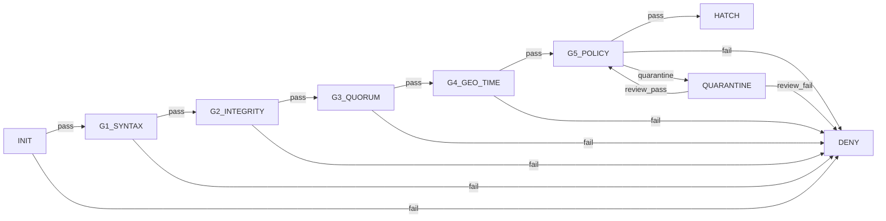

AI agents are being deployed into production with zero provenance. No identity, no authorization chain, no audit trail. When an autonomous agent makes a bad decision -- charges a credit card it shouldn't, executes a destructive command, leaks data to the wrong endpoint -- nobody can answer the most basic question: *who authorized this agent to exist in the first place?*

## The Problem

We solved this for containers years ago. Docker Content Trust, Sigstore, SBOM attestations -- there is a mature ecosystem for proving that a container image is what it claims to be, built by who it claims, from the source it claims. But AI agents? Nothing. Your LangChain agent, your CrewAI crew, your OpenAI assistant -- they boot up with no cryptographic identity, no authorization proof, no lifecycle tracking. They are ghosts in your infrastructure.

This is not a theoretical problem. As agents gain tool access (browser automation, code execution, API calls), the blast radius of an unauthorized or tampered agent grows fast. You need a birth certificate for every agent you deploy.

## The Solution: Attestation Packets

SCBE-AETHERMOORE defines an `egg-attest@v1` packet format -- a signed, verifiable document that captures everything about an agent's authorization and identity at birth. Here is the structure:

```json
{
  "spec": "SCBE-AETHERMOORE/egg-attest@v1",
  "agent_id": "hkdf://sha3-256/project-alpha/agent-07",
  "ritual": {
    "intent_sha256": "a1b2c3...64hex",
    "tongue_quorum": { "k": 4, "n": 6, "phi_weights": [0.15, 0.24, 0.39, 0.63, 1.0, 0.81] },
    "geoseal": { "scheme": "GeoSeal@v1", "region": "Poincare-B(0.2,0.3)", "proof": "zkp:..." },
    "timebox": { "t0": "2026-03-23T00:00:00Z", "delta_s": 3600 }
  },
  "anchors": {
    "H0_envelope": "sha3-256:abc123...",
    "H1_merkle_root": "sha3-256:def456...",
    "pq_sigs": [
      { "alg": "ML-DSA-65", "signer": "tongue:KO", "sig": "base64..." },
      { "alg": "ML-DSA-65", "signer": "tongue:AV", "sig": "base64..." }
    ]
  },
  "gates": {
    "syntax": "pass",
    "integrity": "pass",
    "quorum": { "pass": true, "k": 4, "weighted_phi": 3.22 },
    "geo_time": "pass",
    "policy": { "decision": "allow", "risk": 0.03 }
  },
  "hatch": {
    "boot_epoch": 0,
    "kdf": "HKDF-SHA3",
    "boot_key_fp": "fp:9a8b7c...",
    "attestation_A0": "cose-sign1:eyJ..."
  },
  "signature": {
    "alg": "ML-DSA-65-threshold",
    "signers": ["tongue:KO", "tongue:AV", "tongue:RU", "tongue:CA"],
    "sig": "base64-aggregate-sig..."
  }
}
```

Each section does one job:

- **ritual** -- Who authorized this agent, under what conditions. The `intent_sha256` is a hash of the original deployment intent. The `tongue_quorum` requires k-of-n signers (weighted by golden ratio). The `geoseal` binds the attestation to a geographic/topological region using a zero-knowledge proof. The `timebox` sets a hard expiry window.

- **anchors** -- The cryptographic proof chain. `H0_envelope` is a domain-separated hash of the full packet. `H1_merkle_root` is a Merkle root over the post-quantum signatures. The `pq_sigs` array contains individual signatures from each authorizing signer, using post-quantum algorithms (ML-DSA-65, Falcon-512, etc.) that survive quantum attacks.

- **gates** -- Five verification checks that must all pass before the agent is allowed to exist. More on these below.

- **hatch** -- The deterministic agent identity. `boot_epoch` is a monotonic counter (0 = first boot). The agent ID is derived via HKDF from the anchor chain, so it is reproducible and tamper-evident. `attestation_A0` is a COSE_Sign1 boot attestation.

- **signature** -- A threshold post-quantum signature over the entire packet. Not one signer -- a quorum of signers must agree.

## The 5-Gate Pipeline

Every attestation packet must pass through five sequential gates. There is no shortcut. The state machine is formally verified -- we proved there is no path from INIT to HATCH that skips a gate.



What each gate checks:

1. **G1 SYNTAX** -- Is the packet structurally valid against the JSON schema? Rejects malformed input before any crypto runs.
2. **G2 INTEGRITY** -- Do the hashes match? Is `H0_envelope` correct? Does `H1_merkle_root` cover the provided signatures?
3. **G3 QUORUM** -- Did enough signers sign? Are the golden-ratio-weighted votes above threshold? Are all signers unique?
4. **G4 GEO_TIME** -- Is the geoseal proof valid? Is the timebox still open? Prevents replay attacks and out-of-region deployment.
5. **G5 POLICY** -- Does the risk score fall within acceptable bounds? This is where the hyperbolic cost scaling kicks in -- adversarial intent pushes the risk score toward 1.0 exponentially, making attacks computationally infeasible.

DENY is absorbing. Once denied, there is no transition out. QUARANTINE can loop back to G5 after manual review, but it cannot jump to HATCH directly. The shortest path from INIT to HATCH is exactly 6 edges (INIT plus 5 gates). This is verified at build time by BFS over the automaton.

## Try It Now

Verify an attestation packet against the API:

```bash
curl -X POST https://api.scbe.dev/v1/attest/verify \
  -H "Content-Type: application/json" \
  -H "x-api-key: YOUR_API_KEY" \
  -d @attestation.json
```

Response:

```json
{
  "valid": true,
  "errors": [],
  "verification_id": "av_3f8a1b2c9d4e5f60",
  "verified_at": "2026-03-23T14:30:00.000Z",
  "gates_summary": {
    "syntax": "pass",
    "integrity": "pass",
    "quorum": true,
    "geo_time": "pass",
    "policy_decision": "allow",
    "risk": 0.03
  }
}
```

Sign up free at [scbe.dev/billing/free-signup](https://scbe.dev/billing/free-signup) -- 100 verifications/month, no credit card required.

## npm Quick Start

```bash
npm install scbe-aethermoore
```

```typescript
import { validateEggAttest, allGatesPassed } from 'scbe-aethermoore/crypto';
import type { EggAttestPacket } from 'scbe-aethermoore/crypto';

// Load your attestation packet (from file, API, agent runtime, etc.)
const packet: EggAttestPacket = JSON.parse(raw);

const result = validateEggAttest(packet);

if (result.valid && allGatesPassed(packet.gates)) {
  console.log('Agent attestation verified -- safe to hatch');
} else {
  console.error('Attestation failed:', result.errors);
  // Block the agent from booting
  process.exit(1);
}
```

The validator checks structural shape *and* semantic invariants: quorum arithmetic, timebox expiry, signer uniqueness, gate consistency, and boot epoch ordering. It runs in under 5ms for a single packet.

## What's Next

We are working on:

- **LangChain / CrewAI integrations** -- Attestation middleware that verifies agent identity before tool execution. Drop-in decorators for your existing agent code.
- **SBOM drift detection** -- Continuous comparison of the agent's runtime dependencies against the SBOM digest locked at attestation time. If the dependencies shift, the attestation is invalidated.
- **Runtime attestation streaming** -- Ongoing attestation (A0, A1, A2...) at every epoch boundary, not just at boot. The agent's identity is re-derived and re-verified continuously.

## Get Started

- GitHub: [github.com/issdandavis/scbe-aethermoore](https://github.com/issdandavis/scbe-aethermoore)
- npm: `npm install scbe-aethermoore`
- Free API signup: [scbe.dev/billing/free-signup](https://scbe.dev/billing/free-signup)
- JSON Schema: `GET https://api.scbe.dev/v1/attest/schema`

The schema is open. The validator is open source. If you are building agents that touch anything consequential, give them a birth certificate.
