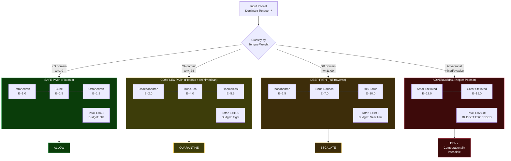
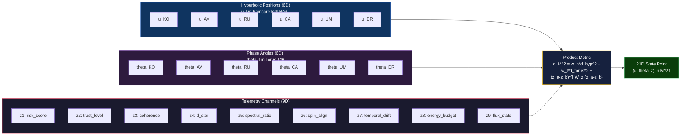
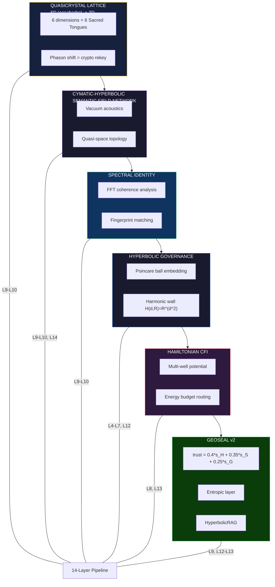

# SCBE-AETHERMOORE System Routing Map

## Full System Flow — Input to Decision

```mermaid
flowchart TB
    subgraph INPUT["INPUT SURFACE"]
        direction LR
        API["REST API<br/>FastAPI :8000"]
        BROWSER["AetherBrowse<br/>Browser Agent"]
        CLI["CLI / Agent<br/>Commands"]
        MCP["MCP Server<br/>Tool Calls"]
        N8N["n8n Bridge<br/>:8001"]
    end

    INPUT --> TOKENIZE

    subgraph TOKENIZE["SACRED TONGUE TOKENIZER"]
        direction LR
        T1["Raw Input"]
        T2["6-Tongue<br/>Token Grid<br/>256 tokens/tongue<br/>1536 total"]
        T3["Tongue Weights<br/>KO=1.0  AV=1.62<br/>RU=2.62  CA=4.24<br/>UM=6.85  DR=11.09"]
        T1 --> T2 --> T3
    end

    TOKENIZE --> PIPELINE

    subgraph PIPELINE["14-LAYER PIPELINE"]
        direction TB
        subgraph EMBED["L1-L4: EMBEDDING"]
            direction LR
            L1["L1: Complex<br/>Context<br/>c = A*exp(i*phi)"]
            L2["L2: Realify<br/>x = Re,Im"]
            L3["L3: Weighted<br/>Transform<br/>x_G = G^0.5 * x"]
            L4["L4: Poincare<br/>Ball Embed<br/>u = tanh(a||x||)*x/||x||"]
            L1 --> L2 --> L3 --> L4
        end

        subgraph HYPER["L5-L7: HYPERBOLIC GEOMETRY"]
            direction LR
            L5["L5: Hyperbolic<br/>Distance d_H<br/>arcosh(1+2||u-v||^2/...)"]
            L6["L6: Breathing<br/>Transform<br/>B(p,t) radial"]
            L7["L7: Mobius<br/>Phase<br/>Q*(a + u)"]
            L5 --> L6 --> L7
        end

        subgraph REALM["L8: POLYHEDRAL ROUTING"]
            L8["L8: Multi-Well<br/>Realm Selection<br/>d* = min_k d_H(u, mu_k)"]
        end

        subgraph COHERE["L9-L10: COHERENCE"]
            direction LR
            L9["L9: Spectral<br/>Coherence<br/>S_spec = 1 - r_HF"]
            L10["L10: Spin<br/>Coherence<br/>S_spin = ||sum exp(i*theta)||/N"]
            L9 --> L10
        end

        subgraph GOVERN["L11-L14: GOVERNANCE"]
            direction LR
            L11["L11: Triadic<br/>Temporal<br/>d_tri = l1*d1+l2*d2+l3*d_G"]
            L12["L12: Harmonic<br/>Wall<br/>H(d,R) = R^(d^2)"]
            L13["L13: DECISION<br/>ALLOW|QUARANTINE<br/>ESCALATE|DENY"]
            L14["L14: Audio<br/>Axis + PQC<br/>Telemetry"]
            L11 --> L12 --> L13 --> L14
        end

        EMBED --> HYPER --> REALM --> COHERE --> GOVERN
    end

    L8 --> PHDM
    L13 --> DECISION

    subgraph PHDM["16 PHDM POLYHEDRA"]
        direction TB
        subgraph PLAT["PLATONIC (Safe Core)"]
            direction LR
            P1["Tetrahedron<br/>E=1.0"]
            P2["Cube<br/>E=1.5"]
            P3["Octahedron<br/>E=1.8"]
            P4["Dodecahedron<br/>E=2.0"]
            P5["Icosahedron<br/>E=2.5"]
        end
        subgraph ARCH["ARCHIMEDEAN (Complex)"]
            direction LR
            A1["Truncated<br/>Icosahedron<br/>E=4.0"]
            A2["Rhombicosi-<br/>dodecahedron<br/>E=5.5"]
            A3["Snub<br/>Dodecahedron<br/>E=7.0"]
        end
        subgraph RHOM["RHOMBIC + JOHNSON"]
            direction LR
            R1["Rhombic<br/>Dodecahedron<br/>E=6.0"]
            R2["Rhombic<br/>Triaconta-<br/>hedron E=8.0"]
            J1["Square<br/>Gyrobicupola<br/>E=5.0"]
            J2["Pentagonal<br/>Orthobirotunda<br/>E=7.0"]
        end
        subgraph TORO["TOROIDAL (Cycles)"]
            direction LR
            T4["Genus-1<br/>Torus<br/>E=8.0"]
            T5["Hexagonal<br/>Torus<br/>E=10.0"]
        end
        subgraph KEPL["KEPLER-POINSOT (Adversarial)"]
            direction LR
            K1["Small Stellated<br/>Dodecahedron<br/>E=12.0"]
            K2["Great Stellated<br/>Dodecahedron<br/>E=15.0"]
        end
    end

    PHDM --> FLUX

    subgraph FLUX["FLUX STATE GATE"]
        direction LR
        POLLY["POLLY<br/>All 16 active<br/>Full capability"]
        QUASI["QUASI<br/>8 active<br/>Defensive"]
        DEMI["DEMI<br/>5 active<br/>Lockdown"]
    end

    FLUX --> GEODESIC

    subgraph GEODESIC["GEODESIC GATEWAYS (TNGG)"]
        direction TB
        subgraph TRIPOD["TRIPOLAR NODE N=0"]
            direction LR
            V1["v1 = (1,0,0)<br/>Branch 1"]
            V2["v2 = (-1/2, sqrt3/2, 0)<br/>Branch 2"]
            V3["v3 = (-1/2, -sqrt3/2, 0)<br/>Branch 3"]
        end
        subgraph FRACTAL["FRACTAL RECURSION lambda=1/phi"]
            direction LR
            D0["Depth 0<br/>cost=-0.387"]
            D1["Depth 1<br/>cost=-0.239"]
            D2["Depth 2<br/>cost=-0.148"]
            D0 --> D1 --> D2
        end
        subgraph ROUGH["HAUSDORFF ROUGHNESS"]
            direction LR
            SMOOTH["D_H < 2.0<br/>ALLOW"]
            ZIGZAG["D_H 2-3<br/>QUARANTINE"]
            EVASION["D_H > 4<br/>DENY"]
        end
    end

    GEODESIC --> WORLD_TREE

    subgraph WORLD_TREE["WORLD TREE METRIC"]
        direction LR
        WT1["L_f: Base<br/>Langues Flux"]
        WT2["L_gate: Gateway<br/>Cost Reduction"]
        WT3["L_fractal: Fractal<br/>Recursion"]
        WT4["L_emotional: Sacred<br/>Egg Valence"]
        WT5["L_spectral: Riemann<br/>Zeta Prior"]
        WT6["L_lyapunov: Stability<br/>Monitor"]
        WT7["L_hausdorff: Intent<br/>Roughness"]
        WTC["L_total = sum(L1..L7)"]
        WT1 --> WTC
        WT2 --> WTC
        WT3 --> WTC
        WT4 --> WTC
        WT5 --> WTC
        WT6 --> WTC
        WT7 --> WTC
    end

    WORLD_TREE --> COIN

    subgraph COIN["GOVERNANCE COIN"]
        direction LR
        VALUE["Value = 1/(1+L)<br/>GovernanceCoin"]
        PROOF["blake2s<br/>Integrity Proof"]
        VALUE --> PROOF
    end

    COIN --> DECISION

    subgraph DECISION["DECISION OUTPUT"]
        direction TB
        ALLOW["ALLOW<br/>Value >= 0.7<br/>Safe operation"]
        QUARANTINE["QUARANTINE<br/>0.3 <= Value < 0.7<br/>Needs review"]
        DENY["DENY<br/>Value < 0.3<br/>Blocked"]
    end

    DECISION --> OUTPUT

    subgraph OUTPUT["OUTPUT SURFACE"]
        direction LR
        RESP["API Response"]
        AGENT_OUT["Agent Action"]
        TRAIN["Training Data<br/>SFT Pair"]
        TELEM["Telemetry<br/>L14 Audio Axis"]
    end

    style INPUT fill:#1a1a2e,stroke:#e94560,color:#fff
    style TOKENIZE fill:#16213e,stroke:#0f3460,color:#fff
    style PIPELINE fill:#0f3460,stroke:#533483,color:#fff
    style EMBED fill:#1a1a2e,stroke:#e94560,color:#fff
    style HYPER fill:#1a1a2e,stroke:#50C878,color:#fff
    style REALM fill:#1a1a2e,stroke:#0F52BA,color:#fff
    style COHERE fill:#1a1a2e,stroke:#9966CC,color:#fff
    style GOVERN fill:#1a1a2e,stroke:#3D3D3D,color:#fff
    style PHDM fill:#16213e,stroke:#FFBF00,color:#fff
    style PLAT fill:#0a3d0a,stroke:#50C878,color:#fff
    style ARCH fill:#1a1a2e,stroke:#FFBF00,color:#fff
    style RHOM fill:#1a1a2e,stroke:#0F52BA,color:#fff
    style TORO fill:#2d1a3e,stroke:#9966CC,color:#fff
    style KEPL fill:#3d0a0a,stroke:#e94560,color:#fff
    style FLUX fill:#16213e,stroke:#533483,color:#fff
    style GEODESIC fill:#0f3460,stroke:#50C878,color:#fff
    style WORLD_TREE fill:#1a1a2e,stroke:#FFBF00,color:#fff
    style COIN fill:#16213e,stroke:#50C878,color:#fff
    style DECISION fill:#0f3460,stroke:#e94560,color:#fff
    style ALLOW fill:#0a3d0a,stroke:#50C878,color:#fff
    style QUARANTINE fill:#3d3d0a,stroke:#FFBF00,color:#fff
    style DENY fill:#3d0a0a,stroke:#e94560,color:#fff
    style OUTPUT fill:#1a1a2e,stroke:#533483,color:#fff
```

## Sacred Tongue Layer Mapping

```mermaid
flowchart LR
    subgraph KO["KO (Koraelin)<br/>Control / w=1.0"]
        direction TB
        KO_L1["L1: Complex Context"]
        KO_L2["L2: Realification"]
        KO_L1 --> KO_L2
    end

    subgraph AV["AV (Avali)<br/>I/O Phase / w=1.62"]
        direction TB
        AV_L3["L3: Weighted Transform"]
        AV_L4["L4: Poincare Embed"]
        AV_L3 --> AV_L4
    end

    subgraph RU["RU (Runethic)<br/>Policy Energy / w=2.62"]
        direction TB
        RU_L5["L5: Hyperbolic Distance"]
        RU_L6["L6: Breathing Transform"]
        RU_L5 --> RU_L6
    end

    subgraph CA["CA (Cassisivadan)<br/>Logic Compute / w=4.24"]
        direction TB
        CA_L7["L7: Mobius Phase"]
        CA_L8["L8: Multi-Well Realms"]
        CA_L7 --> CA_L8
    end

    subgraph UM["UM (Umbroth)<br/>Security Trust / w=6.85"]
        direction TB
        UM_L9["L9: Spectral Coherence"]
        UM_L10["L10: Spin Coherence"]
        UM_L9 --> UM_L10
    end

    subgraph DR["DR (Draumric)<br/>Deep Lock / w=11.09"]
        direction TB
        DR_L11["L11: Triadic Temporal"]
        DR_L12["L12: Harmonic Wall"]
        DR_L11 --> DR_L12
    end

    KO --> AV --> RU --> CA --> UM --> DR

    DR --> L13_OUT["L13: Decision Gate"]
    L13_OUT --> L14_OUT["L14: Audio Axis + Telemetry"]

    style KO fill:#8B0000,stroke:#ff4444,color:#fff
    style AV fill:#CC9900,stroke:#FFBF00,color:#fff
    style RU fill:#2d6b2d,stroke:#50C878,color:#fff
    style CA fill:#0a2d5a,stroke:#0F52BA,color:#fff
    style UM fill:#4d3366,stroke:#9966CC,color:#fff
    style DR fill:#2d2d2d,stroke:#666,color:#fff
    style L13_OUT fill:#1a0a2e,stroke:#e94560,color:#fff
    style L14_OUT fill:#1a0a2e,stroke:#533483,color:#fff
```

## Polyhedral Routing — Energy Budget Path

## 21D State Manifold Structure

## Lattice Stack Integration

