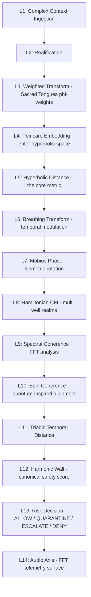
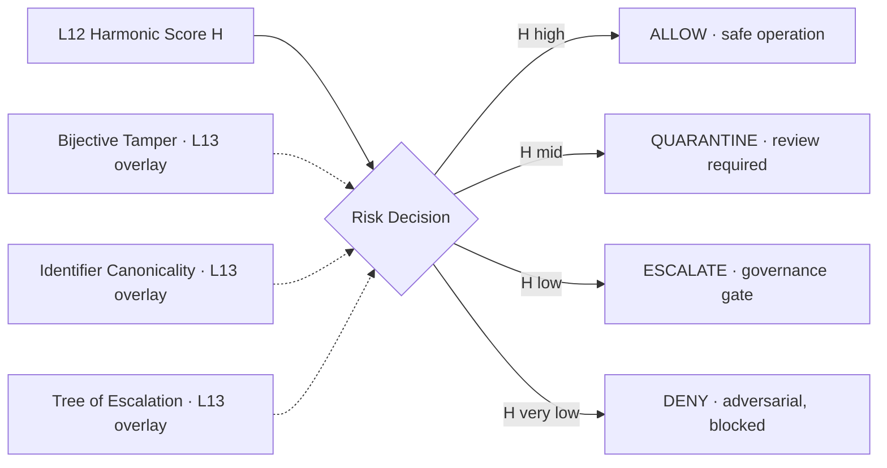
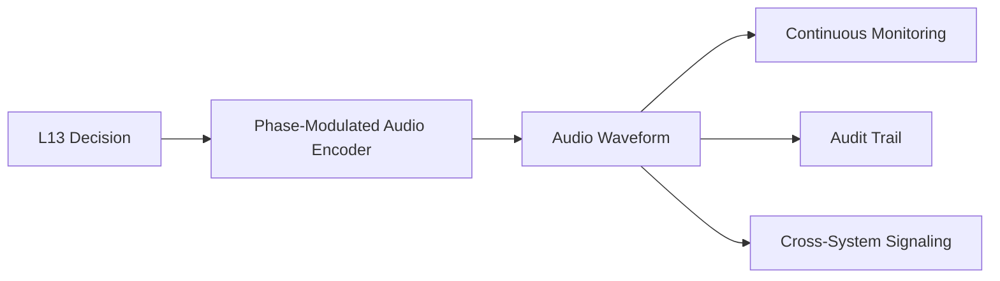
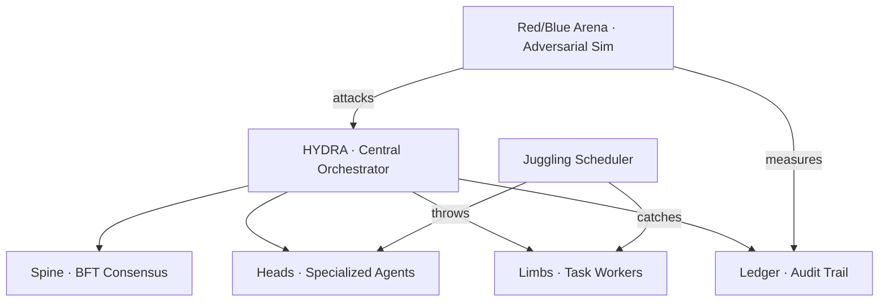
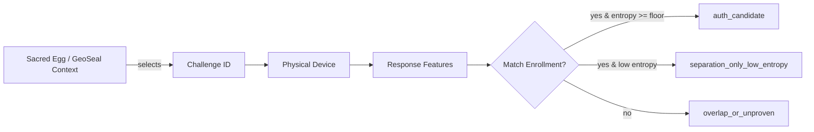

<!-- _class: lead -->

# SCBE-AETHERMOORE
## A 14-Layer Quantum-Resistant Governance Pipeline for AI Systems

**Issac D. Davis** · Principal
**Patent Pending** · US Provisional 63/961,403
**SAM.gov Active** · UEI J4NXHM6N5F59 · CAGE 1EXD5

<!--
SPEAKER NOTES:
Welcome. SCBE-AETHERMOORE is an AI safety and governance framework I designed
and built independently. Today I'm walking you through the system architecture
end to end. The core claim: adversarial behavior against an AI system protected
by SCBE costs exponentially more the further it drifts from safe operation.
That makes most attacks computationally infeasible, not just hard.

Three things to keep in mind throughout:
1. This is patent pending — the math is novel.
2. The business is SAM.gov registered and minority-owned, ready to take federal
   contracts today.
3. Every layer I describe has working code in the public GitHub repository
   with a test that proves it does what I claim.
-->

---

## The Problem

**Every federal agency and regulated enterprise deploying generative AI faces the same gap:**

The model providers ship MODELS.
They do NOT ship the GOVERNANCE LAYER.

| What's missing | Why it matters |
|---|---|
| Audit-ready policy enforcement | NIST AI RMF compliance |
| Adversarial cost scaling | Prompt-injection / jailbreak defense |
| Quantum-resistant signing | Post-quantum readiness (EO 14110) |
| Multi-tongue interpretation | Catches what single-pass parsing misses |
| Bounded harmonic decision | Provable safety bounds, not heuristics |

<!--
SPEAKER NOTES:
The frontier model providers — OpenAI, Anthropic, Google, Meta — sell capability.
They do not sell governance. NIST AI RMF, Executive Order 14110, and the
emerging state and EU AI laws all require that the deploying organization
produce governance evidence. The model vendor doesn't generate that evidence
for you.

That governance gap is what SCBE fills. Not by replacing the model — by sitting
in front of and around the model as a policy enforcement and audit substrate.
-->

---

## The Core Insight

**Use HYPERBOLIC GEOMETRY to make adversarial behavior exponentially expensive.**

In Euclidean space, the cost of moving from safe to adversarial scales linearly.

In the **Poincaré ball model** of hyperbolic space, the cost scales like:

$$
d_H(u, v) = \text{arcosh}\left(1 + \frac{2 \|u - v\|^2}{(1 - \|u\|^2)(1 - \|v\|^2)}\right)
$$

As an adversarial input drifts toward the boundary `‖u‖ → 1`, the denominator
collapses and **distance grows without bound**.

**Translation:** the closer an attack tries to mimic a real misuse, the more
hyperbolic distance it accumulates, and the more compute the attacker must burn
to make any progress.

<!--
SPEAKER NOTES:
This is the central technical claim. Hyperbolic space has the property that
distances grow exponentially as you approach the boundary of the unit ball.
We use this on purpose: the safe operating region sits near the origin, and
adversarial regions sit near the boundary. An attacker trying to camouflage
malicious intent as legitimate use ends up traveling exponentially-expensive
distances in our embedding.

This is not a heuristic. It's a metric — a real distance function on a real
geometric space. The cost scaling is provable, not measured. That's what makes
the SCBE pipeline different from every other "AI safety" wrapper that depends
on classifier accuracy.
-->

---

## The 14-Layer Pipeline at a Glance

<!--
SPEAKER NOTES:
Here's the full pipeline at a glance. Don't try to read every layer name yet —
we'll walk through them in groups. The important thing right now is the SHAPE:
input enters at L1, gets progressively transformed through complex
representation, into hyperbolic space, through coherence and temporal analysis,
and exits as a bounded safety score in L12, a discrete governance decision in
L13, and a telemetry signal in L14.

Every layer has a specific axiom it must satisfy — we'll see that next.
-->

---

## Layers 1–4 — From Text to Hyperbolic Space

| Layer | Function | Axiom |
|---|---|---|
| **L1** Complex Context | Tokenize input into complex-valued representation | Composition (A5) |
| **L2** Realification | Convert complex → real, preserving norm | Unitarity (A1) |
| **L3** Weighted Transform | Apply phi-weighted Sacred Tongue scaling | Locality (A2) |
| **L4** Poincaré Embedding | Project into hyperbolic ball, `‖x‖ < 1` | Unitarity (A1) |

**Key transition: L4.** The Euclidean → Hyperbolic boundary. Once we cross
into the Poincaré ball, the rest of the pipeline operates in a curved space
where adversarial cost scales exponentially.

<!--
SPEAKER NOTES:
The first four layers turn raw text into a hyperbolic geometry representation.
L1 ingests the input. L2 converts complex-valued embedding to real-valued
(this matters for downstream FFT operations). L3 applies a per-language
weighting based on the golden ratio, which gives us a defensible mathematical
basis for treating different language families differently. L4 is the critical
boundary: once we project into the Poincaré ball, we're in hyperbolic geometry
and the cost-scaling property kicks in.

Every transformation here preserves either norm or local structure — that's
what the axiom column tracks.
-->

---

## Layers 5–8 — Geometry, Time, and Energy

| Layer | Function | Axiom |
|---|---|---|
| **L5** Hyperbolic Distance | The arcosh distance metric | Symmetry (A4) |
| **L6** Breathing Transform | Add temporal oscillation | Causality (A3) |
| **L7** Möbius Phase | Isometric rotation in hyperbolic space | Unitarity (A1) |
| **L8** Hamiltonian CFI | Multi-well energy landscape | Locality (A2) |

L8 is where the system exists in **discrete safety REGIMES**: ALLOW well, QUARANTINE
well, ESCALATE well, DENY well. Adversarial drift between wells requires energy
the attacker has to supply.

<!--
SPEAKER NOTES:
L5 is the actual distance computation — the math we saw two slides ago.
L6 introduces time. The "breathing transform" is an oscillatory modulation
that prevents an adversary from finding a static attack point and camping
there.
L7 applies Möbius transformations — these are the isometries of hyperbolic
space, meaning they rotate our perspective without changing the underlying
metric.
L8 is conceptually important: it imposes a Hamiltonian energy landscape with
multiple stable wells, each corresponding to a different security regime. The
system literally has potential energy minima at ALLOW, QUARANTINE, ESCALATE,
and DENY. Moving between them costs energy the attacker has to provide.
-->

---

## Layers 9–11 — Frequency, Spin, and Time

| Layer | Function | Axiom |
|---|---|---|
| **L9** Spectral Coherence | FFT-based frequency analysis | Symmetry (A4) |
| **L10** Spin Coherence | Quantum-inspired alignment | Symmetry (A4) |
| **L11** Triadic Temporal | Three-scale time-window distance | Causality (A3) |

These layers detect **anomalous frequency content, decoherence patterns, and
temporal intent shifts** — adversarial behavior reveals itself in spectral
signatures even when individual tokens look benign.

<!--
SPEAKER NOTES:
These middle layers are about detecting patterns over time and across
frequency space. L9 runs an FFT on the security signal — anomalous spectral
content surfaces here that pure semantic analysis misses. L10 is borrowed
from quantum mechanics: spin coherence measures whether the security signal
is aligned with itself over time, or whether it's decohering. Decoherence
indicates an attacker probing for inconsistencies.

L11 is the temporal layer — it computes intent over three time scales
simultaneously: immediate intent, medium-term intent, long-term intent. An
attacker can fake one scale, but faking all three coherently is much harder.
-->

---

## L12 — The Harmonic Wall

**The canonical safety score:**

$$
H(d_H, p_d) = \frac{1}{1 + \phi \cdot d_H + 2 p_d}
$$

| Variable | Meaning |
|---|---|
| `d_H` | Hyperbolic distance from L5 |
| `p_d` | Probability of harm |
| `phi` | Golden ratio (1.618...) |
| `H` | Safety score in (0, 1] |

`H = 1.0` means perfectly safe. `H → 0` means catastrophic.

**This is the dual bounding system:**
- Soft bound: AttnRes attention regularization (heuristic)
- Hard bound: this algebraic wall (provable)

The hard wall always wins. The soft wall just makes it easier to land near `H = 1`.

<!--
SPEAKER NOTES:
This is the math that everything else feeds into. The harmonic wall is a
single closed-form expression that takes the hyperbolic distance from L5
and the probability of harm, and produces a bounded safety score between
zero and one.

The crucial property is that this is an ALGEBRAIC bound, not a learned
classifier. We can prove the bound holds. Compare to a typical AI safety
filter that depends on a fine-tuned classifier — we're not asking the
adversary to fool a model, we're asking them to violate algebra.

The phi weighting using the golden ratio gives us a defensible spacing
property that prevents adversarial codes from finding regularly-spaced
attack lattices in our scoring space.
-->

---

## L13 — Risk Decision and Governance Overlays

**Three composable overlays land at L13** — all behind feature flags, all
strictly monotonic (overlays can only TIGHTEN the decision, never loosen).

<!--
SPEAKER NOTES:
L13 is where math becomes policy. The harmonic score from L12 maps to one
of four discrete actions: ALLOW, QUARANTINE, ESCALATE, or DENY.

But L13 is also extensible. We have three governance overlays that compose
into the same decision point:

  - Bijective Tamper detects encoding-level attacks: NFD/NFC tricks,
    zero-width characters, anything that diverges under tokenize-decode round
    trip.
  - Identifier Canonicality detects homoglyph attacks: Cyrillic 'a' looking
    like Latin 'a', mixed-script identifiers, invisible Unicode in code.
  - Tree of Escalation is the newest one, just landed. It uses six different
    "Sacred Tongue" lanes to read the input in parallel and only escalates
    when the system runs out of bits to safely compile the operation.

All three are strictly monotonic. They can only tighten the decision. An
overlay can DENY a request the base scoring would have allowed, but it
cannot ALLOW a request the base scoring would have denied.
-->

---

## L14 — Audio Axis Telemetry

The L13 decision gets encoded as a phase-modulated audio signal — a continuous,
human-audible OR ultrasonic telemetry surface that closes the pipeline loop.

**Why audio?**
- A waveform is harder to silently tamper with than a log file
- Audio can be captured by any independent device for cross-system verification
- The Sacred Tongues each have a fundamental frequency (KO=440Hz, etc.) — the
  signal carries which tongue authorized the decision

<!--
SPEAKER NOTES:
The final layer is unusual. We encode the governance decision as audio.

Why? Three reasons. First, a continuous audio waveform is far harder to
silently tamper with than a discrete log file — flipping a log entry is
trivial; flipping bits in a phase-modulated waveform without producing
audible artifacts is hard. Second, an independent device — a phone, a
microphone, anything with audio capture — can record this signal alongside
the system, giving you cross-system verification. Third, the audio carries
which Sacred Tongue authorized the decision, encoded as a fundamental
frequency.

This is also where the system can publish telemetry to humans. An operator
hearing a particular tone knows the system just escalated something.
-->

---

## The 5 Quantum Axiom Mesh

Every layer must satisfy ONE axiom that constrains its behavior:

| Axiom | Meaning | Layers |
|---|---|---|
| **A1 Unitarity** | Norm preservation (no information loss) | L2, L4, L7 |
| **A2 Locality** | Spatial bounds (no nonlocal action) | L3, L8 |
| **A3 Causality** | Time-ordering (no future-leak) | L6, L11, L13 |
| **A4 Symmetry** | Gauge invariance (no privileged frame) | L5, L9, L10, L12 |
| **A5 Composition** | Pipeline integrity (no torn boundaries) | L1, L14 |

Each axiom has a Python implementation under
`src/symphonic_cipher/scbe_aethermoore/axiom_grouped/` and a CI gate that
proves layer-by-layer compliance.

<!--
SPEAKER NOTES:
The axioms are how we formally constrain the system. Each layer is responsible
for satisfying one specific axiom — not all five, just one. This decomposition
makes the system reasoning tractable: you can verify L5 satisfies symmetry
without having to verify every other layer at the same time.

The five axioms together cover all five physical conservation principles
relevant to a discrete-time signal processing pipeline. We didn't invent these
— we borrowed them from quantum information theory and adapted them to a
classical security pipeline. That gives us decades of mathematical literature
to draw on for proving properties of the system.

Every PR that touches a layer has to pass an axiom-compliance CI gate. That's
how we keep the pipeline mathematically honest as it evolves.
-->

---

## The 6 Sacred Tongues

Six dimensions for multi-perspective parsing, each weighted by powers of phi:

| Tongue | Weight | Routes To | Color |
|---|---|---|---|
| **Kor'aelin** (KO) | 1.00 | Python | structural |
| **Avali** (AV) | 1.62 | TypeScript | declarative |
| **Runethic** (RU) | 2.62 | Rust | systemic |
| **Cassisivadan** (CA) | 4.24 | Mathematica | analytic |
| **Umbroth** (UM) | 6.85 | Haskell | symbolic |
| **Draumric** (DR) | 11.09 | Markdown | narrative |

Higher tongue weight = more bits available for compilation but more energy required.

The **Tree of Escalation** (L13 overlay) walks UP this ladder when lower-tongue lanes
run out of bits to compile the input safely.

<!--
SPEAKER NOTES:
The Sacred Tongues are the multi-perspective parsing system. Six lanes,
each handling a different style of computational thinking — structural,
declarative, systemic, analytic, symbolic, narrative — and each weighted
by an integer power of the golden ratio.

The weighting matters because it gives us a phi-spaced lattice. An adversary
who finds an attack at one tongue's frequency cannot just shift to a
neighboring tongue — phi-spacing ensures that adjacent tongues are at
incommensurate frequencies, so the attack doesn't transfer.

Each tongue also has a natural mapping to a real programming language. When
the routing-aware tongue matters, KO tokens lean Python, AV tokens lean
TypeScript, and so on. This isn't arbitrary — it lets the system delegate
to the most natural code generator for the work being done.
-->

---

## Multi-Agent Coordination — The Fleet

**HYDRA** orchestrates fleet-wide policy.
**Juggling Scheduler** models task handoffs as physics juggling (throws, catches, drops).
**Red/Blue Arena** runs continuous adversarial simulation against the live pipeline.

<!--
SPEAKER NOTES:
SCBE doesn't just protect a single AI inference. It coordinates a FLEET of
agents — each one running its own pipeline, all governed by the same
mathematical rules.

HYDRA is the central orchestrator. It uses Byzantine fault tolerant consensus
across multiple specialized agents to make policy decisions. Heads are
specialized agents — say, a code-generation head, a data-analysis head, a
security-evaluation head. Limbs are task workers that execute the heads'
decisions.

The Juggling Scheduler is unusual: it models task coordination as physics.
Tasks are balls, agents are hands, handoffs are throws, deadlines are catch
windows, failures are drops. This metaphor turns out to be load-bearing —
it gives us seven concrete rules for safe task handoff that we wouldn't
have generated from pure software engineering reasoning.

The Red/Blue Arena runs adversarial models against our governance pipeline
continuously. Red team tries to fool the system; Blue team configures defenses.
Provider-agnostic — works with local models, Anthropic, OpenAI, anyone.
-->

---

## Sacred Egg CRP-PUF — Hardware Forward Path

**Three-state verdict gated on entropy floor (default 64 bits).**
- `auth_candidate` → exit 0 (geometry passes AND entropy ≥ floor)
- `separation_only_low_entropy` → exit 3 (geometry passes, entropy too low)
- `overlap_or_unproven` → exit 2 (geometry fails)

This is the hardware-side anchor: the seed selects a challenge, the physical
device responds, and the response is bound to a sealed receipt.

<!--
SPEAKER NOTES:
This is the newest piece of the system, landed today. The Sacred Egg
Challenge-Response Physical Unclonable Function harness is the hardware-side
anchor for the SCBE governance system.

The idea: instead of using a cryptographic key that can be copied, we use
the physical response of a device to a public challenge. Same device + same
challenge gives a stable response; different device gives a different
response. The seed — the Sacred Egg context — selects WHICH challenge to
ask, and then the response is bound into a sealed receipt that goes into
the audit trail.

Crucially, the harness has an honest verdict gate. Geometry passing isn't
enough — the response also has to carry enough entropy to be authentication-
grade. Default floor is 64 bits, the NIST modern auth floor. Our current
synthetic test only delivers 4 bits, so it correctly downgrades to
"separation only low entropy" — geometry checks out, entropy doesn't.
That's the kind of honest gating that lets us cite results without
overpromising.
-->

---

## Adversarial Cost — The Bottom Line

| Adversary strategy | Cost in SCBE pipeline |
|---|---|
| Direct prompt injection | Bounded by L12 harmonic wall |
| Mimicry of safe operation | Exponential in hyperbolic distance |
| Edge-walking the boundary | Diverges as `‖u‖ → 1` |
| Origin-camping at safe region | Defeated by L6 breathing modulation |
| Oscillation between regimes | Defeated by L8 multi-well Hamiltonian |
| Encoding tricks (homoglyph, BiDi) | Caught by L13 canonicality + tamper overlays |
| Multi-step jailbreak | Compositional cost across 14 layers |

**The math doesn't ask the attacker to fool a classifier. It asks them to
violate algebra.**

<!--
SPEAKER NOTES:
Here's the bottom line on what this buys you. For each adversarial strategy
that real attackers use against AI systems, the SCBE pipeline imposes a
specific cost. Direct prompt injection is bounded by the harmonic wall —
the attacker can't push the safety score below a known floor. Mimicry —
trying to look like a legitimate request — costs exponentially more the
closer the attacker tries to camouflage. Edge-walking — sliding along the
boundary of safe behavior — is defeated by the hyperbolic metric itself,
which diverges at the boundary.

Origin camping — finding a static safe input and never moving — is defeated
by the breathing transform, which means the safe region itself is moving.
Oscillation between safe and adversarial regimes is defeated by the energy
landscape, which makes regime transitions cost real energy.

The encoding-level attacks — homoglyphs, bidirectional control characters,
zero-width Unicode — are caught by the canonicality and tamper overlays at
L13.

Multi-step jailbreaks have to defeat all 14 layers in sequence. The cost
is multiplicative.
-->

---

## Federal Pipeline

| Program | Status | Decision date |
|---|---|---|
| **DARPA CLARA** (FP-033) | Submitted 2026-05 | 2026-06-16 |
| **DARPA MATHBAC** | Abstract submitted 2026-04-27 | Full proposal due 2026-06-16 |
| **DARPA DICE** | Brief delivered | Pending follow-up |
| **DARPA SN-26-76** (Physical Compute) | RFI in prep | TBD |
| **DHS S&T AI/ML/DS** | RFI in prep | TBD |

**Active SAM.gov registration** since 2026-04-13 · **Minority-Owned Small Business**
**APEX Accelerator** (Port Angeles WA) supports federal contracting

<!--
SPEAKER NOTES:
The federal pipeline is real and active. Two DARPA proposals are in
evaluation right now — CLARA, which is on adaptive autonomy and has
near-perfect alignment with the SCBE technology stack, and MATHBAC, which
is on mathematical foundations of AI and where SCBE is positioned as a
post-quantum hyperbolic successor to DARPA's earlier Mission-oriented
Resilient Clouds program.

I have an active SAM.gov registration as a minority-owned small business,
which means I can take federal contracts directly today. The Port Angeles
APEX Accelerator provides ongoing federal-contracting support at no cost.

These proposals weren't speculative — both went through proposers' day
attendance, technical positioning, and full submission. Decision dates
are mid-June.
-->

---

## Commercial Path

**Dual-license model** — open-source core drives evaluation, commercial agreements
gate proprietary components.

| Tier | Users | Deploy instances | Swarm agents | Support |
|---|---|---|---|---|
| **Homebrew** | 1 | 1 | 3 | Community |
| **Professional** | up to 10 | up to 5 | 12 | Email (48h) |
| **Enterprise** | unlimited | unlimited | unlimited | Dedicated (24h) |

- Open-source surface: `npm install scbe-aethermoore`, `pip install scbe-agent-bus`
- Patent-pending IP: US Provisional 63/961,403 (commercial license includes practice rights)
- Published research: KDP book on the 6-Tongues protocol (ASIN B0GSSFQD9G), Zenodo abstract

<!--
SPEAKER NOTES:
On the commercial side, SCBE uses a dual-license model. The core library is
MIT-licensed and freely available — that's how we drive evaluation and
adoption. Anyone can pip install or npm install today and run the 14-layer
pipeline.

When customers need enterprise features — dedicated support, regulated
deployment bundles, governance operations as a managed service — those are
paid commercial agreements. The pricing tiers go from a single-user Homebrew
license up through Enterprise.

The patent-pending IP is the moat. Commercial agreements include rights to
practice the patented methods, which protects customers from third-party
licensing pressure.
-->

---

<!-- _class: lead -->

## Contact

**Issac D. Davis** · Principal
**SCBE-AETHERMOORE**

📧 issdandavis7795@gmail.com
📞 (360) 808-0876
🌐 https://aethermoore.com
🐙 https://github.com/issdandavis/SCBE-AETHERMOORE

**UEI:** J4NXHM6N5F59 · **CAGE:** 1EXD5
**SAM.gov Active** · Minority-Owned Small Business
**Patent Pending:** US Provisional 63/961,403

<!--
SPEAKER NOTES:
That's the system. Patent-pending math, published open-source code, active
federal contracting registration, and a working commercial path. I'm Issac
Davis, principal at SCBE-AETHERMOORE. Reach out at the contact info on the
slide. Thank you.
-->
