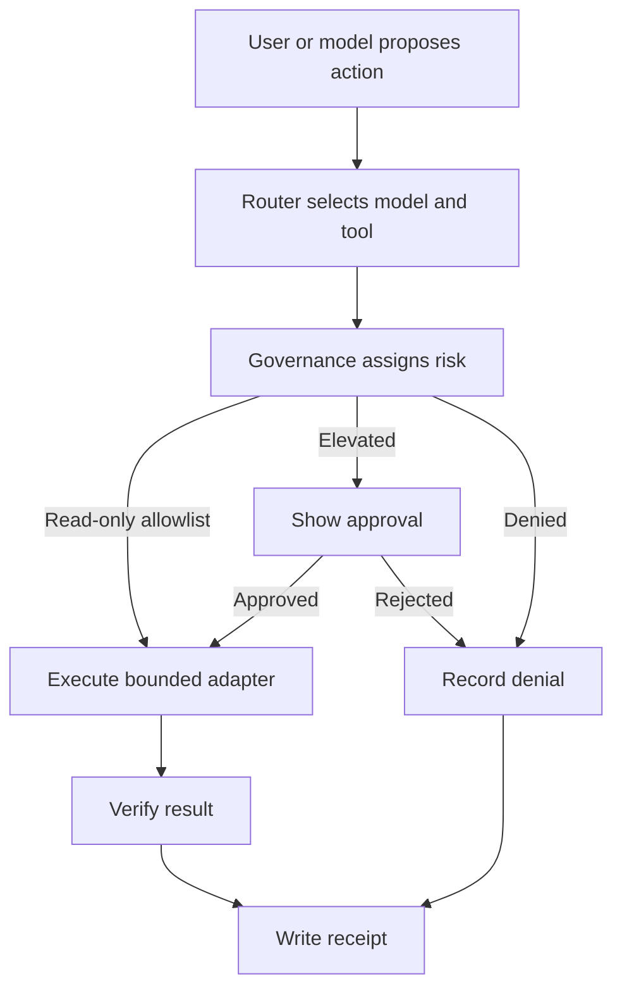

# Aether Workspace Architecture

## Product statement

AetherBrowser + AetherDesk is a local-first human-and-AI workbench. It borrows
the useful shared-workspace pattern from modern coding agents without copying
one product's layout or granting a model invisible host authority.

## Visible workspace

| Region | Contents | Trust behavior |
|---|---|---|
| Main viewport | Browser page, rendered app, selected file, diff, or task output | Human and agent share the same object |
| Assistant rail | Thread, current plan, model/provider, proposed tool calls, diffs | Proposals are distinct from executed actions |
| Approval and receipt drawer | Pending elevated actions and completed immutable receipts | Approval precedes elevated execution; receipt follows every bounded command |
| Status lane | Running/background tasks, local/remote provider state, safety gate, connection health | Failure and fallback remain visible |

The exact styling may change. These information and authority boundaries should
not disappear.

## Runtime components

1. **Model router** normalizes local Ollama/free endpoints and configured remote
   APIs behind provider adapters. It reports unavailable providers and does not
   silently switch to a paid remote model.
2. **AetherBrowser** owns the isolated browser/CDP lane and exposes the viewport
   and browser actions through governed adapters.
3. **AetherDesk** owns the operator shell, task presentation, provider status,
   allowlisted commands, and receipt browser.
4. **Governance gate** assigns a risk tier and determines direct execution,
   approval, escalation, or denial.
5. **Receipt writer** records what was requested, approved, executed, returned,
   and verified without copying secrets into the record.

## Action lifecycle

## Authority policy

- Browser navigation and read-only allowlisted checks may run without a modal
  approval when the current policy permits them.
- Filesystem writes, external messages, purchases, credential use, destructive
  actions, and authority expansion require explicit approval or are denied.
- The model receives capabilities through adapters, never a hidden unrestricted
  shell.
- A receipt is evidence of an attempted or completed action, not proof that the
  action's real-world outcome was correct; verifier fields carry that distinction.
- Secret values are referenced by provider/key name and must not be persisted in
  receipts, logs, diffs, or screenshots.

## Release contract

A product-surface release is valid only when
`npm run product:release-gate` returns zero and its consolidated receipt says
`PASS`. The gate proves:

- AetherBrowser backend and Chrome/CDP start;
- the extension worker is detected;
- backend smoke verification completes;
- AetherDesk health responds;
- a bounded AetherDesk command executes; and
- AetherDesk and the gate both emit receipts.

Training jobs, notebooks, corpora, generated bundles, and research demos are not
part of this contract.
