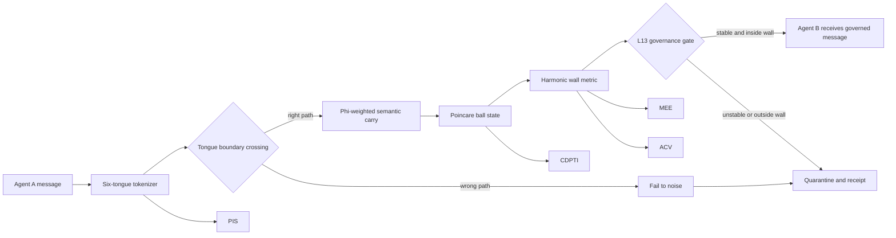
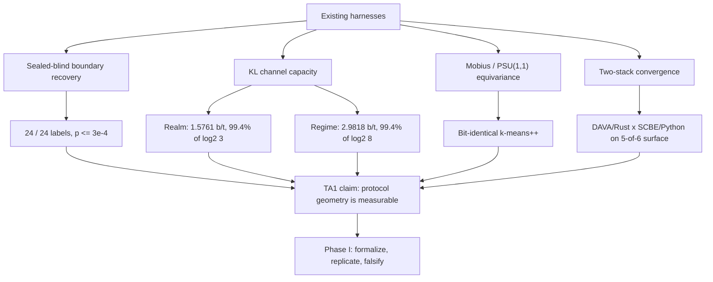
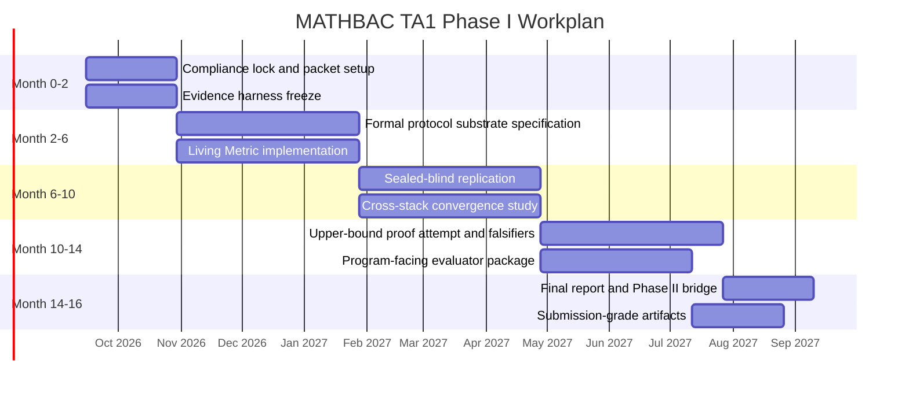

# MATHBAC Submission Readiness - 2026-04-26

**Solicitation:** DARPA-PA-26-05, MATHBAC TA1  
**Current status:** Drafted, not submitted  
**Primary objective:** move from draft text to a submission-grade packet with diagrams, verified channels, and explicit claim boundaries.

## Submission State

| Item | Status | Evidence / path |
|---|---|---|
| Abstract draft | Ready for review | `artifacts/mathbac/MATHBAC_ABSTRACT_DRAFT_v1_2026-04-26.md` |
| Abstract PDF | Rendered locally | `artifacts/mathbac/MATHBAC_ABSTRACT_v1.pdf` |
| Email body | Drafted, not sent | `artifacts/mathbac/MATHBAC_ABSTRACT_EMAIL_DRAFT_2026-04-26.md` |
| Visual appendix | Drafted locally | `artifacts/mathbac/MATHBAC_VISUAL_APPENDIX_2026-04-26.md` |
| CLARA status | Submitted / pending review | `DARPA-PA-25-07-02-CLARA-FP-033`, finalized 2026-04-13 08:04 PM ET |
| BAAT account | User says account exists | Needs no new account action unless portal access fails |

## Blocking Items Before Send

- [ ] Verify official abstract channel from PA-26-05 attachments.
- [ ] Confirm whether abstract is email-only, BAAT upload, or both.
- [ ] Confirm subject line, attachment naming, and page-limit language.
- [ ] Strip internal checklist from the abstract before transmission.
- [ ] Visually inspect the final PDF after any diagram or formatting changes.
- [ ] Save send receipt or portal receipt into the private proposal packet.

## Claim Discipline

- Proven: sealed-blind recovery, KL capacity estimates, bit-identical equivariance, and two-stack convergence under the named harnesses.
- Observed: structured protocol behavior across the current SCBE/DAVA surfaces.
- Hypothesis: geometric cost scaling and broader cross-domain transfer.
- Forbidden framing: "proved universally," "general AI safety solved," or any claim that the current harness covers all agentic systems.

## Figure 1: Protocol Substrate

Use this figure when the reviewer needs to see how tokenizer geometry, harmonic-wall evaluation, and governance are one system instead of three bolted-on claims.

## Figure 2: Evidence Spine

Use this figure when the reviewer asks what evidence exists today. It keeps the packet evidence-led and prevents drift into unsupported architecture language.

## Figure 3: Phase I Workplan

Use this figure in the full proposal work-plan section. It is probably too large for the two-page abstract unless the abstract is reformatted around a single figure.

## Next Operator Steps

1. Pull or open the PA-26-05 attachments and verify the abstract channel.
2. Decide whether the two-page abstract includes Figure 1 or stays text-only.
3. Produce a one-page technical appendix from Figures 1 and 2 if the channel allows attachments beyond the abstract.
4. Run a final overclaim pass against the claim-discipline section above.
5. Stage the final email or portal package, then wait for explicit user authorization before sending.
