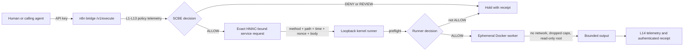

# Whole-system agent security review

**Review date:** 2026-09-19
**Base revision:** `5ba0ef4e7e49e2964ffe6e697cb1265cb7fdc868`
**Review branch:** `fix/whole-system-security-20260919`
**Status:** implementation hardening and bounded engineering evidence

This review is not a penetration-test certificate, NIST certification, FIPS
validation, or proof of general agent safety. It covers the reviewed source
paths, tests, and frozen datasets at the revision above.

## Security decision

SCBE's fourteen-layer geometry can add useful anomaly telemetry, routing
pressure, quarantine selection, and audit context. It must not establish
identity, create authority, repair an invalid signature, or widen a capability.
The authority order is:

1. authenticated principal and cryptographic request binding;
2. explicit resource, operation, expiry, and replay-bounded capability;
3. SCBE policy evaluation and constrained routing;
4. operating-system, container, network, and data boundaries;
5. telemetry and receipts.

If an earlier authority check fails, a favorable geometric score cannot restore
permission. Multiple tongues, inverse rails, nested coordinates, and repeated
hashes are correlated representations unless independent secrets or actors are
actually present.

## Reviewed execution boundary

The bridge API key authenticates its caller. A separate 256-bit-minimum service
secret binds the bridge to the runner with HMAC-SHA-256. These are distinct
boundaries. The fourteen-layer score observes and routes an already
authenticated request.

## Repairs made

### Bridge to runner

- Protected `/api/preflight` and `/api/run` with a cross-language
  HMAC-SHA-256 contract over the exact HTTP method, route, millisecond
  timestamp, random nonce, and SHA-256 body digest.
- Required at least 32 UTF-8 bytes of service secret and constant-time MAC
  comparison.
- Added a 60-second freshness window and bounded in-memory nonce store.
- Made replay-cache saturation fail closed. Live nonces are never evicted to
  admit new work.
- Bound version-2 decision receipts to the request method, route, body digest,
  and nonce. The Python bridge verifies the JavaScript runner receipt before it
  accepts a successful execution response.
- Bound the runner to `127.0.0.1` by default. Remote runners require explicit
  opt-in; remote plain HTTP requires an additional override.
- Rejected unsafe URL forms, oversized code and responses, unsupported
  languages, and out-of-range timeouts.
- Disabled networked dependency installation by default.

### Worker containment

- Dropped all Linux capabilities and enabled `no-new-privileges`.
- Made the container root filesystem read-only.
- Added bounded `tmpfs` mounts, a file-descriptor limit, PID/memory/CPU
  bounds, a non-root user, and no network during execution.
- Replaced the old descriptive “signature” string with a verifiable,
  request-bound HMAC decision receipt when service authentication is configured.
- Disabled unconditional proxy trust. Proxy headers are trusted only through an
  explicit deployment setting.

### Prompt-policy state

The adversarial harness previously accumulated geometric novelty into session
suspicion. Several malicious turns could therefore poison later clean turns.
The corrected policy:

- accumulates suspicion only from direct evidence;
- lets geometric novelty decay rather than accumulate by itself;
- prevents stale suspicion from blocking a clean current turn;
- requires an explicit phase hit or at least two independent geometric signal
  families for the standalone SCBE arm.

## Agent-friendly decision semantics

| Decision | Permitted behavior | Required authority |
|---|---|---|
| `ALLOW` | Execute only the requested bounded capability | Valid identity, request MAC/signature, freshness, capability and policy |
| `QUARANTINE` | Route to a reduced tool profile such as read-only, no network, scratch workspace, or preview | The original caller must still authenticate; quarantine never grants a missing capability |
| `ESCALATE` / `REVIEW` | Hold execution and produce a compact explanation and receipt | No side effect before approval or stronger evidence |
| `DENY` | Stop the proposed side effect and preserve non-secret diagnostics | No fallback to a weaker path |

The current kernel-runner executes only `ALLOW`; other decisions stop. A future
quarantine tool lane should preserve tool reachability through a smaller,
explicit capability rather than silently downgrading answer quality.

## Frozen prompt-detector comparison

The frozen holdout contains 36 prompts: 18 policy-deny and 18 policy-allow. It
has no exact overlap with the clean calibration prompts. Three runs alter only
case order, so they are not independent experimental samples.

| Diagnostic arm | Attack detection | False positives | Benign allowed | Balanced accuracy |
|---|---:|---:|---:|---:|
| No prompt guard | 0.0% | 0.0% | 100.0% | 50.0% |
| Lexical baseline | 0.0% | 11.1% | 88.9% | 44.4% |
| SCBE geometric signals | 50.0% | 11.1% | 88.9% | 69.4% |
| Combined shipped detector | 55.6% | 22.2% | 77.8% | 66.7% |

Full-detector latency was 5,210.7 microseconds median and 5,974.7 microseconds
p95 across 108 evaluations on this machine. The result is **UNDERPOWERED**:
the same fixed holdout is permuted three times and no size-matched independent
implementation control exists. It supports continued engineering, not a general
security claim.

The lexical arm is only a prompt-text detector. It does not represent standard
cryptography, capability authorization, sandboxing, or replay protection. Those
controls are tested at the tool boundary.

Evidence:

- `reports/security/agent_security_layer_comparison_20260919.json`
- `reports/security/agent_security_layer_comparison_20260919.md`

## Validation

These suites overlap and must not be summed as one pass count:

| Scope | Result |
|---|---:|
| Full `tests/security` directory | 201 passed, 3 skipped |
| Adversarial prompt suite plus comparison tests | 92 passed |
| Braid, Sacred Eggs, trinary, quantum-frequency, elastic-hash and dual-lattice regressions | 524 passed, 14 skipped |
| Kernel-runner service-auth tests | 8 passed |
| Bridge and Python service-auth tests | 30 passed |

The existing PQC readiness suite produced 1 pass, 4 skips, and 10 expected
failures in this environment. This is evidence of incomplete backend
availability and contracts, not NIST or FIPS validation.

## Remaining risks

1. The nonce cache is process-local. Restarts and multiple runner replicas need
   a shared atomic replay store. Saturation now fails closed but can deny
   service until entries expire.
2. HMAC authenticates requests; it does not encrypt them. Remote use needs TLS
   or an authenticated encrypted tunnel.
3. The decision receipt authenticates the preflight decision and its request
   binding, not the complete execution stdout/stderr body. Loopback or TLS
   transport remains required for output integrity and confidentiality.
4. The worker image uses a mutable tag. A release should pin and verify an image
   digest, produce an SBOM, and attach provenance.
5. Explicitly enabled network install still executes dependency resolution on
   untrusted package metadata. Keep it off for ordinary agent work and use an
   allowlisted cache or build service when required.
6. A container is one containment layer, not a complete hostile-code sandbox.
   Production execution needs host isolation, seccomp/AppArmor or an equivalent
   profile, output monitoring, patching, and incident response.
7. The prompt holdout is small and local. Add independently sourced,
   version-frozen corpora, semantic hard negatives, tool-specific attacks, and
   matched controls.
8. The external deep security scan did not review source: the selected scanner
   exited before permission-profile verification. Manual review and local tests
   continued, but that scan contributes no evidence.
9. Custom cryptographic compositions still need independent cryptanalysis.
   Functional tests, avalanche measurements, and geometric intuition cannot
   establish hardness.

## Next security increments

1. Introduce a typed capability containing principal, resource, operation,
   constraints, expiry, nonce, issuer, and signature/MAC.
2. Carry that capability unchanged from ingress through policy to the exact
   tool adapter; bind it to the HMAC body.
3. Add a durable, atomic replay store for multi-worker deployments.
4. Implement quarantine as explicit capability attenuation.
5. Pin worker images and dependencies; test supply-chain and network-failure
   modes.
6. Fuzz canonical request parsing, field decoding, state transitions, and
   cross-language test vectors.
7. Require native ML-KEM/ML-DSA known-answer and negative tests for the release
   backend; keep development fallbacks visibly non-production.

The detailed standards boundary, side-channel and fault model, hybrid rules,
and safe dual-trit receipt design are recorded in
[ML-KEM and ML-DSA hardening research](ML_KEM_ML_DSA_HARDENING_RESEARCH_20260919.md).
