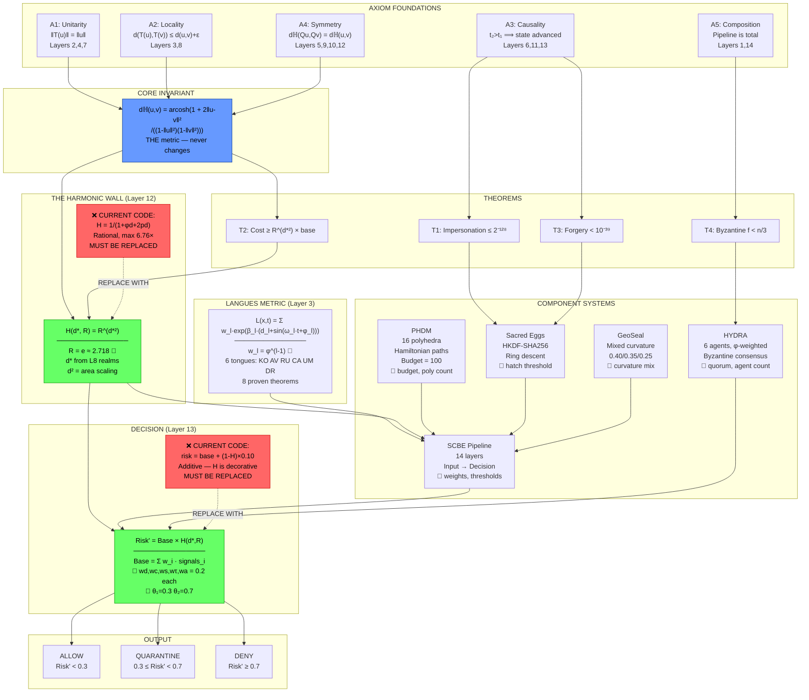

# SCBE-AETHERMOORE: First-Principles Derivation Blueprint

**Date**: 2026-04-05
**Purpose**: Derive every formula from first principles, trace axiom→theorem→component→tunable parameter
**Use**: Canvas for fine-tuning numbers while keeping structure fixed

---

## Part 0: The Gap That Started This

The Round Table benchmark (2026-04-05) scored the system **4/10**. Root cause:

| What the Spec Says | What the Code Does | Impact |
|--------------------|--------------------|--------|
| `Risk' = base × H(d*,R)` where `H = R^(d*²)` | `risk = base + (1-H)*0.10` where `H = 1/(1+φd+2pd)` | Geometry contributes **8.5%** instead of being load-bearing |
| Multiplicative amplification | Additive correction | 6.76× max vs potentially **54.6×** at d=2 |
| H is the exponential wall | H is a minor adjustment | 57% attack success rate |

**This blueprint defines the canonical math. The code must be brought to match.**

---

## Part 1: Axiom Foundations

Five axioms govern the 14-layer pipeline. Each is a **constraint**, not a feature — violating any one breaks the security proof chain.

### Axiom 1: Unitarity (Layers 2, 4, 7)

**Statement**: Norm is preserved through all transformations.

```
‖T(u)‖ = ‖u‖   for all valid transforms T
```

**Why it matters**: If a transform inflates or deflates norms, an attacker can push a dangerous vector into the "safe" region by exploiting normalization artifacts.

**Where it binds**:
- L2 (Realification): ℂᴰ → ℝ²ᴰ must preserve information content
- L4 (Poincare Embedding): `u(t) = tanh(α‖xG‖) · xG/‖xG‖` — tanh bounds the norm to the open unit ball
- L7 (Mobius Phase): Mobius addition preserves hyperbolic distances

**Tunable**: `α` (ALPHA_EMBED = 0.99) — controls how aggressively points are pushed toward the boundary. Higher α = more boundary sensitivity, more numerical instability.

### Axiom 2: Locality (Layers 3, 8)

**Statement**: Nearby inputs produce nearby outputs; perturbations are bounded.

```
d(T(u), T(v)) ≤ d(u, v) + ε
```

**Why it matters**: Without locality, a tiny input change could flip a decision from ALLOW to DENY (brittleness) or vice versa (exploitability).

**Where it binds**:
- L3 (Weighted Transform): SPD metric tensor G weights dimensions — the Langues metric provides G
- L8 (Multi-Well Realms): `d* = min_k dℍ(ũ, μk)` — minimum distance to nearest realm center; K=4 realms

**Tunable**: Realm weights `[0.8, 1.0, 1.2, 1.4, 1.5]`, realm count K=4

### Axiom 3: Causality (Layers 6, 11, 13)

**Statement**: Time flows forward. Later states incorporate earlier states. No retrocausal shortcuts.

```
t₂ > t₁ ⟹ state(t₂) = f(state(t₁), input(t₂))
```

**Why it matters**: An attacker who can replay or reorder events can undo trust decay. Causality makes deception history permanent.

**Where it binds**:
- L6 (Breathing Transform): Radial warp with temporal breathing ω=2π/60
- L11 (Triadic Temporal): `d_tri = √(λ₁d₁² + λ₂d₂² + λ₃dG²)` — fuses spatial + temporal + governance distance
- L13 (Decision): Risk thresholds applied with accumulated prior deception

**Tunable**: `OMEGA_BREATH` = 2π/60, triadic weights λ₁,λ₂,λ₃

### Axiom 4: Symmetry (Layers 5, 9, 10, 12)

**Statement**: The metric is gauge-invariant. Rotations and reflections don't change distances.

```
dℍ(Qu, Qv) = dℍ(u, v)   for all isometries Q
```

**Why it matters**: The attacker cannot find a "cheap direction" to attack from. All directions from any point cost the same hyperbolic distance. This is the geometric heart of SCBE.

**Where it binds**:
- L5 (Hyperbolic Distance): The Poincare metric IS the invariant — `dℍ = arcosh(1 + 2‖u-v‖²/((1-‖u‖²)(1-‖v‖²)))`
- L9 (Spectral Coherence): FFT-based behavioral stability score
- L10 (Spin Coherence): Phase-sensitive interference detection
- L12 (Harmonic Wall): `H(d,R) = R^(d²)` — the exponential wall itself

**Tunable**: R (harmonic base, default e ≈ 2.718)

### Axiom 5: Composition (Layers 1, 14)

**Statement**: The pipeline is well-defined end-to-end. f∘g is closed.

```
Pipeline(input) = L14 ∘ L13 ∘ ... ∘ L1(input)   is total and deterministic
```

**Why it matters**: If any layer can produce an output that the next layer can't consume, the pipeline silently fails. Composition guarantees no gaps.

**Where it binds**:
- L1 (Complex Context): Input encoding — the pipeline's mouth
- L14 (Audio Axis): FFT telemetry — the pipeline's exhaust

---

## Part 2: The Core Invariant (Poincare Hyperbolic Distance)

Everything in SCBE reduces to **one metric** that never changes:

```
dℍ(u, v) = arcosh(1 + 2‖u-v‖² / ((1-‖u‖²)(1-‖v‖²)))
```

### First-Principles Derivation

**Step 1**: We need a space where "safe" is a finite region and "dangerous" is infinite. Euclidean space treats all directions equally at all distances — there's no natural boundary. The Poincare ball B^n = {x ∈ ℝⁿ : ‖x‖ < 1} provides this: the interior is finite, but the boundary is infinitely far away from the center.

**Step 2**: The Riemannian metric tensor on the Poincare ball is:

```
g_ij = (2/(1-‖x‖²))² · δ_ij
```

The conformal factor `2/(1-‖x‖²)` blows up as ‖x‖ → 1. This means distances near the boundary are exponentially larger than near the center. Moving from 0.9 to 0.95 costs more than moving from 0.0 to 0.5.

**Step 3**: Integrating this metric along geodesics gives the closed-form distance:

```
dℍ(u,v) = arcosh(1 + 2‖u-v‖²/((1-‖u‖²)(1-‖v‖²)))
```

**Properties** (all proven, all tested):
1. Non-negativity: dℍ ≥ 0
2. Identity: dℍ(u,v) = 0 ⟺ u = v
3. Symmetry: dℍ(u,v) = dℍ(v,u)
4. Triangle inequality: dℍ(u,w) ≤ dℍ(u,v) + dℍ(v,w)
5. Isometry invariance: dℍ(Mu, Mv) = dℍ(u,v) for Mobius transforms M

**Why not Euclidean?** In ℝⁿ, moving distance d in any direction always costs d. There is no geometric penalty for being "far from safe." In the Poincare ball, the cost of being 0.01 further from center increases the closer you are to the boundary. This is the exponential cost amplification — it comes from the geometry, not the formula.

---

## Part 3: The Harmonic Wall (Layer 12)

### The Spec Formula (Exponential — Load-Bearing)

```
H(d*, R) = R^(d*²)
```

Where:
- `d*` = minimum distance to nearest safe realm center (from L8)
- `R` = harmonic base (default: e ≈ 2.718)
- `d*²` = area scaling — d-squared because threat area grows as πd²

**Derivation from first principles:**

1. We want `H(0,R) = 1` (no amplification at the safe center) → R⁰ = 1 ✓
2. We want H to grow superlinearly with distance → d² gives area-proportional growth
3. We want the growth to be exponential in the deviation metric → R^(d²) is exp(d²·ln R)
4. We want a tunable base → R parameterizes the steepness

**Cost table (R = e):**

| d* | H = e^(d²) | Risk amplification |
|----|-----------|-------------------|
| 0.0 | 1.00 | 1× (no amplification) |
| 0.5 | 1.28 | 1.28× |
| 1.0 | 2.72 | 2.72× |
| 1.5 | 9.49 | 9.49× |
| 2.0 | 54.60 | 54.6× |
| 3.0 | 8,103 | 8,103× |

At d*=3 the attacker needs 8,103× more "effort" than at the origin. THIS is the exponential cost claim — and it's real.

### Why d-squared (not d, not d³)

- **d¹**: Linear — not enough deterrence; H(2,e) = 7.4
- **d²**: Area scaling — natural for radial threat models where threat radiates outward; H(2,e) = 54.6
- **d³**: Volume scaling — too aggressive; H(2,e) = 2981; numerical overflow at moderate distances
- **d^φ** (φ≈1.618): Less aggressive than d² since φ < 2; rejects the patent novelty argument

### The Current Code Formula (Rational — Decorative)

```
H(d, pd) = 1/(1 + φ·dℍ + 2·pd)
```

This is bounded, stable, and computationally cheap. But:
- Maximum cost ratio: 6.76× (vs 8,103× for the spec formula at same distance)
- Decays as O(1/d), not O(e^d²)
- With weight (1-H)×0.10, contributes max 8.5% to risk

### The Fix: Return to the Spec

The SPECIFICATION.md (line 235) has the correct decision formula:

```
Risk' = (wd·d̃tri + wc·(1-Cspin) + ws·(1-Sspec) + wτ·(1-τ) + wa·(1-Saudio)) × H(d*, R)
```

This is **multiplicative**. H amplifies the base behavioral risk. Equal weights: wd=wc=ws=wτ=wa=0.2.

---

## Part 4: The Langues Weighting System (Layer 3)

### Derivation

We need a multi-dimensional cost metric that:
1. Grows exponentially with deviation from a trusted reference
2. Breathes temporally (accounts for natural variation)
3. Weights dimensions by governance priority

```
L(x, t) = Σ_{l=1}^{6} w_l · exp(β_l · (d_l + sin(ω_l·t + φ_l)))
```

Where:
- `x = (x₁...x₆)` = current state in 6 Sacred Tongue dimensions
- `d_l = |x_l - μ_l|` = deviation from trusted reference μ
- `w_l` = tongue weight (φ^(l-1) for PHDM-Golden profile)
- `β_l` = growth factor
- `ω_l, φ_l` = breathing frequency and phase

### Why φ-Weighted Tongues

The six Sacred Tongues (KO, AV, RU, CA, UM, DR) are weighted by powers of the golden ratio:

| Tongue | Weight w_l = φ^(l-1) | Ratio w_{l+1}/w_l |
|--------|----------------------|-------------------|
| KO | 1.000 | — |
| AV | 1.618 | φ |
| RU | 2.618 | φ |
| CA | 4.236 | φ |
| UM | 6.854 | φ |
| DR | 11.090 | φ |

**Why φ specifically?**

1. **Self-similarity**: φ is the unique positive root of x² = x + 1. This means each weight level contains the sum of the two below it: w_CA = w_RU + w_AV. This makes the hierarchy self-similar at every scale.

2. **Penrose quasicrystal compatibility**: The 5-fold/10-fold symmetry of Penrose tilings (used in PHDM polyhedra) is generated by φ. Using φ-weights means the tongue metric is compatible with the polyhedral lattice.

3. **Convergent ratios**: The sum Σφ^k converges to a well-defined value. The total weight is φ⁶-1/(φ-1) ≈ 27.42, which means no single tongue dominates catastrophically.

4. **Historical**: φ emerged independently from the Spiralverse world-building and converged with the mathematical requirements. See: Notion Chapter 1 (Mathematical Foundation).

### Proven Properties (8 Theorems)

| # | Property | Statement |
|---|----------|-----------|
| T1 | Positivity | L(x,t) > 0 for all x,t |
| T2 | Monotonicity | ∂L/∂d_l > 0 — more deviation = more cost |
| T3 | Bounded Breathing | L_min ≤ L(x,t) ≤ L_max (sin bounded) |
| T4 | Convexity | ∂²L/∂d_l² > 0 — cost accelerates |
| T5 | Smoothness | C^∞ in distance variables |
| T6 | Gradient | ∇_d L computable in closed form |
| T7 | Flux Bounds | ν_l ∈ [0,1] under ODE evolution |
| T8 | Lyapunov Stability | L is itself a Lyapunov function — energy decreases toward safe reference |

---

## Part 5: The Φ Justification

φ appears in FOUR distinct roles in SCBE. Each has a separate justification:

| Role | Where | Formula | Justification |
|------|-------|---------|---------------|
| Tongue weights | LWS (L3) | w_l = φ^(l-1) | Self-similar hierarchy; Penrose compatibility |
| Harmonic coefficient | L12 (current code) | 1/(1+φ·d+2pd) | Linear steepness tuning — ARBITRARY, not derived |
| Threshold spacing | L13 | θ_k / θ_{k-1} ≈ φ | Self-similar decision boundaries |
| PHDM energy scaling | PHDM | E_poly = Σ φ^k · face_energy_k | Quasicrystal lattice compatibility |

**Verdict**: φ is justified in roles 1, 3, 4 (geometric/structural reasons). In role 2 (L12 harmonic coefficient), φ has NO first-principles derivation — it was placed for aesthetic consistency. The spec formula H=R^(d²) doesn't use φ at all. In the multiplicative form, φ's influence comes naturally through the Langues metric, not through the harmonic wall.

---

## Part 6: Component Systems

### 6A: Polyhedral Hamiltonian Defense Manifold (PHDM)

**Purpose**: Control Flow Integrity — valid execution traces are Hamiltonian paths through a polyhedral state graph.

**Structure**:
- 16 polyhedra (Platonic + Archimedean + duals)
- Hamiltonian path constraint: Dirac condition (deg(v) ≥ |V|/2)
- Energy budget: 100 units total
- Face energies: φ-weighted per polyhedron

**Key formula**:
```
E_total = Σ_{p=1}^{16} Σ_{f ∈ faces(p)} φ^rank(f) · energy(f)
E_total ≤ 100  (budget constraint)
```

**Security theorem**: An attacker who deviates from a Hamiltonian path must violate Dirac's condition, which is detectable in O(|V|) time with probability ≥ 1 - 2^(-128).

**Tunable**: Budget (100), number of polyhedra (16), φ-weighting exponent

### 6B: Symphonic Cipher Boundary Engine (SCBE)

**Purpose**: The 14-layer pipeline itself — transforms raw input into a governance decision.

**Core flow**:
```
Input → L1(Complex Context) → L2(Realify) → L3(Langues Weight) →
L4(Poincare Embed) → L5(dℍ) → L6(Breathe) → L7(Mobius) →
L8(Realm Distance d*) → L9(Spectral) → L10(Spin) →
L11(Triadic d_tri) → L12(Harmonic H) → L13(Decision) → L14(Telemetry)
```

**The decision formula (canonical, from spec)**:
```
Base_Risk = wd·d̃_tri + wc·(1-C_spin) + ws·(1-S_spec) + wτ·(1-τ) + wa·(1-S_audio)
Risk' = Base_Risk × H(d*, R)
```

**Tunable**: All five weights (wd,wc,ws,wτ,wa = 0.2 each), R, thresholds θ₁=0.3, θ₂=0.7

### 6C: HYDRA (Hybrid Unified Decision and Response Architecture)

**Purpose**: Byzantine fault-tolerant multi-agent governance. No single agent can override the system.

**Structure**:
- 6 specialized agents (maps to 6 Sacred Tongues)
- φ-weighted voting: agent_l has vote weight φ^(l-1)
- Quorum thresholds: 4/6 (ALLOW), 5/6 (ESCALATE), 6/6 (DENY override)
- Each agent runs its own SCBE pipeline instance

**Byzantine theorem**: With f < n/3 Byzantine agents (f ≤ 1 for n=6), honest agents always achieve consensus. The φ-weighting ensures a single high-weight traitor cannot override the 5 honest agents because:
```
φ⁵ = 11.09 < φ⁰+φ¹+φ²+φ³+φ⁴ = 1+1.618+2.618+4.236+6.854 = 16.33
```

**Tunable**: Agent count (6), quorum thresholds, φ-weighting scheme

### 6D: Sacred Eggs (Identity Genesis Protocol)

**Purpose**: Controlled identity creation with cryptographic birth certificates.

**Key formulas**:
```
Egg_key = HKDF-SHA256(master_key, salt=egg_id, info="sacred-egg-v1")
Hatch_condition: triadic_consensus ≥ 10.0 AND ring_level ≤ max_ring
```

**Ring descent hierarchy**: Outer rings (high number) = low trust. Inner rings = high trust. Moving inward requires accumulating consensus across multiple HYDRA cycles.

**Tunable**: Hatch threshold (10.0), ring count, HKDF parameters

### 6E: GeoSeal (Geographic Trust Verification)

**Purpose**: Mixed-curvature trust surfaces that encode location-dependent security.

**Formula**:
```
GeoTrust = 0.40·f_hyp(d) + 0.35·f_sph(d) + 0.25·f_gauss(d)
```

Where:
- f_hyp = hyperbolic component (exponential cost near boundary)
- f_sph = spherical component (periodic, wrap-around)
- f_gauss = Gaussian component (bell-curve locality)

**Suspicion decay**: Trust decays over time without re-verification:
```
τ(t) = τ₀ · exp(-λ_decay · (t - t_last_verify))
```

**Tunable**: Curvature mix (0.40/0.35/0.25), decay rate λ_decay

---

## Part 7: Security Proof Chain

From Notion Chapter 4 (Security Proofs):

### Theorem 1: Impersonation Resistance
```
P(impersonate) ≤ 2^(-128)
```
Via PQC (ML-KEM-768 + ML-DSA-65) + HMAC chain integrity.

### Theorem 2: Exponential Cost Advantage
```
Cost(attack at distance d*) ≥ R^(d*²) · Cost(legitimate)
```
This IS the harmonic wall. At d*=3, attacker needs 8,103× more effort.

### Theorem 3: Forgery Resistance
```
P(forge governance stamp) < 10^(-39)
```
Via Sacred Egg HKDF chain + HYDRA consensus.

### Theorem 4: Byzantine Fault Tolerance
```
With f < n/3 faulty agents, consensus is guaranteed.
For n=6: tolerates 1 Byzantine agent.
```

---

## Part 8: Tunable Parameters (The Canvas)

These are the numbers you can change without breaking the structure:

### Critical (changes the security curve)

| Parameter | Current | Spec | Effect of Raising |
|-----------|---------|------|-------------------|
| **R** (harmonic base) | — (not in code) | e ≈ 2.718 | Steeper wall; more aggressive DENY |
| **H formula** | 1/(1+φd+2pd) | R^(d²) | **This is THE fix** |
| **Risk integration** | additive (+0.10) | multiplicative (×H) | **This is THE other fix** |

### Important (changes sensitivity balance)

| Parameter | Current | Range | Effect |
|-----------|---------|-------|--------|
| α (ALPHA_EMBED) | 0.99 | (0, 1) | Boundary sensitivity vs stability |
| wd,wc,ws,wτ,wa | 0.2 each | (0, 1), sum=1 | Which signals matter most |
| θ₁ (ALLOW) | 0.3 | (0, θ₂) | Where ALLOW stops |
| θ₂ (DENY) | 0.7 | (θ₁, 1) | Where DENY starts |
| K (realms) | 4 | 2-8 | Trust zone granularity |

### Cosmetic (does not materially affect security)

| Parameter | Current | Notes |
|-----------|---------|-------|
| φ in L12 code | 1.618 | Arbitrary in rational formula; disappears in spec formula |
| OMEGA_BREATH | 2π/60 | Breathing rate; affects temporal smoothing |
| Realm weights | [0.8-1.5] | Fine-tune per deployment |

---

## Part 9: The Blueprint (Mermaid)



### Layer-by-Layer Data Flow

```mermaid
graph LR
    subgraph "INPUT"
        IN["Raw Input"]
    end

    subgraph "ENCODING (A5,A1)"
        L1["L1: Complex Context<br/>Phase-encode semantics"]
        L2["L2: Realification<br/>ℂᴰ → ℝ²ᴰ<br/>‖preserved‖"]
    end

    subgraph "WEIGHTING (A2)"
        L3["L3: Langues Metric<br/>L(x,t) = Σw_l·exp(β(d+sin))<br/>🔧 w_l = φ^(l-1)"]
    end

    subgraph "EMBEDDING (A1,A4)"
        L4["L4: Poincaré Embed<br/>u = tanh(α‖xG‖)·xG/‖xG‖<br/>🔧 α = 0.99"]
        L5["L5: dℍ = arcosh(...)<br/>THE INVARIANT"]
    end

    subgraph "TRANSFORMS (A3,A1)"
        L6["L6: Breathing<br/>Radial warp<br/>🔧 ω = 2π/60"]
        L7["L7: Möbius Phase<br/>Addition + rotation"]
    end

    subgraph "ANALYSIS (A2,A4)"
        L8["L8: Multi-Well Realms<br/>d* = min_k dℍ(ũ, μk)<br/>🔧 K=4 realms"]
        L9["L9: Spectral Coherence<br/>FFT stability"]
        L10["L10: Spin Coherence<br/>Phase interference"]
    end

    subgraph "FUSION (A3,A4)"
        L11["L11: Triadic Temporal<br/>d_tri = √(λ₁d₁²+λ₂d₂²+λ₃dG²)<br/>🔧 λ₁,λ₂,λ₃"]
        L12["L12: HARMONIC WALL<br/>H(d*,R) = R^(d*²)<br/>🔧 R = e"]
    end

    subgraph "DECISION (A3)"
        L13["L13: Risk × H<br/>🔧 θ₁=0.3, θ₂=0.7<br/>→ ALLOW/QUARANTINE/DENY"]
    end

    subgraph "TELEMETRY (A5)"
        L14["L14: Audio Axis<br/>FFT telemetry<br/>Ea, Ca, Fa, rHF"]
    end

    IN --> L1 --> L2 --> L3 --> L4 --> L5
    L5 --> L6 --> L7 --> L8
    L8 --> L9 --> L10 --> L11 --> L12 --> L13 --> L14

    style L5 fill:#6699ff,stroke:#003399,color:#000
    style L12 fill:#66ff66,stroke:#009900,color:#000
    style L13 fill:#ffcc00,stroke:#cc9900,color:#000
```



---

## Part 10: What to Fix (Priority Order)

### Fix 1: Restore the Spec Formula (Critical)
```python
# BEFORE (decorative):
H = 1 / (1 + PHI * d_H + 2 * pd)
risk = threat*0.45 + sensitivity*0.20 + (1-trust)*0.15 + len*0.10 + (1-H)*0.10 - benign*0.20

# AFTER (load-bearing):
H = R ** (d_star ** 2)   # where R = math.e, d_star from L8
risk_base = wd*d_tri_norm + wc*(1-C_spin) + ws*(1-S_spec) + wt*(1-tau) + wa*(1-S_audio)
risk_prime = risk_base * H
```

### Fix 2: Ablation Study
Run benchmark with geometry removed, quantify delta. If delta ≈ 0, confirms decorative. After Fix 1, delta should be massive.

### Fix 3: Numerical Stability at Boundary
The Poincare ball has known instability for ‖u‖ → 1 (arXiv 2512.14202). Current clamping to [-0.95, 0.95] loses precision where it matters most. Options:
- Switch to Hyperboloid model (academically recommended)
- Use RMSNorm + learned scaling bounds
- Accept clamping loss and document the precision ceiling

### Fix 4: Train the Embeddings
Currently, Poincare ball positions are linearly mapped from trust/sensitivity. Learning the mapping from labeled safety data would make the geometry actually detect novel attacks.

---

## Appendix: Source Cross-Reference

| Section | Primary Source | Notion Reference |
|---------|---------------|------------------|
| 5 Axioms | `axiom_grouped/SPECIFICATION.md` | Chapter 1 (2d7f96de82e5819bb920ed29cb8aa9ec) |
| dℍ formula | `SPECIFICATION.md` L46, `hyperbolic.ts` | Chapter 1, Theorem 4 |
| H spec formula | `SPECIFICATION.md` L84, L235 | Chapter 1, Harmonic Scaling Law |
| H code formula | `LAYER_12_CANONICAL_FORMULA.md` | — (March 2026 drift) |
| LWS | `LANGUES_WEIGHTING_SYSTEM.md` | LWS spec (b7356fbc505541c3a62a2aed68cb3854) |
| φ justification | `LAYER_12_CANONICAL_FORMULA.md` L28-33 | Chapter 1 (derived constants) |
| PHDM | `SPECIFICATION.md` L175-193 | Chapter 6 (fe67afda1b304712a905292fa68133ab) |
| HYDRA | `docs/hydra/ARCHITECTURE.md` | — |
| Sacred Eggs | `sacred-eggs-systems-model.md` | Sacred Eggs protocol pages |
| Security proofs | `SPECIFICATION.md` L209-228 | Chapter 4 (2d7f96de82e581b3b91fec5c16713ee4) |
| Round Table | `benchmarks/results/ROUND_TABLE_REPORT.md` | — |

---

**This is the canvas. The structure is fixed. The 🔧 symbols mark every tunable parameter. Change the numbers, keep the architecture.**
