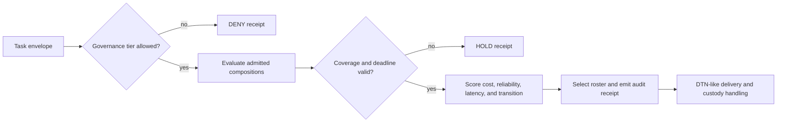

# Fleet Composition Coordination

## Status

This document specifies the first executable research slice for selecting and
transitioning between heterogeneous agent teams. It turns the existing
CloneTrooper role vectors, six-tongue weights, fleet governance gate, and
Mars-style disrupted transport into a controlled benchmark. The values are
normalized simulation units. They are not dollar prices, latency guarantees,
or a production security certification.

## Authority boundary

Identity, signatures, policy, and authorization remain authoritative. Geometry
is used only after governance admits a task. A favorable distance, rank, or
transition score cannot grant access.



The SHA-256 decision digest is an audit checksum. It is not an authentication
tag and must not replace a signed decision envelope.

## Composition model

Each member contributes a capability vector in the six-tongue basis:

`KO, AV, RU, CA, UM, DR`.

For a roster matrix `C` and task vector `t`, the coordinator computes the
orthogonal row-space projector `P = C+ C`, where `C+` is the Moore-Penrose
pseudoinverse. Task coverage and its blind residual are:

```text
coverage       = ||P t|| / ||t||
blind residual = ||t - P t|| / ||t||
```

Matrix rank is the number of independent capability directions. A line of five
identical clones has rank 1 and five blind dimensions. The six-role control has
rank 6 and no blind dimension. This makes role diversity measurable without
pretending that geometric rank proves task correctness.

Roster base cost applies the repository's canonical phi-weighted tongue lanes:

```text
base cost = fixed overhead + sum(member base cost * phi^(tongue index))
```

## Directional transitions

Changing a roster has memory and synchronization cost. For source projector
`Ps`, destination projector `Pd`, and the two member sets:

```text
retained  = shared members / source members
warmed    = shared members / destination members
alignment = trace(Ps Pd) / max(rank(Ps), rank(Pd), 1)
stability = 0.50 retained + 0.20 warmed + 0.30 alignment
cost      = destination base cost * (1 - stability) * (0.5 + inertia)
```

The measure is directional by design: expanding a team and shrinking it do not
preserve the same operational state. The stability-guarded policy keeps a valid
roster for at least four tasks before allowing a cheaper switch. Coverage and
deadline failures bypass that dwell preference.

## Experimental arms

- `sticky` is the no-intervention control.
- `distance` is the zero-tuned, size-matched geometric control.
- `composition_aware` selects by coverage, reliability, deadline, cost, and
  transition score without a dwell guard.
- `stability_guarded` adds the four-task minimum dwell interval.
- `round_robin` is a deliberately simple scheduling reference.

Every governance check and every candidate assessment is billed. This avoids
the execution-accounting error where a router evaluates many candidates but
charges one operation.

The stress matrix uses nominal links, delay and reorder, duplicate delivery,
loss with custody retransmission, blackout with custody, and permanent loss
without custody. Duplicate bundles are deduplicated. Custody-backed loss must
converge; permanent loss without custody must report divergence.

## Measured result

Command:

```powershell
npm run benchmark:fleet-composition -- --tasks 180 --seeds 7,11,19,23,31,43,59,71,83
```

This produces 270 runs: nine seeds, six network conditions, and five policies.

| Policy | Completion | Cost per completed task | Mean transition stability | Churn | Capability misses |
| --- | ---: | ---: | ---: | ---: | ---: |
| sticky | 0.7943 | 77.9297 | 0.3756 | 0.0168 | 1.8704 |
| distance | 0.7923 | 78.6584 | 0.0500 | 0.0056 | 2.8333 |
| composition-aware | 0.7305 | 46.7603 | 0.6860 | 0.5134 | 0.0000 |
| stability-guarded | 0.7869 | 61.1286 | 0.8360 | 0.2484 | 0.0000 |
| round-robin | 0.4195 | 133.7831 | 0.5831 | 0.8994 | 67.1296 |

The aggregate claim is **NO_LIFT** under the repository rule requiring the
custom arm's completion delta to exceed twice pooled sample standard deviation
against both controls. Stability guarding reduced cost per completed task by
about 21.6% versus sticky and 22.3% versus distance, while completion was 0.74
and 0.53 percentage points lower, respectively. Those cost effects are
underpowered across the mixed scenarios. Compared with unguarded adaptive
routing, the guard cut churn by about 51.6% and raised mean transition stability
from 0.6860 to 0.8360.

The measured result supports continued engineering, not a superiority claim.

Across nominal, delay/reorder, duplicate, and loss-with-custody scenarios, the
guarded policy completed 0.9358 of tasks at a cost near 50.65 per completion;
the two controls completed roughly 0.9370 to 0.9395 at costs from 66.22 to
66.84. Blackout exposed the largest completion gap: 0.4247 for the guarded arm
versus 0.4549 to 0.4568 for the controls. Under permanent loss without custody,
all policies correctly reported state divergence. Scenario-specific effects and
their uncertainty gates are retained in the JSON benchmark receipt.

## Production path

1. Stratify claims by network condition instead of relying only on a mixed
   aggregate.
2. Add short-horizon planning so the router can price several upcoming tasks
   rather than react one task at a time.
3. Calibrate normalized costs with live model token, latency, queue, and dollar
   measurements.
4. Bind decisions to the signed fleet decision envelope and existing TypeScript
   governance gate.
5. Validate against real Redis/DTN transport, concurrent workers, and process
   failure before using the router as a control-plane component.
