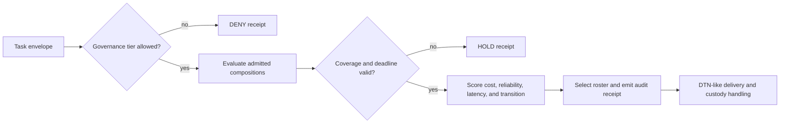

# Fleet Composition Coordination

## Status

This document specifies the first executable research slice for selecting and
transitioning between heterogeneous agent teams. It turns the existing
CloneTrooper role vectors, six-tongue weights, fleet governance gate, and
Mars-style disrupted transport into a controlled benchmark. The values are
normalized simulation units. They are not dollar prices, latency guarantees,
or a production security certification.

## Authority boundary

Identity, signatures, policy, and authorization remain authoritative. Geometry
is used only after governance admits a task. A favorable distance, rank, or
transition score cannot grant access.



The SHA-256 decision digest is an audit checksum. It is not an authentication
tag and must not replace a signed decision envelope.

## Composition model

Each member contributes a capability vector in the six-tongue basis:

`KO, AV, RU, CA, UM, DR`.

For a roster matrix `C` and task vector `t`, the coordinator computes the
orthogonal row-space projector `P = C+ C`, where `C+` is the Moore-Penrose
pseudoinverse. Task coverage and its blind residual are:

```text
coverage       = ||P t|| / ||t||
blind residual = ||t - P t|| / ||t||
```

Matrix rank is the number of independent capability directions. A line of five
identical clones has rank 1 and five blind dimensions. The six-role control has
rank 6 and no blind dimension. This makes role diversity measurable without
pretending that geometric rank proves task correctness.

Roster base cost applies the repository's canonical phi-weighted tongue lanes:

```text
base cost = fixed overhead + sum(member base cost * phi^(tongue index))
```

## Directional transitions

Changing a roster has memory and synchronization cost. For source projector
`Ps`, destination projector `Pd`, and the two member sets:

```text
retained  = shared members / source members
warmed    = shared members / destination members
alignment = trace(Ps Pd) / max(rank(Ps), rank(Pd), 1)
stability = 0.50 retained + 0.20 warmed + 0.30 alignment
cost      = destination base cost * (1 - stability) * (0.5 + inertia)
```

The measure is directional by design: expanding a team and shrinking it do not
preserve the same operational state. The stability-guarded policy keeps a valid
roster for at least four tasks before allowing a cheaper switch. Coverage and
deadline failures bypass that dwell preference.

## Experimental arms

- `sticky` is the no-intervention control.
- `distance` is the zero-tuned, size-matched geometric control.
- `composition_aware` selects by coverage, reliability, deadline, cost, and
  transition score without a dwell guard.
- `stability_guarded` adds the four-task minimum dwell interval.
- `round_robin` is a deliberately simple scheduling reference.

Every governance check and every candidate assessment is billed. This avoids
the execution-accounting error where a router evaluates many candidates but
charges one operation.

The stress matrix uses seven conditions: nominal links, delay and reorder,
duplicate delivery, loss with custody retransmission, a round-trip-dependent
blackout control, the same blackout with pre-synchronized local autonomy and
store-carry-forward custody, and permanent loss without custody. Duplicate
bundles are deduplicated. Custody-backed loss must converge; permanent loss
without custody must report divergence. Every eighth task is marked as truly
remote and still requires the live link in both blackout conditions.

## Measured result

Command:

```powershell
npm run benchmark:fleet-composition -- --tasks 180 --seeds 7,11,19,23,31,43,59,71,83
```

This produces 315 runs: nine seeds, seven network conditions, and five policies.

| Policy | Completion | Cost per completed task | Mean transition stability | Churn | Capability misses |
| --- | ---: | ---: | ---: | ---: | ---: |
| sticky | 0.7543 | 126.6063 | 0.3756 | 0.0168 | 1.8889 |
| distance | 0.7525 | 128.1181 | 0.0500 | 0.0056 | 2.8571 |
| composition-aware | 0.7014 | 79.1857 | 0.6871 | 0.5063 | 0.0000 |
| stability-guarded | 0.7508 | 99.8604 | 0.8302 | 0.2489 | 0.0000 |
| round-robin | 0.4113 | 277.5470 | 0.5831 | 0.8994 | 67.8254 |

The aggregate claim is **NO_LIFT** under the repository rule requiring the
custom arm's completion delta to exceed twice pooled sample standard deviation
against both controls. Stability guarding reduced cost per completed task by
about 21.1% versus sticky and 22.1% versus distance, while completion was 0.35
and 0.17 percentage points lower, respectively. Those aggregate cost effects
remain underpowered across the mixed scenarios. Compared with unguarded
adaptive routing, the guard cut churn by about 50.8% and raised mean transition
stability from 0.6871 to 0.8302.

The measured result supports continued engineering, not a superiority claim.

Under permanent loss without custody, all policies correctly reported state
divergence. Scenario-specific effects and their uncertainty gates are retained
in the JSON benchmark receipt.

## Mars relay blackout ablation

The blackout comparison changes one architectural assumption while keeping the
task stream, loss, delay, reordering, custody, seeds, and policies paired. In the
control, every task waits for the remote round trip. In the relay condition,
157 of 180 tasks per seed are already authorized for local execution and their
receipts are buffered; the remaining 23 tasks still need the remote link.

| Policy | Round-trip completion | Relay completion | Completion delta | Round-trip cost | Relay cost |
| --- | ---: | ---: | ---: | ---: | ---: |
| sticky | 0.1321 | 0.8389 | +0.7068 | 481.0277 | 74.2911 |
| distance | 0.1315 | 0.8370 | +0.7056 | 488.0270 | 74.9010 |
| composition-aware | 0.1148 | 0.7815 | +0.6667 | 326.9579 | 42.4208 |
| stability-guarded | 0.1253 | 0.8333 | +0.7080 | 387.9293 | 57.0642 |
| round-robin | 0.0395 | 0.4759 | +0.4364 | 1362.4905 | 101.9915 |

Every policy cleared the two-pooled-standard-deviation threshold for completion,
cost, and deadline misses, so the architecture ablation is **SUPPORTED** in this
simulation. For the stability-guarded policy, mean deadline misses fell from
156.0 to 19.56. This is evidence for pre-synchronized local autonomy plus
custody, not for a physical Mars link. The 14 blackout ticks are normalized
stress units; they do not claim fourteen Earth days, RF throughput, hardware
reliability, or deployment security.

## Multiplexed transport boundary

The six tongues, harmonic frequencies, and reversible views can form a useful
transport braid when their jobs stay explicit:

1. Assemble commands into the canonical semantic opcode tape.
2. Compress repeated structure with a declared lossless codec or shared
   codebook.
3. Authenticate and encrypt with a standard signed/AEAD or PQC envelope.
4. Add erasure coding, then assign shards to tongue/frequency lanes.
5. Treat forward, reverse, complement, palindrome, spatial, or audio forms as
   bijective representations and independent checks only when exact decoding is
   tested.
6. Reconstruct, authenticate, govern, and only then execute.

The repository already proves byte-to-token round trips in all six tongues,
compact semantic-opcode assembly, and a separate FSK audio prototype. These
pieces do not create free channel capacity. Ten arbitrary commands still require
enough source entropy unless both ends share a codebook. A palindrome repeats
the same symbols; two independent meanings require orientation-specific
decoders or additional symbols. Spatial negative-space readings are suitable
for human display or steganographic experiments, but not as an authoritative
machine-command lane because ordinary reformatting can destroy them.

The first deterministic fixture is implemented in
src/fleet/bijective_frequency_transport.py and
scripts/benchmark/bijective_frequency_transport.py. Ten semicolon-separated
commands occupied 97 UTF-8 bytes, assembled to 47 semantic-opcode bytes, and
compressed to 44 bytes. Five data shards plus one parity shard used 54 wire
symbols, or 1.2273 times the packed payload. That was 79.55% fewer symbols than
sending six complete packed copies. All six possible single-lane erasures and
all six single-lane corruptions reconstructed the exact opcode tape; all fifteen
two-lane erasures were rejected; all six tongue views round-tripped exactly.

Those are structural software results for one deterministic fixture. The next
benchmark must add multiple payload distributions, bit-error and burst-loss
channel traces, decode latency, outer-envelope overhead, and standard erasure
codes. Security claims remain attached to the standard authenticated envelope,
not to geometric or linguistic transforms. Physical RF/audio performance is
still untested.

## Production path

1. Bind the Mars relay abstraction to contact-window queues, finite buffers,
   relay-node loss, and delayed receipt conflicts.
2. Benchmark the six-lane command braid against raw, repetition, and standard
   erasure-coded controls over the same noisy channel traces.
3. Add short-horizon planning so the router can price several upcoming tasks
   rather than react one task at a time.
4. Calibrate normalized costs with live model token, latency, queue, and dollar
   measurements.
5. Bind decisions to the signed fleet decision envelope and existing TypeScript
   governance gate.
6. Validate against real Redis/DTN transport, concurrent workers, and process
   failure before using the router as a control-plane component.
