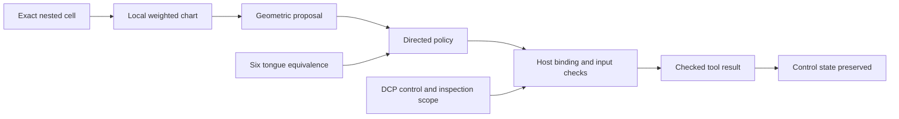

# SCBE proof extension: nested regions and connected execution

This extends the September 18 formalization using the same Lean 4.19.0 and pinned
Mathlib. There are 38 additional named theorems: 19 for nested regions, 12 for
restricted execution and 7 for connections between codecs and routing. The
authoritative validation result is `evidence/proof-extension-20260919.json`.
The source statements are the contract; this guide explains their application.

## 1. Exact nested regions

Source: [SCBE/NestedRegions.lean](SCBE/NestedRegions.lean).
Implementation correspondence: Loom's `clay_nested_calibration.py` and
`experiments/scbe_nested_boundary_20260918/nested_boundary.py`.

A cell has rational lower endpoint `l` and positive rational width `h`. Its
membership rule is `l <= x < l+h`. For radix `r >= 2` and index `0 <= i < r`,
the child has lower endpoint `l+(h/r)*i` and width `h/r`.

`child_within_parent` and `child_width_strictly_decreases` prove containment and
strictly finer resolution. `finite_refinement_within_parent` extends containment
to every finite list of valid subdivisions, rather than a tested depth limit.
`refinement_append` shows that continuing an address gives the same interval as
performing its prefix first and then its suffix.

`adjacent_children_share_seam`, `separated_cells_disjoint` and
`shared_seam_owned_by_right` formalize the half-open boundary convention: the
right cell owns a shared seam. Cells never both own that seam. These theorems
operate on intervals, not their textual labels. They do not prove that distinct
address strings always denote distinct intervals. For example, two different
subdivision histories can describe the same region.

The local chart is `q = 2*(x-l)/h - 1`; its inverse is
`x = l + h*(q+1)/2`. Both round trips are proved. The membership theorem makes
global interval membership equivalent to `-1 <= q < 1`.
`rebase_preserves_global` proves that moving between coordinate charts preserves
the represented point. Changing its chart does not bring an outside point inside
the new region. The checker explicitly rejects that false claim.

The formal cell permits any rational lower endpoint. Existing magnitude cells
use nonnegative major coordinates and separate sign channels; they are a subset
of the mathematical domain. Python integer validation, labels, serialization,
256-level prototype limits and floating-point execution are separate boundaries.

## 2. Weighted local geometry and phi lanes

For nonnegative weights with nonzero total, normalization produces weights
`g_i = w_i / sum(w)` with sum one. When every local coordinate lies in `[-1,1]`,
the weighted energy `sum(g_i*q_i^2)` is at most one. The exact-real embedding
`u_i = (3/4)*sqrt(g_i)*q_i` consequently satisfies
`sum(u_i^2) <= 9/16 < 1`.

`normalized_weights_sum_one`, `normalized_weighted_energy_bound`,
`local_ball_norm_identity` and `local_ball_margin` prove these statements for
arbitrary finite dimension. The earlier phi positivity theorem supplies positive
weights when six lanes use powers of phi. The ball-margin theorem also permits
zero normalized weights for its upper bound; invertible weighted charts need
strictly positive weights, as the Python prototype requires.

This is a bound on the initial local embedding. It does not prove that arbitrary
breathing, rotations, learned weights or subsequent updates retain a region's
walls. Breathing is a deformation, not generally an isometry. The prototype
reports wall crossings instead of making them disappear by clipping. A separate
directed gate must decide whether a proposed crossing is allowed.

## 3. Quarantine continues permitted work

Source: [SCBE/RestrictedExecution.lean](SCBE/RestrictedExecution.lean).
Correspondence: Loom's `agent_security_integration_20260918/routed_workcell.py`,
SCBE's `src/agentic/quarantine_lock.py` and DCP tool scopes.

| DCP control | Inspection tool in permitted scope | Other tool |
|---|---|---|
| ALLOW | Eligible after remaining checks | Eligible after remaining checks |
| QUARANTINE | Eligible after remaining checks | Blocked |
| ESCALATE | Requires review; no dispatch | Requires review; no dispatch |
| DENY | No dispatch | No dispatch |

Eligibility also requires a ready directed policy, known endpoints, a permitted
edge, current binding, valid arguments, valid input codec and the underlying
tool gate's approval. `dispatch_contract` exposes all those conditions.
`dispatch_requires_directed_edge` prevents a scope decision from substituting
for route authority. `stale_binding_blocks_dispatch` closes the abstract path
when the binding evidence is false.

`quarantine_returns_tool_result` constructs a successful restricted call and
returns its actual pure-handler value while retaining QUARANTINE.
`quarantine_progress_example` checks a concrete result of 6. The proof therefore
does not achieve safety by forbidding every action. Conversely,
`quarantine_blocks_unscoped`, `deny_blocks_dispatch` and
`escalate_requires_review` prove the corresponding refusal cases.

This profile is separate from `Composition.lean`'s ALLOW/QUARANTINE/DENY/SNAP
restriction order. In particular, that earlier `authorizedStep` describes a full
authorization path and is not the predicate for restricted inspection. Do not
silently substitute one enum or meaning for another.

The `inspection` flag and `CallEvidence` come from the trusted host. This module
does not prove that a malicious tool is accurately classified or that a caller
cannot forge host evidence. `checkedCall` models a total pure handler; actual
process effects, exceptions, hangs and result-serialization failure remain in
runtime tests and deployment obligations. An inspection allowlist is not an OS
sandbox. No nonce, replay or concurrent-state guarantee is claimed here.

## 4. Six tongues preserve the execution contract

Source: [SCBE/InterfaceConnections.lean](SCBE/InterfaceConnections.lean).

`relabelPolicy` transports the full policy through an equivalence `e` using its
inverse to interpret node names. `relabel_preserves_permits`,
`relabel_preserves_walk`, `relabel_preserves_execution` and
`relabel_preserves_dispatch` prove that renamed nodes retain the same permitted
edges, complete walk result, fuel-bounded execution and restricted dispatch.

`six_tongue_dispatch_invariant` specializes this law to the existing six
byte-vocabulary equivalences. It applies when the policy and both endpoint
representations are transported consistently. Renaming only the request while
leaving a differently encoded policy untouched is not covered.

`codec_chunk_composition` proves that encoding concatenated byte lists agrees
with concatenating their encoded lists. `codec_no_sequence_alias` proves that
equal encoded lists imply equal byte lists. This concerns structured lists of
valid vocabulary members, not concatenated unframed strings. It proves neither
natural-language meaning nor cryptographic secrecy.

The existing equivalence assumption is explicit. Concrete Python table
uniqueness and decoder agreement are checked by the existing implementation
audit; a formal refinement proof of that Python parser is still open.



The diagram maps contracts. It does not assert that every production ingress
currently passes through all of these components.

## 5. Validation and reproducibility

Run the existing verifier with an unused receipt path:

```powershell
$env:PATH = 'C:\dev\tools\lean-4.19.0-windows\bin;' + $env:PATH
Set-Location C:\dev\scbe-lean-proof\formal\lean
python -X utf8 verify.py --output validation-new.json
```

The verifier builds all modules, enumerates every named theorem and checks its
transitive axiom dependencies. Only `propext`, `Classical.choice` and `Quot.sound`
are allowed. There are no custom axioms, unfinished proofs or native-decision
shortcuts. Lean documents the role of `#print axioms` in its
[official axiom reference](https://lean-lang.org/doc/reference/latest/Axioms/).
That reference is explanatory; the checker uses the pinned 4.19.0 toolchain.

Seven intentionally false fixtures must fail: reversed directed permission,
refusal weakening, excluding the valid score at the origin, double ownership of
a seam, admission by coordinate rebasing, unscoped quarantine execution, and
silent promotion from QUARANTINE to ALLOW. Each fixture's negation must compile
first, so missing imports or malformed propositions cannot count as successful
rejection. Receipts include proof, toolchain, dependency-lock and verifier hashes.

The corresponding Python checks on September 19 passed: 16 nested-boundary
tests and 18 routed-workcell tests. These finite checks support the implementation
mapping; they are not universal proofs of the Python programs. Receipt hashes
identify the inspected versions.

## 6. Patent engineering map and remaining obligations

This is an engineering companion to the owner's hyperbolic authorization and
topological control-flow work. Directed-route preservation, weighted chart
bounds and restricted dispatch have explicit formal statements. The 14-layer
inventory remains in [SYSTEM_MAP.md](SYSTEM_MAP.md); these additions do not
convert unproved layer implementations into proved ones.

Authenticated submitted Claims and Specification documents have not been bound
to this proof set. No numbered claim coverage, validity, novelty, cryptographic
hardness, NIST certification or learning gain follows from these theorems.

Next proof obligations follow the dependency chain:

1. Bind actual vocabulary decoding and policy extraction to the formal objects.
2. Prove validated request fields cannot bypass dispatch through another ingress.
3. Add authenticated principal/resource/action/context capabilities and atomic
   replay consumption, including stale-state and concurrent-call cases.
4. Formalize finite-value handling, numerical tolerances, dynamic weights and
   breathing derivatives against each named runtime profile.
5. Specify handler effects, output-delivery failure, safe retries and recovery.
6. Verify compiler primitive semantics and cross-language compilation against
   the actual language contract, separately from byte encoding invariants.

Clay's running optimizer, checkpoints, data and tokenizer were not modified by
this proof work. Proofs can guide future verified lessons, but do not themselves
alter weights or establish improved speech or reasoning.
