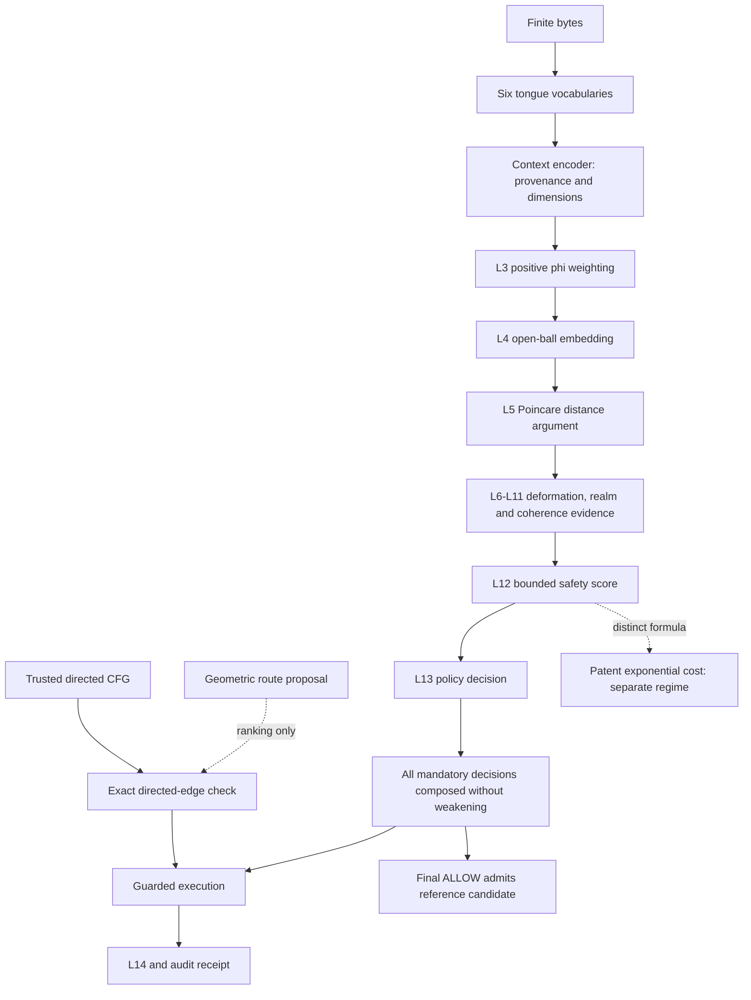

# Formalization map: SCBE layers and contracts

This scoped map extends `../../SYSTEM_MAP.md` and
`../../docs/specs/CANONICAL_FORMULA_REGISTRY.md`. It follows `PY_FULL14` unless a
row names another source. `TS_PIPELINE14`, `PY_REFERENCE14` and the public scan
surface remain separate profiles. Their Layer 11 formulas are not equivalent.

Arrows describe intended contracts, not a claim that every path is connected in
the deployed product. The executable audit traces the named Python sources.

## Layer inventory

`F` below abbreviates
`src/symphonic_cipher/scbe_aethermoore/layers/fourteen_layer_pipeline.py`.

| Layer | Actual component / input → output | Proof or remaining obligation |
|---|---|---|
| 1 | `F:layer_1_complex_context`; identity/intent/trajectory/time/commitment/signature → complex coordinates | No provenance or signature-verification proof. Numeric features are not cryptographic identities. |
| 2 | `F:layer_2_realify`; complex → real coordinates | Real/imaginary layout and inverse not yet formalized. |
| 3 | `F:layer_3_weighted`; real coordinates → weighted coordinates | Lean proves positive phi powers and positivity of a weighted quadratic energy for positive weights. No numerical kernel proof. |
| 4 | `F:layer_4_poincare`; weighted coordinates → ball coordinates | Open-ball premise is explicit in geometry theorems. Tanh saturation and clamping remain unproved. |
| 5 | `F:layer_5_hyperbolic_distance`; two ball points → distance | Lean: positive denominator, argument >=1, symmetry, diagonal argument. Python: 64 interior samples, 192 checks. Full metric proof open. |
| 6 | `F:layer_6_breathing`; point/time → radially deformed point | Repaired positive schedule, explicit inverse and analytic Jacobian; boundary saturation rejects. Derivative and inverse tests pass. This is a deformation, not an isometry or a globally conditioned map. |
| 7 | `F:layer_7_phase`; point/phase/translation → transformed point | Prove translation/rotation domain constraints and metric behavior separately from breathing. |
| 8 | `F:layer_8_multi_well`; point/realm centers → minimum distance/index | Well-defined finite centers and domain validation not yet formalized. |
| 9 | `F:layer_9_spectral_coherence`; signal → coherence | Sampling/FFT normalization, empty signal and bounds need a named contract. |
| 10 | `F:layer_10_spin_coherence`; phase evidence → coherence | Optional 47D backend and fallback differ. No parity theorem. |
| 11 | `F:layer_11_triadic_distance`; geometry/time/entropy/fidelity → aggregate | Actual full-profile formula differs from TS/reference profiles. State validity and norm contract open. |
| 12 | `F:layer_12_harmonic_scaling`; distance/phase → `1/(1+d+2p)` | Lean positivity, upper bound and monotonicity. Runtime invalid-input repairs and regression cases are included in this branch. |
| 13 | `F:layer_13_decision`; scores/thresholds → risk assessment | Lean evidence-risk bounds and abstract restriction composition. Exact branch thresholds and IEEE behavior need further refinement. |
| 14 | `F:layer_14_audio_axis`; audio/context → telemetry | No audio, timing, receipt-authenticity or side-channel theorem. |

## Interfaces outside the numbered layers

| Boundary | Source and connection | Status |
|---|---|---|
| Reversible tongue data | `src/crypto/sacred_tongues.py`; byte ↔ vocabulary tables | General sequence laws proved under equivalences; exported table dimensions proved; concrete table uniqueness and round trips tested. Semantic understanding and constant-time execution are separate. |
| Directed program routes | `src/symphonic_cipher/topological_cfi.py`; CFG → initialized transition checker | Abstract legal-path and fuel theorems proved. The repaired directed checker is included here and matches bounded enumeration; initial main-branch defects are historical evidence. |
| Decision wrapper | `src/symphonic_cipher/scbe_aethermoore/full_system.py`; L13 + other checks → final decision | Restriction composition proved abstractly; wrapper tested across four modes, cold/warm starts and four input decisions. |
| Reference admission | Same wrapper; final decision + candidate → stored reference | Abstract refusal preservation proved; no whole Python state-machine proof. |
| Runtime gate / GeoSeal | `src/governance/runtime_gate.py`, `src/crypto/geoseal_execution_gate.py` where present | Adjacent consumers requiring principal/resource/context/replay contracts. Not certified by this suite. |
| PHDM / manifold state | `src/harmonic/`, package `unified.py`, `ManifoldController` | Supplies geometry and state diagnostics. No global stability or containment proof. |
| Clay, Loom/Rubix, Hydra and tools | Learners/proposers and adapters consuming shared encodings | Must pass proposals through the authoritative checks; training correctness is not assumed. No worker or model was changed here. |
| Patent cost regime | Registered `QUADRATIC_EXP_COST` and local draft equation `R^(d^2)` | Exact-real monotonic cost proved independently of the L12 score. |

## Authority, resources and rollback

The Lean definitions are the proof authority; immutable source hashes identify
the implementation being compared. A Git commit alone is insufficient for a
dirty tree. A Python pass is finite evidence, not a proof of all inputs.

Work uses an isolated worktree based on GitHub main. Selected runtime repairs
now accompany the `formal/lean` proof project; unrelated local repairs, patent
originals, training code, weights and data remain in their own locations.
Runtime changes include snapshot schema v2 and discard legacy untrusted
reference state. Roll back by an explicit reviewed commit; preserve audit and
snapshot artifacts. No model rollback is involved. Toolchain and Mathlib caches
are rebuildable and ignored by Git. Proof checking is CPU-only with two Lean threads.

New claims must state the quantity, domain, profile, proof assumptions, source
correspondence and counterexamples before receiving a stronger evidence label.

## Separate SpiralVerse repository

[Spiralverse-AetherMoore-active](https://github.com/issdandavis/Spiralverse-AetherMoore-active)
is the writable active mirror of the older archived submodule, confirmed through
GitHub metadata on 2026-09-18. SCBE also has a local `src/spiralverse` integration
surface. A sparse checkout must include it for the existing RWP2 envelope import
check. No file named RWP2/RPW2 was found in the active mirror's inspected tree;
the exact cross-repository protocol/version mapping remains to be established.

## Nested decimal boundary extension

The existing Loom exact-cell and hierarchical-sign implementations are mapped
in [the nested boundary integration contract](../../docs/specs/NESTED_BOUNDARY_INTEGRATION_2026-09-18.md).
An isolated prototype connects those cells to this branch's L6 transform and
Jacobian, with 16 mechanical tests. It normalizes exact local coordinates before
floating-point execution, preserves parent paths, and reports wall crossings.
It does not alter live authorization or Clay's running model. Its mathematical
contract and future gate integration are separate from the 47 Lean theorems.
